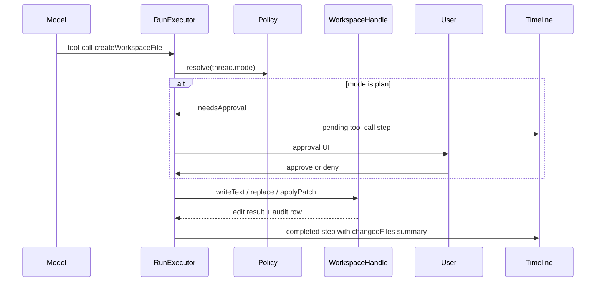

<!-- c58edf88-e3a3-4ca4-a5c7-4374762a4519 -->
---
todos:
  - id: "spec-v2"
    content: "Write docs/specs/2026-05-30-agent-native-tooling-v2-safe-file-edits.md and link from agent-native-tooling.md V2 section"
    status: pending
  - id: "workspace-mutations"
    content: "Add writeText/replaceInText/applyUnifiedPatch to WorkspaceHandle + config limits + unit tests"
    status: pending
  - id: "audit-table"
    content: "Add workspace_edits migration, repository, and edit service integrated with tool execute"
    status: pending
  - id: "mutating-tools"
    content: "Implement mutating-workspace-tools.ts (create/replace/patch) + payload summarization + run-executor merge"
    status: pending
  - id: "approval-runtime"
    content: "Wire thread.mode plan/agent to needsApproval, pending steps, approve/deny API, stream resume"
    status: pending
  - id: "ui-timeline-approval"
    content: "Timeline changed-file summaries + thread approval UI + composer mode copy; web/api tests"
    status: pending
  - id: "mock-uat"
    content: "Extend mock runtime for write tools; document manual UAT in spec"
    status: pending
isProject: false
---
# V2: Safe file edits

## Product intent

Agents gain **mutating** workspace tools scoped to `AGENTIS_STORAGE_ROOT/workspaces/{id}/files/`, with the same path jail as V1 ([`workspace-service.ts`](apps/api/src/workspaces/workspace-service.ts)).

**Policy gate (user decision):** reuse existing thread mode ([`threadModeSchema`](packages/shared/src/schemas.ts)):

| UI label (target) | Stored mode | Mutating tools |
| --- | --- | --- |
| Plan first | `plan` | Require user approval before execute |
| Execute | `agent` | Auto-execute (no approval step) |

Writes stay sandboxed to the workspace `files/` root in both modes. Mode only controls **whether the user must approve** each mutating tool call.

**Tool surface (user decision):** all three tools from the PRD:

- `createWorkspaceFile`
- `replaceInWorkspaceFile` (bounded search/replace for small edits)
- `applyWorkspacePatch` (unified diff)

Reference UX: Plan/Execute mode menu in composer ([`thread-prompt-composer.tsx`](apps/web/src/components/thread/thread-prompt-composer.tsx)); optional polish to match Hyperagent copy (“Plan first” / “Execute”) without renaming the stored enum.

---

## Architecture



### Layering (mirror V1)

| Layer | Path | Responsibility |
| --- | --- | --- |
| Workspace I/O | [`workspace-service.ts`](apps/api/src/workspaces/workspace-service.ts) | Add `writeText`, `replaceInText`, `applyUnifiedPatch`; reuse `resolvePath`, binary checks, byte limits |
| Audit | `workspace-edit-repository.ts` + migration | Persist per-edit metadata linked to run/thread/workspace |
| Native tools | `mutating-workspace-tools.ts` | Zod schemas, AI SDK `tool()` defs, payload summarization |
| Policy | `workspace-tool-policy.ts` | Map `thread.mode` → approval; path/size deny rules |
| Runtime | [`run-executor.ts`](apps/api/src/runtime/run-executor.ts) | Merge mutating tools; approval chunks; resume after approve |
| UI | [`run-timeline.tsx`](apps/web/src/components/thread/run-timeline.tsx) + approval component | Changed-file summaries, pending/approved/denied states |

Split mutating tools out of [`read-only-workspace-tools.ts`](apps/api/src/native-tools/read-only-workspace-tools.ts); add `native-tools/index.ts` barrel that builds read + write tool sets for `RunExecutor`.

---

## 1. Authoritative design spec

Create [`docs/specs/2026-05-30-agent-native-tooling-v2-safe-file-edits.md`](docs/specs/2026-05-30-agent-native-tooling-v2-safe-file-edits.md) (same pattern as [V1 spec](docs/specs/2026-05-29-agent-native-tooling-design.md)) and link it from [V2 section in `docs/agent-native-tooling.md`](docs/agent-native-tooling.md).

Spec should define:

- Tool inputs/outputs and error codes
- Approval lifecycle and persisted message/run-step shapes
- Audit record fields
- Acceptance tests and manual UAT script

---

## 2. Workspace mutations (API)

Extend `WorkspaceHandle` in [`workspace-service.ts`](apps/api/src/workspaces/workspace-service.ts):

**`writeText({ path, content, createOnly? })`**

- Normalize path; reject directories; optional `createOnly` (fail if exists)
- Create parent dirs with `mkdir({ recursive: true })`
- Enforce `AGENTIS_WORKSPACE_WRITE_MAX_BYTES` (new config in [`config.ts`](apps/api/src/config.ts))
- Post-write: return `{ path, operation: "create" | "overwrite", bytesWritten, previousBytes?, created }`

**`replaceInText({ path, oldText, newText, replaceAll? })`**

- Read via existing `readText` (respects binary rejection)
- Require unique match unless `replaceAll`; cap replacements
- Atomic write: write temp file in same dir + rename
- Return `{ path, operation: "replace", replacements, bytesWritten }`

**`applyUnifiedPatch({ path, patch })`**

- Add dependency: `diff` (uses `applyPatch` / `parsePatch`) in [`apps/api/package.json`](apps/api/package.json)
- Validate patch targets exactly one file and matches `path`
- Fail loudly with `workspace_patch_failed` + hunks context (no silent partial apply)
- Return `{ path, operation: "patch", linesAdded, linesRemoved, bytesWritten }`

**Safety (all mutations)**

- Same `realpath` jail as read paths
- Reject writes to existing symlinks that escape root
- Optional deny prefixes via config (e.g. `.git/`, `.env`) — start minimal: block dotfiles at workspace root only if needed for demo safety
- Never expose full file content in run-step payloads (summaries only, like V1 read tools)

---

## 3. Audit-friendly edit metadata

New table `workspace_edits` (Drizzle migration under [`apps/api/src/db/`](apps/api/src/db/)):

| Column | Purpose |
| --- | --- |
| `id`, `workspace_id`, `thread_id`, `run_id` | Provenance |
| `tool_name`, `operation` | `create` / `replace` / `patch` |
| `path` | Workspace-relative path |
| `status` | `pending`, `approved`, `denied`, `applied`, `failed` |
| `approval_mode` | `plan` / `agent` snapshot |
| `input_json` | Sanitized tool input |
| `result_json` | Summary output (bytes, line counts, errors) |
| `content_hash_before`, `content_hash_after` | SHA-256 for audit |
| `created_at`, `applied_at` | Timeline ordering |

Repository: `workspace-edit-repository.ts`; service wraps create-on-tool-call, update-on-apply/deny.

Extend native run-step payload ([`NativeToolRunStepPayload`](apps/api/src/native-tools/read-only-workspace-tools.ts)):

```ts
type NativeToolRunStepPayload = {
  provider: "native"
  toolName: string // include mutating names
  workspaceId: string
  changedFiles?: Array<{ path: string; operation: string; bytesWritten?: number }>
  approval?: { status: "pending" | "approved" | "denied"; editId: string }
  // ...existing fields
}
```

---

## 4. Native mutating tools

New [`apps/api/src/native-tools/mutating-workspace-tools.ts`](apps/api/src/native-tools/mutating-workspace-tools.ts):

| Tool | Model-facing behavior |
| --- | --- |
| `createWorkspaceFile` | `{ path, content }` — creates file; fails if exists |
| `replaceInWorkspaceFile` | `{ path, oldText, newText, replaceAll? }` |
| `applyWorkspacePatch` | `{ path, patch }` — unified diff string |

Each tool:

- Sets `needsApproval: async (_input, { experimental_context }) => thread.mode === "plan"` (or equivalent AI SDK v5 approval hook used by [`streamText`](apps/api/src/runtime/run-executor.ts) in `ai@^5`)
- `execute` calls `WorkspaceHandle` + records `workspace_edits`
- Returns summary object (path, operation, byte/line stats) — **not** full file bodies

Update [`formatNativeToolRunStepPayload`](apps/api/src/native-tools/read-only-workspace-tools.ts) (or move to shared `native-tool-payload.ts`) to summarize mutating outputs and include `changedFiles`.

Wire in [`run-executor.ts`](apps/api/src/runtime/run-executor.ts):

```ts
const nativeTools = {
  ...buildWorkspaceReadOnlyTools(handle),
  ...buildWorkspaceMutatingTools(handle, { thread, editService }),
}
```

---

## 5. Approval flow (Plan mode)

**Runtime**

- On `tool-approval-request` (or AI SDK v5 equivalent chunk), persist:
  - Assistant message part (new discriminated variant in [`messagePartSchema`](packages/shared/src/schemas.ts) if required by SDK)
  - Run step `tool-call` with `status: "pending"` and `payload.approval.status: "pending"`
- Pause run in `tool-calling` until resolved (do not call `execute` yet)

**API** (new routes on [`threads.ts`](apps/api/src/routes/threads.ts) or `runs.ts`):

- `POST /api/runs/:runId/tool-approvals/:toolCallId` body `{ decision: "approve" | "deny" }`
- Validates run is active, tool call pending, user owns thread
- On approve: execute tool, finalize step, append `tool-result`, resume `streamText` with `addToolResult` / continuation API per AI SDK docs in [`docs/ai-sdk-llms.txt`](docs/ai-sdk-llms.txt)
- On deny: mark edit `denied`, persist denial result to model, resume or complete run with visible error

**Agent mode**

- Skip approval UI; `needsApproval` false; edits go straight to `applied`.

**Mock runtime**

- Extend [`executeMockNativeWorkspaceStream`](apps/api/src/runtime/run-executor.ts) with a branch for “create/edit/write/patch” prompts that exercises one mutating tool + audit row (CI without OpenAI).

---

## 6. UI: changed files, timeline, approval

**Run timeline** ([`run-timeline.tsx`](apps/web/src/components/thread/run-timeline.tsx))

- Extend `formatNativePayload` for mutating tools:
  - Show `changedFiles` list (path + operation + size delta)
  - Badge: Pending approval / Applied / Denied / Failed
  - Keep full content out of timeline (V1 rule)

**Thread detail** ([`thread-detail.tsx`](apps/web/src/routes/thread-detail.tsx))

- When a pending native edit step exists, render inline **Approve / Deny** actions calling new API
- After action, refresh run steps (existing polling/SSE pattern)

**Composer mode UX** (optional but low-cost)

- Replace toggle-only control with dropdown copy from reference image:
  - Plan first — “Think through an approach and get clarification before taking action.”
  - Execute — “Act immediately without a plan.”
- Keep stored values `plan` / `agent`

**Tests**

- [`run-timeline.test.tsx`](apps/web/src/components/thread/run-timeline.test.tsx): mutating payload + pending approval
- API tests: path jail on writes, patch failure, plan-mode pending, agent-mode auto-apply

---

## 7. Config and env

Add to [`.env.example`](.env.example):

```bash
AGENTIS_WORKSPACE_WRITE_MAX_BYTES=262144
# Optional: AGENTIS_WORKSPACE_WRITE_DENY_PREFIXES=.env,.git
```

---

## 8. Verification

```bash
pnpm --filter @workspace/shared test
pnpm --filter api test
pnpm --filter web test
pnpm typecheck && pnpm build && pnpm lint
```

**Manual UAT** (real runtime, `AGENTIS_MOCK_RUNTIME=0`):

1. Seed a file in generic Agentis workspace (existing debug seed).
2. **Plan mode** thread: ask agent to patch a file → see pending approval in timeline → approve → file on disk updated → timeline shows changed path + audit summary.
3. **Execute mode** thread: same request → no approval step → immediate apply.
4. Reload thread: persisted tool-call/result parts and `workspace_edits` row inspectable via API/debug.

---

## Explicitly out of scope (remain V3+)

- Shell/command execution
- File versioning/history UI
- Native tool grants UI (Composio-style)
- Production/non-local-fs backends
- Full transcript rendering of tool bodies
- Workspace copy on promotion

---

## Open items (defaults chosen; adjust in spec review)

- **UI label:** display “Execute” for `agent` mode while keeping API enum stable.
- **Dotfile policy:** block writes to `.*` at repo root only for V2; expand denylist later.
- **Versioning:** store before/after hashes in `workspace_edits` only (no revert UI in V2).
