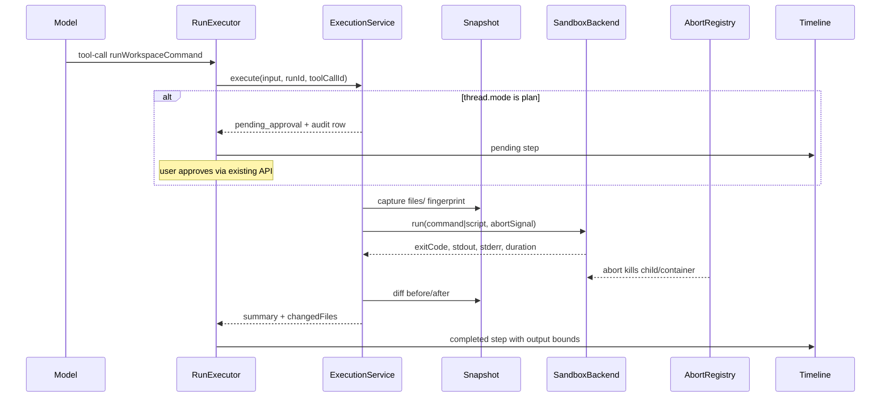

<!-- eda6664c-1e94-430f-a302-7ce7ca853038 -->
---
todos:
  - id: "sandbox-backend"
    content: "Add apps/api/src/sandbox/ abstraction, local-process backend, execution registry, abort propagation"
    status: completed
  - id: "file-snapshot"
    content: "Implement workspace-file-snapshot.ts for pre/post diff with config limits + unit tests"
    status: completed
  - id: "audit-executions"
    content: "Add workspace_executions migration, repository, and WorkspaceExecutionService (approve/deny parity with edits)"
    status: completed
  - id: "execution-tool"
    content: "Implement runWorkspaceCommand tool (command|script input), policy, payload summarization, run-executor merge"
    status: completed
  - id: "approval-routing"
    content: "Extend workspace-tool-approval coordinator to route execution tool approvals"
    status: completed
  - id: "config-env"
    content: "Add sandbox config keys to config.ts and .env.example"
    status: completed
  - id: "ui-timeline-approval"
    content: "Extend run-timeline and thread-detail for execution output + generalized approval copy; web tests"
    status: completed
  - id: "container-backend"
    content: "Optional local-container backend + apps/api/sandbox/Dockerfile behind AGENTIS_SANDBOX_BACKEND"
    status: completed
  - id: "mock-tests-uat"
    content: "Extend mock runtime for execution; api/web tests; manual UAT per plan section 7"
    status: completed
  - id: "prd-link"
    content: "Link this plan from the V3 section in docs/agent-native-tooling.md (no separate spec file)"
    status: completed
isProject: false
---
# V3: Sandboxed execution

## Product intent

Agents can run **bounded shell commands or short scripts** against the current workspace `files/` tree. Execution reuses V2’s thread-mode policy: **Plan first** (`plan`) requires user approval before running; **Execute** (`agent`) runs immediately.

**User decisions (locked in):**

- Local backend: **process-first** (`spawn` with cwd jailed to workspace `files/`); optional **Docker container** backend behind env flag.
- Tool surface: **one tool** — `runWorkspaceCommand` with discriminated input `{ kind: "command" | "script", ... }`.
- **No separate design spec file** — this plan is the authoritative implementation reference (same pattern as [V2 plan](V2%20Safe%20File%20Edits-c58edf88.plan.md)).

Reference inventory: Hyperagent **Script** (Python/JS in isolated container) in [`docs/agent-native-tooling.md`](../../docs/agent-native-tooling.md). V3 targets script parity via the `script` kind, with durable workspace side effects allowed (unlike Hyperagent’s ephemeral script runs).

---

## Prerequisites (already on branch)

V2 provides the patterns V3 should extend, not reinvent:

| Capability | Existing location |
| --- | --- |
| Native tool merge in runs | [`apps/api/src/native-tools/index.ts`](../../apps/api/src/native-tools/index.ts) → [`run-executor.ts`](../../apps/api/src/runtime/run-executor.ts) |
| Plan/agent approval + API | [`workspace-edit-service.ts`](../../apps/api/src/workspaces/workspace-edit-service.ts), [`workspace-tool-approval.ts`](../../apps/api/src/workspaces/workspace-tool-approval.ts), `POST /api/runs/:id/tool-approvals/:toolCallId` |
| Changed-file timeline UI | [`run-timeline.tsx`](../../apps/web/src/components/thread/run-timeline.tsx) (`changedFiles` list) |
| Path jail + hashing | [`workspace-service.ts`](../../apps/api/src/workspaces/workspace-service.ts) (`resolvePath`, `realpath`, SHA-256 on writes) |
| Run abort signal | [`abort-registry.ts`](../../apps/api/src/runtime/abort-registry.ts) + `streamText({ abortSignal })` |

V3 adds **runtime execution** as a separate concern from filesystem I/O (`WorkspaceHandle` stays file-focused).

---

## Architecture



### Layering (mirror V2)

| Layer | Path | Responsibility |
| --- | --- | --- |
| Sandbox abstraction | `apps/api/src/sandbox/` | Backend interface, process + container impls, execution registry |
| File snapshot/diff | `apps/api/src/sandbox/workspace-file-snapshot.ts` | Pre/post fingerprint + changed-file summary |
| Audit | `workspace_executions` migration + repository | Provenance, status, sanitized I/O summaries |
| Execution orchestration | `apps/api/src/workspaces/workspace-execution-service.ts` | Approval gate, snapshot, run, audit (parallel to [`workspace-edit-service.ts`](../../apps/api/src/workspaces/workspace-edit-service.ts)) |
| Native tool | `apps/api/src/native-tools/execution-workspace-tools.ts` | Zod input schema + AI SDK `tool()` |
| Policy | extend [`workspace-tool-policy.ts`](../../apps/api/src/native-tools/workspace-tool-policy.ts) | Treat execution tool as approval-gated in `plan` mode |
| Payload/UI | extend [`native-tool-payload.ts`](../../apps/api/src/native-tools/native-tool-payload.ts), [`run-timeline.tsx`](../../apps/web/src/components/thread/run-timeline.tsx), [`thread-detail.tsx`](../../apps/web/src/routes/thread-detail.tsx) | Exit code, duration, bounded stdout/stderr, changed files |
| Runtime wiring | [`run-executor.ts`](../../apps/api/src/runtime/run-executor.ts), [`workspace-tool-approval.ts`](../../apps/api/src/workspaces/workspace-tool-approval.ts) | Merge tool; route approve/deny to execution service |
| Config | [`config.ts`](../../apps/api/src/config.ts), [`.env.example`](../../.env.example) | Timeout, output caps, backend selection, deny patterns |

---

## 1. Tool contract

### `runWorkspaceCommand`

**Input (discriminated union):**

```ts
{ kind: "command"; command: string; cwd?: string }
| { kind: "script"; language: "python" | "node"; code: string; cwd?: string }
```

**Script kind behavior:** materialize code under workspace `runtime/scripts/{executionId}.{py|js}` (uses the V1-reserved `runtime/` tree, not `files/`), then invoke `python3` or `node` via the sandbox backend. Script files are audit metadata only; changed-file detection still scans `files/`.

**Output summary (never full unbounded streams in persisted payloads):**

```ts
{
  workspaceId: string
  executionId: string
  kind: "command" | "script"
  exitCode: number | null
  durationMs: number
  stdout: string          // truncated to config max
  stderr: string
  stdoutTruncated: boolean
  stderrTruncated: boolean
  timedOut: boolean
  aborted: boolean
  changedFiles: Array<{ path: string; operation: "created" | "modified" | "deleted" }>
  status?: "pending_approval" | "denied"  // plan-mode only
}
```

**Error codes:**

- `sandbox_command_required` / `sandbox_script_required`
- `sandbox_command_denied` (policy blocklist)
- `sandbox_cwd_invalid` (cwd escapes `files/` jail)
- `sandbox_timeout`
- `sandbox_aborted`
- `sandbox_backend_unavailable` (container selected but Docker missing)
- `sandbox_execution_failed` (non-zero exit — returned as structured result, not thrown, unless backend crash)

**Approval lifecycle** (reuse existing endpoint and UI):

1. Plan mode: persist `workspace_executions.status = pending`, return `pending_approval`, run stays `tool-calling`.
2. Approve: run sandbox + diff, mark `applied`, finalize run step.
3. Deny: mark `denied`, no execution.

Generalize thread approval copy from “workspace edit” to “workspace action” when `toolName === "runWorkspaceCommand"`.

**Persisted run-step payload** — extend [`NativeToolRunStepPayload`](../../apps/api/src/native-tools/native-tool-payload.ts):

```ts
type NativeToolRunStepPayload = {
  provider: "native"
  toolName: "runWorkspaceCommand" | /* existing names */
  workspaceId: string
  changedFiles?: Array<{ path: string; operation: string }>
  approval?: { status: "pending" | "approved" | "denied"; executionId: string }
  // execution output summary on output field: exitCode, durationMs, stdout, stderr, flags
}
```

---

## 2. Sandbox backend abstraction

New package area: `apps/api/src/sandbox/`

```ts
type SandboxExecuteInput = {
  workspaceId: string
  filesRoot: string          // realpath of .../files/
  kind: "command" | "script"
  command?: string           // shell command (kind=command)
  argv?: string[]            // direct argv (kind=script)
  cwd?: string               // workspace-relative under files/
  timeoutMs: number
  maxStdoutBytes: number
  maxStderrBytes: number
  env?: Record<string, string>
}

type SandboxExecuteResult = {
  exitCode: number | null
  stdout: string
  stderr: string
  stdoutTruncated: boolean
  stderrTruncated: boolean
  durationMs: number
  timedOut: boolean
  aborted: boolean
}

interface SandboxBackend {
  execute(input: SandboxExecuteInput, signal: AbortSignal): Promise<SandboxExecuteResult>
}
```

**Factory:** `createSandboxBackend(config)` selects implementation via `AGENTIS_SANDBOX_BACKEND`:

| Value | Implementation | Notes |
| --- | --- | --- |
| `local-process` (default) | `local-process-backend.ts` | `child_process.spawn`; cwd = resolved `files/` subdir; minimal env (`PATH`, `HOME`, `LANG` only — strip `OPENAI_*`, `AGENTIS_*`, secrets) |
| `local-container` | `local-container-backend.ts` | `docker run --rm -v {filesRoot}:/workspace -w /workspace --network none` + pinned image; fail loudly if Docker unavailable |

**Execution registry** (`execution-registry.ts`): map `runId` → active child PID / container ID so [`abort(runId)`](../../apps/api/src/runtime/run-executor.ts) can kill in-flight executions even when AI SDK tool `execute` does not receive `abortSignal` directly. Wire `registerAbortController` cleanup to also signal the registry.

**Safety defaults (process backend):**

- Resolve optional `cwd` through the same path jail as file tools — expose a helper or method on `WorkspaceHandle` for execution cwd.
- Configurable deny patterns (`AGENTIS_SANDBOX_COMMAND_DENY_PATTERNS`) for obviously destructive invocations — best-effort string checks, not a full shell parser.
- Hard timeout: SIGTERM → brief grace → SIGKILL.

**Container backend (optional, same V3 slice):**

- Add minimal `apps/api/sandbox/Dockerfile` with `python3`, `node`, common shell utilities.
- Document build + `AGENTIS_SANDBOX_CONTAINER_IMAGE` in `.env.example`.

---

## 3. Changed-file detection

New `apps/api/src/sandbox/workspace-file-snapshot.ts`:

1. **Before run:** walk `files/` (respect list limits / max file count from config), record `{ path, size, mtimeMs, contentHash? }`. Hash only files under a size cap (`AGENTIS_SANDBOX_SNAPSHOT_MAX_FILE_BYTES` or reuse write max).
2. **After run:** repeat walk.
3. **Diff:** emit `created`, `modified` (hash or mtime+size change), `deleted`; cap list at `AGENTIS_SANDBOX_CHANGED_FILES_LIMIT`.

Reuse hashing from [`workspace-service.ts`](../../apps/api/src/workspaces/workspace-service.ts) (`createHash("sha256")`).

---

## 4. Audit table `workspace_executions`

New Drizzle migration under [`apps/api/src/db/`](../../apps/api/src/db/):

| Column | Purpose |
| --- | --- |
| `id`, `workspace_id`, `thread_id`, `run_id`, `tool_call_id` | Provenance |
| `tool_name`, `kind`, `status` | `pending` / `applied` / `denied` / `failed` / `aborted` |
| `approval_mode` | `plan` / `agent` snapshot |
| `input_json` | Sanitized command/script (truncate long code in audit if needed) |
| `result_json` | Exit code, duration, truncated streams, flags |
| `changed_files_json` | Post-run diff summary |
| `created_at`, `finished_at` | Ordering |

Repository: `workspace-execution-repository.ts`; service wraps create-on-tool-call, update-on-apply/deny/abort.

---

## 5. Execution service + native tool

**`workspace-execution-service.ts`** — parallel to edit service:

- `executeWorkspaceCommand(handle, { threadId, runId, toolCallId, approvalMode, input })`
- Plan mode → create pending audit row, return pending output (no sandbox run).
- Agent mode → snapshot → sandbox → diff → record applied.
- `approveByRunToolCall` / `denyByRunToolCall` mirroring edit service claim semantics.

**`execution-workspace-tools.ts`:**

- Zod discriminated union for input.
- `execute` delegates to `WorkspaceExecutionService`.
- Pass `runId` into service for abort registry correlation.

**Wire-up:**

- Add to [`tool-names.ts`](../../apps/api/src/native-tools/tool-names.ts): `EXECUTION_NATIVE_WORKSPACE_TOOL_NAMES`.
- Extend [`buildWorkspaceNativeTools`](../../apps/api/src/native-tools/index.ts).
- Extend [`requiresWorkspaceToolApproval`](../../apps/api/src/native-tools/workspace-tool-policy.ts).
- Extend [`formatNativeToolRunStepPayload`](../../apps/api/src/native-tools/native-tool-payload.ts) to summarize execution output.

**Approval coordinator:** extend [`workspace-tool-approval.ts`](../../apps/api/src/workspaces/workspace-tool-approval.ts) to dispatch by tool name — edits → `WorkspaceEditService`, execution → `WorkspaceExecutionService`.

---

## 6. Config and env

Add to [`config.ts`](../../apps/api/src/config.ts) and [`.env.example`](../../.env.example):

| Env var | Default | Purpose |
| --- | --- | --- |
| `AGENTIS_SANDBOX_BACKEND` | `local-process` | `local-process` \| `local-container` |
| `AGENTIS_SANDBOX_TIMEOUT_MS` | `30000` | Max wall time |
| `AGENTIS_SANDBOX_MAX_STDOUT_BYTES` | `65536` | Persist cap |
| `AGENTIS_SANDBOX_MAX_STDERR_BYTES` | `65536` | Persist cap |
| `AGENTIS_SANDBOX_CHANGED_FILES_LIMIT` | `50` | Diff cap |
| `AGENTIS_SANDBOX_COMMAND_DENY_PATTERNS` | `""` | Comma-separated substrings |
| `AGENTIS_SANDBOX_CONTAINER_IMAGE` | `agentis-sandbox:local` | Docker image tag |

No change to `workspaceBackendTypeSchema` (storage stays `local-fs`); sandbox backend is runtime config.

---

## 7. UI updates

**Run timeline** ([`run-timeline.tsx`](../../apps/web/src/components/thread/run-timeline.tsx)):

- For execution payloads: show `exitCode`, `durationMs`, truncated stdout/stderr previews, `timedOut` / `aborted` badges.
- Reuse existing `changedFiles` list (extend operation labels for `created` / `modified` / `deleted`).

**Thread approval card** ([`thread-detail.tsx`](../../apps/web/src/routes/thread-detail.tsx)):

- Generalize heading/copy when pending step is execution (show command preview or script language).
- Reuse existing approve/deny buttons and API client.

---

## 8. Mock runtime, tests, and UAT

**Mock runtime** ([`run-executor-mocks.ts`](../../apps/api/src/runtime/run-executor-mocks.ts)):

- Add prompt trigger (e.g. contains `mock sandbox` or `run echo`) that exercises `WorkspaceExecutionService` — prefer real `echo` via process backend in mock mode (align with V2 mock mutation pattern).

**Automated tests:**

| Area | File | Cases |
| --- | --- | --- |
| Snapshot diff | `workspace-file-snapshot.test.ts` | create/modify/delete detection, caps |
| Process backend | `local-process-backend.test.ts` | happy path, timeout, output truncation, non-zero exit |
| Execution service | `workspace-execution-service.test.ts` | plan pending, agent immediate, approve/deny |
| Native payload | extend `native-tool-payload` tests | execution summarization |
| API/run | extend `run-executor.test.ts` | plan-mode execution approval flow |
| Web | extend `run-timeline.test.tsx`, `thread-detail.test.tsx` | execution evidence + approval copy |

**Manual UAT** (real runtime, `AGENTIS_MOCK_RUNTIME=0`):

1. Agent mode: ask agent to run `echo hello` → timeline shows exit 0, stdout, duration.
2. Plan mode: same request → pending approval → approve → output appears; deny leaves no `applied` execution.
3. Script kind: run short Python/Node that writes a file under `files/` → changed-files list shows `created`.
4. Abort mid-run (`POST .../abort`) on a `sleep 60` command → `aborted: true`, run status `aborted`.
5. Optional: `AGENTIS_SANDBOX_BACKEND=local-container` with Docker running.

**Verification:**

```bash
pnpm --filter @workspace/shared test
pnpm --filter api test
pnpm --filter web test
pnpm typecheck && pnpm build && pnpm lint
```

---

## 9. PRD link (no spec file)

Update the V3 section in [`docs/agent-native-tooling.md`](../../docs/agent-native-tooling.md) to link this plan (mirror V2’s plan link). Do **not** add `docs/specs/2026-05-31-*.md`.

---

## Out of scope (explicit)

- Production cloud sandbox providers (E2B, Modal, etc.) — interface only, no impl.
- Package installation (`pip install`, `npm install`) as first-class tools.
- Network egress policy beyond container `--network none` (process backend remains best-effort).
- Native tool grants UI (execution always available when workspace-bound, like read tools).
- Full VM / persistent Hyperagent-style runtime (V4+).

---

## Build sequence

1. Sandbox backend interface + process implementation + execution registry
2. File snapshot/diff utility
3. `workspace_executions` migration + repository + execution service
4. `runWorkspaceCommand` tool + run-executor / approval wiring
5. Config + `.env.example`
6. Timeline + approval UI
7. Container backend + Dockerfile (optional env path)
8. Tests + mock runtime
9. Link plan from `docs/agent-native-tooling.md` V3 section
