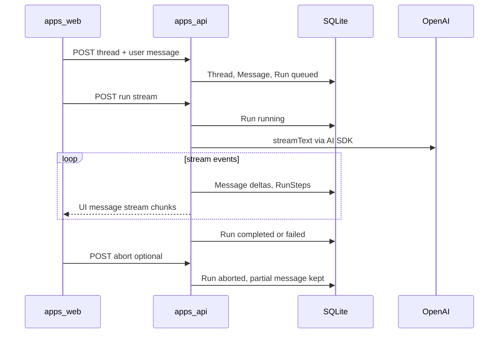
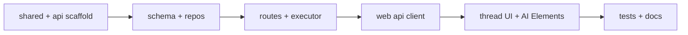

# M02 Threads and Run Lifecycle — Implementation Plan
## Current baseline
| Area | State |
| --- | --- |
| Backend | No `apps/api`; monorepo ready via `pnpm-workspace.yaml` |
| Thread routes | Only `/threads/new`; no `:threadId` route |
| Composer | Fully disabled in `thread-composer.tsx` |
| Data | Fixture-only `schema.ts` (`runStatusSchema` already matches design); no `Message` / `RunStep` |
| MSW | GET stubs only in `handlers.ts` |
| E2E | Shell screenshots only; Playwright starts web only (`playwright.config.ts`) |

**Acceptance target** ([roadmap M02](./docs/agentis-prd-roadmap.md)): create thread → stream → resume; abort with persisted partial state; runtime-disabled UX; sidebar/recent threads refresh from API; demo run against OpenAI.

* * *
## Architecture


**Boundary (from design):** AI SDK owns model/tool streaming; API owns persistence and maps stream events → `Message` parts + `RunStep` timeline.

* * *
## Phase 1 — Monorepo foundation and shared contracts
### 1.1 Create `packages/shared`
Add `packages/shared` with Zod schemas and inferred types used by both API and web:

- **Persisted entities:** `Thread`, `Message`, `Run`, `RunStep` (design fields: model/mode on thread, message `parts`, step `type`/`payload`, run usage/cost when available)
  
- **API DTOs:** create-thread request/response, thread detail (messages + runs + steps), runtime health, abort response
  
- **Enums:** reuse existing `runStatusSchema` values; extend thread status only where needed for API (`active` / `finished` / `failed` can stay for list UX)
  

Keep M01 `Workspace` types in fixtures for Command Center, Agents, etc.—do not replace those screens with API data in M02.
### 1.2 Scaffold `apps/api`
New package with:

- **Runtime:** Hono on Node (e.g. port `3001`)
  
- **ORM:** Drizzle + `better-sqlite3` (or `libsql` if team prefers; design says SQLite)
  
- **AI:** `ai`, `@ai-sdk/openai` — verify installed APIs and model IDs from `node_modules/ai/docs/` per ai-sdk skill (do not assume training-data APIs)
  
- **Scripts:** `dev`, `build`, `typecheck`, `test`, `db:migrate`, `db:studio` (optional)
  
- **Env:** `apps/api/.env.example` with `OPENAI_API_KEY`, `DATABASE_URL` (file path), `PORT`
  

Wire into root `turbo.json` / `package.json` so `pnpm dev` runs **api + web** in parallel.
### 1.3 Dev proxy
Update `apps/web/vite.config.ts`:

```ts
server: { proxy: { "/api": "http://127.0.0.1:3001" } }
```

Uncomment/set `VITE_API_BASE_URL` in `apps/web/.env.example` for non-proxy deployments.

* * *
## Phase 2 — Database and repositories
### 2.1 Drizzle schema (`apps/api/src/db/schema.ts`)
| Table | Key columns |
|-------|-------------|
| `threads` | `id`, `title`, `status`, `model`, `mode`, `project_id?`, timestamps |
| `messages` | `id`, `thread_id`, `role`, `parts` (JSON), `status`, `created_at` |
| `runs` | `id`, `thread_id`, `status`, `model`, `started_at`, `finished_at?`, `error_summary?`, usage/cost JSON |
| `run_steps` | `id`, `run_id`, `type`, `status`, `title`, `payload` (JSON), timestamps |

Design notes: stable string IDs (cuid/uuid), explicit timestamps, JSON only for structured event payloads—Postgres-friendly shape.
### 2.2 Migrations
Initial migration under `apps/api/drizzle/`; seed optional empty DB on first run.
### 2.3 Repository layer
Thin repos (no SQL in route handlers):

- `ThreadRepository`: create, getById, list (ordered by `updated_at`), update title/status
  
- `MessageRepository`: append user/assistant, patch parts for streaming deltas
  
- `RunRepository`: create queued, transition status, attach error/usage
  
- `RunStepRepository`: append reasoning/tool/error/aborted steps
  

**API tests (Vitest):** CRUD, status transitions, abort leaves partial assistant message + `aborted` step.

* * *
## Phase 3 — API routes and run executor
### 3.1 Route map
| Method | Path | Purpose |
|--------|------|---------|
| `GET` | `/api/runtime/health` | `{ available, reason? }` — API up + `OPENAI_API_KEY` present |
| `GET` | `/api/threads` | List for sidebar / recent threads |
| `POST` | `/api/threads` | Create thread + first user message + queued run |
| `GET` | `/api/threads/:id` | Thread + messages + runs + steps (resume) |
| `POST` | `/api/threads/:id/messages` | Follow-up user message + new run |
| `POST` | `/api/runs/:id/stream` | Start execution; return AI SDK UI stream |
| `POST` | `/api/runs/:id/abort` | Cancel in-flight stream; persist partial state |

Use Zod validation on request bodies; map errors to HTTP 4xx/5xx with stable error codes for the UI.
### 3.2 Run lifecycle executor (`apps/api/src/runtime/run-executor.ts`)
State machine aligned with design:

1. `queued` → `running` on stream start
  
2. Tool call → `tool-calling` + `RunStep` (tool)
  
3. Tool result → back to `running`
  
4. Success → `completed` + finalize assistant `Message`
  
5. Provider/tool failure → `failed` + error step
  
6. Abort → cancel `AbortController`, keep partial text, `aborted` step, run `aborted`
  

**Demo tool:** `getWorkspaceSummary` — no external credentials; returns static/summarized fixture-shaped workspace info to prove tool timeline persistence.

**Persistence during stream:** Subscribe to AI SDK fullStream/chunk handlers; on each text delta update assistant message parts; on tool events insert/update steps. Verify exact stream API from installed `ai` package before coding.
### 3.3 Abort registry
In-memory `Map<runId, AbortController>` for M02 (single-process local runtime). Clear on completion/failure/abort.
### 3.4 API route tests
- Health: missing key → `available: false`
  
- Create thread + stream happy path (mock OpenAI provider in tests)
  
- Tool step creation for `getWorkspaceSummary`
  
- Tool failure → run `failed`
  
- Abort mid-stream → partial message + `aborted` run persisted
  

* * *
## Phase 4 — Web: dependencies and API client
### 4.1 Install packages (`apps/web`)
- `ai`, `@ai-sdk/react`, `@ai-sdk/openai` (client transport only if needed)
  
- AI Elements via `pnpm dlx ai-elements@latest` into `apps/web` (per ai-elements skill); align `components.json` aliases with `packages/ui/components.json`
  
- Review generated components for DESIGN.md tokens (IBM Plex, restrained agent-blue for active states)
  
### 4.2 API client module (`apps/web/src/lib/api/`)
- `fetchRuntimeHealth()`, `createThread()`, `getThread()`, `listThreads()`, `sendFollowUp()`, `streamRun()`, `abortRun()`
  
- Typed with `@workspace/shared` schemas
  
- Hook: `useRuntimeHealth()` polling or load-on-mount for composer gating
  
### 4.3 MSW strategy
- Keep existing GET handlers for workspace/agents/integrations
  
- **Remove or bypass** fixture `GET /api/threads` when real API is targeted (dev proxy hits api; MSW `onUnhandledRequest: "bypass"` already allows this)
  
- Optional: MSW handlers mirroring API for unit tests without api process
  

* * *
## Phase 5 — Thread UI routes
### 5.1 Router (`apps/web/src/router.tsx`)
Add `{ path: "threads/:threadId", element: <ThreadDetailPage /> }`.
### 5.2 `/threads/new` (`new-thread.tsx`)
Replace disabled composer with AI Elements **prompt input** +:

- Model selector (single OpenAI POC model — ID from live provider list, not memory)
  
- Mode selector (existing Plan affordance; store on thread)
  
- Attachment button visible, disabled with tooltip (“M02”)
  
- Runtime banner when health unavailable (API down vs missing key — distinct copy per design)
  
- **Submit:** `POST /api/threads` → `navigate(/threads/:id)` → trigger stream on detail page (or return `runId` from create and start stream immediately)
  

Recent threads section: fetch `GET /api/threads`, link to `/threads/:threadId`.
### 5.3 `/threads/:threadId` (new `thread-detail.tsx`)
- Load persisted state on mount (`GET /api/threads/:id`)
  
- **Transcript:** AI Elements `Conversation` / `Message` / tool + reasoning components
  
- **Streaming:** `useChat` (or current AI SDK client pattern — verify common-errors) with custom transport pointing at `POST /api/runs/:id/stream`
  
- **Timeline:** run steps panel showing queued → running → tool-calling → terminal states
  
- **Abort:** visible while run active; calls abort endpoint
  
- **Follow-up composer:** same prompt input; `POST .../messages` + new stream
  
- **Reload:** refresh from API shows completed/aborted transcript unchanged
  

Style per [DESIGN.md](./DESIGN.md): workbench layout inside existing `AppShell`.
### 5.4 Sidebar (`app-sidebar.tsx`)
- Fetch API thread list (or shared React Query/context) instead of fixture `workspace.threads` for the Threads group
  
- `NavLink` to `/threads/:threadId` with `useMatch` for active state
  
- Keep fixture-backed agents/nav unchanged
  

* * *
## Phase 6 — Testing and docs
### 6.1 Web unit/integration tests (Vitest + RTL)
- Runtime-disabled composer (no key / API down)
  
- Submit from `/threads/new` navigates to detail (mock `fetch`)
  
- Thread detail renders persisted messages after load
  
- Abort UI shows aborted marker (mock stream + abort)
  
### 6.2 E2E (`apps/web/e2e/`)
Update `playwright.config.ts` `webServer` to start **api + web** (or documented `pnpm dev` script).

New specs per design:

1. Create → stream → **abort** → reload → aborted state persists
  
2. Create → **complete** → reload → transcript persists
  

**CI strategy:** Use AI SDK test/mock provider or env-gated real OpenAI key; document local `OPENAI_API_KEY` requirement. Avoid flaky live-LLM assertions in CI unless secret is configured.
### 6.3 Docs / agent context
Update after implementation:

- `AGENTS.md` — M02 routes, `apps/api`, dev commands
  
- `README.md` — clone, `apps/api/.env`, `pnpm dev`
  
- `CONTRIBUTING.md` — fixtures vs API boundary
  

* * *
## Implementation order (recommended)


Work in vertical slices: health + create thread (no stream) → stream complete → tool step → abort → sidebar list → e2e.

* * *
## Key risks and mitigations
| Risk | Mitigation |
|------|------------|
| AI SDK / `useChat` API drift | Read `node_modules/ai/docs/` before client/server stream code |
| Stream + persistence race | Single executor owns stream; DB updates awaited or sequenced per chunk |
| Fixture vs API thread shape drift | `packages/shared` is source of truth for API; map to sidebar display fields |
| E2E depends on OpenAI | Mock provider in CI; real key for local demo |
| AI Elements + Vite (not Next) | Install into `apps/web`; adjust paths/aliases; post-install design review |

* * *
## Out of scope (explicit non-goals)
Composio, Slack/webhooks, user API key UI, workers/queues/Docker, Chat SDK, API-backed Command Center/Agents/Library, attachment upload, multi-provider selector beyond OpenAI POC.
