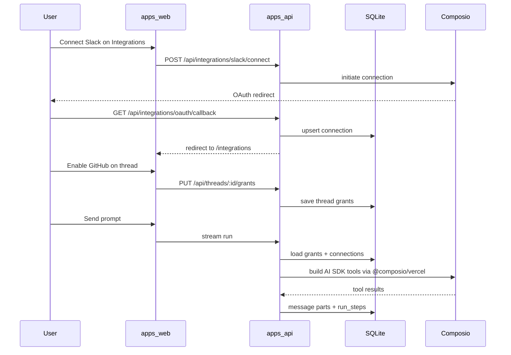

# M03: Composio Integrations and Tool Access

## Context

[M03 in the PRD](docs/agentis-prd-roadmap.md) adds the first real external-tool layer. **M02 is already the right foundation**: SQLite persistence, `RunExecutor` with AI SDK `streamText`, `tool-call` / `tool-result` message parts, and `run_steps` logging in `[apps/api/src/runtime/run-executor.ts](apps/api/src/runtime/run-executor.ts)`.

**Today:** Integrations UI at `[apps/web/src/routes/integrations.tsx](apps/web/src/routes/integrations.tsx)` reads fixtures from `[apps/web/src/fixtures/demo-workspace.ts](apps/web/src/fixtures/demo-workspace.ts)`; Connect/Manage are disabled. Composio is not referenced anywhere. The executor only exposes `getWorkspaceSummary`.

**M03 scope (from PRD):** workspace connections + **per-thread** grants. **Per-agent grants stay in M05**—but the grant schema should accept an optional `agentId` later without a migration rewrite.

---

## Recommended stack choices

| Decision           | Recommendation                                                                                    | Rationale                                                                                         |
| ------------------ | ------------------------------------------------------------------------------------------------- | ------------------------------------------------------------------------------------------------- |
| Composio SDK       | `@composio/core` + `@composio/vercel`                                                             | Official Vercel AI SDK provider; matches existing `streamText({ tools })` in `RunExecutor`        |
| Auth               | Composio-managed OAuth (Auth Configs in Composio dashboard)                                       | Fastest path for self-hosted MVP; BYO OAuth credentials can be documented as production follow-up |
| Workspace identity | Single install user: `AGENTIS_COMPOSIO_USER_ID` (default `agentis-local`)                         | No multi-tenant auth in M02/M03; one Composio `userId` per deployment                             |
| Catalog            | **Curated static catalog** aligned with fixture IDs, enriched with live connection status from DB | Meets PRD featured/search/categories without blocking on full Composio toolkit sync               |
| First apps         | `slack`, `gmail`, `google-drive`, `github`, `airtable`                                            | PRD list; map fixture `id` → Composio toolkit slug in one config module                           |
| CI / no-key dev    | `AGENTIS_MOCK_COMPOSIO=1` + keep `AGENTIS_MOCK_RUNTIME=1`                                         | Mirror M02 pattern: deterministic runs without Composio dashboard setup                           |

---

## Phase 1 — Shared contracts and configuration

### 1.1 Environment and config

Extend `[.env.example](.env.example)` and `[apps/api/src/config.ts](apps/api/src/config.ts)`:

- `COMPOSIO_API_KEY` (required when Composio is enabled)
- `AGENTIS_COMPOSIO_USER_ID` (optional, default `agentis-local`)
- `AGENTIS_PUBLIC_URL` (OAuth callback base, e.g. `http://localhost:3001`)
- `AGENTIS_MOCK_COMPOSIO=1` (fixture connections + stub tool execution)

Add `isComposioAvailable(config)` parallel to `isRuntimeAvailable`.

### 1.2 Zod schemas in `packages/shared`

Add integration DTOs (mirror fixture shape in `[apps/web/src/fixtures/schema.ts](apps/web/src/fixtures/schema.ts)` `integrationSchema`):

- `IntegrationCatalogItem`, `IntegrationConnection`, `IntegrationStatus`
- `ThreadToolGrant` / `ThreadGrantsResponse`
- API request/response types for catalog, connect, callback status, grant CRUD
- Extend `runtimeHealthSchema` with optional `composioAvailable` + `composioReason` (`missing_api_key`, `mock`, etc.)
- Extend `threadDetailSchema` (or thread schema) with `enabledIntegrationIds: string[]`

Export types from `[packages/shared/src/schemas.ts](packages/shared/src/schemas.ts)` and re-export from package index.

### 1.3 Curated catalog config (API)

New module e.g. `[apps/api/src/integrations/catalog.ts](apps/api/src/integrations/catalog.ts)`:

- Static entries for PRD apps + categories/search metadata
- `composioToolkitSlug` per `id` (e.g. `github` → `GITHUB`)
- Helper: `listCatalog(connections)` merges DB state into `status` / `connectedAccounts`

---

## Phase 2 — Persistence

### 2.1 Drizzle tables in `[apps/api/src/db/schema.ts](apps/api/src/db/schema.ts)`

`**integration_connections`**

| Column                          | Purpose                                |
| ------------------------------- | -------------------------------------- |
| `id`                            | Internal PK                            |
| `integration_id`                | Catalog slug (`github`, `slack`, …)    |
| `composio_connected_account_id` | Composio reference                     |
| `composio_entity_id`            | Same as workspace user id              |
| `status`                        | `connected` | `disconnected` | `error` |
| `account_label`                 | Optional display name                  |
| `scopes_json` / `metadata_json` | Optional                               |
| `connected_at`, `updated_at`    | ISO strings                            |

Unique on `(integration_id)` for single-connection-per-app in MVP (multi-account can be M05+).

`**tool_access_grants**`

| Column           | Purpose                                     |
| ---------------- | ------------------------------------------- |
| `id`             | PK                                          |
| `integration_id` | Catalog id                                  |
| `thread_id`      | FK → threads (nullable later if agent-only) |
| `agent_id`       | **nullable**, unused in M03                 |
| `created_at`     |                                             |

Unique on `(thread_id, integration_id)`.

### 2.2 Repositories

Add `integrations` and `grants` repositories under `[apps/api/src/repositories/](apps/api/src/repositories/)` with CRUD used by routes and `RunExecutor`.

Run Drizzle migration/generate per existing API workflow.

---

## Phase 3 — Composio service layer (API)

New package area: `[apps/api/src/integrations/](apps/api/src/integrations/)`

| Module                  | Responsibility                                                                                   |
| ----------------------- | ------------------------------------------------------------------------------------------------ |
| `composio-client.ts`    | Lazy `Composio` singleton from API key                                                           |
| `connection-service.ts` | `initiateConnection`, handle callback payload, refresh status, disconnect                        |
| `tool-registry.ts`      | Given `threadId`, load grants + connections → build AI SDK `tools` object via `@composio/vercel` |
| `permission.ts`         | Before execute: connection must exist and grant must include toolkit; return structured denial   |

**OAuth flow (self-hosted)**

1. `POST /api/integrations/:integrationId/connect` → Composio auth link + store pending state if needed
2. `GET /api/integrations/oauth/callback` → verify, persist `integration_connections`, redirect to web `/integrations?connected=:id`
3. `POST /api/integrations/:integrationId/disconnect` → mark disconnected + Composio revoke if supported

Mount routes in `[apps/api/src/app.ts](apps/api/src/app.ts)`: `app.route("/api/integrations", ...)`.

**Mock mode:** `connection-service` returns seeded connections (GitHub connected) and `tool-registry` registers one deterministic tool (e.g. `GITHUB_LIST_REPOS` stub) so E2E can assert timeline steps without live Composio.

---

## Phase 4 — Thread grants API

Extend thread surface in `[apps/api/src/routes/threads.ts](apps/api/src/routes/threads.ts)`:

- `GET /api/threads/:id/grants` — enabled integration ids + connection status per id
- `PUT /api/threads/:id/grants` — replace grant set (`integrationIds: string[]`)
- Include `enabledIntegrationIds` in `GET /api/threads/:id` thread detail payload

Validation rules:

- Reject grants for `integration_id` with no `connected` connection (400 + remediation code)
- Allow empty grants (model runs with local tools only)

---

## Phase 5 — Runtime bridge

### 5.1 `RunExecutor` changes (`[apps/api/src/runtime/run-executor.ts](apps/api/src/runtime/run-executor.ts)`)

1. Replace static `tools` with `await buildToolsForThread(threadId, config, repos)`.
2. Merge **local** tools (`getWorkspaceSummary`) + **Composio** tools for granted, connected apps only.
3. Wrap Composio tool `execute` (if not fully handled by provider) to:
  - Run permission check
  - Record `startedAt` / `durationMs` on step payload
  - On denial: write `run_steps` type `error` with `code: "tool_not_granted" | "integration_not_connected"` and user-facing message
4. Update system prompt with real connection/grant summary from DB.
5. Fix `toUiMessages` to **include tool parts** (currently text-only filter at lines 46–48) so streamed UI matches persisted messages.

### 5.2 Runtime health

Extend `[apps/api/src/routes/runtime.ts](apps/api/src/routes/runtime.ts)` health JSON so the web can show “Composio not configured” on Integrations and disable connect when appropriate (distinct from OpenAI missing).

---

## Phase 6 — Web: Integrations screen

### 6.1 API client

Extend `[apps/web/src/lib/api/client.ts](apps/web/src/lib/api/client.ts)` with `fetchIntegrationsCatalog`, `connectIntegration`, `refreshIntegrations`, `disconnectIntegration`.

### 6.2 Wire existing UI

| File                                                                                              | Change                                                                       |
| ------------------------------------------------------------------------------------------------- | ---------------------------------------------------------------------------- |
| `[integrations.tsx](apps/web/src/routes/integrations.tsx)`                                        | `useQuery`/hook loading from `/api/integrations` instead of `getWorkspace()` |
| `[integration-card.tsx](apps/web/src/components/integrations/integration-card.tsx)`               | Enable Connect/Manage; navigate or `window.location` to OAuth URL from API   |
| Refresh button                                                                                    | Call API refresh, invalidate cache                                           |
| `[connection-status-panel.tsx](apps/web/src/components/integrations/connection-status-panel.tsx)` | Live counts from API                                                         |

Keep fixture workspace for Command Center / Agents until those surfaces migrate (per [AGENTS.md](AGENTS.md) boundary).

### 6.3 MSW

Add handlers in `[apps/web/src/mocks/handlers.ts](apps/web/src/mocks/handlers.ts)` for `/api/integrations`* when `AGENTIS_MOCK_COMPOSIO` dev without API—or rely on API mock flag only (prefer single mock in API for consistency).

---

## Phase 7 — Web: Thread tool picker and visibility

### 7.1 Composer

Update `[thread-prompt-composer.tsx](apps/web/src/components/thread/thread-prompt-composer.tsx)`:

- New `ThreadToolsPicker` in `[apps/web/src/components/thread/](apps/web/src/components/thread/)`: popover/sheet listing **connected** integrations; toggle grants via `PUT .../grants`
- **Connected-tool chips** in `PromptInputTools` (icon from `[integration-mark.tsx](apps/web/src/lib/integration-mark.tsx)`)
- Disabled states with tooltips linking to `/integrations` when not connected

### 7.2 Session hook

`[use-thread-session.ts](apps/web/src/hooks/use-thread-session.ts)`: load grants with thread detail; expose `setThreadGrants`; refresh after grant change.

### 7.3 Transcript and timeline

| Area                                                                  | Change                                                                                                                                                  |
| --------------------------------------------------------------------- | ------------------------------------------------------------------------------------------------------------------------------------------------------- |
| `[thread-detail.tsx](apps/web/src/routes/thread-detail.tsx)`          | Render `tool-call` / `tool-result` parts (install AI Elements `tool` registry per AGENTS.md, or minimal custom blocks)                                  |
| `[run-timeline.tsx](apps/web/src/components/thread/run-timeline.tsx)` | Expand tool steps: show `toolName`, truncated input/output JSON, duration, error payload                                                                |
| Remediation banner                                                    | When run step or stream error includes `integration_not_connected` / `tool_not_granted`, show CTA: “Connect in Integrations” / “Enable for this thread” |

---

## Phase 8 — Verification and docs

### Tests (targeted, high value)

- **API unit:** grant validation rejects disconnected apps; `tool-registry` omits ungranted toolkits
- **API integration (mock Composio):** connect callback persists row; thread run creates `tool-call` step
- **Web component:** `IntegrationCard` connected vs oauth_required states
- **Manual demo script** (align with PRD acceptance): connect GitHub → enable on thread → prompt “list my repos” → see tool step

### Docs updates

- `[.env.example](.env.example)` + [README](README.md) / [AGENTS.md](AGENTS.md): Composio setup, callback URL, mock flags
- Optional short `docs/integrations-composio.md` for OAuth dashboard steps (Composio Auth Config IDs per app)

### Acceptance mapping

| PRD acceptance                                    | Implementation checkpoint                  |
| ------------------------------------------------- | ------------------------------------------ |
| Connect one integration from Integrations         | OAuth connect + DB persist + UI refresh    |
| Enable for thread and run prompt that calls it    | Grants API + `tool-registry` in executor   |
| Tool calls in timeline with I/O, duration, errors | Enriched `run_steps.payload` + timeline UI |
| Disconnected/ungranted remediation                | Permission layer + inline banners          |
| Survives restart                                  | SQLite only; no in-memory connection state |

---

## Out of scope for M03 (explicit deferrals)

- **Per-agent tool grants** → M05 (`[agent detail` tabs](docs/agentis-prd-roadmap.md))
- Full Composio catalog sync / dynamic categories from Composio API
- Multi-account per integration, workspace RBAC, BYO OAuth credentials UI
- Slack/webhook **invocations** → M07
- Replacing all fixture `workspace.integrations` on Command Center

---

## Suggested implementation order

1. Shared schemas + config + catalog module
2. DB tables + repositories
3. Integrations API (connect/callback/list) + mock mode
4. Thread grants API
5. `RunExecutor` tool bridge + permission errors
6. Integrations page wired to API
7. Thread picker/chips + timeline/transcript tool UI
8. Tests + env/docs

Each slice should be demoable: after step 3, Integrations connect works; after step 5, thread runs can call a granted tool.