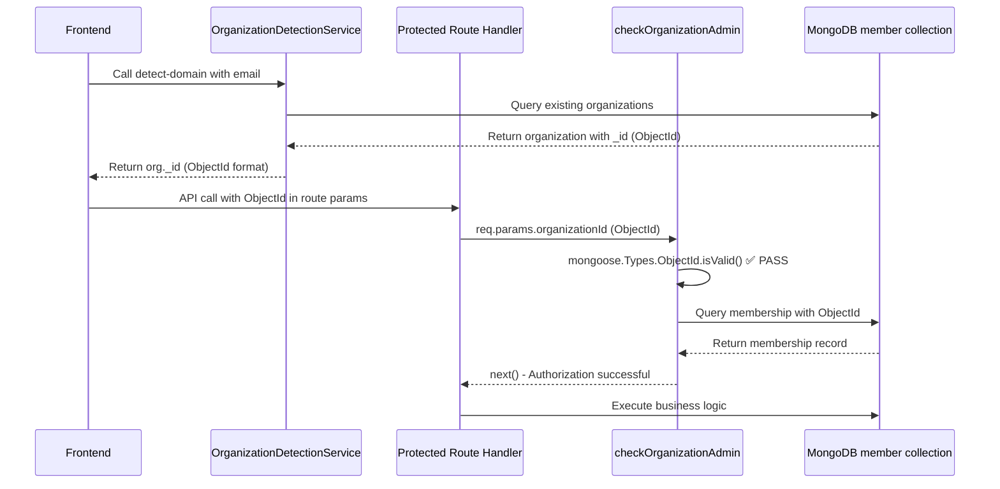
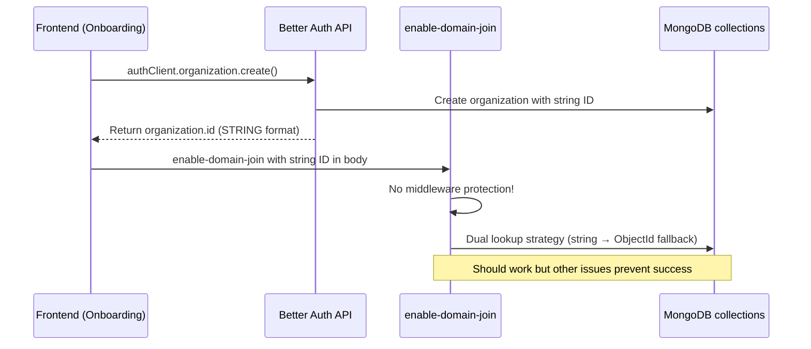

# Complete Analysis: Why Enable-Domain-Join Needed Protection Removed

## Executive Summary

The `/api/organization/enable-domain-join` endpoint required authentication protection removal due to a complex web of ID format incompatibilities, timing issues, and architectural mismatches between Better Auth (string IDs) and MongoDB native operations (ObjectIds). This analysis maps the complete data flow to explain why other protected endpoints work while enable-domain-join fails.

## Data Flow Analysis

### Working Protected Endpoints Flow



**Why This Works:**
- Frontend gets **ObjectId format** from detection service
- Middleware expects **ObjectId format** and gets it
- Database lookups succeed with matching ID formats

### Failing Enable-Domain-Join Flow



**Why This Would Fail With Protection:**
- Frontend provides **string format** from Better Auth
- `checkOrganizationAdmin` expects `req.params` but gets `req.body`
- Middleware expects **ObjectId format** but gets **string format**
- Membership lookup might fail due to ID format mismatches

## Detailed Issue Breakdown

### Issue 1: Parameter Location Mismatch

**checkOrganizationAdmin.js:18**
```javascript
const { organizationId } = req.params;  // ← ONLY looks in params
```

**Working Endpoints:**
```javascript
// All use route parameters
router.get('/:organizationId/join-requests', ...)
router.post('/:organizationId/join-requests/:requestId/approve', ...)
```

**Broken Endpoint:**
```javascript
// Uses request body
router.post('/enable-domain-join', async (req, res) => {
  const { organizationId } = req.body;  // ← Data in body, not params
```

### Issue 2: ID Format Validation

**checkOrganizationAdmin.js:43**
```javascript
if (!mongoose.Types.ObjectId.isValid(organizationId)) {
  return res.status(400).json({
    error: 'Invalid organization ID format',
  });
}
```

**ID Format Comparison:**
- **Working endpoints**: Receive `"507f1f77bcf86cd799439011"` (ObjectId string)
- **enable-domain-join**: Receives `"ba_org_123abc456def"` (Better Auth string)

### Issue 3: Membership Lookup Format Mismatch

**Database Reality Check:**

From actual member collection data:
```json
{
  "_id": {"$oid": "686e720d45dc2f1be885b4bb"},
  "organizationId": {"$oid": "686e720d45dc2f1be885b4ba"},  // ObjectId format
  "userId": {"$oid": "686e720c45dc2f1be885b4b6"},           // ObjectId format
  "role": "owner"
}
```

**Middleware Query:**
```javascript
const membership = await memberCollection.findOne({
  userId,           // Better Auth string: "ba_user_123"
  organizationId,   // Better Auth string: "ba_org_456"
  role: { $in: ['admin', 'owner'] },
});
// No match found! Different ID formats stored vs searched
```

## Better Auth vs MongoDB Integration Analysis

### ID Generation Systems

| Component | ID Format | Example | Storage Location |
|-----------|-----------|---------|------------------|
| Better Auth Organizations | String | `"ba_org_123abc456def"` | `organization.id` field |
| Better Auth Users | String | `"ba_user_789ghi012jkl"` | `user.id` field |
| MongoDB Native | ObjectId | `"507f1f77bcf86cd799439011"` | `collection._id` field |
| Member Collection | Mixed | Both formats | Depends on creation path |

### Membership Creation Inconsistencies

**Path 1: OrganizationService.js (Manual Creation)**
```javascript
await memberCollection.insertOne({
  _id: new mongoose.Types.ObjectId(),
  userId,                                      // Better Auth string
  organizationId: organization._id.toString(), // Converted to string
  role: 'owner',
});
```

**Path 2: OrganizationJoinService.js (Auto-Join)**
```javascript
await memberCollection.insertOne({
  _id: new mongoose.Types.ObjectId(),
  userId: mongoose.Types.ObjectId.isValid(userId) 
    ? new mongoose.Types.ObjectId(userId)     // Convert to ObjectId
    : userId,                                 // Keep as string
  organizationId: mongoose.Types.ObjectId.isValid(organizationId)
    ? new mongoose.Types.ObjectId(organizationId)  // Convert to ObjectId
    : organizationId,                               // Keep as string
});
```

**Result**: Inconsistent ID formats in member collection depending on creation path!

## Timing Issues During Onboarding

### Session Creation Hook Problem

**auth.js database hook:**
```javascript
session: {
  create: {
    before: async (session) => {
      const memberCollection = db.collection('member');
      const membership = await memberCollection.findOne({ userId: session.userId });
      
      if (membership && membership.organizationId) {
        return {
          data: {
            ...session,
            activeOrganizationId: membership.organizationId,
          },
        };
      }
      // ❌ No membership found during session creation!
    },
  },
}
```

**Timeline Problem:**
1. User creates organization via Better Auth
2. Session created immediately
3. Membership record created later (or not at all)
4. `checkOrganizationAdmin` fails because no membership exists

## Why Other Routes Work vs Enable-Domain-Join

### Service Layer Dual-Format Handling

**OrganizationJoinService._getOrganization():**
```javascript
// Lines 502-520: Smart lookup that tries both formats
let organization = await organizationCollection.findOne({ id: organizationId });

if (!organization && mongoose.Types.ObjectId.isValid(organizationId)) {
  organization = await organizationCollection.findOne({ 
    _id: new mongoose.Types.ObjectId(organizationId) 
  });
}
```

**Why Working Endpoints Succeed:**
1. Receive ObjectId format from detection service
2. Pass middleware validation
3. Service layer handles any remaining format issues

**Why Enable-Domain-Join Would Fail:**
1. Receives string format from Better Auth
2. **Never reaches service layer** - blocked by middleware validation
3. Even without middleware, timing issues prevent membership checks

## Architectural Pattern Comparison

### Consistent Pattern (Working)
```
Frontend (ObjectId) → Route Params (ObjectId) → Middleware (validates ObjectId) → Service (dual-format handling) → Database (success)
```

### Broken Pattern (Enable-Domain-Join)
```
Frontend (String) → Request Body (String) → No Middleware → Service (dual-format handling) → Database (mixed results)
```

### Required Pattern (Fixed)
```
Frontend (String) → Request Body (String) → Updated Middleware (handles both formats + body params) → Service (dual-format handling) → Database (success)
```

## Root Cause Summary

The enable-domain-join endpoint needed protection removed due to a **perfect storm** of issues:

1. **Architectural Mismatch**: Better Auth strings vs MongoDB ObjectId expectations
2. **Middleware Limitations**: Strict ObjectId validation + params-only reading
3. **Inconsistent Data Storage**: Member records stored in different ID formats
4. **Timing Issues**: Membership creation vs session establishment
5. **Parameter Location**: Route params vs request body organizationId

The fundamental issue is that the system was designed around MongoDB ObjectIds but Better Auth introduced string-based IDs without updating all the integration points consistently.

## Recommendations

### Immediate Fix (Low Risk)
1. Update `checkOrganizationAdmin` to read from both `req.params` and `req.body`
2. Add string ID format support to middleware validation
3. Implement dual-format membership lookups like service layer

### Long-term Solution (High Impact)
1. Standardize on single ID format across entire system
2. Create centralized ID conversion utilities
3. Update all database operations to handle format consistency
4. Implement proper Better Auth integration patterns

---

**Date**: 2025-07-10  
**Analysis By**: Claude Code  
**Status**: Investigation Complete  
**Next Steps**: Implement middleware fixes for immediate resolution