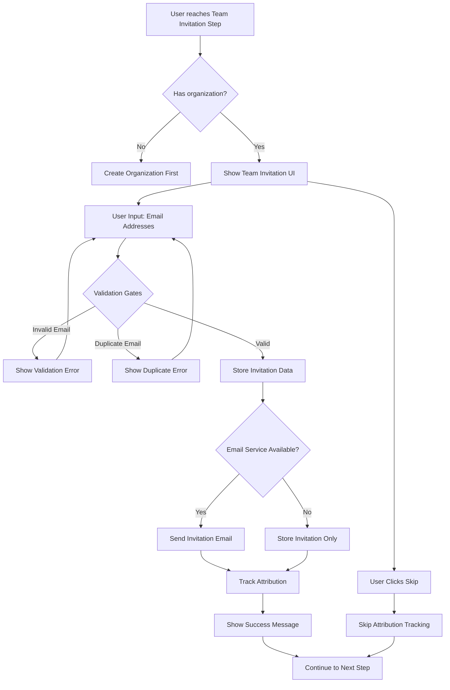
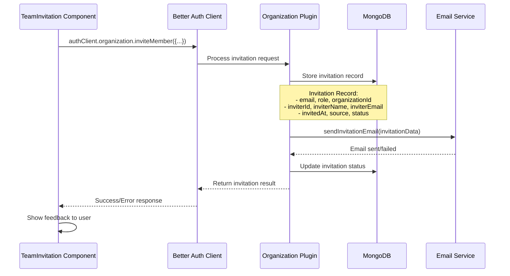
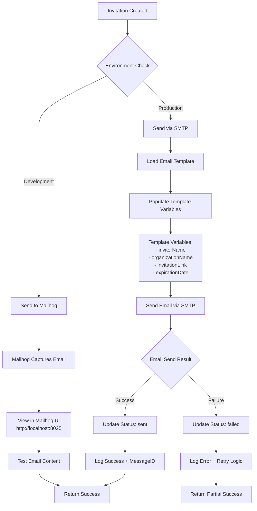
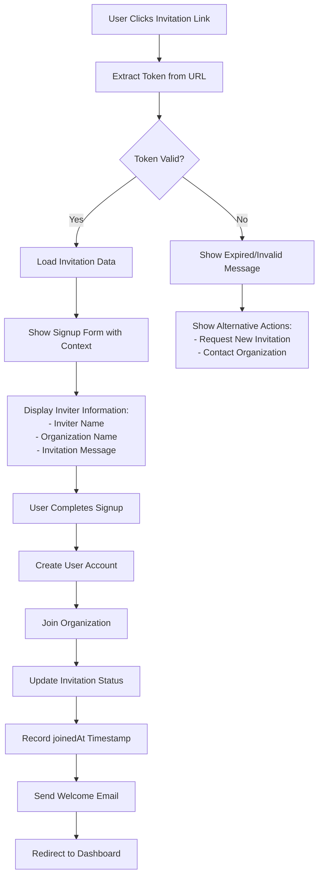
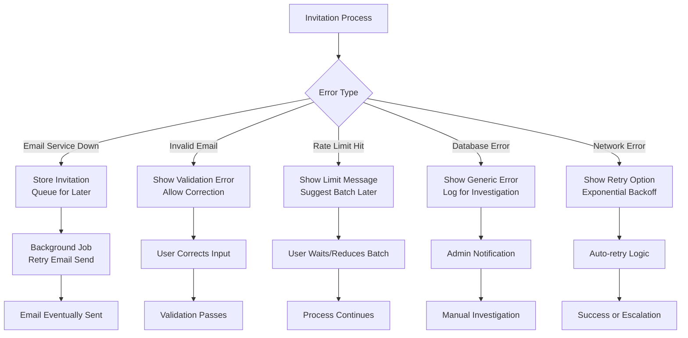

## Description

Build the team invitation step in the onboarding flow, allowing new organization owners to invite team members. This step should be skippable for users who want to explore first.

## Acceptance Criteria

- [ ] Email input for team invitations
- [ ] Bulk invite functionality
- [ ] Skip option for solo users
- [ ] Send invitation emails
- [ ] Track invitation metrics
- [ ] **NEW: Store invitation attribution (invitedBy field)**
- [ ] **NEW: Display inviter information during signup**
- [ ] **NEW: Track invitation chains for analytics**

## Technical Details

**Priority**: Medium  
**Estimated Size**: M  
**Dependencies**: Task #8 (Profile Setup)

## Flow Diagrams & Architecture

### 1. Onboarding Invitation Flow



### 2. Better Auth Integration Flow



### 3. Invitation Attribution Schema

```
┌─────────────────────────────────────────┐
│           Invitation Record             │
├─────────────────────────────────────────┤
│ Core Fields:                            │
│ • id: string                            │
│ • email: string                         │
│ • role: UserRole                        │
│ • status: pending|accepted|declined     │
│ • organizationId: string                │
│ • inviterId: string                     │
│ • expiresAt: Date                       │
│ • createdAt: Date                       │
├─────────────────────────────────────────┤
│ Attribution Fields (NEW):               │
│ • inviterName: string                   │
│ • inviterEmail: string                  │
│ • invitedAt: Date                       │
│ • joinedAt: Date                        │
│ • source: string                        │
├─────────────────────────────────────────┤
│ Indexes:                                │
│ • { organizationId: 1, email: 1 }       │
│ • { inviterId: 1, invitedAt: -1 }       │
│ • { status: 1, expiresAt: 1 }           │
└─────────────────────────────────────────┘
```

### 4. Conditional Gates & Validation

```
┌─────────────────────────────────────────┐
│         Invitation Validation           │
├─────────────────────────────────────────┤
│ GATE 1: Email Format Validation         │
│ • Regex: /^[^\s@]+@[^\s@]+\.[^\s@]+$/   │
│ • Block: no-reply@, admin@, etc.        │
│ • Action: Show inline error             │
├─────────────────────────────────────────┤
│ GATE 2: Duplicate Detection             │
│ • Check: Same email in form             │
│ • Check: Already invited                │
│ • Check: Already member                 │
│ • Action: Show warning/skip             │
├─────────────────────────────────────────┤
│ GATE 3: Rate Limiting                   │
│ • Onboarding: Max 10 invites            │
│ • Hourly: Max 50 invites                │
│ • Daily: Max 100 invites                │
│ • Action: Show limit message            │
├─────────────────────────────────────────┤
│ GATE 4: Organization Permissions       │
│ • Check: User is admin/owner            │
│ • Check: Organization exists            │
│ • Check: User is member                 │
│ • Action: 403 Forbidden                 │
└─────────────────────────────────────────┘
```

### 5. Email Sending Flow



### 6. Invitation Acceptance Flow



### 7. Analytics & Attribution Tracking

```
┌─────────────────────────────────────────┐
│        Analytics Pipeline              │
├─────────────────────────────────────────┤
│ Event: invitation.created               │
│ • inviterId, organizationId             │
│ • source, timestamp                     │
│ • batch_size (for bulk invites)         │
├─────────────────────────────────────────┤
│ Event: invitation.sent                  │
│ • invitationId, email_status            │
│ • delivery_time                         │
├─────────────────────────────────────────┤
│ Event: invitation.viewed                │
│ • invitationId, user_agent              │
│ • referrer, timestamp                   │
├─────────────────────────────────────────┤
│ Event: invitation.accepted              │
│ • invitationId, userId                  │
│ • time_to_accept                        │
│ • signup_method                         │
├─────────────────────────────────────────┤
│ Metrics Calculated:                     │
│ • Invitation Conversion Rate            │
│ • Viral Coefficient                     │
│ • Time to First Team Member             │
│ • Most Effective Inviters               │
│ • Source Performance                    │
└─────────────────────────────────────────┘
```

### 8. Error Handling & Recovery



## Current Implementation Status

### ✅ Completed Components

1. **E2E Acceptance Tests** (`/e2e/specs/auth-ob/auth-ob.team-invitation.spec.ts`)
   - Team invitation flow testing
   - Skip functionality testing
   - Bulk invitation testing
   - Error handling testing

2. **TeamInvitation Component** (`/client/src/components/Auth/OnboardingFlow/TeamInvitation.tsx`)
   - Email input validation
   - Bulk paste functionality
   - Dynamic field addition/removal
   - Integration with Better Auth

3. **Database Schema Enhancement** (`/client/src/config/betterAuth.ts`)
   - Attribution fields added to OrganizationInvitation interface
   - inviterName, inviterEmail, invitedAt, joinedAt, source fields

4. **Onboarding Integration** (`/client/src/routes/OnboardingRoute.tsx`)
   - TeamInvitation component integrated into onboarding flow
   - Success/error feedback handling

### 🔄 In Progress

5. **Email Sending Configuration** (`/api/auth.js`)
   - Better Auth organization plugin configuration
   - Magic link email sending setup
   - Template system integration

### ⏳ Pending Tasks

6. **Invitation Email Templates**
   - Handlebars templates for invitation emails
   - Personalization with inviter information
   - Mobile-responsive design

7. **Signup Flow Enhancement**
   - Display inviter information during signup
   - Invitation context in signup forms
   - Attribution tracking on acceptance

8. **Analytics Implementation**
   - Event tracking for invitation lifecycle
   - Conversion rate calculations
   - Viral coefficient metrics

## Critical Decision Points

### 1. Email Service Configuration

**Current State**: Better Auth magic link system configured with Mailhog for development, but organization plugin email sending needs implementation.

**Implementation Strategy**: 
- Use existing sendEmail utility (`/api/server/utils/sendEmail.js`)
- Configure `sendInvitationEmail` function in organization plugin
- Template system: Handlebars templates (consistent with magic link emails)
- Development: Mailhog for local email testing (same as magic link setup)
- Production: SMTP configuration for actual email delivery

### 2. Invitation Token Security

**Current State**: Better Auth handles token generation and validation.

**Security Considerations**:
- Token expiration (currently 10 minutes for magic links)
- Rate limiting on invitation creation
- Secure token storage and validation

### 3. Attribution Data Structure

**Current State**: Enhanced OrganizationInvitation interface with attribution fields.

**Data Flow**:
```javascript
// During invitation creation
{
  inviterName: user.name,      // From current user session
  inviterEmail: user.email,    // From current user session
  invitedAt: new Date(),       // Timestamp of invitation
  source: 'onboarding',        // Context where invitation was sent
}

// During acceptance
{
  joinedAt: new Date(),        // Timestamp when user joined
  status: 'accepted',          // Updated from 'pending'
}
```

### 4. Error Handling Strategy

**Current Approach**: Multi-layer error handling with graceful degradation.

**Error Categories**:
- **Validation Errors**: Client-side validation with server-side verification
- **Email Service Errors**: Fallback to file-based storage in development
- **Rate Limiting**: Progressive restrictions with clear user feedback
- **Database Errors**: Retry logic with exponential backoff

### 5. Performance Considerations

**Bulk Operations**: 
- Client-side: Batch validation and submission
- Server-side: Parallel invitation processing
- Database: Efficient indexing strategy

**Caching Strategy**:
- Organization membership caching
- Invitation status caching
- Email template caching

## Edge Cases & Considerations

### 1. Duplicate Invitation Handling

```javascript
// Check for existing invitations
const existingInvitation = await db.invitation.findOne({
  organizationId,
  email,
  status: 'pending'
});

if (existingInvitation) {
  // Option 1: Update existing invitation
  // Option 2: Show warning and skip
  // Option 3: Cancel old, create new
}
```

### 2. Organization Ownership Transfer

**Scenario**: What happens to invitation attribution when organization ownership changes?

**Solution**: Maintain historical attribution data, add ownership_at_time field if needed.

### 3. Invitation Expiration

**Current**: 7 days for invitation links (configurable)

**Cleanup Strategy**:
- Background job to clean expired invitations
- Notification to inviter on expiration
- Option to resend expired invitations

### 4. Cross-Organization Invitations

**Edge Case**: User already belongs to organization A, invited to organization B.

**Handling**: Better Auth organization plugin supports multi-organization membership.

### 5. Email Deliverability

**Considerations**:
- SPF/DKIM configuration
- Email reputation monitoring
- Bounce handling and retry logic
- Unsubscribe handling

## Testing Strategy

### Unit Tests
- Email validation logic
- Invitation creation/update functions
- Attribution tracking functions

### Integration Tests
- Better Auth organization plugin integration
- Email service integration
- Database operations

### E2E Tests (Completed)
- Full onboarding flow with invitations
- Error scenarios and recovery
- Bulk invitation workflows

## UI Design

### Invitation Form

```
┌─────────────────────────────────────────┐
│  Who else is on the [Org Name] team?   │
│                                         │
│  Add teammates by email:                │
│  ┌───────────────────────────────────┐ │
│  │ colleague@company.com             │ │
│  └───────────────────────────────────┘ │
│  + Add another                          │
│                                         │
│  [Skip for now]     [Send Invitations]  │
└─────────────────────────────────────────┘
```

### Features

1. **Email Input Fields**

   - Dynamic addition/removal of fields
   - Email validation
   - Duplicate detection
   - Max 10 invites in onboarding

2. **Bulk Operations**

   - Paste multiple emails (comma/newline separated)
   - Import from CSV option (future enhancement)

3. **Skip Option**
   - Clear "Skip for now" button
   - No penalty for skipping
   - Can invite later from settings

## Backend Implementation

```javascript
// Send invitations with full attribution
const invitations = await Promise.all(
  emails.map((email) =>
    auth.api.invitation.create({
      organizationId: org.id,
      email: email,
      role: "member",
      invitedBy: user.id, // User ID who sent invitation
      inviterName: user.name, // For display during signup
      inviterEmail: user.email, // For context
      invitedAt: new Date(), // Timestamp
      source: "onboarding", // Track invitation source
    })
  )
);

// Send email notifications
await sendInvitationEmails(invitations);
```

## Invitation Attribution Features

### Database Schema Enhancement

```javascript
// Add to organization membership/invitation table
{
  invitedBy: String,        // User ID of inviter
  inviterName: String,      // Display name for UX
  inviterEmail: String,     // For reference
  invitedAt: Date,          // Invitation timestamp
  joinedAt: Date,           // When they accepted (if they did)
  source: String,           // 'onboarding', 'dashboard', 'api', etc.
}
```

### Signup Experience Enhancement

When invited users sign up, show:

```
┌─────────────────────────────────────────┐
│  Join [Organization Name]               │
│                                         │
│  👋 John Doe (john@company.com)         │
│     invited you to join the team        │
│                                         │
│  [Continue with Google] [Continue with  │
│                         Email]          │
└─────────────────────────────────────────┘
```

## Email Template

- Personalized with inviter's name
- Organization name and description
- Clear CTA to join
- Expiration info (7 days)
- **NEW: "Join [Name]'s team at [Org]" subject line**

## Metrics to Track

- Number of invites sent during onboarding
- Skip rate
- Invitation acceptance rate
- Time to first team member joining
- **NEW: Invitation attribution analytics**
  - Most effective inviters
  - Invitation conversion by source
  - Team growth viral coefficient
  - Time from invite to signup

## Analytics Queries

```javascript
// Find most effective inviters
SELECT invitedBy, COUNT(*) as invites_sent,
       COUNT(joinedAt) as accepted_invites
FROM invitations
WHERE organizationId = ?
GROUP BY invitedBy;

// Track viral growth
SELECT source, COUNT(*) as invitations,
       AVG(DATEDIFF(joinedAt, invitedAt)) as avg_time_to_join
FROM invitations
WHERE joinedAt IS NOT NULL
GROUP BY source;
```

## Error Handling

- Invalid email formats
- Existing members
- Failed email sends
- Rate limiting (max 50 invites/hour)

## Related PRD

[Onboarding Flow Refactor PRD](/docs/ACTIVE/onboarding-flow-refactor-prd.md) - Task #9
