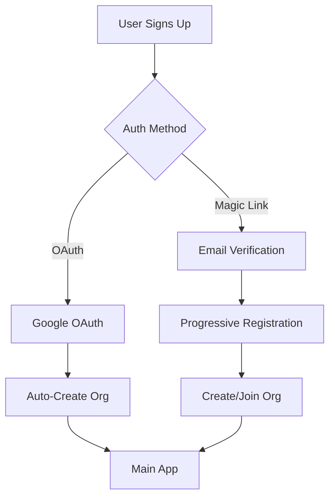
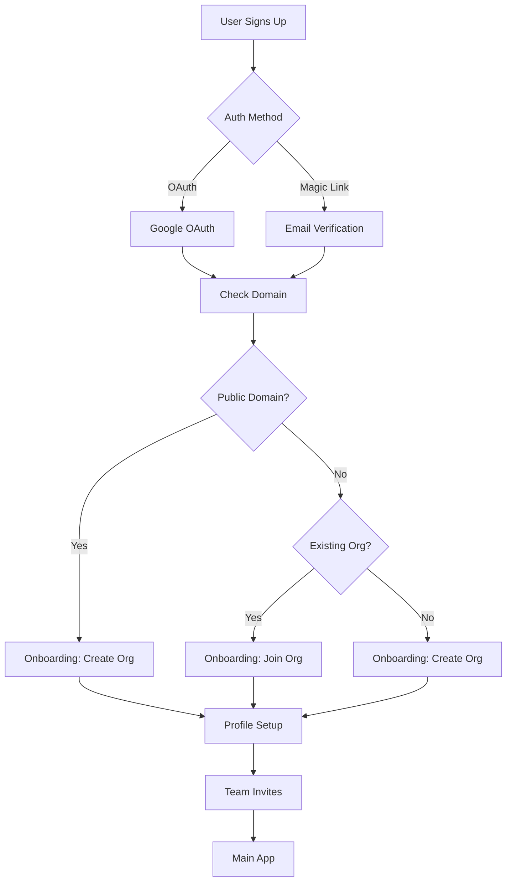

# Product Requirements Document: Onboarding Flow Refactor

## Executive Summary

### Problem Statement

Agentis currently auto-creates organizations for all users based on their email domain during signup. This approach is problematic for public email domains (Gmail, Yahoo, etc.) and doesn't provide users with control over their organization settings. The current flow bypasses important onboarding steps and doesn't align with industry best practices exemplified by Slack.

### Proposed Solution

Implement a Slack-style onboarding flow that:

1. Prevents automatic organization creation for public email domains
2. Provides explicit organization creation/joining steps
3. Allows corporate domains to enable auto-join functionality
4. Follows a proper sequence: Auth → Org Creation → Profile → Team Invites

### Key Benefits

- **User Control**: Users explicitly choose to create or join organizations
- **Public Domain Safety**: Prevents accidental organization creation for Gmail/Yahoo users
- **Corporate Flexibility**: Organizations can enable domain-based auto-join
- **Better UX**: Guided onboarding improves user understanding and engagement
- **Data Quality**: Explicit steps ensure accurate organization and profile data

### Key Risks

- **Migration Complexity**: Existing users may have auto-created organizations
- **Breaking Changes**: Current OAuth flow assumptions will change
- **User Friction**: Additional steps may increase drop-off rates

## Technical Analysis

### Current Architecture Assessment

#### Authentication Flow

#### Key Components

1. **Better Auth Integration**

   - Handles authentication, sessions, and organization management
   - Currently has `onCreate` hooks that auto-create organizations
   - Manages user-organization relationships through member records

2. **Frontend Components**

   - `ProgressiveRegistration`: Multi-step registration flow (magic link only)
   - `OAuthOnboardingRedirect`: Attempts to redirect OAuth users without orgs
   - `OnboardingFlow/*`: Unused components for proper onboarding

3. **Backend Services**
   - `OrganizationService`: Handles organization CRUD operations
   - `handleOrganizationAssignment`: Auto-assigns users to orgs by domain
   - Public domain list exists but isn't utilized

### Proposed Changes

#### New Authentication Flow

#### Architecture Changes

1. **Disable Auto-Organization Creation**

   - Remove `onCreate` hooks in Better Auth organization plugin
   - Update session creation to handle users without organizations

2. **Unified Onboarding Route**

   - Create `/onboarding` route for all new users
   - Support resumable onboarding for interrupted flows
   - Handle different entry points (OAuth, Magic Link)

3. **Domain Detection Service**

   - Implement public domain checking using existing list
   - Add organization domain detection for corporate emails
   - Support subdomain handling (user@dept.company.com)

4. **Organization Settings**
   - Add `allowDomainJoin` boolean field to organizations
   - Implement domain verification for security
   - Support multiple verified domains per organization

### Dependency Mapping

- **Better Auth**: Core authentication system
- **MongoDB**: User and organization data storage
- **React Router**: Frontend routing for onboarding flow
- **Tailwind CSS**: Styling for onboarding components

### Performance Considerations

- **Domain Checking**: Use in-memory Set for O(1) lookup of public domains
- **Database Queries**: Index email domains for fast organization lookup
- **Session Management**: Cache user-organization relationships
- **Progressive Enhancement**: Load onboarding steps on-demand

## Implementation Plan

### Phase 1: Foundation (Week 1)

1. Fix existing Better Auth hook implementation
2. Implement public domain detection service
3. Create unified onboarding route structure
4. Update authentication redirects

### Phase 2: Core Flow (Week 2)

1. Build organization creation/join flow
2. Implement domain-based organization detection
3. Add "allow domain join" functionality
4. Create profile setup integration

### Phase 3: Polish & Migration (Week 3)

1. Implement team invitation flow
2. Add onboarding progress persistence
3. Create migration for existing users
4. Add analytics and error tracking

### Resource Requirements

- **Engineering**: 1 full-stack developer for 3 weeks
- **Design**: UI/UX review of onboarding screens
- **QA**: Test coverage for all auth methods and edge cases
- **DevOps**: Database migration support

## Risk Assessment

### Technical Risks

1. **Breaking Changes**
   - Risk: Existing OAuth users may lose access
   - Mitigation: Implement backwards compatibility layer
2. **Data Migration**

   - Risk: Incorrect organization assignments
   - Mitigation: Dry-run migrations with rollback plan

3. **Performance Impact**
   - Risk: Additional steps slow down signup
   - Mitigation: Optimize queries and use caching

### Timeline Risks

1. **Scope Creep**

   - Risk: Additional features requested during development
   - Mitigation: Strict adherence to PRD scope

2. **Integration Complexity**
   - Risk: Better Auth limitations require workarounds
   - Mitigation: Early spike to validate approach

### Mitigation Strategies

1. **Feature Flags**: Roll out to percentage of users
2. **A/B Testing**: Compare conversion rates
3. **Monitoring**: Track drop-off at each step
4. **Rollback Plan**: Keep legacy flow available

## Task List

### Task #1: Fix Better Auth Organization Hook

<https://github.com/gannonh/agentis/issues/98>

**Priority**: High  
**Estimated Size**: S  
**Dependencies**: None  
**Acceptance Criteria**:

- [x] Fix `handleOrganizationAssignment` function call parameters
- [x] Verify organizations are created correctly via hooks
- [x] Add error handling for hook failures
- [x] Unit tests for organization assignment logic

### Task #2: Implement Public Domain Detection Service

<https://github.com/gannonh/agentis/issues/99>

**Priority**: High  
**Estimated Size**: S  
**Dependencies**: None  
**Acceptance Criteria**:

- [x] Create service using existing public-email-domains.txt
- [x] Implement efficient domain lookup (Set-based)
- [x] Add subdomain handling (mail.google.com → google.com)
- [x] Support domain extraction from email addresses
- [x] Unit tests with 95% coverage

### Task #3: Create Onboarding Route Structure

<https://github.com/gannonh/agentis/issues/100>

**Priority**: High  
**Estimated Size**: M  
**Dependencies**: None  
**Acceptance Criteria**:

- [x] Create `/onboarding` route with step management
- [x] Implement route guards for authenticated users
- [x] Add progress tracking and step validation
- [x] Support resumable onboarding flows
- [x] Handle different entry points (OAuth vs Magic Link)

### Task #4: Disable Auto-Organization Creation

<https://github.com/gannonh/agentis/issues/101>

**Priority**: High  
**Estimated Size**: M  
**Dependencies**: Task #1  
**Acceptance Criteria**:

- [x] Remove/modify Better Auth onCreate hooks
- [x] Update session creation to handle org-less users
- [x] Redirect new users to onboarding flow
- [x] Maintain backwards compatibility for existing users
- [x] Integration tests for both auth methods

### Task #5: Build Organization Detection Step

<https://github.com/gannonh/agentis/issues/102>

**Priority**: High  
**Estimated Size**: M  
**Dependencies**: Tasks #2, #3  
**Acceptance Criteria**:

- [x] Check if user's domain is public/private
- [x] Search for existing organizations by domain
- [x] Display appropriate UI (create vs join)
- [x] Handle edge cases (no org exists, multiple orgs)
- [x] E2E tests for detection logic

### Task #6: Implement Organization Creation Flow

<https://github.com/gannonh/agentis/issues/103>

**Priority**: High  
**Estimated Size**: L  
**Dependencies**: Task #5  
**Acceptance Criteria**:

- [ ] Organization name and slug input
- [ ] Domain verification for corporate emails
- [ ] "Allow domain join" checkbox option
- [ ] Create organization via Better Auth API
- [ ] Assign user as organization owner
- [ ] Form validation and error handling

### Task #7: Implement Organization Join Flow

<https://github.com/gannonh/agentis/issues/104>

**Priority**: High  
**Estimated Size**: M  
**Dependencies**: Task #5  
**Acceptance Criteria**:

- [ ] Display organization details before joining
- [ ] Request to join (if domain join disabled)
- [ ] Auto-join (if domain join enabled)
- [ ] Send notifications to org admins
- [ ] Handle approval/rejection flows

### Task #8: Update Profile Setup Integration.

<https://github.com/gannonh/agentis/issues/105>

**Priority**: Medium  
**Estimated Size**: S  
**Dependencies**: Tasks #6, #7  
**Acceptance Criteria**:

- [ ] Ensure profile setup works after org creation/join
- [ ] Pre-fill data from OAuth providers
- [ ] Update user record with profile data
- [ ] Handle profile image uploads

### Task #9: Implement Team Invitation Flow

<https://github.com/gannonh/agentis/issues/106>

**Priority**: Medium  
**Estimated Size**: M  
**Dependencies**: Task #8  
**Acceptance Criteria**:

- [ ] Email input for team invitations
- [ ] Bulk invite functionality
- [ ] Skip option for solo users
- [ ] Send invitation emails
- [ ] Track invitation metrics

### Task #10: Add Onboarding Analytics

<https://github.com/gannonh/agentis/issues/107>

**Priority**: Medium  
**Estimated Size**: S  
**Dependencies**: Tasks #3-9  
**Acceptance Criteria**:

- [ ] Track progression through each step
- [ ] Monitor drop-off rates
- [ ] Record time spent per step
- [ ] Add error tracking
- [ ] Create analytics dashboard

### Task #12: Update Documentation

<https://github.com/gannonh/agentis/issues/109>

**Priority**: Low  
**Estimated Size**: S  
**Dependencies**: All tasks  
**Acceptance Criteria**:

- [ ] Update API documentation
- [ ] Create onboarding flow diagrams
- [ ] Document organization settings
- [ ] Add troubleshooting guide
- [ ] Update developer setup instructions

### Task #13: E2E Test Suite

<https://github.com/gannonh/agentis/issues/110>

**Priority**: High  
**Estimated Size**: L  
**Dependencies**: Tasks #3-9  
**Acceptance Criteria**:

- [ ] Test OAuth signup → onboarding → completion
- [ ] Test Magic Link signup → onboarding → completion
- [ ] Test domain detection scenarios
- [ ] Test organization creation/join flows
- [ ] Test error scenarios and edge cases
- [ ] Test migration scenarios

## Success Metrics

1. **Conversion Rate**: Maintain or improve signup completion rate
2. **Time to Activation**: Reduce time from signup to first meaningful action
3. **Organization Quality**: Reduce orphaned/incorrect organizations by 90%
4. **User Satisfaction**: Onboarding NPS score > 7
5. **Drop-off Rate**: < 15% abandonment during onboarding

## GitHub Issues Links

### Implementation Tasks

- **Task #1**: [Fix Better Auth Organization Hook](https://github.com/gannonh/agentis/issues/98)
- **Task #2**: [Implement Public Domain Detection Service](https://github.com/gannonh/agentis/issues/99)
- **Task #3**: [Create Onboarding Route Structure](https://github.com/gannonh/agentis/issues/100)
- **Task #4**: [Disable Auto-Organization Creation](https://github.com/gannonh/agentis/issues/101)
- **Task #5**: [Build Organization Detection Step](https://github.com/gannonh/agentis/issues/102)
- **Task #6**: [Implement Organization Creation Flow](https://github.com/gannonh/agentis/issues/103)
- **Task #7**: [Implement Organization Join Flow](https://github.com/gannonh/agentis/issues/104)
- **Task #8**: [Update Profile Setup Integration](https://github.com/gannonh/agentis/issues/105)
- **Task #9**: [Implement Team Invitation Flow](https://github.com/gannonh/agentis/issues/106)
- **Task #10**: [Add Onboarding Analytics](https://github.com/gannonh/agentis/issues/107)
- **Task #11**: [Create Migration for Existing Users](https://github.com/gannonh/agentis/issues/108)
- **Task #12**: [Update Documentation](https://github.com/gannonh/agentis/issues/109)
- **Task #13**: [E2E Test Suite for Onboarding Flow](https://github.com/gannonh/agentis/issues/110)
