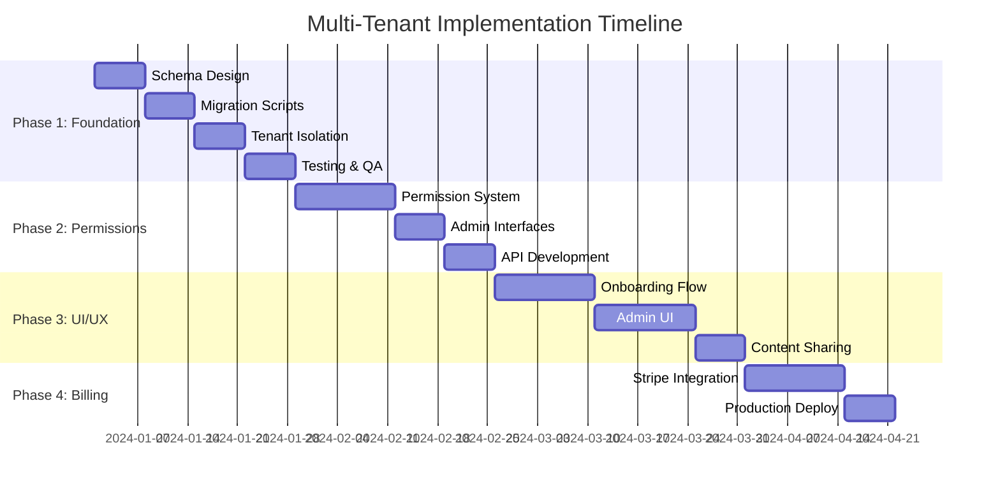

# Multi-Tenant Implementation Roadmap

## Overview

4-phase transformation from single-tenant to multi-tenant SaaS platform, estimated 12-16 weeks total development time.

## Phase Breakdown

### Phase 1: Foundation & Schema (3-4 weeks)
**Goal**: Establish multi-tenant data structure without breaking existing functionality

#### Deliverables
- [ ] Organization and Team schema design
- [ ] Database migration scripts
- [ ] Enhanced User model with org/team references  
- [ ] Tenant isolation middleware (query level)
- [ ] Updated JWT structure with organization context
- [ ] Regression testing suite

#### Key Features
- Default organization creation for existing users
- Organization-aware authentication flow
- Basic tenant isolation at database level
- Backward compatibility maintained

---

### Phase 2: Permission System & Admin Core (3-4 weeks)  
**Goal**: Implement role-based permissions and basic admin functionality

#### Deliverables
- [ ] Enhanced permission middleware system
- [ ] Organization admin interface (basic)
- [ ] Team creation and management APIs
- [ ] User invitation system (org/team level)
- [ ] Content sharing transformation (project → team/org)
- [ ] Agentis staff admin dashboard

#### Key Features
- Slack-inspired role hierarchy implementation
- Organization and team user management
- Cross-tenant access prevention
- Admin interface for platform oversight

---

### Phase 3: UI Transformation & User Experience (4-5 weeks)
**Goal**: Complete user-facing multi-tenant experience

#### Deliverables
- [ ] Organization onboarding flow
- [ ] Team management interface  
- [ ] Enhanced sharing controls (org/team/individual)
- [ ] Organization/team context in all UI components
- [ ] User invitation and onboarding UX
- [ ] Content discovery by organization/team
- [ ] Mobile responsiveness for admin interfaces

#### Key Features
- Seamless organization creation during signup
- Intuitive team collaboration interface
- Modern admin UX for organization management
- Context-aware content sharing

---

### Phase 4: Billing Integration & Production Readiness (2-3 weeks)
**Goal**: Stripe integration and production deployment

#### Deliverables
- [ ] Stripe organization billing integration
- [ ] Usage tracking and quota management
- [ ] Subscription plan management interface
- [ ] Payment processing and invoice handling
- [ ] Production monitoring and alerting
- [ ] Documentation and deployment guides

#### Key Features
- Automated billing at organization level
- Usage-based and seat-based pricing support  
- Self-service subscription management
- Production monitoring and observability

## Development Phases Detail

## Critical Path Dependencies

### Technical Dependencies
1. **Database Schema** → All subsequent development
2. **Permission System** → Admin interfaces and content sharing  
3. **Admin Interfaces** → User management and billing
4. **Billing Integration** → Production readiness

### Resource Dependencies
- **Full-stack developer**: All phases
- **DevOps engineer**: Phase 1 (migration) and Phase 4 (production)
- **UI/UX designer**: Phase 3 (admin interfaces)
- **QA engineer**: All phases (testing)

## Risk Assessment & Mitigation

### High Risk Items
| Risk | Impact | Mitigation |
|------|--------|------------|
| Data migration failure | Critical | Comprehensive backup strategy, staged rollout |
| Performance degradation | High | Load testing, query optimization, indexing strategy |
| User experience disruption | High | Gradual feature rollout, feature flags |
| Cross-tenant data leaks | Critical | Security audits, automated testing |

### Medium Risk Items  
| Risk | Impact | Mitigation |
|------|--------|------------|
| Timeline overrun | Medium | 20% buffer built into estimates |
| Stripe integration complexity | Medium | Use proven libraries, start early |
| Mobile compatibility issues | Medium | Responsive design from start |

## Success Criteria

### Phase 1 Success
- [ ] Zero data loss during migration
- [ ] All existing functionality preserved
- [ ] Tenant isolation working correctly
- [ ] Performance within 10% of baseline

### Phase 2 Success  
- [ ] Role-based permissions functioning
- [ ] Admin can manage organization users
- [ ] Cross-tenant access blocked
- [ ] Team creation and management working

### Phase 3 Success
- [ ] New user onboarding smooth (< 5 minutes)
- [ ] Admin interfaces intuitive (user testing)
- [ ] Content sharing working across all levels
- [ ] Mobile experience acceptable

### Phase 4 Success
- [ ] Billing integration functional
- [ ] Production deployment stable
- [ ] Monitoring and alerting active
- [ ] Documentation complete

## Resource Allocation

### Development Team Structure
- **Tech Lead** (1.0 FTE): Architecture oversight, critical development
- **Backend Developer** (1.0 FTE): API development, database work  
- **Frontend Developer** (1.0 FTE): UI/UX implementation
- **DevOps Engineer** (0.5 FTE): Migration support, production deployment
- **QA Engineer** (0.5 FTE): Testing strategy, automation

### Total Effort Estimate
- **Development**: 14-18 person-weeks
- **Testing & QA**: 4-6 person-weeks  
- **DevOps & Deployment**: 2-3 person-weeks
- **Project Management**: 2-3 person-weeks

**Total**: 22-30 person-weeks (12-16 calendar weeks with team)

## Go-Live Strategy

### Staged Rollout Approach
1. **Internal Testing** (1 week): Agentis team testing
2. **Beta Users** (1 week): Select power users
3. **Gradual Rollout** (2 weeks): 25% → 50% → 100% of traffic
4. **Full Production** (Ongoing): Monitor and optimize

This roadmap provides a structured approach to achieving the multi-tenant transformation while minimizing risk and maintaining system reliability.