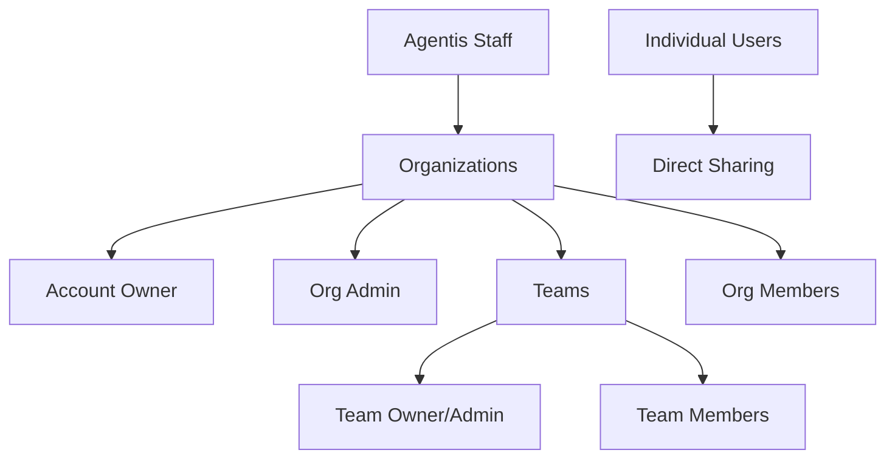

# Multi-Tenant Transformation Strategy

## Executive Summary

Transform Agentis from single-tenant to multi-tenant SaaS platform, enabling organizations to manage teams, users, and shared AI resources (agents, prompts) with Slack-inspired permission model.

## Current State Analysis

### Existing Architecture
- **Single-tenant**: All users in shared space
- **Simple roles**: Admin, User only
- **Content ownership**: User-based with project sharing
- **Authentication**: JWT + multiple social providers
- **Sharing**: Project-based system for agents/prompts


## Target Multi-Tenant Architecture

### Organizational Hierarchy (Slack-Inspired)



### Permission Levels

| Role                 | Scope        | Key Permissions                                        |
| -------------------- | ------------ | ------------------------------------------------------ |
| **Agentis Staff**    | Platform     | Manage all orgs, billing oversight, support            |
| **Account Owner**    | Organization | Transfer ownership, delete org, billing, create admins |
| **Org Admin**        | Organization | Manage users, teams, org settings, content policies    |
| **Team Owner/Admin** | Team         | Manage team members, team content, team settings       |
| **Team Member**      | Team         | Access team content, create/share within team          |
| **Org Member**       | Organization | Basic org access, join public teams                    |

## Implementation Strategy

#### Core Entity Changes

**Organizations Table/Collection:**
```javascript
{
  _id: ObjectId,
  name: String,
  domain: String, // for email-based auto-assignment
  subdomain: String, // future custom domains
  accountOwnerId: ObjectId, // ref to User
  settings: {
    allowPublicTeams: Boolean,
    requireAdminApproval: Boolean,
    contentRetentionDays: Number
  },
  billing: {
    stripeCustomerId: String,
    plan: String, // hobby, team, enterprise
    status: String, // active, suspended, cancelled
  },
  createdAt: Date
}
```

**Teams Table/Collection:**
```javascript
{
  _id: ObjectId,
  organizationId: ObjectId, // ref to Organization
  name: String,
  description: String,
  ownerId: ObjectId, // ref to User
  isPublic: Boolean,
  memberIds: [ObjectId], // refs to Users
  adminIds: [ObjectId], // refs to Users (subset of memberIds)
  createdAt: Date
}
```

**Updated User Schema:**
```javascript
{
  // ... existing fields
  organizationId: ObjectId, // ref to Organization
  orgRole: String, // account_owner, org_admin, member
  teamMemberships: [{
    teamId: ObjectId,
    role: String // owner, admin, member
  }],
  // ... rest unchanged
}
```

#### Content Sharing Enhancement

**Updated Agent/Prompt Schema:**
```javascript
{
  // ... existing fields
  organizationId: ObjectId, // tenant isolation
  sharing: {
    level: String, // private, team, org, individual
    teamIds: [ObjectId], // if level = team
    userIds: [ObjectId], // if level = individual
  },
  // Remove projectIds[] - replace with sharing object
}
```

### Phase 2: Authentication & Tenant Resolution

#### Tenant Resolution Strategy
1. **Subdomain-based**: `acme.agentis.ai` → Organization lookup
2. **Fallback**: Organization selection UI for multi-org users (future)
3. **API requests**: Include `organizationId` in JWT payload

### Phase 3: Permission System Overhaul

#### New Permission Architecture

```javascript
// Enhanced permission checking
const permissions = {
  // Content permissions
  agents: {
    create: ['account_owner', 'org_admin', 'team_owner', 'team_admin', 'member'],
    read_org: ['account_owner', 'org_admin'],
    read_team: ['team_owner', 'team_admin', 'team_member'],
    share_org: ['account_owner', 'org_admin'],
    share_team: ['team_owner', 'team_admin'],
    delete: ['owner', 'account_owner', 'org_admin']
  },
  
  // Admin permissions
  organization: {
    manage_users: ['account_owner', 'org_admin'],
    manage_teams: ['account_owner', 'org_admin'],
    manage_billing: ['account_owner'],
    delete_org: ['account_owner']
  },
  
  team: {
    create: ['account_owner', 'org_admin', 'member'],
    manage_members: ['team_owner', 'team_admin'],
    manage_settings: ['team_owner', 'team_admin']
  }
};
```

### Phase 4: Admin Interface

#### Agentis Staff Dashboard (Better Auth 'Admin')
- **Organizations**: Create, suspend, delete, billing overview
- **Users**: Cross-org user management, support tools
- **Analytics**: Usage metrics, billing summaries
- **Support**: Impersonation, audit logs

#### End-user Admin Interface  
- **User Management**: Invite, remove, role assignment
- **Team Management**: Create, archive, member oversight
- **Content Policies**: Sharing rules, retention settings
- **Billing**: Subscription management, usage monitoring

