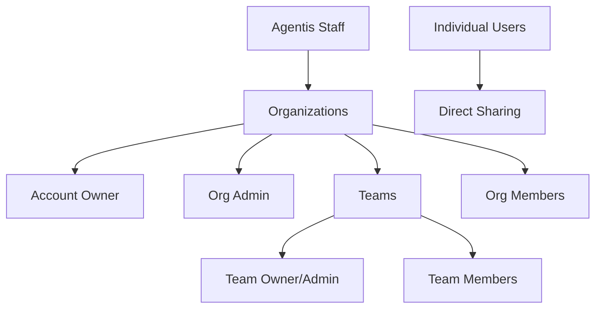

# Multi-Tenant Transformation Strategy

## Executive Summary

Transform Agentis from single-tenant to multi-tenant SaaS platform, enabling organizations to manage teams, users, and shared AI resources (agents, prompts) with Slack-inspired permission model.

## Current State Analysis

### Existing Architecture
- **Single-tenant**: All users in shared space
- **Simple roles**: Admin, User only
- **Content ownership**: User-based with project sharing
- **Authentication**: JWT + multiple social providers
- **Sharing**: Project-based system for agents/prompts

### Technical Foundation
- **Database**: MongoDB with shared schemas
- **Auth**: Passport.js strategies (local, OAuth2, LDAP)
- **Permissions**: SystemRoles + PermissionTypes enum
- **Content**: Agent/Prompt models with `projectIds[]` sharing

## Target Multi-Tenant Architecture

### Organizational Hierarchy (Slack-Inspired)



### Permission Levels

| Role | Scope | Key Permissions |
|------|-------|----------------|
| **Agentis Staff** | Platform | Manage all orgs, billing oversight, support |
| **Account Owner** | Organization | Transfer ownership, delete org, billing, create admins |
| **Org Admin** | Organization | Manage users, teams, org settings, content policies |
| **Team Owner/Admin** | Team | Manage team members, team content, team settings |
| **Team Member** | Team | Access team content, create/share within team |
| **Org Member** | Organization | Basic org access, join public teams |

## Implementation Strategy

### Phase 1: Database Schema Transformation

#### Core Entity Changes

**Organizations Table/Collection:**
```javascript
{
  _id: ObjectId,
  name: String,
  domain: String, // for email-based auto-assignment
  subdomain: String, // future custom domains
  accountOwnerId: ObjectId, // ref to User
  settings: {
    allowPublicTeams: Boolean,
    requireAdminApproval: Boolean,
    contentRetentionDays: Number
  },
  billing: {
    stripeCustomerId: String,
    plan: String, // hobby, team, enterprise
    status: String, // active, suspended, cancelled
  },
  createdAt: Date
}
```

**Teams Table/Collection:**
```javascript
{
  _id: ObjectId,
  organizationId: ObjectId, // ref to Organization
  name: String,
  description: String,
  ownerId: ObjectId, // ref to User
  isPublic: Boolean,
  memberIds: [ObjectId], // refs to Users
  adminIds: [ObjectId], // refs to Users (subset of memberIds)
  createdAt: Date
}
```

**Updated User Schema:**
```javascript
{
  // ... existing fields
  organizationId: ObjectId, // ref to Organization
  orgRole: String, // account_owner, org_admin, member
  teamMemberships: [{
    teamId: ObjectId,
    role: String // owner, admin, member
  }],
  // ... rest unchanged
}
```

#### Content Sharing Enhancement

**Updated Agent/Prompt Schema:**
```javascript
{
  // ... existing fields
  organizationId: ObjectId, // tenant isolation
  sharing: {
    level: String, // private, team, org, individual
    teamIds: [ObjectId], // if level = team
    userIds: [ObjectId], // if level = individual
  },
  // Remove projectIds[] - replace with sharing object
}
```

### Phase 2: Authentication & Tenant Resolution

#### Tenant Resolution Strategy
1. **Subdomain-based**: `acme.agentis.ai` → Organization lookup
2. **Fallback**: Organization selection UI for multi-org users (future)
3. **API requests**: Include `organizationId` in JWT payload

#### JWT Enhancement
```javascript
// Current JWT payload
{
  id: userId,
  email: userEmail,
  role: systemRole
}

// Enhanced JWT payload
{
  id: userId,
  email: userEmail,
  role: systemRole,
  organizationId: orgId,
  orgRole: orgRole, // account_owner, org_admin, member
  teamMemberships: [
    { teamId: teamId, role: teamRole }
  ]
}
```

### Phase 3: Permission System Overhaul

#### New Permission Architecture

```javascript
// Enhanced permission checking
const permissions = {
  // Content permissions
  agents: {
    create: ['account_owner', 'org_admin', 'team_owner', 'team_admin', 'member'],
    read_org: ['account_owner', 'org_admin'],
    read_team: ['team_owner', 'team_admin', 'team_member'],
    share_org: ['account_owner', 'org_admin'],
    share_team: ['team_owner', 'team_admin'],
    delete: ['owner', 'account_owner', 'org_admin']
  },
  
  // Admin permissions
  organization: {
    manage_users: ['account_owner', 'org_admin'],
    manage_teams: ['account_owner', 'org_admin'],
    manage_billing: ['account_owner'],
    delete_org: ['account_owner']
  },
  
  team: {
    create: ['account_owner', 'org_admin', 'member'],
    manage_members: ['team_owner', 'team_admin'],
    manage_settings: ['team_owner', 'team_admin']
  }
};
```

#### Middleware Updates

```javascript
// Enhanced permission middleware
const checkTenantAccess = (permission, scope = 'org') => {
  return async (req, res, next) => {
    const { organizationId, orgRole, teamMemberships } = req.user;
    
    // Tenant isolation check
    if (req.resourceOrgId && req.resourceOrgId !== organizationId) {
      return res.status(403).json({ error: 'Access denied' });
    }
    
    // Permission validation based on scope
    const hasPermission = validatePermission(
      permission, 
      scope, 
      orgRole, 
      teamMemberships,
      req.targetTeamId
    );
    
    if (!hasPermission) {
      return res.status(403).json({ error: 'Insufficient permissions' });
    }
    
    next();
  };
};
```

### Phase 4: Admin Interface

#### Agentis Staff Dashboard
- **Organizations**: Create, suspend, delete, billing overview
- **Users**: Cross-org user management, support tools
- **Analytics**: Usage metrics, billing summaries
- **Support**: Impersonation, audit logs

#### Organization Admin Interface  
- **User Management**: Invite, remove, role assignment
- **Team Management**: Create, archive, member oversight
- **Content Policies**: Sharing rules, retention settings
- **Billing**: Subscription management, usage monitoring

## Migration Strategy

### Phase 1: Schema Migration (Non-Breaking)
1. Add organization/team fields to existing schemas
2. Create default organization for existing users
3. Migrate existing content to organization ownership
4. Update JWT to include organization context

### Phase 2: Permission Layer (Breaking)
1. Deploy new permission middleware
2. Update all content access APIs
3. Implement tenant isolation throughout
4. Replace project-based sharing with team/org sharing

### Phase 3: UI Transformation
1. Add organization/team context to all UI
2. Implement admin interfaces
3. Update sharing modals and permissions
4. Add onboarding flows

### Phase 4: Billing Integration
1. Stripe integration at organization level
2. Usage tracking and quotas
3. Plan management interface
4. Payment processing

## Architectural Considerations

### Database Strategy
- **Shared Database**: Single MongoDB with `organizationId` tenant isolation
- **Indexing**: Compound indexes on `(organizationId, ...)` for all queries
- **Query Patterns**: All queries MUST include `organizationId` filter

### Security Measures
- **Row-Level Security**: Mongoose middleware to auto-inject tenant filters
- **API Isolation**: Middleware to validate resource ownership
- **Cross-Tenant Prevention**: Explicit checks for resource access

### Scalability Preparations
- **Caching**: Organization/team data in Redis
- **Database Sharding**: Future horizontal scaling by `organizationId`
- **CDN**: User uploads segregated by organization

## Success Metrics

- **Migration**: Zero data loss, 100% user retention
- **Performance**: No degradation in response times
- **Security**: Zero cross-tenant data leaks
- **Adoption**: 90% of new signups create organizations

## Risk Mitigation

### Data Integrity
- **Backup Strategy**: Full database backups before each migration phase
- **Rollback Plan**: Schema versioning and rollback procedures
- **Testing**: Comprehensive end-to-end testing in staging environment

### Performance Impact
- **Index Strategy**: Pre-create all required compound indexes
- **Query Optimization**: Review all database queries for tenant filtering
- **Load Testing**: Validate performance with multi-tenant load patterns

This strategy provides a comprehensive roadmap for transforming Agentis into a robust multi-tenant SaaS platform while maintaining system integrity and user experience.