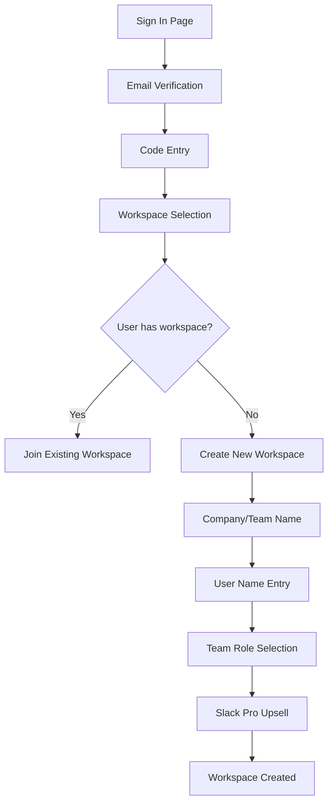
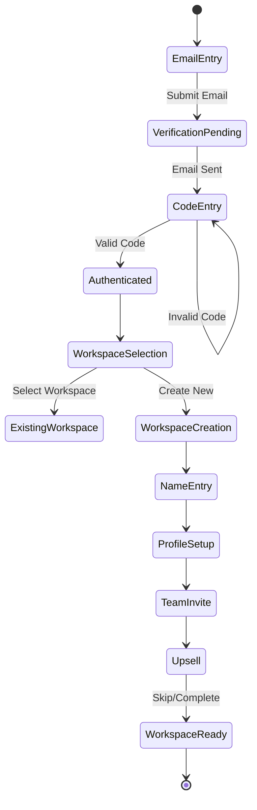

# Slack Onboarding Flow - Wireframes & Analysis

## Overview
This document provides detailed wireframes and analysis of Slack's onboarding flow, covering the journey from initial sign-in through workspace creation and team setup.

## Flow Diagram



## Detailed Wireframes

### 1. Sign In Page
```
┌─────────────────────────────────────┐
│          [Slack Logo]               │
│                                     │
│    Enter your email to sign in     │
│                                     │
│  ┌─────────────────────────────┐   │
│  │ name@company.com      ▼     │   │
│  └─────────────────────────────┘   │
│                                     │
│  [  Continue with Email  ]          │
│                                     │
│  ─────── OR ───────                │
│                                     │
│  🔍 [Google]  🍎 [Apple]           │
│                                     │
│  New to Slack? • Sign up           │
│                                     │
│  Privacy • Terms • Contact us      │
└─────────────────────────────────────┘
```

**Annotations:**
- **Purpose**: Initial entry point for authentication
- **Key Elements**:
  - Email input with dropdown for recently used emails
  - Primary CTA: "Continue with Email" (purple button)
  - User strongly encouraged to use work email to more easily find co-workers
  - SSO options: Google and Apple sign-in
  - Footer links for new users and legal information
- **UX Notes**: 
  - Clean, minimal design reduces cognitive load
  - Email-first approach with SSO as secondary options
  - Clear value proposition implied through branding

### 2. Email Verification
```
┌─────────────────────────────────────┐
│          [Slack Logo]               │
│                                     │
│     We emailed you a code          │
│  Check your inbox and enter code   │
│                                     │
│         ┌─┬─┬─┬─┬─┬─┐              │
│         │ │ │ │ │ │ │              │
│         └─┴─┴─┴─┴─┴─┘              │
│                                     │
│     [Take me back] [I need help]   │
│                                     │
│      Having trouble? • Sign out    │
│                                     │
│  Privacy • Terms • Contact us      │
└─────────────────────────────────────┘
```

**Annotations:**
- **Purpose**: Secure email verification using 6-digit code
- **Key Elements**:
  - 6 separate input fields for code entry
  - Auto-advance between fields
  - Help options: "Take me back" and "I need help"
  - Sign out option for account switching
- **Security Features**:
  - Time-limited codes
  - No password required (passwordless authentication)
  - Clear fallback options for issues

### 3. Workspace Selection
```
┌─────────────────────────────────────┐
│          [Slack Logo]               │
│                                     │
│      Get started on Slack          │
│                                     │
│  ┌─────────────────────────────┐   │
│  │ 📷 Company Workspace        │   │
│  │     Active workspace         │   │
│  └─────────────────────────────┘   │
│                                     │
│  ┌─────────────────────────────┐   │
│  │ 📷 Personal Space           │   │
│  │     Your private workspace   │   │
│  └─────────────────────────────┘   │
│                                     │
│  [Create a new workspace]           │
│                                     │
│  Looking for a different workspace?│
│  Try a different email             │
│                                     │
│  Or use Slack in your browser      │
│  Try a different email             │
└─────────────────────────────────────┘
```

**Annotations:**
- **Purpose**: Workspace discovery and selection
- **Decision Points**: 
  - User chooses between existing workspaces or creating new
  - User can change email (this is clearly to help redirect people who use their personal email (eg gmail))
- **Key Elements**:
  - Visual cards for each workspace with avatars
  - Clear workspace type indicators
  - Prominent "Create new workspace" option
  - Alternative actions for wrong account scenarios

### 4. Company/Team Name Entry
```
┌─────────────────────────────────────┐
│          [← Back]                   │
│                                     │
│   What's the name of your          │
│   company or team?                 │
│                                     │
│   This will be your workspace name │
│   - choose something recognizable   │
│                                     │
│  ┌─────────────────────────────┐   │
│  │ Ex: Acme Inc or Marketing   │   │
│  └─────────────────────────────┘   │
│                                     │
│         [ Next → ]                  │
│                                     │
└─────────────────────────────────────┘
```

**Annotations:**
- **Purpose**: Workspace naming and identification
- **Design Pattern**: Dark theme introduced (workspace creation flow)
- **Key Elements**:
  - Contextual help text explaining workspace naming
  - Example placeholder text
  - Progressive disclosure (Next button)
  - Back navigation for corrections

### 5. User Name Entry
```
┌─────────────────────────────────────┐
│          [← Back]                   │
│                                     │
│      What's your name?             │
│                                     │
│   Adding your name helps teammates │
│   recognize and connect with you   │
│                                     │
│  ┌─────────────────────────────┐   │
│  │ First & Last                │   │
│  └─────────────────────────────┘   │
│                                     │
│                                     │
│  [👤] [Upload photo]               │
│                                     │
│         [ Next → ]                  │
│                                     │
└─────────────────────────────────────┘
```

**Annotations:**
- **Purpose**: Personal profile setup
- **Key Elements**:
  - Combined name field
  - Profile photo upload (optional but encouraged)
  - Value proposition: "helps teammates recognize"
- **UX Pattern**: Building personal investment in the workspace

### 6. Team Role Selection
```
┌─────────────────────────────────────┐
│          [← Back]                   │
│                                     │
│   Who else is on the               │
│   Agentis Corp team?               │
│                                     │
│   Add teammates to collaborate     │
│                                     │
│  ┌─────────────────────────────┐   │
│  │ 🔍 name or email address    │   │
│  └─────────────────────────────┘   │
│                                     │
│         [ Next → ]                  │
│                                     │
│  [+ Add teammates]  [I'll do later]│
│                                     │
└─────────────────────────────────────┘
```

**Annotations:**
- **Purpose**: Initial team building
- **Key Elements**:
  - Email/name search for adding teammates
  - Copy invite link to send yourself
  - Skip option: "I'll do this later" (reduces friction)
  - Dynamic workspace name in heading
- **Growth Mechanic**: Encouraging immediate team invites

### 7. Slack Pro Upsell (SKIPP FOR NOW)
```
┌─────────────────────────────────────┐
│                                     │
│      Start with                    │
│      Slack Pro                     │
│                                     │
│  ✓ Unlimited message history       │
│  ✓ Unlimited app integrations     │
│  ✓ Guest accounts                  │
│  ✓ Group video calls              │
│  ✓ User provisioning              │
│                                     │
│  💳 Payment method required        │
│  ┌─────────────────────────────┐   │
│  │ Card number                 │   │
│  └─────────────────────────────┘   │
│                                     │
│  [Start 30-day free trial]         │
│                                     │
│  Prefer the free version?          │
│  [Start with limited Slack]        │
│                                     │
└─────────────────────────────────────┘
```

**Annotations:**
- **Purpose**: Premium feature upsell
- **Timing**: Strategic placement after workspace creation
- **Key Elements**:
  - Feature comparison highlights
  - Free trial emphasis
  - Clear downgrade option
  - Credit card collection (frictionless upgrade later)

## State Management Flow



## Key UX Patterns

### 1. **Progressive Disclosure**
- Information collected step-by-step
- Each screen has single primary action
- Optional fields clearly marked

### 2. **Visual Hierarchy**
- Dark theme for workspace creation (differentiation)
- Light theme for authentication
- Consistent button placement and styling

### 3. **Error Prevention**
- Real-time validation
- Clear helper text
- Example placeholders

### 4. **User Control**
- Back navigation always available
- Skip options for non-critical steps
- Clear alternative paths

### 5. **Growth Optimization**
- Team invites integrated into onboarding
- Upsell positioned after value creation
- Social proof through team building

## Technical Implementation Notes

### Frontend Considerations
- **State Management**: Multi-step form requires session persistence
- **Validation**: Client-side for immediate feedback, server-side for security
- **API Calls**: 
  - Email verification
  - Code validation
  - Workspace creation
  - User profile updates
  - Team invitations

### Backend Requirements
- **Authentication Service**: Email-based OTP system
- **Workspace Service**: Creation and configuration
- **User Service**: Profile management
- **Invitation Service**: Team member additions
- **Analytics**: Track drop-off points and conversion

### Security Measures
- Rate limiting on code attempts
- Session tokens for multi-step process
- CSRF protection
- Input sanitization

## Conversion Optimization Elements

1. **Reduced Friction**
   - No password creation required
   - Optional fields clearly marked
   - Skip options available

2. **Value Communication**
   - Clear benefits at each step
   - Visual workspace preview
   - Team collaboration emphasis

3. **Trust Signals**
   - Recognizable SSO providers
   - Security messaging
   - Professional design

4. **Activation Focus**
   - Team invites during onboarding
   - Immediate workspace creation
   - Profile completion encouragement