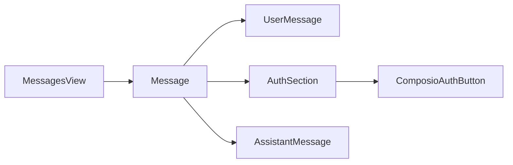

# Proactive MCP Authentication - Component Mapping

@proactive-mcp-auth-implementation-plan.md

## React Component Architecture



## Key Components to Modify

### 1. Message Rendering Pipeline
- **File**: `client/src/components/Chat/Messages/MessagesView.tsx`
- **Purpose**: Main container for message list
- **Change**: Add auth section logic between messages

### 2. Message Components
- **File**: `client/src/components/Chat/Messages/Content/`
- **Purpose**: Individual message rendering
- **Change**: Detect first user message, insert auth section

### 3. Auth Section Component
- **File**: `client/src/components/Chat/Messages/Content/AuthSection.tsx` (new)
- **Purpose**: Container for authentication buttons
- **Content**: Uses existing `ComposioAuthButton` components

## Component Hierarchy

```
ChatView
├── MessagesView
│   ├── Message (user message #1)
│   ├── AuthSection (new - if agent has MCP tools)
│   │   └── ComposioAuthButton[] (existing)
│   └── Message (agent response #1)
│   └── Message (subsequent messages...)
```

## State Management

### Agent Detection
- **Source**: Recoil conversation state or URL params
- **Location**: `store/conversation.ts` or `hooks/useStartAgentChat.ts`

### MCP Tool Detection
- **Source**: Agent tools array from database/API
- **Location**: Current conversation context

### Auth State
- **Source**: Existing `ComposioAuthButton` internal state
- **Location**: No changes needed - leverage existing patterns

## Integration Points

### Data Flow
1. User sends first message
2. `MessagesView` checks current agent
3. Extract MCP tools from agent.tools[]
4. Identify required auth services
5. Render `AuthSection` with buttons
6. Continue normal message flow

### Event Handling
- Use existing auth success/error callbacks
- No new event system needed
- Leverage current authentication flows