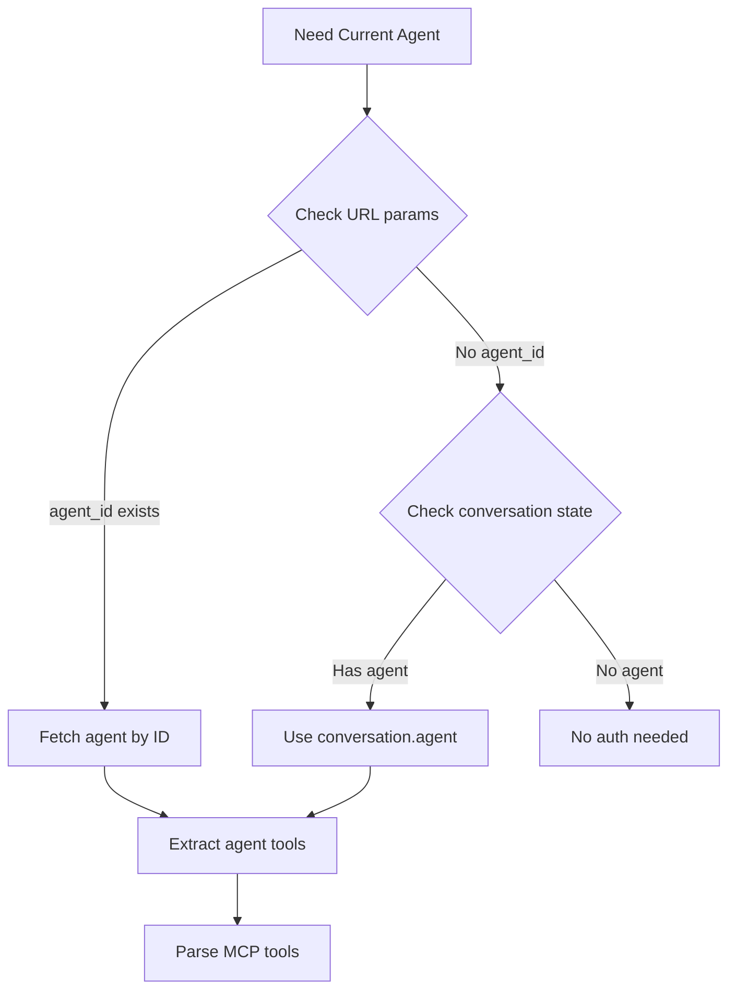

# Proactive MCP Authentication - Detection Logic

@proactive-mcp-auth-component-mapping.md

## Agent Detection Methods



## Detection Logic

### 1. Agent Identification
```javascript
// Option A: URL parameter
const agentId = searchParams.get('agent_id')

// Option B: Conversation state  
const agent = conversation?.agent

// Option C: Agent endpoint detection
const isAgentEndpoint = conversation?.endpoint === 'agents'
```

### 2. MCP Tool Detection
```javascript
// Check tool keys for MCP pattern
const mcpTools = agent.tools?.filter(toolKey => 
  toolKey.includes('_mcp_')
)

// Extract server names
const mcpServers = mcpTools.map(toolKey => {
  const parts = toolKey.split('_mcp_')
  return parts[parts.length - 1] // server name
})
```

### 3. Service Mapping
```javascript
// Map MCP servers to auth services
const serviceMap = {
  'googlesheets': 'googlesheets',
  'googledrive': 'googledrive', 
  'googledocs': 'googledocs',
  'gmail': 'gmail',
  'googlecalendar': 'googlecalendar',
  // Future: slack, notion, github, etc.
}

const requiredServices = mcpServers
  .map(server => serviceMap[server])
  .filter(Boolean)
```

## Implementation Patterns

### Hook Pattern
```javascript
// Custom hook for MCP auth detection
function useMCPAuthRequirements(agent) {
  return useMemo(() => {
    if (!agent?.tools) return []
    
    return extractRequiredServices(agent.tools)
  }, [agent?.tools])
}
```

### Utility Functions
```javascript
// Pure functions for tool parsing
export function extractMCPServers(toolKeys) { }
export function mapServersToServices(servers) { }
export function getRequiredServices(agent) { }
```

### Trigger Conditions
```javascript
// When to show auth section
const shouldShowAuth = 
  isFirstMessage && 
  requiredServices.length > 0 &&
  !hasShownAuthForThisConversation
```

## Data Sources

### Agent Data Structure
```javascript
{
  id: "agent_123",
  name: "Google Workspace Assistant", 
  tools: [
    "GOOGLESHEETS_CREATE_SHEET_mcp_googlesheets",
    "GOOGLEDOCS_CREATE_DOC_mcp_googledocs",
    "calculator", // non-MCP tool
  ]
}
```

### Expected Services Output
```javascript
// For above agent
requiredServices = ["googlesheets", "googledocs"]
```

## Edge Cases

- Agent with no tools
- Agent with only non-MCP tools  
- Agent with MCP tools from unknown services
- Missing agent data
- Malformed tool keys

## Performance Optimization

- Parse tools only once per conversation
- Cache service requirements
- Avoid re-computation on re-renders