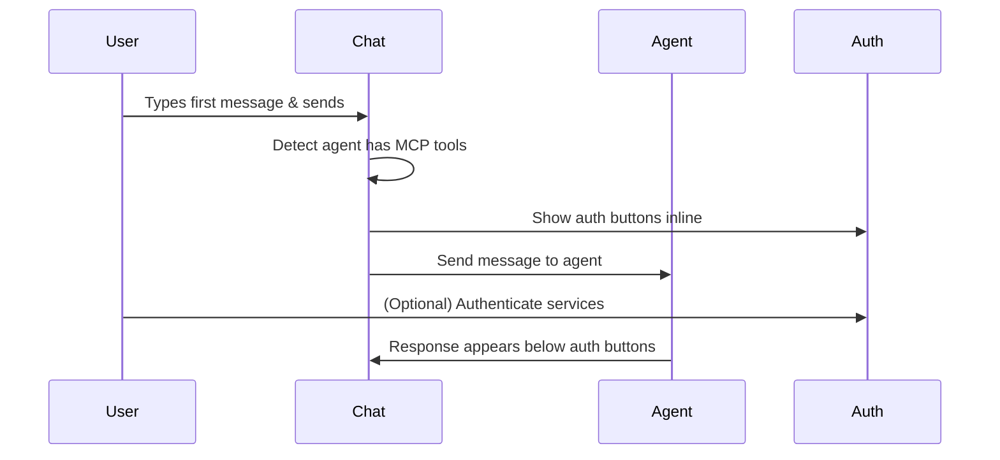
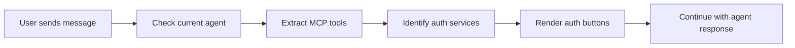

# Proactive MCP Authentication - Feature Brief

## Overview
Show authentication buttons immediately after user's first message in chats with agents that have MCP tools requiring authentication.

## User Flow

## Requirements

### Functional
- **Trigger**: After user sends first message to agent with MCP tools
- **Placement**: Between first user message and first agent response
- **Content**: Existing `ComposioAuthButton` components for all required services
- **Scope**: Composio MCP tools only (all auth providers, not just Google)

### Technical
- Use existing components (no new UI needed)
- Leverage current agent detection methods
- Utilize existing auth state management
- KISS principle - minimal code changes

## Implementation Approach

### Components to Modify
1. **Message rendering area** - Add auth section between messages
2. **Agent detection logic** - Identify MCP tools in current agent
3. **Service extraction** - Parse required auth services from tools

### Data Flow

## Success Criteria
- Auth buttons appear immediately after first user message
- Users can authenticate before tools fail
- Uses existing UI components and flows
- Works for all Composio services (not just Google)

## Next Steps
- Create technical implementation plan
- Identify specific components to modify
- Create development tasks and issues