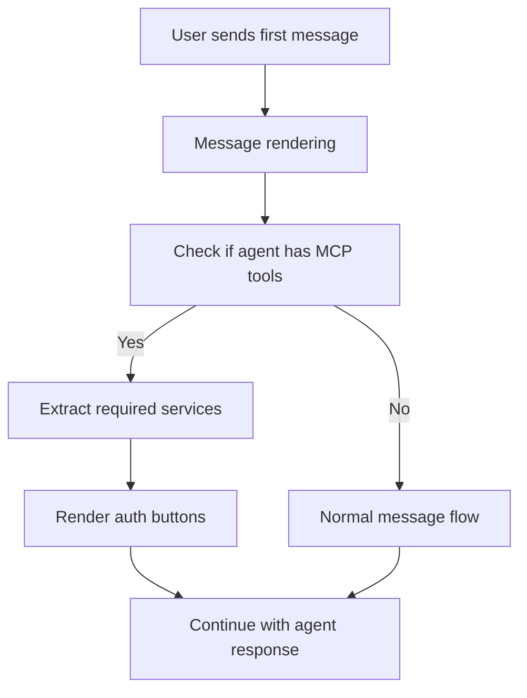

# Proactive MCP Authentication - Technical Implementation Plan

@proactive-mcp-auth-feature-brief.md

## Architecture Overview

## Implementation Strategy

### Phase 1: Core Detection Logic
- Implement agent detection in message flow
- Create MCP tool parser utility
- Build service extraction logic

### Phase 2: UI Integration
- Add auth section to message rendering
- Position between first user message and first agent response
- Use existing `ComposioAuthButton` components

### Phase 3: State Management
- Track first message vs subsequent messages
- Manage auth button visibility
- Handle successful authentication updates

## Technical Requirements

### Dependencies
- Existing `ComposioAuthButton` component
- Current agent state management
- Message rendering pipeline
- MCP tool detection utilities

### Performance Considerations
- Only check for MCP tools on first message
- Cache service requirements per agent
- Avoid re-rendering on auth state changes

### Error Handling
- Graceful degradation if agent data unavailable
- Fallback to existing AUTHCODE pattern detection
- Handle malformed tool configurations

## Risk Mitigation
- Small, incremental changes to existing codebase
- Leverage proven components and patterns
- Maintain backward compatibility with current auth flow