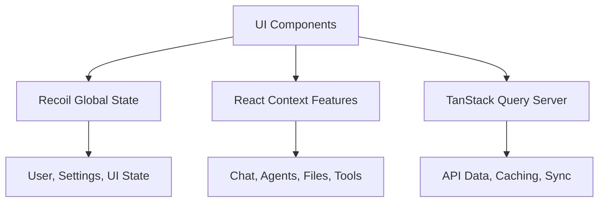

# LibreChat Client

A modern React-based frontend for Agentis (LibreChat) featuring multi-model AI conversations, agent capabilities, code execution, and real-time streaming.

## 🚀 Quick Start

```bash
# Prerequisites: Node.js 18+, npm 8+, backend running on port 3080

# Install dependencies
cd LibreChat/client
npm install

# Build shared packages (from project root)
npm run build:data-schemas
npm run build:data-provider
npm run build:mcp

# Start development server
npm run dev
# → http://localhost:3090
```

## 🏗️ Tech Stack

| Category | Technology |
|----------|------------|
| **Framework** | React 18 + TypeScript |
| **Build** | Vite with HMR |
| **State** | Recoil + React Context + TanStack Query |
| **Routing** | React Router v6 |
| **Styling** | Tailwind CSS |
| **UI** | Radix UI + Headless UI |
| **Real-time** | Server-Sent Events (SSE) |
| **PWA** | Service Worker + Manifest |
| **i18n** | i18next (30+ languages) |
| **Testing** | Jest + React Testing Library |

## 🎯 Key Features

### 🤖 Multi-Model AI Support
- **15+ AI Providers**: OpenAI, Anthropic, Google, Azure, and more
- **Dynamic Switching**: Change models mid-conversation
- **Custom Endpoints**: Configure your own AI services
- **Parameter Control**: Adjust temperature, max tokens, etc.

### 🛠️ Agent System
- **MCP Integration**: Model Context Protocol server support with Composio authentication
- **Tool Calling**: Visual tool execution tracking with inline authentication
- **Ephemeral Agents**: Per-conversation agent instances
- **Server Management**: Configure MCP servers through UI
- **Inline Authentication**: OAuth flows directly within chat conversations

### 💻 Code Artifacts
- **Live Execution**: Sandpack-powered code runner
- **30+ Languages**: Syntax highlighting for all major languages
- **Real-time Preview**: Instant code visualization
- **Export Options**: Download or share code artifacts

### 📡 Real-time Streaming
- **SSE Implementation**: Server-Sent Events for live responses
- **Stream Control**: Pause, resume, or interrupt generation
- **Progress Tracking**: Visual indicators for long operations
- **Token Counting**: Real-time usage monitoring

### 📁 Advanced File Handling
- **Drag & Drop**: Multi-file upload with preview
- **Image Editing**: Built-in avatar and image editor
- **File Attachment**: Attach files to messages
- **Preview Support**: Images, documents, and more

### 💬 Enhanced Chat Experience
- **Conversation Branching**: Fork conversations at any point
- **Message Regeneration**: Try different AI responses
- **Edit & Continue**: Modify messages and continue
- **Export/Share**: Save or share conversations
- **Search**: Find messages across all conversations

## 📂 Project Structure

```
client/
├── src/
│   ├── components/          # React components
│   │   ├── ui/             # Reusable UI primitives (Button, Dialog, etc.)
│   │   ├── Auth/           # Login, registration, 2FA
│   │   ├── Chat/           # Core chat interface
│   │   ├── Messages/       # Message rendering & actions
│   │   ├── Artifacts/      # Code artifact system
│   │   ├── Tools/          # MCP & tool integration
│   │   ├── Composio/       # Composio authentication components
│   │   ├── SidePanel/      # Navigation & conversation list
│   │   ├── Nav/            # Main navigation
│   │   └── svg/            # SVG icon library
│   ├── Providers/          # React Context providers (15+)
│   ├── hooks/              # Custom hooks (organized by feature)
│   ├── store/              # Recoil atoms & selectors
│   ├── data-provider/      # API communication layer
│   ├── routes/             # Route components & guards
│   ├── utils/              # Helper functions & utilities
│   ├── locales/            # Translation files (30+ languages)
│   └── main.jsx            # Application entry point
├── public/                 # Static assets
├── dist/                   # Production build output
└── test/                   # Test setup & utilities
```

## 🔄 State Management

### Three-Layer Architecture



#### Recoil Atoms (Global State)
```javascript
// Core application state
user                 // Current user & auth
conversation         // Active conversation
messages             // Message history
endpoints            // AI provider configurations
settings             // User preferences
artifactsState       // Code artifacts
submission           // Input form state
```

#### Context Providers (Feature State)
```javascript
// Feature-specific state management
<ChatContext>           // Chat session management
<AgentsContext>         // Agent configurations
<FileMapContext>        // File upload tracking
<ArtifactContext>       // Code artifact handling
<ToolCallsMapContext>   // Tool execution state
<MessageContext>        // Message operations
<AnnouncerContext>      // Accessibility announcements
```

#### TanStack Query (Server State)
- Automatic background refetching
- Optimistic updates
- Request deduplication
- Error handling & retries

## 🌐 Routing & Navigation

| Route | Component | Description |
|-------|-----------|-------------|
| `/` | Landing | Home/redirect page |
| `/c/:id` | ChatRoute | Active conversation |
| `/d/prompts` | Dashboard | Prompt library |
| `/share/:id` | ShareRoute | Public conversation view |
| `/login` | Login | Authentication |
| `/register` | Registration | Account creation |
| `/settings/*` | Settings | User preferences |

## 🔐 Composio Authentication System

The client includes a comprehensive inline authentication system for Composio MCP tools, enabling seamless OAuth flows directly within chat conversations.

### Key Components

- **AuthCodeParser**: Detects authentication messages and renders inline auth UI
- **ComposioAuthButton**: Reactive authentication button with status polling
- **ComposioTestPage**: Development testing interface for OAuth flows

### Authentication Flow

1. **Detection**: Text component identifies authentication messages
2. **UI Render**: Inline authentication UI appears below agent message  
3. **OAuth Flow**: Popup window handles Google OAuth with Composio
4. **Status Update**: Button reactively updates to "✓ Connected" status
5. **Tool Access**: Users can immediately retry tools after authentication

### Supported Services

- Google Sheets
- Google Docs  
- Google Drive
- Gmail
- Google Calendar

### Technical Features

- **Reactive Status**: Real-time connection status checking and polling
- **Cross-Session Persistence**: Authentication status persists across page refreshes
- **Error Handling**: Graceful fallbacks for failed OAuth flows
- **Theme Integration**: UI components adapt to light/dark themes

### Adding New Auth Providers

The inline authentication system is provider-agnostic and designed for easy extension. To add new OAuth providers (e.g., Notion, GitHub, Slack), you need to update **6 specific locations** with service mappings.

#### 1. Backend Service Mapping
**File**: `/api/server/services/ComposioService.js` (lines ~358-373)

Update the `getAppNameForService()` function:
```javascript
getAppNameForService(service) {
  const serviceToAppMap = {
    googlesheets: 'googlesheets',
    googledrive: 'googledrive',
    googledocs: 'googledocs',
    gmail: 'gmail',
    googlecalendar: 'googlecalendar',
    notion: 'notion',        // ← Add new service
    github: 'github',        // ← Add new service
    slack: 'slack'           // ← Add new service
  };
  
  const appName = serviceToAppMap[service];
  if (!appName) {
    throw new Error(`Unsupported service: ${service}`);
  }
  return appName;
}
```

#### 2. Frontend Auth Button Component
**File**: `/client/src/components/Composio/ComposioAuthButton.tsx` (lines ~312-321)

Update the `getServiceDisplayName()` function:
```typescript
const getServiceDisplayName = (service: string) => {
  const serviceNames: Record<string, string> = {
    googlesheets: 'Google Sheets',
    googledrive: 'Google Drive',
    googledocs: 'Google Docs',
    gmail: 'Gmail',
    googlecalendar: 'Google Calendar',
    notion: 'Notion',        // ← Add new service
    github: 'GitHub',        // ← Add new service
    slack: 'Slack'           // ← Add new service
  };
  return serviceNames[service] || service;
};
```

#### 3. Auth Code Parser Component
**File**: `/client/src/components/Messages/Content/AuthCodeParser.tsx`

Update the `getServiceDisplayName()` function (lines ~22-31):
```typescript
const getServiceDisplayName = (service: string) => {
  const serviceNames: Record<string, string> = {
    googlesheets: 'Google Sheets',
    googledrive: 'Google Drive',
    googledocs: 'Google Docs',
    gmail: 'Gmail',
    googlecalendar: 'Google Calendar',
    notion: 'Notion',        // ← Add new service
    github: 'GitHub',        // ← Add new service
    slack: 'Slack'           // ← Add new service
  };
  return serviceNames[service] || service;
};
```

Update the service detection logic (lines ~118-127):
```typescript
// Try to detect other services from the message content
const lowerContent = content.toLowerCase();
if (lowerContent.includes('google drive')) {
  service = 'googledrive';
} else if (lowerContent.includes('google docs')) {
  service = 'googledocs';
} else if (lowerContent.includes('gmail')) {
  service = 'gmail';
} else if (lowerContent.includes('google calendar')) {
  service = 'googlecalendar';
} else if (lowerContent.includes('notion')) {
  service = 'notion';        // ← Add new service
} else if (lowerContent.includes('github')) {
  service = 'github';        // ← Add new service
} else if (lowerContent.includes('slack')) {
  service = 'slack';         // ← Add new service
}
```

#### 4. MCP Auth Utilities
**File**: `/client/src/utils/mcpAuth.ts`

Update the auth mapping (lines ~14-21):
```typescript
const MCP_SERVER_AUTH_MAP: Record<string, string> = {
  googlesheets: 'googlesheets',
  googledocs: 'googledocs',
  googledrive: 'googledrive',
  gmail: 'gmail',
  googlecalendar: 'googlecalendar',
  notion: 'notion',          // ← Add new service
  github: 'github',          // ← Add new service
  slack: 'slack'             // ← Add new service
};
```

Update the display names function (lines ~149-157):
```typescript
export function getServiceDisplayName(service: string): string {
  const serviceNames: Record<string, string> = {
    googlesheets: 'Google Sheets',
    googledocs: 'Google Docs',
    googledrive: 'Google Drive',
    gmail: 'Gmail',
    googlecalendar: 'Google Calendar',
    notion: 'Notion',        // ← Add new service
    github: 'GitHub',        // ← Add new service
    slack: 'Slack'           // ← Add new service
  };
  return serviceNames[service] || service;
}
```

#### 5. Database Schema Update
**File**: `/packages/data-schemas/src/schema/composioConnectedAccount.ts` (lines ~23 and ~5)

Add new service to the MongoDB schema enum validation:
```typescript
// Update the interface comment
service: string; // 'googlesheets', 'googledrive', 'googledocs', 'gmail', 'googlecalendar', 'notion'

// Update the schema enum
service: {
  type: String,
  required: true,
  enum: ['googlesheets', 'googledrive', 'googledocs', 'gmail', 'googlecalendar', 'notion'],
},
```

**Rebuild the package**: `npm run build:data-schemas`

#### 6. MCP Server Configuration
**File**: `/librechat.yaml`

Add MCP server configuration:
```yaml
mcpServers:
  notion:
    type: streamable-http
    url: "https://mcp.composio.dev/composio/server/{uuid}/mcp?user_id={{LIBRECHAT_USER_ID}}&connected_account_id={{COMPOSIO_CONNECTED_ACCOUNT_ID}}"
    headers:
      X-User-ID: "{{LIBRECHAT_USER_ID}}"
      X-API-Key: "${COMPOSIO_API_KEY}"
      X-Connection-ID: "{{LIBRECHAT_USER_ID}}-notion"
    displayName: "Notion"
    iconPath: "/assets/tools/notion.svg"
    description: "Notion workspace tool for notes and collaboration"
    toolDisplayNames:
      COMPOSIO_CHECK_ACTIVE_CONNECTION: "Check Connection"
      COMPOSIO_INITIATE_CONNECTION: "Connect to Notion"
```

#### Testing Your Changes

1. **Rebuild packages**: `npm run build:data-schemas`
2. **Restart backend**: `npm run backend:dev`
3. **Test auth flow**:
   - Create agent with new service tools
   - Send message that triggers tool requiring auth
   - Verify inline auth button appears
   - Test OAuth popup flow
   - Confirm connection persists

#### Troubleshooting

- **"is not a valid enum value" error**: Database schema not updated or package not rebuilt
- **Auth button not showing**: Check console for service detection logs
- **OAuth popup fails**: Verify Composio app configuration and API key
- **Connection not persisting**: Check MongoDB for `ComposioConnectedAccount` records
- **Service not detected**: Ensure all 6 locations are updated consistently

#### Benefits of This Architecture
- **Type Safety**: Prevents runtime errors with unknown services
- **Consistent UX**: Same authentication flow for all providers
- **Maintainable**: Clear service boundaries and explicit configuration
- **Scalable**: No architectural changes needed for new providers

The core authentication flow, UI components, backend services, and database schema work unchanged for any OAuth 2.0 provider that Composio supports.

## 🛠️ Development

### Essential Commands

```bash
# Development
npm run dev              # Start dev server (port 3090)
npm run build            # Production build
npm run preview-prod     # Preview production build

# Testing
npm run test             # Watch mode
npm run test:ci          # Single run with coverage

# Package Management
npm run data-provider    # Rebuild data-provider package

# Alternative: Bun Support
npm run b:dev           # Bun dev server
npm run b:build         # Bun build
npm run b:test          # Bun test runner
```

### Development Server Features

- **Hot Module Replacement (HMR)**: Instant updates without losing state
- **TypeScript Checking**: Real-time type validation
- **API Proxy**: Automatic routing to backend (port 3080)
- **Source Maps**: Debug-friendly error traces

### Package Dependencies

When modifying shared packages, rebuild in order:
1. `data-schemas` (Mongoose models)
2. `data-provider` (API layer) 
3. `mcp` (Model Context Protocol)
4. Client restart

## 📝 TypeScript Configuration

### Multiple Configurations

The client uses separate TypeScript configurations for different purposes:

#### `tsconfig.json` (Development & Build)
- **Purpose**: Full development experience with IntelliSense
- **Includes**: All source files and test files
- **Used by**: Vite, Jest, IDE

#### `tsconfig.typecheck.json` (Production Type Checking)
- **Purpose**: CI/CD and production code validation
- **Includes**: Source code only, excludes all test files
- **Used by**: `npm run typecheck:client`

#### `tsconfig.test.json` (Test-Only Type Checking)
- **Purpose**: Separate test file validation (optional)
- **Includes**: Test files only
- **Used by**: `npm run typecheck:client:tests`

### Commands

```bash
# Type check production code only (recommended for CI/CD)
npm run typecheck:client

# Type check test files only
npm run typecheck:client:tests

# Type check all (client + api + packages)
npm run typecheck:all
```

### Benefits

- **Focused Errors**: Production typechecking shows only runtime-affecting errors
- **Faster CI/CD**: Reduced noise in deployment checks
- **Better DX**: Less overwhelming type error output
- **Flexible**: Can still check test types when needed

**Before**: 101 errors in 41 files | **After**: ~63 errors in 33 files

## 🧪 Testing Strategy

### Test Configuration
```bash
# Run with coverage
npm run test:ci

# Development mode
npm run test

# Run specific test file
npm run test:ci -- src/path/to/test.test.tsx

# Coverage report
open coverage/lcov-report/index.html
```

### Test Organization

#### File Structure
Tests follow a consistent directory structure:
```
src/
├── components/
│   └── Chat/
│       └── Messages/
│           ├── ProactiveMCPAuth.tsx
│           └── __tests__/
│               └── ProactiveMCPAuth.test.tsx
├── utils/
│   ├── mcpAuth.ts
│   └── __tests__/
│       └── mcpAuth.test.ts
└── hooks/
    ├── useStartAgentChat.ts
    └── __tests__/
        └── useStartAgentChat.test.ts
```

#### Test Categories
- **Unit Tests**: Utilities, hooks, pure functions
- **Component Tests**: UI behavior with React Testing Library
- **Integration Tests**: API interactions and data flow

#### Naming Conventions
- **Test Files**: Use `*.test.tsx` for components, `*.test.ts` for utilities
- **Test Directories**: Place tests in `__tests__` subdirectories alongside source code
- **Test Structure**: Group tests by component/functionality with descriptive `describe` blocks

### Testing Patterns

#### Component Testing
```typescript
// Example: Component test with proper mocking
describe('MyComponent', () => {
  // Mock external dependencies
  jest.mock('~/hooks/AuthContext');
  jest.mock('~/data-provider/queries');
  
  beforeEach(() => {
    jest.clearAllMocks();
    // Reset mocks to default state
  });

  it('should render correctly with props', () => {
    render(<MyComponent {...mockProps} />);
    expect(screen.getByText('Expected Text')).toBeInTheDocument();
  });
});
```

#### Complex Component Mocking
For components with multiple dependencies (Context, Recoil, hooks):
```typescript
// Mock Recoil state
jest.mock('recoil', () => ({
  ...jest.requireActual('recoil'),
  useRecoilValue: jest.fn(),
}));

// Wrap component with required providers
const renderWithProviders = (ui: React.ReactElement) => {
  return render(
    <RecoilRoot>
      <ChatContext.Provider value={mockChatContext}>
        <AgentsMapContext.Provider value={mockAgentsMap}>
          {ui}
        </AgentsMapContext.Provider>
      </ChatContext.Provider>
    </RecoilRoot>
  );
};
```

#### Test Coverage Examples
Recent component tests achieving 100% coverage:
- **ProactiveMCPAuth**: 29 test cases, 100% coverage across all metrics
- **AgentCTA**: Comprehensive rendering and interaction tests
- **AgentDiscovery**: Integration testing with data providers

### Coverage Goals
- Functions: 80%+ (achieving 100% on critical components)
- Lines: 80%+ (achieving 100% on critical components)
- Statements: 80%+ (achieving 100% on critical components)
- Branches: 80%+ (achieving 100% on critical components)

### Testing Tools
- **Jest**: Test runner and assertion library
- **React Testing Library**: Component testing utilities
- **@testing-library/user-event**: User interaction simulation
- **Mock Service Worker**: API mocking for integration tests

## 🏭 Production Build

### Build Optimization

The production build implements sophisticated code splitting:

```javascript
// Chunk Strategy (vite.config.ts)
{
  'radix-ui': ['@radix-ui/*'],          // UI component library
  'framer-motion': ['framer-motion'],    // Animation library
  'tanstack': ['@tanstack/*'],           // Data fetching
  'markdown': ['react-markdown', 'remark-*'], // Markdown processing
  'highlight': ['highlight.js'],          // Syntax highlighting
  'locales': ['locales/*'],              // Translation files
  'vendor': [/* remaining dependencies */] // Everything else
}
```

### PWA Features
- **Service Worker**: Automatic updates with user prompt
- **Offline Support**: Core functionality without network
- **Install Prompt**: Native app-like installation
- **Background Sync**: Queued actions when reconnected

### Deployment Checklist
- [ ] Set production environment variables
- [ ] Configure API proxy for `/api/*` routes
- [ ] Enable HTTPS (required for PWA)
- [ ] Set up CDN for static assets
- [ ] Configure security headers

## ⚙️ Configuration

### Environment Variables

```bash
# .env.local
VITE_API_HOST=http://localhost:3080    # Backend API URL
VITE_APP_TITLE=LibreChat               # Application title
VITE_SHOW_GOOGLE_LOGIN_OPTION=true    # Enable Google OAuth
VITE_DISABLE_REGISTRATION=false       # Allow new registrations
VITE_GTM_ID=GTM-XXXXXXX               # Google Tag Manager
```

### Build Configuration

Key settings in `vite.config.ts`:
- **Dev Server**: Port 3090 with API proxy
- **Build Target**: Modern browsers (ES2020+)
- **PWA**: Service worker with 4MB cache limit
- **Optimization**: Tree shaking, minification, compression

## 🌍 Internationalization

### Supported Languages (30+)
Arabic, Catalan, Czech, Danish, German, English, Spanish, Estonian, Persian, Finnish, French, Hebrew, Hungarian, Indonesian, Italian, Japanese, Georgian, Korean, Dutch, Polish, Portuguese (BR/PT), Russian, Swedish, Thai, Turkish, Vietnamese, Chinese (Simplified/Traditional)

### Usage Example
```javascript
import { useLocalize } from '~/hooks';

function WelcomeMessage() {
  const localize = useLocalize();
  
  return (
    <h1>{localize('com_ui_welcome')}</h1>
    <p>{localize('com_ui_model_select', { count: 5 })}</p>
  );
}
```

### Adding Translations
1. Add keys to `src/locales/en/translation.json`
2. Translate in target language files
3. Use `localize()` hook in components

## 🚀 Advanced Features

### Model Context Protocol (MCP)
```typescript
// MCP Server Configuration
interface MCPServer {
  name: string;
  command: string;
  args?: string[];
  description?: string;
  iconPath?: string;
}
```

### Code Execution
- **Sandpack Integration**: Live React, Vue, Angular preview
- **Language Support**: JavaScript, TypeScript, Python, and more
- **Error Handling**: Real-time error display
- **Export Options**: Download as files or share links

### Accessibility (WCAG 2.1 AA)
- **Screen Reader**: Optimized for NVDA, JAWS, VoiceOver
- **Keyboard Navigation**: Full keyboard accessibility
- **Live Regions**: Dynamic content announcements
- **High Contrast**: System theme respect

## 🛠️ Development Best Practices

### Performance Optimization
```typescript
// Memo for expensive components
const ExpensiveList = memo(({ items }: { items: Item[] }) => {
  const processedItems = useMemo(() => 
    items.map(processItem), [items]
  );
  
  return <VirtualizedList items={processedItems} />;
});

// Lazy loading for routes
const SettingsPage = lazy(() => import('./routes/Settings'));
```

### Type Safety
```typescript
// Discriminated unions for type safety
type Message = 
  | { type: 'text'; content: string }
  | { type: 'image'; url: string; alt: string }
  | { type: 'code'; language: string; code: string };

// Generic hooks
function useAsyncData<T>(url: string): {
  data: T | null;
  loading: boolean;
  error: Error | null;
} {
  // Implementation
}
```

### Component Patterns
```tsx
// Compound component pattern
<Dialog>
  <Dialog.Trigger>Open</Dialog.Trigger>
  <Dialog.Content>
    <Dialog.Title>Title</Dialog.Title>
    <Dialog.Description>Description</Dialog.Description>
  </Dialog.Content>
</Dialog>

// Custom hook for complex state
function useChatSession(conversationId: string) {
  const [state, dispatch] = useReducer(chatReducer, initialState);
  // Complex state logic here
  return { state, actions };
}
```

## 🐛 Troubleshooting

### Common Issues

| Problem | Solution |
|---------|----------|
| Build fails | Rebuild shared packages in order |
| HMR not working | Check port 3090 availability |
| API calls fail | Verify backend on port 3080 |
| Translations missing | Check locale file paths |
| PWA not installing | Ensure HTTPS in production |

### Debug Mode
```javascript
// Enable detailed logging
localStorage.setItem('debug', 'librechat:*');

// View React Query cache
import { useQueryClient } from '@tanstack/react-query';
const queryClient = useQueryClient();
console.log(queryClient.getQueryCache());
```

## 🔧 LibreChat Configuration Integration

### Overview

The client integrates with `librechat.yaml` configuration to provide custom tool display names for MCP (Model Context Protocol) tools. This ensures that tool calls in the chat interface show user-friendly names instead of technical function names.

### How It Works

#### Development Mode
- **File Source**: Uses symlink to `/LibreChat/client/public/librechat.yaml` → `../librechat.yaml`
- **Service**: `LibreChatConfigService` fetches `/librechat.yaml` from dev server
- **Hot Reload**: Changes to `librechat.yaml` are reflected after browser refresh

#### Production/E2E Mode
- **File Source**: Copy created by `prebuild` script: `../librechat.yaml` → `public/librechat.yaml`
- **Build Process**: File is copied and compressed to `dist/librechat.yaml.gz`
- **Service**: Same fetch URL `/librechat.yaml` (browser handles gzip decompression)

### Architecture Components

#### LibreChatConfigService (`src/services/LibreChatConfigService.ts`)
- **Purpose**: Singleton service to load and manage librechat.yaml configuration
- **Key Features**:
  - Fetches YAML from `/librechat.yaml` endpoint
  - Parses YAML and builds MCP server config map
  - Provides methods to get tool display names
  - Handles object-based `mcpServers` structure (not array)

```typescript
// Example usage
const config = await LibreChatConfigService.loadConfig();
const displayName = config.getToolDisplayName('COMPOSIO_CHECK_ACTIVE_CONNECTION', 'googlesheets');
// Returns: "Check Connection"
```

#### useLibreChatConfig Hook (`src/hooks/useLibreChatConfig.ts`)
- **useMCPServerConfig**: React hook to get server configuration for specific MCP server
- **Async Loading**: Ensures config is loaded before components need it
- **Type Safety**: Returns `MCPServerConfig | undefined`

#### ToolCall Component Integration
- **File**: `src/components/Chat/Messages/Content/ToolCall.tsx`
- **Integration**: Uses `useMCPServerConfig` hook to get server config
- **Display Logic**: Calls `getToolDisplayName()` with server config for MCP tools
- **Fallback**: Shows transformed function name if no config available

### Configuration Structure

The client expects this YAML structure:
```yaml
mcpServers:
  googlesheets:
    type: sse
    url: "https://example.com"
    displayName: "Google Sheets"
    toolDisplayNames:
      COMPOSIO_CHECK_ACTIVE_CONNECTION: "Check Connection"
      GOOGLESHEETS_CREATE_GOOGLE_SHEET1: "Create New Spreadsheet"
      # ... more mappings
```

### Build Process Integration

#### Package.json Scripts
```json
{
  "prebuild": "cp ../librechat.yaml public/librechat.yaml || true"
}
```

#### Development Setup
```bash
# Symlink is created automatically during development
ln -sf ../librechat.yaml public/librechat.yaml
```

#### Production Build
1. `prebuild` script copies `../librechat.yaml` to `public/librechat.yaml`
2. Vite build process includes file in `dist/` (compressed as `.gz`)
3. Production server serves file at `/librechat.yaml` endpoint

### Debug System

A localStorage-based debug system is available for troubleshooting:

#### Enable Debugging
```javascript
// In browser console
localStorage.setItem('debug-tool-display-names', 'true');
// Refresh page or trigger new tool call
```

#### Debug Information Shows
- **UI Debug Boxes**: Yellow boxes below MCP tool calls showing:
  - Function name, domain, name parameters
  - Whether MCP server config loaded successfully
  - Resolved display name result
  - Complete tool display names mapping
- **Console Logs**: Configuration loading details and MCP servers found

#### Disable Debugging
```javascript
// In browser console
localStorage.removeItem('debug-tool-display-names');
```

### Docker & CI/CD Considerations

#### Current Implementation
✅ **No changes needed** - the current approach works across all deployment modes:

- **Development**: Symlink allows real-time config changes
- **Docker Development**: Volume mount includes `librechat.yaml` at project root
- **Production Build**: `prebuild` script ensures file is included in build artifacts
- **CI/CD**: GitHub Actions build process will include the file automatically

#### File Flow in Different Modes

| Mode | Source | Destination | Method |
|------|--------|-------------|--------|
| **Dev (local)** | `../librechat.yaml` | `public/librechat.yaml` | Symlink |
| **E2E Tests** | `../librechat.yaml` | `dist/librechat.yaml.gz` | `prebuild` → copy → build |
| **Docker Dev** | `../librechat.yaml` | Container volume | Volume mount |
| **Docker Prod** | `../librechat.yaml` | Image build | Copy during image build |
| **CI/CD** | `../librechat.yaml` | Build artifacts | `prebuild` → copy → build |

### Troubleshooting

#### Tool Display Names Not Working
1. **Enable debug mode**: `localStorage.setItem('debug-tool-display-names', 'true')`
2. **Check debug output**:
   - Is `mcpServerConfig: LOADED`?
   - Does `toolDisplayNames` contain expected mappings?
   - What does `displayNameResult` show?

#### Common Issues
- **Config not loading**: Check browser Network tab for `/librechat.yaml` 404 errors
- **Wrong server name**: Verify MCP server domain matches YAML key names
- **Tool name mismatch**: Ensure YAML mapping keys match exact function names

#### YAML Structure Validation
```bash
# Validate YAML syntax
npx js-yaml ../librechat.yaml

# Check MCP servers structure
node -e "console.log(Object.keys(require('js-yaml').load(require('fs').readFileSync('../librechat.yaml', 'utf8')).mcpServers))"
```

### Future Enhancements

1. **Real-time Config Updates**: WebSocket-based config reloading
2. **Config Validation**: Runtime validation of YAML structure
3. **Fallback Handling**: Better error handling for missing configurations
4. **Admin Interface**: UI for managing tool display names

## 📚 Additional Resources

- [React Best Practices](https://react.dev/learn)
- [TypeScript Handbook](https://typescriptlang.org/docs)
- [Vite Guide](https://vitejs.dev/guide)
- [Tailwind CSS](https://tailwindcss.com/docs)
- [Radix UI](https://radix-ui.com/primitives)
- [TanStack Query](https://tanstack.com/query/latest)
- [Model Context Protocol (MCP)](https://modelcontextprotocol.io/)

## 🤝 Contributing

1. **Code Style**: Follow project ESLint/Prettier rules
2. **Type Safety**: Use TypeScript strictly, avoid `any`
3. **Testing**: Write tests for new features
4. **Accessibility**: Ensure WCAG 2.1 AA compliance
5. **i18n**: Add translations for UI changes
6. **Documentation**: Update docs for API changes

### Pre-commit Checklist
```bash
npm run lint        # Check code style
npm run typecheck   # Verify TypeScript
npm run test:ci     # Run test suite
npm run build       # Verify production build
```

---

**Built with ❤️ for the LibreChat/Agentis community**