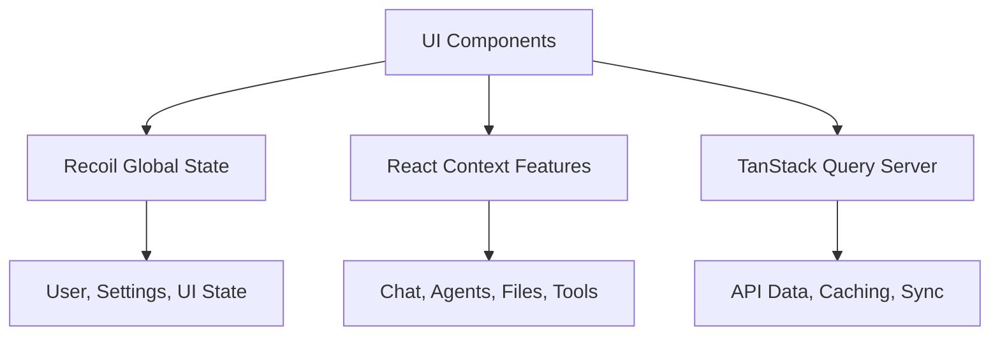

# LibreChat Client

A modern React-based frontend for Agentis (LibreChat) featuring multi-model AI conversations, agent capabilities, code execution, and real-time streaming.

## 🚀 Quick Start

```bash
# Prerequisites: Node.js 18+, npm 8+, backend running on port 3080

# Install dependencies
cd LibreChat/client
npm install

# Build shared packages (from project root)
npm run build:data-schemas
npm run build:data-provider
npm run build:mcp

# Start development server
npm run dev
# → http://localhost:3090
```

## 🏗️ Tech Stack

| Category | Technology |
|----------|------------|
| **Framework** | React 18 + TypeScript |
| **Build** | Vite with HMR |
| **State** | Recoil + React Context + TanStack Query |
| **Routing** | React Router v6 |
| **Styling** | Tailwind CSS |
| **UI** | Radix UI + Headless UI |
| **Real-time** | Server-Sent Events (SSE) |
| **PWA** | Service Worker + Manifest |
| **i18n** | i18next (30+ languages) |
| **Testing** | Jest + React Testing Library |

## 🎯 Key Features

### 🤖 Multi-Model AI Support
- **15+ AI Providers**: OpenAI, Anthropic, Google, Azure, and more
- **Dynamic Switching**: Change models mid-conversation
- **Custom Endpoints**: Configure your own AI services
- **Parameter Control**: Adjust temperature, max tokens, etc.

### 🛠️ Agent System
- **MCP Integration**: Model Context Protocol server support
- **Tool Calling**: Visual tool execution tracking
- **Ephemeral Agents**: Per-conversation agent instances
- **Server Management**: Configure MCP servers through UI

### 💻 Code Artifacts
- **Live Execution**: Sandpack-powered code runner
- **30+ Languages**: Syntax highlighting for all major languages
- **Real-time Preview**: Instant code visualization
- **Export Options**: Download or share code artifacts

### 📡 Real-time Streaming
- **SSE Implementation**: Server-Sent Events for live responses
- **Stream Control**: Pause, resume, or interrupt generation
- **Progress Tracking**: Visual indicators for long operations
- **Token Counting**: Real-time usage monitoring

### 📁 Advanced File Handling
- **Drag & Drop**: Multi-file upload with preview
- **Image Editing**: Built-in avatar and image editor
- **File Attachment**: Attach files to messages
- **Preview Support**: Images, documents, and more

### 💬 Enhanced Chat Experience
- **Conversation Branching**: Fork conversations at any point
- **Message Regeneration**: Try different AI responses
- **Edit & Continue**: Modify messages and continue
- **Export/Share**: Save or share conversations
- **Search**: Find messages across all conversations

## 📂 Project Structure

```
client/
├── src/
│   ├── components/          # React components
│   │   ├── ui/             # Reusable UI primitives (Button, Dialog, etc.)
│   │   ├── Auth/           # Login, registration, 2FA
│   │   ├── Chat/           # Core chat interface
│   │   ├── Messages/       # Message rendering & actions
│   │   ├── Artifacts/      # Code artifact system
│   │   ├── Tools/          # MCP & tool integration
│   │   ├── SidePanel/      # Navigation & conversation list
│   │   ├── Nav/            # Main navigation
│   │   └── svg/            # SVG icon library
│   ├── Providers/          # React Context providers (15+)
│   ├── hooks/              # Custom hooks (organized by feature)
│   ├── store/              # Recoil atoms & selectors
│   ├── data-provider/      # API communication layer
│   ├── routes/             # Route components & guards
│   ├── utils/              # Helper functions & utilities
│   ├── locales/            # Translation files (30+ languages)
│   └── main.jsx            # Application entry point
├── public/                 # Static assets
├── dist/                   # Production build output
└── test/                   # Test setup & utilities
```

## 🔄 State Management

### Three-Layer Architecture



#### Recoil Atoms (Global State)
```javascript
// Core application state
user                 // Current user & auth
conversation         // Active conversation
messages             // Message history
endpoints            // AI provider configurations
settings             // User preferences
artifactsState       // Code artifacts
submission           // Input form state
```

#### Context Providers (Feature State)
```javascript
// Feature-specific state management
<ChatContext>           // Chat session management
<AgentsContext>         // Agent configurations
<FileMapContext>        // File upload tracking
<ArtifactContext>       // Code artifact handling
<ToolCallsMapContext>   // Tool execution state
<MessageContext>        // Message operations
<AnnouncerContext>      // Accessibility announcements
```

#### TanStack Query (Server State)
- Automatic background refetching
- Optimistic updates
- Request deduplication
- Error handling & retries

## 🌐 Routing & Navigation

| Route | Component | Description |
|-------|-----------|-------------|
| `/` | Landing | Home/redirect page |
| `/c/:id` | ChatRoute | Active conversation |
| `/d/prompts` | Dashboard | Prompt library |
| `/share/:id` | ShareRoute | Public conversation view |
| `/login` | Login | Authentication |
| `/register` | Registration | Account creation |
| `/settings/*` | Settings | User preferences |

## 🛠️ Development

### Essential Commands

```bash
# Development
npm run dev              # Start dev server (port 3090)
npm run build            # Production build
npm run preview-prod     # Preview production build

# Testing
npm run test             # Watch mode
npm run test:ci          # Single run with coverage

# Package Management
npm run data-provider    # Rebuild data-provider package

# Alternative: Bun Support
npm run b:dev           # Bun dev server
npm run b:build         # Bun build
npm run b:test          # Bun test runner
```

### Development Server Features

- **Hot Module Replacement (HMR)**: Instant updates without losing state
- **TypeScript Checking**: Real-time type validation
- **API Proxy**: Automatic routing to backend (port 3080)
- **Source Maps**: Debug-friendly error traces

### Package Dependencies

When modifying shared packages, rebuild in order:
1. `data-schemas` (Mongoose models)
2. `data-provider` (API layer) 
3. `mcp` (Model Context Protocol)
4. Client restart

## 🧪 Testing Strategy

### Test Configuration
```bash
# Run with coverage
npm run test:ci

# Development mode
npm run test

# Coverage report
open coverage/lcov-report/index.html
```

### Test Organization
- **Unit Tests**: Utilities, hooks, pure functions
- **Component Tests**: UI behavior with React Testing Library
- **Integration Tests**: API interactions and data flow

### Coverage Goals
- Functions: 80%+
- Lines: 80%+
- Statements: 80%+
- Branches: 80%+

## 🏭 Production Build

### Build Optimization

The production build implements sophisticated code splitting:

```javascript
// Chunk Strategy (vite.config.ts)
{
  'radix-ui': ['@radix-ui/*'],          // UI component library
  'framer-motion': ['framer-motion'],    // Animation library
  'tanstack': ['@tanstack/*'],           // Data fetching
  'markdown': ['react-markdown', 'remark-*'], // Markdown processing
  'highlight': ['highlight.js'],          // Syntax highlighting
  'locales': ['locales/*'],              // Translation files
  'vendor': [/* remaining dependencies */] // Everything else
}
```

### PWA Features
- **Service Worker**: Automatic updates with user prompt
- **Offline Support**: Core functionality without network
- **Install Prompt**: Native app-like installation
- **Background Sync**: Queued actions when reconnected

### Deployment Checklist
- [ ] Set production environment variables
- [ ] Configure API proxy for `/api/*` routes
- [ ] Enable HTTPS (required for PWA)
- [ ] Set up CDN for static assets
- [ ] Configure security headers

## ⚙️ Configuration

### Environment Variables

```bash
# .env.local
VITE_API_HOST=http://localhost:3080    # Backend API URL
VITE_APP_TITLE=LibreChat               # Application title
VITE_SHOW_GOOGLE_LOGIN_OPTION=true    # Enable Google OAuth
VITE_DISABLE_REGISTRATION=false       # Allow new registrations
VITE_GTM_ID=GTM-XXXXXXX               # Google Tag Manager
```

### Build Configuration

Key settings in `vite.config.ts`:
- **Dev Server**: Port 3090 with API proxy
- **Build Target**: Modern browsers (ES2020+)
- **PWA**: Service worker with 4MB cache limit
- **Optimization**: Tree shaking, minification, compression

## 🌍 Internationalization

### Supported Languages (30+)
Arabic, Catalan, Czech, Danish, German, English, Spanish, Estonian, Persian, Finnish, French, Hebrew, Hungarian, Indonesian, Italian, Japanese, Georgian, Korean, Dutch, Polish, Portuguese (BR/PT), Russian, Swedish, Thai, Turkish, Vietnamese, Chinese (Simplified/Traditional)

### Usage Example
```javascript
import { useLocalize } from '~/hooks';

function WelcomeMessage() {
  const localize = useLocalize();
  
  return (
    <h1>{localize('com_ui_welcome')}</h1>
    <p>{localize('com_ui_model_select', { count: 5 })}</p>
  );
}
```

### Adding Translations
1. Add keys to `src/locales/en/translation.json`
2. Translate in target language files
3. Use `localize()` hook in components

## 🚀 Advanced Features

### Model Context Protocol (MCP)
```typescript
// MCP Server Configuration
interface MCPServer {
  name: string;
  command: string;
  args?: string[];
  description?: string;
  iconPath?: string;
}
```

### Code Execution
- **Sandpack Integration**: Live React, Vue, Angular preview
- **Language Support**: JavaScript, TypeScript, Python, and more
- **Error Handling**: Real-time error display
- **Export Options**: Download as files or share links

### Accessibility (WCAG 2.1 AA)
- **Screen Reader**: Optimized for NVDA, JAWS, VoiceOver
- **Keyboard Navigation**: Full keyboard accessibility
- **Live Regions**: Dynamic content announcements
- **High Contrast**: System theme respect

## 🛠️ Development Best Practices

### Performance Optimization
```typescript
// Memo for expensive components
const ExpensiveList = memo(({ items }: { items: Item[] }) => {
  const processedItems = useMemo(() => 
    items.map(processItem), [items]
  );
  
  return <VirtualizedList items={processedItems} />;
});

// Lazy loading for routes
const SettingsPage = lazy(() => import('./routes/Settings'));
```

### Type Safety
```typescript
// Discriminated unions for type safety
type Message = 
  | { type: 'text'; content: string }
  | { type: 'image'; url: string; alt: string }
  | { type: 'code'; language: string; code: string };

// Generic hooks
function useAsyncData<T>(url: string): {
  data: T | null;
  loading: boolean;
  error: Error | null;
} {
  // Implementation
}
```

### Component Patterns
```tsx
// Compound component pattern
<Dialog>
  <Dialog.Trigger>Open</Dialog.Trigger>
  <Dialog.Content>
    <Dialog.Title>Title</Dialog.Title>
    <Dialog.Description>Description</Dialog.Description>
  </Dialog.Content>
</Dialog>

// Custom hook for complex state
function useChatSession(conversationId: string) {
  const [state, dispatch] = useReducer(chatReducer, initialState);
  // Complex state logic here
  return { state, actions };
}
```

## 🐛 Troubleshooting

### Common Issues

| Problem | Solution |
|---------|----------|
| Build fails | Rebuild shared packages in order |
| HMR not working | Check port 3090 availability |
| API calls fail | Verify backend on port 3080 |
| Translations missing | Check locale file paths |
| PWA not installing | Ensure HTTPS in production |

### Debug Mode
```javascript
// Enable detailed logging
localStorage.setItem('debug', 'librechat:*');

// View React Query cache
import { useQueryClient } from '@tanstack/react-query';
const queryClient = useQueryClient();
console.log(queryClient.getQueryCache());
```

## 📚 Additional Resources

- [React Best Practices](https://react.dev/learn)
- [TypeScript Handbook](https://typescriptlang.org/docs)
- [Vite Guide](https://vitejs.dev/guide)
- [Tailwind CSS](https://tailwindcss.com/docs)
- [Radix UI](https://radix-ui.com/primitives)
- [TanStack Query](https://tanstack.com/query/latest)

## 🤝 Contributing

1. **Code Style**: Follow project ESLint/Prettier rules
2. **Type Safety**: Use TypeScript strictly, avoid `any`
3. **Testing**: Write tests for new features
4. **Accessibility**: Ensure WCAG 2.1 AA compliance
5. **i18n**: Add translations for UI changes
6. **Documentation**: Update docs for API changes

### Pre-commit Checklist
```bash
npm run lint        # Check code style
npm run typecheck   # Verify TypeScript
npm run test:ci     # Run test suite
npm run build       # Verify production build
```

---

**Built with ❤️ for the LibreChat/Agentis community**