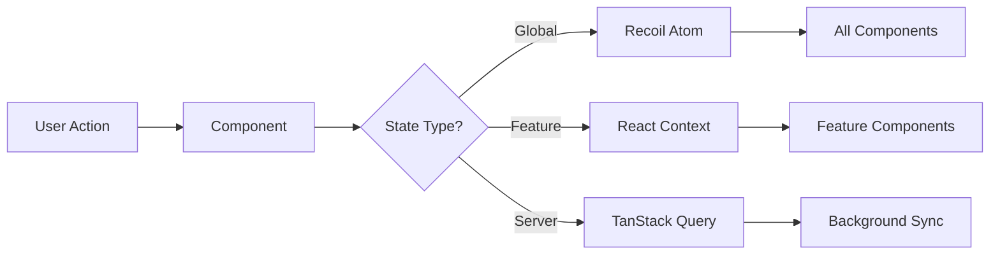

# LibreChat Client

[](https://react.dev/)
[](https://typescriptlang.org/)
[](https://vitejs.dev/)
[](https://vitest.dev/)

A sophisticated React TypeScript frontend for LibreChat/Agentis featuring multi-model AI conversations, intelligent agents with MCP integration, code execution, and real-time streaming.

---

## 🚀 Quick Start

> **Prerequisites**: Node.js 18+, npm 8+, LibreChat API server on port 3080

```bash
# 1. Install & build dependencies
cd LibreChat/client && npm install
cd .. && npm run build:data-schemas && npm run build:data-provider && npm run build:mcp

# 2. Start development
cd client && npm run dev
# → http://localhost:3090
```

**🎯 Common First-Time Issues:**
- **Port 3090 in use?** Run `npx kill-port 3090`
- **API errors?** Ensure backend is running on port 3080
- **Build errors?** Rebuild packages in order: `data-schemas` → `data-provider` → `mcp`

---

## 🎯 What This Client Does

| Feature | Description | Key Tech |
|---------|-------------|----------|
| **🤖 Multi-Model AI** | Chat with 15+ providers, switch models mid-conversation | React Context + SSE |
| **🛠️ Intelligent Agents** | MCP-powered agents with visual tool tracking | Model Context Protocol |
| **🔐 Inline OAuth** | Authenticate services directly in chat | Composio Integration |
| **💻 Code Execution** | Live code preview in 30+ languages | Sandpack Integration |
| **🌍 Global Ready** | 30+ languages, RTL support, PWA | i18next + Service Worker |

---

## 🏗️ Architecture Overview

### Tech Stack
```typescript
// Core Stack
React 18.2 + TypeScript     // UI Framework
├── Vite 6.3.4              // Build System (HMR, ESBuild)
├── Tailwind + Radix UI     // Styling + Accessible Components
└── Better Auth 1.2.9       // Authentication (2FA, OAuth)

// State Management (3-Layer)
Recoil Atoms                // Global state (user, settings)
├── React Context          // Feature state (chat, agents)
└── TanStack Query         // Server state (API, caching)

// Real-time & Performance
Server-Sent Events         // Live AI streaming
├── PWA + Service Worker   // Offline support
└── Code Splitting         // Optimized bundles
```

### State Flow


---

## 📂 Project Structure

```
client/src/
├── 🎨 components/          # React components (500+ files)
│   ├── ui/                # Reusable primitives (Button, Dialog)
│   ├── Auth/              # Login, 2FA, onboarding flows
│   ├── Chat/              # Core chat interface + messaging
│   ├── Artifacts/         # Code execution with Sandpack
│   ├── Tools/             # MCP integration + tool management
│   └── Composio/          # Inline OAuth authentication
├── 🧮 store/              # Recoil atoms (user, settings, endpoints)
├── 🔗 hooks/              # 80+ custom hooks (by feature)
├── 🌐 data-provider/      # API communication layer
├── 🚏 routes/             # Router config + auth guards
├── 🛠️ utils/              # Helper functions
├── 🗣️ locales/            # 30+ language translations
└── ⚙️ services/           # Core services (config, logging)
```

**Key Patterns:**
- **Co-located Tests**: `MyComponent.tsx` + `__tests__/MyComponent.test.tsx`
- **Feature Organization**: Components grouped by domain (Auth, Chat, etc.)
- **Barrel Exports**: Each directory has `index.ts` for clean imports

---

## 🛠️ Development Guide

### Essential Commands

```bash
# 🔄 Development
npm run dev              # Start dev server (port 3090)
npm run build            # Production build
npm run preview-prod     # Preview production build

# 🧪 Testing
npm run test             # Watch mode
npm run test:ci          # Single run + coverage
npm run test:ui          # Interactive test UI

# 🔍 Quality
npm run typecheck        # TypeScript validation
npm run lint             # ESLint checking

# 📦 Package Management
npm run data-provider    # Rebuild data-provider (common)
```

### Development Workflow

**1. 🔧 When Packages Change**
```bash
# Required rebuild order
npm run build:data-schemas     # 1. Types & models
npm run build:data-provider    # 2. API layer
npm run build:mcp             # 3. MCP services
# 4. Restart dev server
```

**2. 🧪 Testing Strategy**
```bash
# TDD Workflow
npm run test MyComponent    # Watch specific component
npm run test:coverage      # Full coverage report
npm run test:ci           # CI-style run
```

**3. 🎯 TypeScript Configs**
- `tsconfig.json` → Development (all files)
- `tsconfig.typecheck.json` → Production (source only)
- **Why?** Faster CI, focused errors, better DX

### Development Server Features

| Feature | Benefit |
|---------|---------|
| **⚡ Hot Module Replacement** | Instant updates, preserve state |
| **🔗 API Proxy** | Auto-routes `/api/*` to port 3080 |
| **🗺️ Source Maps** | Debug-friendly error traces |
| **🔍 TypeScript Integration** | Real-time type validation |

---

## 🧪 Testing Strategy

### Quick Test Commands
```bash
npm run test                    # Watch mode (development)
npm run test:ci                # Single run + coverage
npm run test:ui                # Interactive Vitest UI
npm run test:ci -- AuthButton  # Test specific component
```

### Test Organization
```
src/components/Auth/AuthButton.tsx
src/components/Auth/__tests__/AuthButton.test.tsx
```

### Example Test Pattern
```typescript
// Clean, focused component tests
describe('AuthButton', () => {
  const renderButton = (props = {}) => 
    render(
      <RecoilRoot>
        <AuthContext.Provider value={mockAuthContext}>
          <AuthButton {...props} />
        </AuthContext.Provider>
      </RecoilRoot>
    );

  it('shows loading state during authentication', async () => {
    const user = userEvent.setup();
    renderButton({ loading: true });
    
    expect(screen.getByRole('button')).toBeDisabled();
    expect(screen.getByText('Signing in...')).toBeInTheDocument();
  });
});
```

**Current Coverage**: 80%+ target, with several components achieving 100% (ProactiveMCPAuth: 29 test cases, 100% coverage)

---

## 🔧 Advanced Features

### Model Context Protocol (MCP) Integration

**What it does:** Enables AI agents to use external tools with visual tracking and authentication.

```typescript
// Example: Custom tool display names
const config = await LibreChatConfigService.loadConfig();
const displayName = config.getToolDisplayName('COMPOSIO_CHECK_ACTIVE_CONNECTION', 'googlesheets');
// Returns: "Check Connection" instead of technical function name
```

**Key Components:**
- **Tool Execution Tracking**: Visual status indicators
- **Inline Authentication**: OAuth flows in chat
- **Server Management**: Configure MCP servers via UI
- **Custom Display Names**: User-friendly tool names via YAML config

### Composio Authentication System

**Inline OAuth Flow:**
1. Agent attempts tool requiring auth → Shows auth message
2. `AuthCodeParser` detects auth needed → Renders auth button
3. User clicks → OAuth popup → Service connection
4. Button updates to "✓ Connected" → User can retry tool

**Supported Services**: Google Sheets, Docs, Drive, Gmail, Calendar

**Adding New Services**: Update 6 specific files:
1. Backend service mapping (`ComposioService.js`)
2. Frontend auth button (`ComposioAuthButton.tsx`)
3. Auth code parser (`AuthCodeParser.tsx`)
4. MCP auth utilities (`mcpAuth.ts`)
5. Database schema (`composioConnectedAccount.ts`)
6. MCP server config (`librechat.yaml`)

### Code Execution (Sandpack)
- **Live Preview**: React, Vue, Angular projects
- **30+ Languages**: Syntax highlighting
- **Real-time**: Instant execution + error handling
- **Export**: Download or share code

---

## ⚙️ Configuration

### Environment Variables
```bash
# .env.local (development)
VITE_API_HOST=http://localhost:3080
VITE_APP_TITLE=LibreChat
VITE_SHOW_GOOGLE_LOGIN_OPTION=true
VITE_DISABLE_REGISTRATION=false
```

### LibreChat YAML Integration
```yaml
# librechat.yaml - Custom tool display names
mcpServers:
  googlesheets:
    displayName: "Google Sheets"
    toolDisplayNames:
      COMPOSIO_CHECK_ACTIVE_CONNECTION: "Check Connection"
      GOOGLESHEETS_CREATE_GOOGLE_SHEET1: "Create Spreadsheet"
```

**Debug Tools:**
```javascript
// Browser console debugging
localStorage.setItem('debug-tool-display-names', 'true');
localStorage.setItem('debug', 'librechat:*');
```

---

## 🏭 Production Build

### Build Optimization
```typescript
// Intelligent code splitting (vite.config.ts)
{
  'radix-ui': ['@radix-ui/*'],        // ~200KB
  'framer-motion': ['framer-motion'], // ~150KB  
  'tanstack': ['@tanstack/*'],        // ~100KB
  'markdown': ['react-markdown'],     // ~300KB
  'locales': ['src/locales/*'],       // ~50KB each
}
```

### PWA Features
- 📱 **Native Installation**: App-like experience
- 🔄 **Auto Updates**: Background updates with user prompt
- 📴 **Offline Support**: Core functionality without network
- 💾 **Smart Caching**: 4MB intelligent asset caching

---

## 🐛 Troubleshooting

### Quick Fixes

| Issue | Quick Fix |
|-------|-----------|
| **Build fails** | `cd .. && npm run build:data-provider && cd client` |
| **Port 3090 in use** | `npx kill-port 3090` |
| **API errors** | Check backend: `curl http://localhost:3080/api/health` |
| **Package errors** | Rebuild in order: schemas → provider → mcp |
| **HMR not working** | Restart dev server |

### Debug Tools
```javascript
// React DevTools + browser console
localStorage.setItem('debug', 'librechat:*');
localStorage.setItem('debug-tool-display-names', 'true');

// TanStack Query debugging
import { useQueryClient } from '@tanstack/react-query';
const client = useQueryClient();
console.log(client.getQueryCache());
```

---

## 🌍 Internationalization

**30+ Languages**: Arabic (RTL), Chinese, English, French, German, Japanese, Korean, Spanish, etc.

```typescript
// Usage in components
import { useLocalize } from '~/hooks';

function WelcomeMessage() {
  const localize = useLocalize();
  return <h1>{localize('com_ui_welcome')}</h1>;
}
```

**Adding Languages:**
1. Create `src/locales/[lang]/translation.json`
2. Copy English keys as template
3. Update `i18n.ts` configuration

---

## 🤝 Contributing

### Quick Contribution Checklist
```bash
# Pre-commit verification
npm run lint          # ✅ ESLint passes
npm run typecheck     # ✅ TypeScript validates  
npm run test:ci       # ✅ Tests pass + coverage
npm run build         # ✅ Production builds
```

### Code Standards
- **🎯 Type Safety**: Use TypeScript strictly, avoid `any`
- **♿ Accessibility**: WCAG 2.1 AA compliance
- **🧪 Testing**: Write tests for new features
- **🌍 i18n**: Add translations for UI text
- **📖 Documentation**: Update docs for API changes

### Git Conventions
```bash
# Branch naming
feat/issue-123-mcp-integration
fix/issue-456-auth-bug

# Commit messages
feat(auth): add 2FA support for enhanced security
fix(chat): resolve message regeneration timeout
test(mcp): increase tool execution coverage to 100%
```

---

## 📚 Essential Resources

### Core Documentation
- **[React 18 Docs](https://react.dev/learn)** - Modern React patterns
- **[TypeScript Handbook](https://typescriptlang.org/docs)** - Type system guide
- **[Vite Guide](https://vitejs.dev/guide)** - Build tool docs
- **[Tailwind CSS](https://tailwindcss.com/docs)** - Utility-first styling

### Project-Specific
- **[Model Context Protocol](https://modelcontextprotocol.io/)** - MCP specification
- **[Better Auth](https://better-auth.com/docs)** - Authentication framework
- **[Sandpack](https://sandpack.codesandbox.io/)** - Code execution docs

---

## 🎯 Next Steps

**New Developer Path:**
1. ✅ Follow Quick Start → Get dev server running
2. 🔍 Explore `src/components/ui/` → Understand component patterns
3. 🧪 Run `npm run test:ui` → See testing approach
4. 🔧 Make small change → Experience HMR workflow
5. 📖 Read Advanced Features → Understand MCP/Composio systems

**Ready to Contribute:**
1. 🎯 Pick issue from GitHub → Focus on specific feature
2. 🔧 Create feature branch → Follow naming conventions
3. 🧪 Write tests first → Follow TDD approach
4. ✅ Run quality checks → Ensure standards met
5. 📝 Submit PR → Clear description + documentation

---

**🚀 Built with ❤️ for the LibreChat/Agentis community**

*Questions? Check our [troubleshooting section](#-troubleshooting) or open a GitHub issue.*