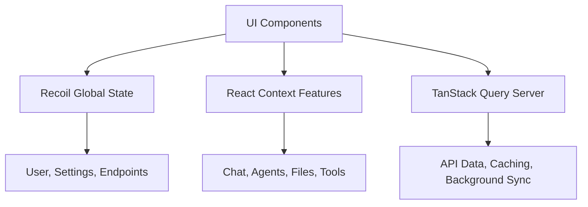

# LibreChat Client

A modern React TypeScript frontend for Agentis (LibreChat) featuring multi-model AI conversations, intelligent agents, code execution, and real-time streaming.

## 📋 Table of Contents

- [Quick Start](#-quick-start)
- [Features Overview](#-features-overview)
- [Architecture](#-architecture)
- [Project Structure](#-project-structure)
- [Development Guide](#-development-guide)
- [Testing](#-testing)
- [Production Build](#-production-build)
- [Configuration](#-configuration)
- [Advanced Features](#-advanced-features)
- [Troubleshooting](#-troubleshooting)
- [Contributing](#-contributing)

## 🚀 Quick Start

### Prerequisites
- **Node.js**: 18+ (LTS recommended)
- **npm**: 8+ or **Bun**: 1.0+ (alternative runtime)
- **Backend**: LibreChat API server running on port 3080

### Installation & Setup

```bash
# Navigate to client directory
cd LibreChat/client

# Install dependencies
npm install

# Build shared packages (required for monorepo)
cd .. && npm run build:data-schemas
npm run build:data-provider
npm run build:mcp

# Return to client and start development server
cd client && npm run dev
```

**🌐 Open [http://localhost:3090](http://localhost:3090)** - Your development server is ready!

### Quick Development Tips
- **Hot Reload**: Changes reflect instantly without losing state
- **Type Checking**: Real-time TypeScript validation in your IDE
- **API Integration**: Backend calls automatically proxy to port 3080
- **Package Changes**: Run rebuild commands when modifying shared packages

## 🎯 Features Overview

### 🤖 **Multi-Model AI Chat**
Chat with 15+ AI providers (OpenAI, Anthropic, Google, Azure) with seamless model switching mid-conversation.

### 🛠️ **Intelligent Agents**
Deploy MCP-powered agents with visual tool execution tracking and inline OAuth authentication for services like Google Workspace.

### 💻 **Code Artifacts**
Execute code in 30+ programming languages with live preview for React, Vue, and Angular projects.

### 📁 **Smart File Management**
Drag-and-drop file uploads with RAG integration, image editing, and vector store processing.

### 💬 **Enhanced Chat**
Fork conversations, regenerate responses, edit messages, and search across all conversations.

### 🌍 **Global Ready**
25+ languages with RTL support, accessibility compliance (WCAG 2.1 AA), and PWA installation.

## 🏗️ Architecture

### Technology Stack

| Layer | Technology | Purpose |
|-------|------------|---------|
| **UI Framework** | React 18.2 + TypeScript | Component-based development with type safety |
| **Build System** | Vite 6.3.4 | Fast development with optimized production builds |
| **State Management** | Recoil + React Context + TanStack Query | Multi-layer state architecture |
| **Styling** | Tailwind CSS 3.4.1 + Radix UI | Utility-first CSS with accessible primitives |
| **Real-time** | Server-Sent Events (SSE) | Live AI response streaming |
| **Authentication** | Better Auth 1.2.9 | Modern auth with 2FA and OAuth |
| **Testing** | Vitest + React Testing Library | Modern testing with fast execution |

### State Management Architecture



**🌐 Global State (Recoil)**: User auth, app settings, UI state  
**⚡ Feature State (Context)**: Chat sessions, agents, file processing  
**🔄 Server State (TanStack Query)**: API data with intelligent caching  

## 📂 Project Structure

```
client/
├── src/
│   ├── components/           # React component library (500+ files)
│   │   ├── ui/              # 50+ reusable primitives (Button, Dialog, Form)
│   │   ├── Auth/            # Login, 2FA, OAuth flows
│   │   ├── Chat/            # Main chat interface
│   │   ├── Artifacts/       # Code execution system
│   │   ├── Tools/           # MCP tool integration
│   │   └── ...              # Feature-organized components
│   ├── Providers/           # 24 React Context providers
│   ├── hooks/               # 80+ custom hooks by feature
│   ├── store/               # Recoil state atoms
│   ├── data-provider/       # API communication layer
│   ├── utils/               # Helper functions
│   ├── locales/             # 25+ language translations
│   └── main.jsx             # App entry point
├── public/                  # Static assets & configuration
├── test/                    # Testing utilities
└── dist/                    # Production build output
```

### Key Directories Explained

**`components/`** - Feature-organized React components:
- `ui/` - Reusable primitives built on Radix UI
- `Auth/` - Complete authentication flows  
- `Chat/` - Core chat interface with message handling
- `Artifacts/` - AI-generated code execution system
- `Tools/` - MCP server integration and management

**`hooks/`** - Domain-specific custom hooks:
- `Auth/` - Authentication state and flows
- `Chat/` - Chat functionality and message processing
- `SSE/` - Server-sent events for real-time streaming
- `Files/` - File upload and drag-and-drop handling

**`store/`** - Recoil state management:
- `user.ts` - User profile and authentication state
- `settings.ts` - Application preferences
- `endpoints.ts` - AI provider configurations

## 🛠️ Development Guide

### Essential Commands

```bash
# Development workflow
npm run dev              # Start dev server (port 3090)
npm run build            # Production build
npm run preview-prod     # Preview production build

# Testing & quality
npm run test             # Watch mode testing
npm run test:ci          # Single run with coverage
npm run typecheck        # TypeScript validation
npm run lint             # Code style checking

# Package management
npm run data-provider    # Rebuild data-provider package
npm run prebuild         # Copy configuration files

# Bun alternative (faster)
npm run b:dev           # Bun development server
npm run b:build         # Bun production build
```

### Development Server Features

- **⚡ Hot Module Replacement**: Instant updates preserving component state
- **🔍 TypeScript Checking**: Real-time validation with error overlay
- **🔗 API Proxy**: Automatic backend routing (port 3080)
- **🗺️ Source Maps**: Debug-friendly error traces
- **🌍 Environment Variables**: Auto-loaded from parent directory

### Package Dependencies & Rebuild Workflow

The client integrates with shared monorepo packages:

```bash
# Required rebuild sequence when packages change:
1. npm run build:data-schemas     # Mongoose models
2. npm run build:data-provider    # API layer  
3. npm run build:mcp             # MCP services
4. Restart client dev server      # Pick up changes
```

**💡 Quick rebuild**: Use `npm run data-provider` for frequent data-provider changes.

### IDE Setup Recommendations

**VS Code Extensions:**
- ES7+ React/Redux/React-Native snippets
- Tailwind CSS IntelliSense
- TypeScript Importer
- Auto Rename Tag
- Bracket Pair Colorizer

**Settings:**
```json
{
  "typescript.preferences.useAliasesForRenames": false,
  "typescript.preferences.importModuleSpecifier": "relative"
}
```

## 🧪 Testing

### Test Organization & Patterns

```
src/
├── components/MyComponent.tsx
├── components/__tests__/MyComponent.test.tsx
├── utils/myUtility.ts
└── utils/__tests__/myUtility.test.ts
```

### Testing Commands

```bash
# Development testing
npm run test             # Watch mode
npm run test:ui          # Interactive Vitest UI

# CI testing
npm run test:ci          # Single run with coverage
npm run test:coverage    # Detailed coverage report

# Specific tests
npm run test:ci -- Chat  # Test specific component
npm run test -- --grep "auth" # Test by pattern
```

### Testing Tools

- **Vitest**: Fast ESM-native test runner
- **React Testing Library**: Accessibility-focused component testing
- **jsdom**: Browser environment simulation
- **Coverage**: v8 provider with 80%+ target across all metrics

### Example Test Pattern

```typescript
import { render, screen } from '@testing-library/react';
import userEvent from '@testing-library/user-event';
import { RecoilRoot } from 'recoil';

describe('ChatMessage', () => {
  const renderWithProviders = (props = {}) => 
    render(
      <RecoilRoot>
        <ChatContext.Provider value={mockContext}>
          <ChatMessage {...props} />
        </ChatContext.Provider>
      </RecoilRoot>
    );

  it('handles user interactions', async () => {
    const user = userEvent.setup();
    renderWithProviders({ content: 'Hello' });
    
    await user.click(screen.getByRole('button', { name: /regenerate/i }));
    expect(mockRegenerate).toHaveBeenCalled();
  });
});
```

## 🏭 Production Build

### Build Optimization Strategy

**Code Splitting Configuration:**
```typescript
// Intelligent chunk strategy for optimal loading
{
  'radix-ui': ['@radix-ui/*'],        // UI library (~200KB)
  'framer-motion': ['framer-motion'], // Animations (~150KB)
  'tanstack': ['@tanstack/*'],        // Data fetching (~100KB)
  'markdown': ['react-markdown'],     // Content rendering (~300KB)
  'locales': ['src/locales/*'],       // Translations (~50KB each)
  'vendor': [/* other dependencies */] // Remaining packages
}
```

**Performance Features:**
- 🌲 **Tree Shaking**: Eliminates unused code
- 📦 **Terser Minification**: Advanced compression
- 🗜️ **Gzip Compression**: Auto-compression for assets > 10KB
- 🖼️ **Asset Optimization**: Font subsetting, image compression

### Progressive Web App (PWA)

**Installation Features:**
- 📱 Native app-like installation on all devices
- 🔄 Background updates with user notifications
- 📴 Offline functionality for core features
- 💾 4MB intelligent asset caching

### Environment Configuration

```bash
# Development (.env.local)
VITE_API_HOST=http://localhost:3080
VITE_APP_TITLE=LibreChat
VITE_SHOW_GOOGLE_LOGIN_OPTION=true
VITE_DISABLE_REGISTRATION=false

# Production
VITE_API_HOST=https://your-api-domain.com
VITE_APP_TITLE=Your Custom Title
```

## ⚙️ Configuration

### TypeScript Configuration

**Multiple Config Strategy:**
- `tsconfig.json` - Development with full IntelliSense
- `tsconfig.typecheck.json` - Production CI/CD validation
- `tsconfig.test.json` - Test-specific type checking

**Benefits:**
- 🎯 **Focused Errors**: Production builds show only runtime-critical issues
- ⚡ **Faster CI**: ~40% reduction in type checking time
- 🔧 **Better DX**: Less overwhelming error output

```bash
npm run typecheck        # Production code only (recommended)
npm run typecheck:all    # All files including tests
```

### LibreChat YAML Integration

The client dynamically loads configuration from `librechat.yaml`:

**Development**: Symlinked from project root for hot reload  
**Production**: Copied during build and served compressed

```typescript
// Configuration service usage
const config = await LibreChatConfigService.loadConfig();
const displayName = config.getToolDisplayName('TOOL_NAME', 'server');
```

**Debug Configuration:**
```javascript
// Enable debug mode in browser console
localStorage.setItem('debug-tool-display-names', 'true');
```

## 🔧 Advanced Features

### Model Context Protocol (MCP) Integration

**Core Capabilities:**
- 🔧 **Tool Execution**: Visual tracking with real-time status
- 🔐 **Authentication**: Inline OAuth flows for service connections
- ⚙️ **Server Management**: Dynamic configuration through UI
- 🏷️ **Custom Naming**: Tool display names via configuration

### Composio Authentication System

**Inline OAuth Features:**
- **Seamless Integration**: OAuth flows directly in chat conversations
- **Service Support**: Google Workspace (Sheets, Docs, Drive, Gmail, Calendar)
- **Status Persistence**: Authentication state across sessions
- **Error Handling**: Graceful fallbacks for failed flows

**Adding New OAuth Providers:**

To extend the system with new providers (Notion, GitHub, Slack), update these 6 locations:

1. **Backend Service Mapping** (`/api/server/services/ComposioService.js`)
2. **Frontend Auth Button** (`/client/src/components/Composio/ComposioAuthButton.tsx`)
3. **Auth Code Parser** (`/client/src/components/Messages/Content/AuthCodeParser.tsx`)
4. **MCP Auth Utilities** (`/client/src/utils/mcpAuth.ts`)
5. **Database Schema** (`/packages/data-schemas/src/schema/composioConnectedAccount.ts`)
6. **MCP Server Config** (`/librechat.yaml`)

### Code Execution System

**Sandpack Integration:**
- **Framework Support**: React, Vue, Angular, Vanilla JS/TS
- **Language Support**: JavaScript, TypeScript, Python, HTML, CSS
- **Live Preview**: Real-time execution with error handling
- **Export Options**: Download files or create shareable links

### Internationalization (i18n)

**25+ Supported Languages:**
Arabic (RTL), Chinese (Simplified/Traditional), English, French, German, Japanese, Korean, Spanish, and more.

**Implementation:**
```typescript
import { useLocalize } from '~/hooks';

function Component() {
  const localize = useLocalize();
  return <h1>{localize('com_ui_welcome')}</h1>;
}
```

**Adding Languages:**
1. Create `src/locales/[lang]/translation.json`
2. Copy English translations as template
3. Update `i18n.ts` configuration
4. Add language selector option

## 🐛 Troubleshooting

### Common Issues & Solutions

| Problem | Symptoms | Solution |
|---------|----------|----------|
| **Build Failures** | `npm run build` errors | Rebuild packages: `data-schemas` → `data-provider` → `mcp` |
| **HMR Issues** | Changes not reflecting | Check port 3090, restart dev server |
| **API Failures** | Network/404 errors | Verify backend on port 3080, check proxy config |
| **Type Errors** | TS compilation failures | Run `npm run typecheck`, fix reported issues |
| **Package Import Errors** | Module not found | Rebuild package dependencies in correct order |

### Development Debugging

**Browser Console Tools:**
```javascript
// Enable detailed logging
localStorage.setItem('debug', 'librechat:*');

// Debug TanStack Query
import { useQueryClient } from '@tanstack/react-query';
const client = useQueryClient();
console.log(client.getQueryCache());

// Debug MCP tool display names
localStorage.setItem('debug-tool-display-names', 'true');
```

**Browser Extensions:**
- **React DevTools**: Component inspection
- **Recoil DevTools**: State atom visualization
- **Network Tab**: API request debugging

### Error Messages & Fixes

**"Module not found: librechat-data-provider"**
```bash
cd .. && npm run build:data-provider && cd client && npm run dev
```

**"Port 3090 already in use"**
```bash
# Kill existing process
npx kill-port 3090
# Or use different port
npm run dev -- --port 3091
```

**"Cannot connect to API"**
- Verify backend running: `curl http://localhost:3080/api/health`
- Check proxy configuration in `vite.config.ts`
- Ensure environment variables are set correctly

## 📚 Resources & Documentation

### Essential Links
- **[React Documentation](https://react.dev/learn)** - Modern React patterns
- **[TypeScript Handbook](https://typescriptlang.org/docs)** - Type system reference
- **[Vite Guide](https://vitejs.dev/guide)** - Build tool documentation
- **[Tailwind CSS](https://tailwindcss.com/docs)** - Utility-first styling
- **[Radix UI](https://radix-ui.com/primitives)** - Accessible component primitives

### Project-Specific Resources
- **[Model Context Protocol](https://modelcontextprotocol.io/)** - MCP specification
- **[Better Auth](https://better-auth.com/docs)** - Authentication framework
- **[Sandpack](https://sandpack.codesandbox.io/)** - Code execution environment
- **[LibreChat API](../api/README.md)** - Backend API documentation

### Community & Support
- **GitHub Issues**: Bug reports and feature requests
- **Discord Community**: Real-time discussions and support
- **Documentation**: Comprehensive guides and tutorials

## 🤝 Contributing

### Development Workflow

1. **🍴 Fork & Clone**: Create your development branch
2. **📦 Setup**: Install dependencies and build packages
3. **🔧 Develop**: Make changes with proper testing
4. **🧪 Test**: Ensure all tests pass and coverage is maintained
5. **📝 Document**: Update docs for any API changes
6. **🔍 Review**: Submit PR with clear description

### Code Quality Standards

```bash
# Pre-commit verification
npm run lint          # ESLint style checking
npm run typecheck     # TypeScript validation
npm run test:ci       # Complete test suite
npm run build         # Production build verification
```

### Guidelines

- **🎯 Type Safety**: Use TypeScript strictly, avoid `any`
- **♿ Accessibility**: Ensure WCAG 2.1 AA compliance
- **🌍 Internationalization**: Add translations for new UI text
- **🧪 Testing**: Write tests for new features and bug fixes
- **📖 Documentation**: Update relevant documentation

### Git Conventions

**Branch Naming:**
- `feat/issue-123-feature-name`
- `fix/issue-456-bug-description`
- `refactor/component-cleanup`

**Commit Messages:**
```
feat(auth): add 2FA support for enhanced security
fix(chat): resolve message regeneration timeout issue
test(components): increase Button component coverage to 100%
docs(readme): update deployment configuration guide
```

---

**🚀 Ready to build the future of AI conversations?**  
**Built with ❤️ for the LibreChat/Agentis community**