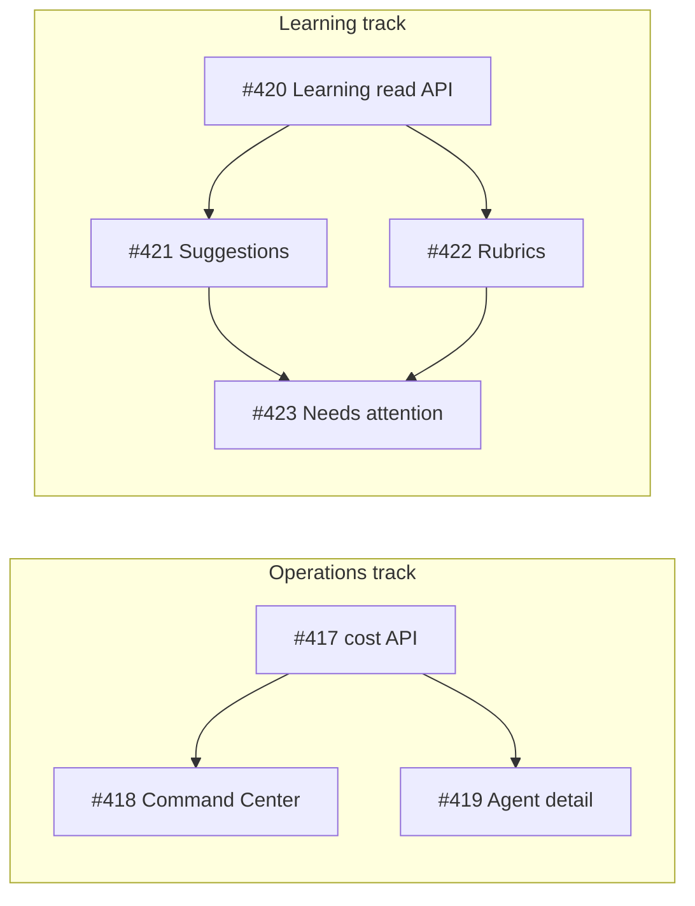

# Foundational execution queue

**Purpose:** Short, ordered list of what we are building *now* — separate from long-horizon ideation (`docs/ideation/`) and direction (`STRATEGY.md`).

**How to pick up work:** Start here → open the linked GitHub issue → new worktree from `main` → branch → PR.

**List open queue:**

```bash
gh issue list --repo gannonh/agentis --label ready-for-agent --search "execution queue" --json number,title,state --jq '.[] | "#\(.number) \(.title)"'
```

Or read the table below.

---

## Queue

| # | Status | Slice | Issue |
|---|--------|-------|-------|
| 1 | **Shipped** | Gateway model catalog + composer picker | PR branch `cursor/2dddaf88` |
| 2 | **Shipped** | Research golden path (web search → Library brief) + live finalizer | PR branch `cursor/2dddaf88` |
| 3 | **Shipped** | Thread runtime UX — tool results & document creation in chat | [#412](https://github.com/gannonh/agentis/issues/412) (PR [#424](https://github.com/gannonh/agentis/pull/424)) |
| 4 | **Shipped** | One Composio integration golden path (generic thread) | [#413](https://github.com/gannonh/agentis/issues/413) (PR [#425](https://github.com/gannonh/agentis/pull/425)) — [UAT](../uat/2026-06-08-composio-github-golden-path.md) |
| 5 | **Shipped** | Honest UI for fixture-backed surfaces | [#414](https://github.com/gannonh/agentis/issues/414) (PR [#426](https://github.com/gannonh/agentis/pull/426)) |
| 6 | **Shipped** | Self-host docs (Cloudflare + Tavily keyless) | [#415](https://github.com/gannonh/agentis/issues/415) (PR [#426](https://github.com/gannonh/agentis/pull/426)) — [golden path](../self-host/golden-path-research.md) |

**Next recommended:** [#421](https://github.com/gannonh/agentis/issues/421) and [#422](https://github.com/gannonh/agentis/issues/422) can proceed in parallel after #420's read path.

---

## Wave 1 — HyperAgent gap (honest operations)

Source: `docs/roadmap/hyperagent-gap-roadmap.md`. **Wave 0 complete** (#412–#415 shipped); Wave 1 operations read paths are in place through #420.

| # | Status | Slice | Issue | Depends on |
|---|--------|-------|-------|------------|
| 7 | **Shipped** | Run cost attribution API | [#417](https://github.com/gannonh/agentis/issues/417) (PR [#427](https://github.com/gannonh/agentis/pull/427)) | — |
| 8 | **Shipped** | Command Center live metrics wire-up | [#418](https://github.com/gannonh/agentis/issues/418) | #417 (shipped) |
| 9 | **Shipped** | Agent detail observability panel | [#419](https://github.com/gannonh/agentis/issues/419) | #417 (shipped) |
| 10 | **Shipped** | Learning dashboard API (read path) | [#420](https://github.com/gannonh/agentis/issues/420) | — |
| 11 | Open | Post-run learning suggestions + accept/dismiss | [#421](https://github.com/gannonh/agentis/issues/421) | #420 |
| 12 | Open | Rubrics and run evaluation scoring | [#422](https://github.com/gannonh/agentis/issues/422) | #420 |
| 13 | Open | Needs-attention queue (live) | [#423](https://github.com/gannonh/agentis/issues/423) | #421, #422 (partial OK) |

### Wave 1 dependency graph

GitHub **blocked-by** relationships mirror this graph (see each issue's Relationships sidebar).



**Currently unblocked:** [#421](https://github.com/gannonh/agentis/issues/421) and [#422](https://github.com/gannonh/agentis/issues/422).

| Phase | Safe in parallel | Issues |
|-------|------------------|--------|
| Now | 2 workers | #421, #422 |
| Final | 1 worker | #423 |

**Soft coupling (not blockers):** Command Center shipped with score placeholders until rubric avg scores (#422). #423 accepts partial implementation (failed runs first).

**GitHub filters:** `is:blocked`, `is:blocking`, `blocked-by:#420`.

---

## Not this queue

`docs/ideation/2026-06-08-open-ideation.md` holds **future bets** (lineage layer, OEE scorecard, promotion lanes). Wave 1 supersedes the "Command Center live metrics" ideation item — see `docs/roadmap/hyperagent-gap-roadmap.md` for full gap map.

---

## Adding items in a fresh session (no chat context)

When planning happens in a new agent session and you need durable tracking:

### 1. Capture the decision in git

Ask the agent to **update this file** with a new row (or strike through completed rows), then commit. One paragraph of *why* in the issue body is enough — do not rely on chat history.

### 2. Create a GitHub issue per slice

From the repo root:

```bash
gh issue create --repo gannonh/agentis \
  --title "Short imperative title" \
  --label "enhancement,ready-for-agent" \
  --body "$(cat <<'EOF'
## Context
Link to this file: docs/roadmap/execution-queue.md

## Goal
One sentence.

## Acceptance criteria
- [ ] Observable outcome 1
- [ ] Tests / UAT note

## References
- Paths or ADRs
EOF
)"
```

Then add the issue URL to the table in this file.

### 3. Point agents at the issue

In a new Cursor session:

> Read `docs/roadmap/execution-queue.md` and implement GitHub issue #413.

Or use Kata / `gh issue view 412` if you use that workflow.

### 4. Optional Compound Engineering flow

| Step | Skill / action | Output |
|------|----------------|--------|
| Direction | `/ce-strategy` | `STRATEGY.md` (rare) |
| Ideas | `/ce-ideate` | `docs/ideation/*.md` (not the sprint board) |
| **Execution** | **This file + `gh issue create`** | **Issues #NNN** |
| Plan one slice | `/ce-plan` on the issue body | Plan in issue comment or spec |
| Build | Agent + worktree | PR |
| Learn | `/ce-compound` | `docs/solutions/` |

### 5. After merge

- Mark row **Shipped** in this file (PR link or issue close).
- `gh issue close NNN --comment "Shipped in PR #…"`.
- New worktree from `origin/main` for the next open issue.

---

## Changelog

| Date | Change |
|------|--------|
| 2026-06-08 | Queue created; shipped items 1–2 from `cursor/2dddaf88`; opened #412–#415 |
| 2026-06-08 | Wave 1 HyperAgent gap slices opened #417–#423 from `hyperagent-gap-roadmap.md` |
| 2026-06-08 | Shipped #412 (thread tool-result cards, document links, durable-artifact refresh) in PR #424 |
| 2026-06-08 | Shipped #413 (Composio GitHub golden path); UAT `docs/uat/2026-06-08-composio-github-golden-path.md` |
| 2026-06-09 | PR #425 review hardening: grant-safe integration refresh, narrower GitHub preflight heuristics, human-readable grant API errors |
| 2026-06-09 | Shipped #414–#415 in PR #426: `DemoDataNotice` on fixture-backed surfaces; self-host golden path `docs/self-host/golden-path-research.md` |
| 2026-06-09 | Documented Wave 1 dependency graph; synced GitHub blocked-by links for #417–#423 |
| 2026-06-09 | Shipped #417 in PR #427: run cost attribution, `GET /api/agents/:id/usage`, and `GET /api/command-center/summary` |
| 2026-06-09 | Integrated Wave 1 read paths: Command Center live metrics (#418), Agent Detail usage observability (#419), and Learning API read models (#420) |
