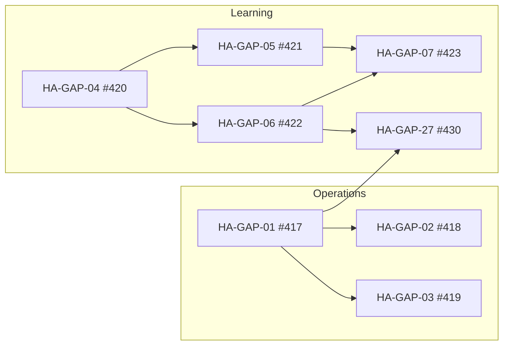
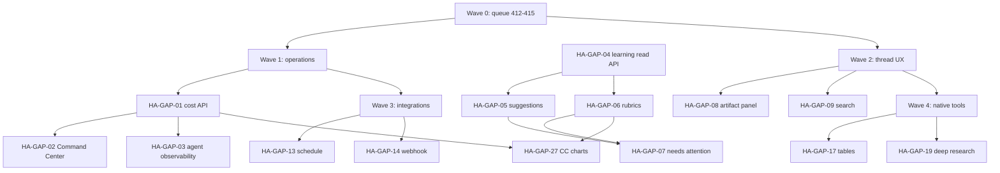

# HyperAgent gap roadmap

**Purpose:** Ordered vertical slices to close meaningful gaps between [HyperAgent](https://hyperagent.com) and Agentis. Each slice is demo-able, scoped for a single GitHub issue, and safe for parallel agent execution.

**Source:** Live product exploration via logged-in Chrome session (2026-06-08), cross-checked against `docs/specs/agent-native-tooling.md`, `docs/specs/agentis-prd-roadmap.md`, and `STRATEGY.md`.

**How to use:** Pick a slice → create a GitHub issue from the template at the bottom → implement in an isolated worktree.

**Strategy guardrail:** Agentis is self-hosted and cost-sensitive. We pursue **bounded deliverables** (artifacts, workspace tools, Composio, evals) rather than full cloud VM/browser parity. Slices marked **Defer** are intentional non-goals unless strategy changes.

---

## Parity snapshot

### Product surfaces

| Surface | HyperAgent (observed) | Agentis today | Gap severity |
| --- | --- | --- | --- |
| New thread home | Agent switcher, Plan/Execute, suggestion chips, AI thread summaries, capability showcase cards with cost/time | API-backed threads; simpler home | Medium |
| Thread session | Model picker, Live mode, reasoning blocks, Working Doc side panel, inline artifact iframes, Plan vs Execute | API-backed streaming; human-readable native tool cards, document links in transcript, durable-artifact sidebar; inline Working Doc panel still missing | Medium–High |
| Library | Search, Type/Visibility/Source filters, Save/bookmark, archived toggle, iframe previews | API-backed artifacts + workspaces | Low–Medium |
| Agents | Ideas roster, observability charts, cost by model, evals, version history, invocations (Slack/Telegram/webhook/email), Live mode | API agents with live usage observability, version history, rubric CRUD, and run evaluation scores on Overview when rubrics exist | Medium |
| Command Center | Live roster, cost breakdown, needs-attention queue, pending improvements, recent runs, score trends | API-backed live run metrics, roster, recent runs, avg score, and needs-attention queue (HA-GAP-07); fleet chart panels still placeholder (HA-GAP-27) | Medium |
| Learning | Skills (19), categorized memories, rubrics, thread-derived suggestions with accept/dismiss | API-backed skills, memories, rubrics, post-run suggestions with accept/dismiss, and accepted-memory context injection | Low–Medium |
| Integrations | NATIVE + MCP catalog, custom MCP server, 20+ apps | Composio-backed; fixture catalog UI | Medium |
| Projects | Sidebar grouping, thread counts, per-project threads | API-backed | Low |
| Search (⌘K) | Global search entry point | Placeholder route | Medium |
| Teams | Shared agents/skills spaces | Not present | Defer (multi-tenant) |

### Native tools (20 active on Sales Prospector agent)

| Category | HyperAgent tool | Agentis status |
| --- | --- | --- |
| **Execution** | Script (ephemeral container) | Partial — `runWorkspaceCommand` with local-process/container sandbox; durable workspace writes (differs from HA ephemeral model) |
| **Execution** | Full VM (persistent cloud machine) | **Defer** — conflicts with self-host ROI positioning |
| **Research** | Search | **Shipped** — V4.1 `searchWeb` |
| **Research** | Exa, Find Similar, Exa Answer, Exa Research, Exa Websets | Missing — provider-specific research suite |
| **Research** | Browser (optional persistent sessions) | Missing — bounded local browser is a candidate equivalent |
| **Research** | Thread Search | Missing |
| **Data** | Documents | **Shipped** — V4.2 persistent markdown artifacts |
| **Data** | Tables (optional global scope) | Missing |
| **Interactive** | Webpages & Slides | **Shipped** — V4.3 static artifacts |
| **Interactive** | Slides (Polished/image mode) | Missing — HTML slides only today |
| **Interactive** | HyperApps | **Shipped** — V4.4 Apps (`type: app`) |
| **Media** | Images, Video, Audio, Transcribe, Avatar, Maps | Missing (PRD non-goal for advanced media pipelines) |

---

## Recommended execution order

Slices are grouped into **waves**. Within a wave, issues are parallel-safe unless a dependency is noted.

### Wave 0 — Complete (execution queue #412–#415)

| ID | Slice | Issue |
| --- | --- | --- |
| HA-GAP-00a | Gateway model picker + research brief golden path | Shipped on `cursor/2dddaf88` |
| HA-GAP-00b | Thread runtime UX — tool results & document creation in chat | Shipped in PR [#424](https://github.com/gannonh/agentis/pull/424) ([#412](https://github.com/gannonh/agentis/issues/412)) |
| HA-GAP-00c | One Composio integration golden path (generic thread) | Shipped in PR [#425](https://github.com/gannonh/agentis/pull/425) ([#413](https://github.com/gannonh/agentis/issues/413)) |
| HA-GAP-00d | Honest UI for fixture-backed surfaces | Shipped in PR [#426](https://github.com/gannonh/agentis/pull/426) ([#414](https://github.com/gannonh/agentis/issues/414)) |
| HA-GAP-00e | Self-host docs (Cloudflare gateway + Tavily keyless) | Shipped in PR [#426](https://github.com/gannonh/agentis/pull/426) ([#415](https://github.com/gannonh/agentis/issues/415)) — [golden path](../self-host/golden-path-research.md) |

**Gate:** Wave 0 is complete. Fixture-backed surfaces now show a `DemoDataNotice`; Wave 1 (honest operations layer) is unblocked.

---

### Wave 1 — Honest operations layer

These slices make Agentis **truthful and inspectable** for fleet oversight — the biggest perceived gap vs HyperAgent Command Center and agent observability.

| ID | Slice | Issue |
| --- | --- | --- |
| HA-GAP-01 | Run cost attribution API | Shipped in PR [#427](https://github.com/gannonh/agentis/pull/427) ([#417](https://github.com/gannonh/agentis/issues/417)) |
| HA-GAP-02 | Command Center live metrics wire-up | Shipped ([#418](https://github.com/gannonh/agentis/issues/418)) |
| HA-GAP-03 | Agent detail observability panel | Shipped ([#419](https://github.com/gannonh/agentis/issues/419)) |
| HA-GAP-04 | Learning dashboard API (read path) | Shipped ([#420](https://github.com/gannonh/agentis/issues/420)) |
| HA-GAP-05 | Post-run learning suggestions + accept/dismiss | Shipped on `feat/wave1-421-422-integration` ([#421](https://github.com/gannonh/agentis/issues/421)) |
| HA-GAP-06 | Rubrics and run evaluation scoring | Shipped on `feat/wave1-421-422-integration` ([#422](https://github.com/gannonh/agentis/issues/422)) |
| HA-GAP-07 | Needs-attention queue (live) | [#423](https://github.com/gannonh/agentis/issues/423) |
| HA-GAP-27 | Command Center observability charts (live) | [#430](https://github.com/gannonh/agentis/issues/430) |

**Gate:** Wave 0 (#412–#415) and HA-GAP-01 through HA-GAP-06 (#417–#422) are complete. HA-GAP-07 (#423) ships the needs-attention queue; HA-GAP-27 (#430) completes fleet chart panels and can run in parallel with Wave 2 once #423 merges.

**Dependency graph** (mirrored as GitHub blocked-by links):



| Issue | Blocked by | Can parallel with |
| --- | --- | --- |
| #417 | Shipped | — |
| #418 | Shipped | — |
| #419 | Shipped | — |
| #420 | Shipped | — |
| #421 | Shipped | — |
| #422 | Shipped | — |
| #423 | #421, #422 | #430 (after cost + eval data exists) |
| #430 | #417, #422 | #423, Wave 2 (HA-GAP-08, HA-GAP-09) |

#### HA-GAP-01: Run cost attribution API

**HyperAgent reference:** Agent detail → Observability → usage by model/provider (Claude, Exa, Gemini token lines); Command Center total cost; per-run cost on recent runs.

**Agentis today:** Shipped in PR [#427](https://github.com/gannonh/agentis/pull/427). Runs persist `costUsd` and optional `costBreakdown`; API consumers can query per-agent usage and Command Center totals.

**Goal:** Persist and query per-run cost from AI Gateway usage metadata + native tool provider costs (e.g. search).

**Demo:** Complete a thread run with web search → API returns `costUsd` on run + rollups by agent.

**Acceptance:**
- [x] Each completed run stores `costUsd` (and optional breakdown JSON).
- [x] `GET /api/agents/:id/usage` returns daily totals and by-model breakdown.
- [x] `GET /api/command-center/summary` includes `totalCostUsd`, `totalRuns`, `activeRuns`.
- [x] Unit tests for aggregation; mock-runtime path returns deterministic costs.

**Depends on:** None.

---

#### HA-GAP-02: Command Center live metrics wire-up

**HyperAgent reference:** `/command-center` — agent roster table (runs, quality, cost/run, last active), cost breakdown, recent runs, needs-attention count.

**Agentis today:** Shipped. `command-center.tsx` reads API summary, roster, and recent-run data including `avgScore` from run evaluations (HA-GAP-06). Needs-attention queue ships in HA-GAP-07 (#423). Fleet score-trend and cost-by-model chart panels remain placeholders until HA-GAP-27 (#430).

**Goal:** Replace fixture metrics with HA-GAP-01 aggregates; keep existing component schema.

**Demo:** Run 3 threads → Command Center shows non-zero runs, cost, and last-active without seed fixtures.

**Acceptance:**
- [x] Summary cards use API only (agents, active, total runs, avg score, total cost).
- [x] Agent roster rows show real run counts, cost, last active from API.
- [x] Recent runs panel lists API runs with cost + deep links.
- [x] Empty states when no runs (no silent fixture fallback).
- [x] Update/remove misleading fixture fields or gate behind dev flag.

**Depends on:** HA-GAP-01 (cost), optionally HA-GAP-09 for avg score.

---

#### HA-GAP-03: Agent detail observability panel

**HyperAgent reference:** Sales Prospector → Overview observability: cost chart, usage by model, evaluations section, version history.

**Agentis today:** Shipped. Agent detail Overview loads usage from `GET /api/agents/:agentId/usage`, shows usage by model, and displays evaluation scores when rubric-scored runs exist (HA-GAP-06).

**Goal:** Agent detail Overview tab shows real usage chart + cost breakdown for that agent.

**Demo:** Open Sales-style agent → 14-day cost chart reflects HA-GAP-01 data.

**Acceptance:**
- [x] Overview tab charts call agent usage API.
- [x] Evaluations section shows scores when rubric evaluations exist; empty state otherwise.
- [x] Version history lists agent config versions from DB (or explicit empty if not stored yet — sub-slice OK).

**Depends on:** HA-GAP-01.

**Parallel note:** Completed with the same usage API consumed by HA-GAP-02.

---

#### HA-GAP-04: Learning dashboard API (read path)

**HyperAgent reference:** `/learning` — Skills, Memories (categorized), Rubrics, conversation-derived suggestion counts.

**Agentis today:** Shipped. `/learning` reads summary, skills, memories, rubrics, and suggestion counts from `GET /api/learning/*` endpoints. Installs without debug seeds show intentional empty states; seeded dev data may still populate memories from accepted thread-derived records.

**Goal:** API-backed read models for skills, memories, rubrics, and pending suggestion counts.

**Demo:** Learning page loads from API; shows 0/empty states on fresh install.

**Acceptance:**
- [x] `GET /api/learning/summary` returns counts for skills, memories, rubrics, pending suggestions.
- [x] List endpoints for skills, memories, rubrics with pagination.
- [x] Learning UI uses API; fixtures removed or dev-only.
- [x] Fresh install shows intentional empty states.

**Depends on:** None (schema migration included in slice).

---

#### HA-GAP-05: Post-run learning suggestions + accept/dismiss

**HyperAgent reference:** Learning → pending suggestions from threads; Command Center → "17 pending improvements" (memory + rubric proposals).

**Agentis today:** Shipped on `feat/wave1-421-422-integration`. Post-run heuristics create pending suggestions; Learning UI supports accept, edit, and dismiss; accepted memories inject into run context.

**Goal:** After run completion, create reviewable memory/skill suggestions; user accepts or dismisses in Learning.

**Demo:** Finish a thread where user states a preference → Learning shows 1 pending memory → Accept → memory appears in agent context on next run.

**Acceptance:**
- [x] Suggestion records with `pending | accepted | dismissed`, source run/thread, type.
- [x] Post-run job (sync OK for MVP) creates suggestions from heuristics or model summary.
- [x] Learning UI: accept, edit, dismiss actions persist.
- [x] Accepted memories inject into run context assembly.
- [x] Dismissed suggestions stay dismissed.

**Depends on:** HA-GAP-04.

---

#### HA-GAP-06: Rubrics and run evaluation scoring

**HyperAgent reference:** Agent eval section; Command Center avg score + score trends; Learning rubrics browser.

**Agentis today:** Shipped on `feat/wave1-421-422-integration`. Rubric CRUD with weighted criteria, post-run evaluator persists `run.evaluation`, and Command Center/agent detail show scores.

**Goal:** CRUD rubrics per agent; score completed runs; surface scores in Command Center.

**Demo:** Create rubric on agent → run thread → evaluation score appears on run + Command Center avg score updates.

**Acceptance:**
- [x] Rubric CRUD API with weighted criteria.
- [x] Post-run evaluator produces score + criterion feedback (mock-runtime deterministic).
- [x] Run detail and Command Center display scores.
- [ ] Low-score runs can appear in needs-attention (HA-GAP-07).

**Depends on:** HA-GAP-04; pairs with HA-GAP-01 for cost-aware quality metrics later.

---

#### HA-GAP-07: Needs-attention queue (live)

**HyperAgent reference:** Command Center → Needs Attention: pending improvements, failed/low-score signals.

**Agentis today:** Fixture queue.

**Goal:** API-driven queue combining pending learning suggestions, failed runs, and low evaluation scores.

**Demo:** Fail a run + leave pending memory → Command Center shows 2 attention items with links.

**Acceptance:**
- [ ] `GET /api/command-center/needs-attention` returns typed items.
- [ ] UI renders list with resolve/dismiss navigation.
- [ ] No fixture data in production path.

**Depends on:** HA-GAP-05, HA-GAP-06 (partial OK — failed runs can ship first).

---

#### HA-GAP-27: Command Center observability charts (live)

**HyperAgent reference:** `/command-center` sidebar — Score trends (fleet eval quality over ~90 days) and Cost breakdown (spend by model/provider).

**Agentis today:** `ScoreTrendsPanel` and `CostBreakdownPanel` show placeholder empty states; `DemoDataNotice` on Command Center warns that chart panels are not live yet. Agent-level usage charts shipped in HA-GAP-03 (`GET /api/agents/:id/usage`).

**Goal:** Fleet-level score trend series and cost-by-model breakdown on Command Center, backed by new command-center chart API(s).

**Demo:** Complete rubric-scored runs with mixed models → Command Center sidebar shows live score trend and cost breakdown lines; empty states when data is insufficient.

**Acceptance:**
- [ ] Fleet cost breakdown API for a bounded period (by model/provider).
- [ ] Fleet score trends API for a bounded period (daily/weekly avg evaluation scores).
- [ ] `ScoreTrendsPanel` and `CostBreakdownPanel` consume live API data only.
- [ ] Remove or narrow Command Center `DemoDataNotice` once panels are live.
- [ ] Unit tests for aggregation; mock-runtime deterministic series.

**Depends on:** HA-GAP-01 (cost), HA-GAP-06 (eval scores). HA-GAP-07 (#423) recommended first; not a hard blocker.

**Parallel note:** Can run alongside Wave 2 (HA-GAP-08/09) after cost and evaluation data exist.

---

### Wave 2 — Thread & discovery UX

#### HA-GAP-08: Thread side panel for working documents and artifacts

**HyperAgent reference:** Thread → draggable "Working Doc" + `hyperapps-guide.md` iframes with open/hide/fullscreen.

**Agentis today:** Artifacts open in separate routes; limited inline thread preview.

**Goal:** Thread session right rail lists run-linked artifacts/documents with inline preview.

**Demo:** Agent creates document during run → panel shows live preview without leaving thread.

**Acceptance:**
- [ ] Panel lists artifacts for current thread (API).
- [ ] Markdown document iframe or preview component.
- [ ] Open in full workspace link.
- [ ] Mobile: collapsible panel.

**Depends on:** HA-GAP-00b shipped (transcript tool cards); inline Working Doc panel remains open.

---

#### HA-GAP-09: Global search (⌘K)

**HyperAgent reference:** Sidebar Search ⌘K across threads, library, agents.

**Agentis today:** `/search` placeholder.

**Goal:** Command palette search over threads, artifacts, agents, projects.

**Demo:** ⌘K → type "prospect" → jump to thread and library hits.

**Acceptance:**
- [ ] `GET /api/search?q=` returns grouped results.
- [ ] Keyboard shortcut opens modal from any authenticated route.
- [ ] Result navigation works for each entity type.

**Depends on:** None.

---

#### HA-GAP-10: New thread home parity (lightweight)

**HyperAgent reference:** Recent threads with AI summaries; suggestion chips; showcase cards.

**Agentis today:** Basic recent threads list.

**Goal:** Enrich home without external dependencies — rule-based summaries from last message + static suggestion chips from agent catalog.

**Demo:** Home shows 3 recent threads with one-line summaries; chips prefill composer.

**Acceptance:**
- [ ] Thread cards show summary (stored or computed on run complete).
- [ ] 4+ suggestion chips map to composer prefill.
- [ ] Optional: link to curated demo threads (self-hosted seed data).

**Depends on:** None.

---

#### HA-GAP-11: Thread metadata — star, status badges, agent chip

**HyperAgent reference:** Star thread; "Waiting for your input" badges; agent emoji on thread rows.

**Agentis today:** Plain thread list.

**Goal:** Starred threads filter; plan-mode waiting state visible in sidebar.

**Demo:** Star a thread → filter sidebar to starred; plan-mode thread shows waiting badge.

**Acceptance:**
- [ ] `starred` boolean on thread; toggle in UI.
- [ ] Sidebar filter or section for starred.
- [ ] Waiting-for-input derived from last run state (plan + pending approval).

**Depends on:** None.

---

### Wave 3 — Integrations & invocations

#### HA-GAP-12: Integrations catalog API wire-up

**HyperAgent reference:** `/settings/integrations` — featured apps, NATIVE vs MCP badges, connected section, custom MCP.

**Agentis today:** Composio backend (M03); fixture catalog UI.

**Goal:** Integrations screen reads live Composio catalog + connection status; honest NATIVE/MCP labeling.

**Demo:** Connect Slack → appears under Connected; disconnect flow works.

**Acceptance:**
- [ ] Featured + search + category from API.
- [ ] Connection status per integration.
- [ ] Remove fixture catalog from default path.
- [ ] "Custom MCP" shown as coming soon OR scoped sub-slice (HA-GAP-16).

**Depends on:** HA-GAP-00c (golden path) recommended first.

---

#### HA-GAP-13: Scheduled agent invocations

**HyperAgent reference:** Agent detail → Schedule → set up cadence.

**Agentis today:** M07 not implemented.

**Goal:** Cron-style schedule creates thread/run from agent template + project context.

**Demo:** Schedule agent every 5 min (test cron) → run appears in activity.

**Acceptance:**
- [ ] Schedule CRUD on agent.
- [ ] Background scheduler (in-process OK for MVP with documented limits).
- [ ] Invocation run linked to agent + schedule id.
- [ ] Disable when agent archived or credentials missing.

**Depends on:** HA-GAP-01 (cost visibility) nice-to-have.

---

#### HA-GAP-14: Webhook agent invocation

**HyperAgent reference:** Agent → Create webhooks.

**Agentis today:** Not implemented.

**Goal:** Signed webhook endpoint triggers agent run with payload template.

**Demo:** `curl` webhook → run created → transcript shows injected context.

**Acceptance:**
- [ ] Webhook secret + URL per agent.
- [ ] HMAC verification.
- [ ] Run history lists webhook-triggered runs.
- [ ] Rate limit + disabled state.

**Depends on:** None (parallel with HA-GAP-13).

---

#### HA-GAP-15: Slack invocation via Composio

**HyperAgent reference:** Add to Slack channel invocation.

**Agentis today:** Composio Slack tools for threads; not agent invocation channel.

**Goal:** Agent responds in Slack channel/thread when @mentioned or on configured trigger.

**Demo:** @agent in connected Slack → run completes → reply posted.

**Acceptance:**
- [ ] Invocation config on agent links Slack channel.
- [ ] Inbound event → run → outbound message via Composio.
- [ ] Documented setup in README fragment.

**Depends on:** HA-GAP-00c, HA-GAP-12.

---

#### HA-GAP-16: Custom MCP server connections

**HyperAgent reference:** Add custom MCP server on integrations page.

**Agentis today:** Composio only.

**Goal:** User registers MCP server URL + auth; tools appear in agent tool picker.

**Demo:** Connect example MCP server → grant to agent → tool call in thread.

**Acceptance:**
- [ ] MCP connection CRUD.
- [ ] Runtime bridge lists MCP tools alongside native + Composio.
- [ ] Permission boundaries documented.

**Depends on:** HA-GAP-12.

---

### Wave 4 — Native tool gaps (bounded equivalents)

Prioritized for **demo value** and **self-host feasibility**. Full VM and cloud browser farms stay deferred.

#### HA-GAP-17: Tables artifact + table tools

**HyperAgent reference:** Tables tool; optional global tables across threads.

**Agentis today:** `table` type in domain model; not implemented.

**Goal:** CRUD structured tables as Library artifacts; agent tools `createTable`, `queryTable`, `updateTable`.

**Demo:** Agent builds comparison table from web search → Library shows table artifact → second run appends rows.

**Acceptance:**
- [ ] SQLite or JSON-backed table storage under artifact primitive.
- [ ] Scope: thread + project (global optional flag).
- [ ] Timeline evidence for table mutations.

**Depends on:** None.

---

#### HA-GAP-18: Thread search native tool

**HyperAgent reference:** Thread Search — search past conversations.

**Agentis today:** Missing.

**Goal:** `searchThreads` tool + API search index over message text.

**Demo:** Ask "what did we decide about markdown?" → agent cites prior thread excerpts.

**Acceptance:**
- [ ] Tool returns ranked snippets with thread links.
- [ ] Scoped to workspace/project per policy.
- [ ] Pagination + bounds on result size.

**Depends on:** HA-GAP-09 (shared index OK).

---

#### HA-GAP-19: Deep research brief (multi-source structured output)

**HyperAgent reference:** Exa Research — 1–3 minute structured research jobs.

**Agentis today:** V4.1 web search + research brief finalizer (golden path in flight).

**Goal:** `runDeepResearch` tool producing structured brief artifact (sections, sources, confidence).

**Demo:** "Research top 5 competitors of X" → Library markdown brief with citations.

**Acceptance:**
- [ ] Provider-neutral boundary (Tavily/Exa/Gateway adapters).
- [ ] Async job with progress in timeline.
- [ ] Output lands as document artifact.

**Depends on:** HA-GAP-00a shipped.

---

#### HA-GAP-20: Bounded browser automation tool

**HyperAgent reference:** Browser tool with optional persistent sessions.

**Agentis today:** Missing. **Defer** full persistent cloud browser.

**Goal:** Self-hosted bounded browser session (local CDP or agent-browser) for read-only fetch, screenshot, form fill with approval gate.

**Demo:** "Screenshot pricing page for X" → image artifact + timeline step.

**Acceptance:**
- [ ] Opt-in tool permission; disabled by default.
- [ ] Session timeout + URL allowlist policy.
- [ ] No claim of HyperAgent-grade persistent cloud browser.

**Depends on:** Sandbox policy review.

---

#### HA-GAP-21: Slides polished (image) render mode

**HyperAgent reference:** Slides → Polished mode — each slide AI-rendered image.

**Agentis today:** HTML slides only (V4.3).

**Goal:** Optional `renderMode: polished` on slides artifact generation.

**Demo:** Same outline → HTML deck vs image deck; user toggles in artifact workspace.

**Acceptance:**
- [ ] Generation path calls image model per slide.
- [ ] Artifact stores image URLs per slide.
- [ ] Viewer supports arrow navigation across images.

**Depends on:** Image provider credentials; may pair with HA-GAP-22.

---

#### HA-GAP-22: Image artifact generation tool

**HyperAgent reference:** Images — Gemini generate/edit.

**Agentis today:** PRD non-goal for advanced media; `image` artifact type exists in model.

**Goal:** Minimal `generateImage` tool → Library `image` artifact.

**Demo:** "Generate hero image for landing page" → image in Library + usable in webpage artifact.

**Acceptance:**
- [ ] Provider adapter (Gateway/OpenAI/Gemini).
- [ ] Stored under `AGENTIS_STORAGE_ROOT`.
- [ ] Cost surfaced via HA-GAP-01.

**Depends on:** HA-GAP-01 recommended.

---

#### HA-GAP-23: Maps / geocoding tool

**HyperAgent reference:** Maps — geocoding, places, directions, map viz.

**Agentis today:** Missing.

**Goal:** `geocode` + `searchPlaces` tools; static map image or webpage embed.

**Demo:** "Map coffee shops near Austin convention center" → table + map webpage artifact.

**Acceptance:**
- [ ] Provider key documented (e.g. Mapbox/Google).
- [ ] Bounded API calls per run.

**Depends on:** HA-GAP-17 optional (places as table).

---

#### HA-GAP-24: Audio transcribe → document pipeline

**HyperAgent reference:** Transcribe with diarization.

**Agentis today:** Missing.

**Goal:** Upload audio to Library → transcribe tool → markdown document artifact.

**Demo:** Upload meeting MP3 → agent transcribes → editable document.

**Acceptance:**
- [ ] File upload accepts audio.
- [ ] Transcription provider adapter.
- [ ] Speaker labels optional.

**Depends on:** None.

---

### Wave 5 — Self-host MVP packaging

#### HA-GAP-25: Docker Compose + setup wizard

**HyperAgent reference:** N/A (managed SaaS).

**Agentis today:** Local dev documented; M10 not complete.

**Goal:** One-command self-host with env validation wizard.

**Demo:** Fresh VM → `docker compose up` → setup screen → first thread run.

**Acceptance:**
- [ ] Compose: api, web, volume for SQLite + storage.
- [ ] Setup validates gateway + optional Composio + search.
- [ ] README MVP path updated.

**Depends on:** HA-GAP-00e docs.

---

#### HA-GAP-26: Seed demo workspace

**HyperAgent reference:** Showcase threads on home with cost/time.

**Agentis today:** Dev fixtures only.

**Goal:** Optional seed command populates demo project, agent, threads, artifacts for reviewers.

**Demo:** `pnpm seed:demo` → Library + Command Center look alive.

**Acceptance:**
- [ ] Idempotent seed script.
- [ ] Clearly labeled demo data.
- [ ] Works with `AGENTIS_MOCK_RUNTIME=1`.

**Depends on:** None.

---

## Explicit deferrals

| HyperAgent capability | Rationale | Agentis stance |
| --- | --- | --- |
| Full VM | Expensive cloud compute; misaligned with self-host ROI | Defer; workspace + sandbox + artifacts instead |
| Persistent cloud browser sessions | Isolation + infra cost | Bounded local browser only (HA-GAP-20) |
| Video, Avatar, multi-speaker TTS | Advanced media pipelines (PRD non-goal) | Defer; revisit after Wave 4 |
| Teams / multi-tenant sharing | Enterprise RBAC scope | Defer past MVP |
| Telegram, email alias invocations | Lower priority vs Slack/webhook | Defer |
| Referral program | GTM, not product core | Out of scope |
| Live mode (always-on agent) | Ops complexity | Defer; document as future |

---

## GitHub issue template

Use this body when creating issues from slices above:

```markdown
## Context
HyperAgent gap slice from `docs/roadmap/hyperagent-gap-roadmap.md` (**HA-GAP-XX**).

## HyperAgent reference
<what you observed in HyperAgent — link or route>

## Goal
One sentence outcome.

## Demo script
1. ...
2. ...
3. ...

## Acceptance criteria
- [ ] ...
- [ ] ...

## Dependencies
- HA-GAP-XX or "none"

## Out of scope
- ...

## References
- `docs/roadmap/hyperagent-gap-roadmap.md`
- <relevant specs/ADRs>
```

**Suggested labels:** `enhancement`, `ready-for-agent`, plus area labels (`command-center`, `learning`, `native-tools`, `integrations`, `self-host`).

**Issue creation example:**

```bash
gh issue create --repo gannonh/agentis \
  --title "Command Center live metrics wire-up" \
  --label "enhancement,ready-for-agent" \
  --body "$(cat <<'EOF'
## Context
HyperAgent gap slice HA-GAP-02 from docs/roadmap/hyperagent-gap-roadmap.md

## HyperAgent reference
/command-center — live agent roster, cost breakdown, recent runs

## Goal
Replace fixture Command Center metrics with API aggregates.

## Demo script
1. Run three threads on one agent.
2. Open Command Center.
3. Verify run count, total cost, and recent runs match API.

## Acceptance criteria
- [ ] Summary cards use API only
- [ ] Agent roster shows real run counts and cost
- [ ] Recent runs panel lists API runs
- [ ] Empty states when no data

## Dependencies
- HA-GAP-01 (run cost attribution API)

## Out of scope
- Rubric avg score (HA-GAP-06)

## References
- docs/roadmap/hyperagent-gap-roadmap.md
- apps/web/src/routes/command-center.tsx
EOF
)"
```

---

## Parallel execution map



**Max parallelism after HA-GAP-04:** HA-GAP-05 and HA-GAP-06 can start concurrently; HA-GAP-07 follows once suggestions and rubrics exist. HA-GAP-27 can parallel HA-GAP-07 and Wave 2 once HA-GAP-01 and HA-GAP-06 data exists.

---

## Next steps

1. Ship HA-GAP-07 (#423) — needs-attention queue combining pending suggestions, failed runs, and low evaluation scores.
2. Pick up HA-GAP-27 (#430) for Command Center fleet chart panels, or open Wave 2 (HA-GAP-08 thread artifact panel, HA-GAP-09 global search) in parallel.
3. Keep this roadmap aligned as Wave 1 closes and integration branch merges to `main`.
