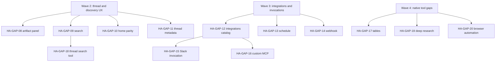

# HyperAgent gap roadmap

**Purpose:** Ordered vertical slices to close meaningful gaps between [HyperAgent](https://hyperagent.com) and Agentis. Each slice is demo-able, scoped for a single GitHub issue, and safe for parallel agent execution.

**Source:** Live product exploration via logged-in Chrome session (2026-06-08), cross-checked against completed specs in `docs/specs/_done/`, and `STRATEGY.md`.

**How to use:** Pick a slice → create a GitHub issue from the template at the bottom → implement in an isolated worktree.

**Strategy guardrail:** Agentis is self-hosted and cost-sensitive. We pursue **bounded deliverables** (artifacts, workspace tools, Composio, evals) rather than full cloud VM/browser parity. Slices marked **Defer** are intentional non-goals unless strategy changes.

---

## Parity snapshot

### Product surfaces

| Surface | HyperAgent (observed) | Agentis today | Gap severity |
| --- | --- | --- | --- |
| New thread home | Agent switcher, Plan/Execute, suggestion chips, AI thread summaries, capability showcase cards with cost/time | API-backed home with agent picker, suggestion chips, rule-based thread summaries, and demo/recent sections (HA-GAP-10); no capability showcase cards with cost/time | Low–Medium |
| Thread session | Model picker, Live mode, reasoning blocks, Working Doc side panel, inline artifact iframes, Plan vs Execute | API-backed streaming; human-readable native tool cards, turn-grouped transcript (`thread-transcript.tsx`), Working artifacts rail with inline document/static preview (HA-GAP-08); no draggable panel or in-thread app iframe | Medium |
| Library | Search, Type/Visibility/Source filters, Save/bookmark, archived toggle, iframe previews | API-backed artifacts + workspaces | Low–Medium |
| Agents | Ideas roster, observability charts, cost by model, evals, version history, invocations (Slack/Telegram/webhook/email), Live mode | API agents with live usage observability, version history, rubric CRUD, and run evaluation scores on Overview when rubrics exist | Medium |
| Command Center | Live roster, cost breakdown, needs-attention queue, pending improvements, recent runs, score trends | API-backed live run metrics, roster, recent runs, avg score, needs-attention queue (HA-GAP-07), and fleet score-trend + cost breakdown charts (HA-GAP-27) | Low–Medium |
| Learning | Skills (19), categorized memories, rubrics, thread-derived suggestions with accept/dismiss | API-backed skills, memories, rubrics, post-run suggestions with accept/dismiss, and accepted-memory context injection | Low–Medium |
| Integrations | NATIVE + MCP catalog, custom MCP server, 20+ apps | Composio-backed; fixture catalog UI | Medium |
| Projects | Sidebar grouping, thread counts, per-project threads | API-backed | Low |
| Search (⌘K) | Global search entry point | `GET /api/search?q=` grouped results; ⌘K command palette from app shell (HA-GAP-09); `/search` browse page | Low–Medium |
| Teams | Shared agents/skills spaces | Not present | Defer (multi-tenant) |

### Native tools (20 active on Sales Prospector agent)

| Category | HyperAgent tool | Agentis status |
| --- | --- | --- |
| **Execution** | Script (ephemeral container) | Partial — `runWorkspaceCommand` with local-process/container sandbox; durable workspace writes (differs from HA ephemeral model) |
| **Execution** | Full VM (persistent cloud machine) | **Defer** — conflicts with self-host ROI positioning |
| **Research** | Search | **Shipped** — V4.1 `searchWeb` |
| **Research** | Exa, Find Similar, Exa Answer, Exa Research, Exa Websets | Missing — provider-specific research suite |
| **Research** | Browser (optional persistent sessions) | Missing — bounded local browser is a candidate equivalent |
| **Research** | Thread Search | Missing |
| **Data** | Documents | **Shipped** — V4.2 persistent markdown artifacts |
| **Data** | Tables (optional global scope) | Missing |
| **Interactive** | Webpages & Slides | **Shipped** — V4.3 static artifacts |
| **Interactive** | Slides (Polished/image mode) | Missing — HTML slides only today |
| **Interactive** | HyperApps | **Shipped** — V4.4 Apps (`type: app`) |
| **Media** | Images, Video, Audio, Transcribe, Avatar, Maps | Missing (PRD non-goal for advanced media pipelines) |

---

## Recommended execution order

Completed foundation: HA-GAP-00a through HA-GAP-10 and HA-GAP-27 are shipped. Agentis now has the model-picker/research golden path, thread tool-result UX, one Composio golden path, honest demo-data labeling, self-host research docs, cost attribution, live Command Center metrics, agent observability, Learning APIs, post-run suggestions, rubric scoring, needs-attention, Command Center charts, the thread Working artifacts rail, global ⌘K search, and enriched new thread home summaries/chips.

Start new work from the first open wave below. Within each wave, slices are parallel-safe unless a dependency is listed.

### Wave 2 — Thread & discovery UX

#### HA-GAP-08: Thread side panel for working documents and artifacts

**Status:** Shipped (2026-06-13). Spec: `docs/specs/2026-06-13-thread-working-artifacts-design.md`.

**HyperAgent reference:** Thread → draggable "Working Doc" + `hyperapps-guide.md` iframes with open/hide/fullscreen.

**Agentis today:** `/threads/:threadId` exposes a Working artifacts rail (`thread-durable-artifacts.tsx`) with thread-scoped artifact list, inline markdown and static webpage/slides preview, workspace links, and a collapsed mobile bar above the transcript.

**Goal:** Thread session right rail lists run-linked artifacts/documents with inline preview.

**Demo:** Agent creates document during run → panel shows live preview without leaving thread.

**Acceptance:**
- [x] Panel lists artifacts for current thread (API).
- [x] Markdown document iframe or preview component.
- [x] Open in full workspace link.
- [x] Mobile: collapsible panel.

**Depends on:** None; transcript tool cards are already shipped.

---

#### HA-GAP-09: Global search (⌘K)

**Status:** Shipped (2026-06-13). PR #438.

**HyperAgent reference:** Sidebar Search ⌘K across threads, library, agents.

**Agentis today:** `GET /api/search?q=` returns grouped thread, artifact, agent, and project hits (`search-service.ts`); ⌘K opens `global-search-dialog.tsx` from the app shell on any route; `/search` provides a browse page with the same API.

**Goal:** Command palette search over threads, artifacts, agents, projects.

**Demo:** ⌘K → type "prospect" → jump to thread and library hits.

**Acceptance:**
- [x] `GET /api/search?q=` returns grouped results.
- [x] Keyboard shortcut opens modal from any authenticated route.
- [x] Result navigation works for each entity type.

**Depends on:** None.

---

#### HA-GAP-10: New thread home parity (lightweight)

**Status:** Shipped (2026-06-13). PR #437.

**HyperAgent reference:** Recent threads with AI summaries; suggestion chips; showcase cards.

**Agentis today:** `/threads/new` loads `GET /api/threads` once, partitions demo (`seed_thread_*`) and recent sections, and shows rule-based one-line summaries via shared `threadListSummaryFromMessages` (`thread-preview.ts`). Suggestion chips (`buildSuggestionChips`) prefill the composer from agent workflow prompts plus static prompts. `loadThreadListContext` batches message/run/document reads for thread list and agent detail summaries.

**Goal:** Enrich home without external dependencies — rule-based summaries from last message + static suggestion chips from agent catalog.

**Demo:** Home shows 3 recent threads with one-line summaries; chips prefill composer.

**Acceptance:**
- [x] Thread cards show summary (stored or computed on run complete).
- [x] 4+ suggestion chips map to composer prefill.
- [x] Optional: link to curated demo threads (self-hosted seed data).

**Depends on:** None.

---

#### HA-GAP-11: Thread metadata — star, status badges, agent chip

**HyperAgent reference:** Star thread; "Waiting for your input" badges; agent emoji on thread rows.

**Agentis today:** Plain thread list.

**Goal:** Starred threads filter; plan-mode waiting state visible in sidebar.

**Demo:** Star a thread → filter sidebar to starred; plan-mode thread shows waiting badge.

**Acceptance:**
- [ ] `starred` boolean on thread; toggle in UI.
- [ ] Sidebar filter or section for starred.
- [ ] Waiting-for-input derived from last run state (plan + pending approval).

**Depends on:** None.

---

### Wave 3 — Integrations & invocations

#### HA-GAP-12: Integrations catalog API wire-up

**HyperAgent reference:** `/settings/integrations` — featured apps, NATIVE vs MCP badges, connected section, custom MCP.

**Agentis today:** Composio backend (M03); fixture catalog UI.

**Goal:** Integrations screen reads live Composio catalog + connection status; honest NATIVE/MCP labeling.

**Demo:** Connect Slack → appears under Connected; disconnect flow works.

**Acceptance:**
- [ ] Featured + search + category from API.
- [ ] Connection status per integration.
- [ ] Remove fixture catalog from default path.
- [ ] "Custom MCP" shown as coming soon OR scoped sub-slice (HA-GAP-16).

**Depends on:** HA-GAP-00c (golden path) recommended first.

---

#### HA-GAP-13: Scheduled agent invocations

**HyperAgent reference:** Agent detail → Schedule → set up cadence.

**Agentis today:** M07 not implemented.

**Goal:** Cron-style schedule creates thread/run from agent template + project context.

**Demo:** Schedule agent every 5 min (test cron) → run appears in activity.

**Acceptance:**
- [ ] Schedule CRUD on agent.
- [ ] Background scheduler (in-process OK for MVP with documented limits).
- [ ] Invocation run linked to agent + schedule id.
- [ ] Disable when agent archived or credentials missing.

**Depends on:** HA-GAP-01 (cost visibility) nice-to-have.

---

#### HA-GAP-14: Webhook agent invocation

**HyperAgent reference:** Agent → Create webhooks.

**Agentis today:** Not implemented.

**Goal:** Signed webhook endpoint triggers agent run with payload template.

**Demo:** `curl` webhook → run created → transcript shows injected context.

**Acceptance:**
- [ ] Webhook secret + URL per agent.
- [ ] HMAC verification.
- [ ] Run history lists webhook-triggered runs.
- [ ] Rate limit + disabled state.

**Depends on:** None (parallel with HA-GAP-13).

---

#### HA-GAP-15: Slack invocation via Composio

**HyperAgent reference:** Add to Slack channel invocation.

**Agentis today:** Composio Slack tools for threads; not agent invocation channel.

**Goal:** Agent responds in Slack channel/thread when @mentioned or on configured trigger.

**Demo:** @agent in connected Slack → run completes → reply posted.

**Acceptance:**
- [ ] Invocation config on agent links Slack channel.
- [ ] Inbound event → run → outbound message via Composio.
- [ ] Documented setup in README fragment.

**Depends on:** HA-GAP-00c, HA-GAP-12.

---

#### HA-GAP-16: Custom MCP server connections

**HyperAgent reference:** Add custom MCP server on integrations page.

**Agentis today:** Composio only.

**Goal:** User registers MCP server URL + auth; tools appear in agent tool picker.

**Demo:** Connect example MCP server → grant to agent → tool call in thread.

**Acceptance:**
- [ ] MCP connection CRUD.
- [ ] Runtime bridge lists MCP tools alongside native + Composio.
- [ ] Permission boundaries documented.

**Depends on:** HA-GAP-12.

---

### Wave 4 — Native tool gaps (bounded equivalents)

Prioritized for **demo value** and **self-host feasibility**. Full VM and cloud browser farms stay deferred.

#### HA-GAP-17: Tables artifact + table tools

**HyperAgent reference:** Tables tool; optional global tables across threads.

**Agentis today:** `table` type in domain model; not implemented.

**Goal:** CRUD structured tables as Library artifacts; agent tools `createTable`, `queryTable`, `updateTable`.

**Demo:** Agent builds comparison table from web search → Library shows table artifact → second run appends rows.

**Acceptance:**
- [ ] SQLite or JSON-backed table storage under artifact primitive.
- [ ] Scope: thread + project (global optional flag).
- [ ] Timeline evidence for table mutations.

**Depends on:** None.

---

#### HA-GAP-18: Thread search native tool

**HyperAgent reference:** Thread Search — search past conversations.

**Agentis today:** Missing.

**Goal:** `searchThreads` tool + API search index over message text.

**Demo:** Ask "what did we decide about markdown?" → agent cites prior thread excerpts.

**Acceptance:**
- [ ] Tool returns ranked snippets with thread links.
- [ ] Scoped to workspace/project per policy.
- [ ] Pagination + bounds on result size.

**Depends on:** HA-GAP-09 (shared index OK).

---

#### HA-GAP-19: Deep research brief (multi-source structured output)

**HyperAgent reference:** Exa Research — 1–3 minute structured research jobs.

**Agentis today:** V4.1 web search + research brief finalizer (golden path in flight).

**Goal:** `runDeepResearch` tool producing structured brief artifact (sections, sources, confidence).

**Demo:** "Research top 5 competitors of X" → Library markdown brief with citations.

**Acceptance:**
- [ ] Provider-neutral boundary (Tavily/Exa/Gateway adapters).
- [ ] Async job with progress in timeline.
- [ ] Output lands as document artifact.

**Depends on:** HA-GAP-00a shipped.

---

#### HA-GAP-20: Bounded browser automation tool

**HyperAgent reference:** Browser tool with optional persistent sessions.

**Agentis today:** Missing. **Defer** full persistent cloud browser.

**Goal:** Self-hosted bounded browser session (local CDP or agent-browser) for read-only fetch, screenshot, form fill with approval gate.

**Demo:** "Screenshot pricing page for X" → image artifact + timeline step.

**Acceptance:**
- [ ] Opt-in tool permission; disabled by default.
- [ ] Session timeout + URL allowlist policy.
- [ ] No claim of HyperAgent-grade persistent cloud browser.

**Depends on:** Sandbox policy review.

---

#### HA-GAP-21: Slides polished (image) render mode

**HyperAgent reference:** Slides → Polished mode — each slide AI-rendered image.

**Agentis today:** HTML slides only (V4.3).

**Goal:** Optional `renderMode: polished` on slides artifact generation.

**Demo:** Same outline → HTML deck vs image deck; user toggles in artifact workspace.

**Acceptance:**
- [ ] Generation path calls image model per slide.
- [ ] Artifact stores image URLs per slide.
- [ ] Viewer supports arrow navigation across images.

**Depends on:** Image provider credentials; may pair with HA-GAP-22.

---

#### HA-GAP-22: Image artifact generation tool

**HyperAgent reference:** Images — Gemini generate/edit.

**Agentis today:** PRD non-goal for advanced media; `image` artifact type exists in model.

**Goal:** Minimal `generateImage` tool → Library `image` artifact.

**Demo:** "Generate hero image for landing page" → image in Library + usable in webpage artifact.

**Acceptance:**
- [ ] Provider adapter (Gateway/OpenAI/Gemini).
- [ ] Stored under `AGENTIS_STORAGE_ROOT`.
- [ ] Cost surfaced via HA-GAP-01.

**Depends on:** HA-GAP-01 recommended.

---

#### HA-GAP-23: Maps / geocoding tool

**HyperAgent reference:** Maps — geocoding, places, directions, map viz.

**Agentis today:** Missing.

**Goal:** `geocode` + `searchPlaces` tools; static map image or webpage embed.

**Demo:** "Map coffee shops near Austin convention center" → table + map webpage artifact.

**Acceptance:**
- [ ] Provider key documented (e.g. Mapbox/Google).
- [ ] Bounded API calls per run.

**Depends on:** HA-GAP-17 optional (places as table).

---

#### HA-GAP-24: Audio transcribe → document pipeline

**HyperAgent reference:** Transcribe with diarization.

**Agentis today:** Missing.

**Goal:** Upload audio to Library → transcribe tool → markdown document artifact.

**Demo:** Upload meeting MP3 → agent transcribes → editable document.

**Acceptance:**
- [ ] File upload accepts audio.
- [ ] Transcription provider adapter.
- [ ] Speaker labels optional.

**Depends on:** None.

---

### Wave 5 — Self-host MVP packaging

#### HA-GAP-25: Docker Compose + setup wizard

**HyperAgent reference:** N/A (managed SaaS).

**Agentis today:** Local dev documented; M10 not complete.

**Goal:** One-command self-host with env validation wizard.

**Demo:** Fresh VM → `docker compose up` → setup screen → first thread run.

**Acceptance:**
- [ ] Compose: api, web, volume for SQLite + storage.
- [ ] Setup validates gateway + optional Composio + search.
- [ ] README MVP path updated.

**Depends on:** HA-GAP-00e docs.

---

#### HA-GAP-26: Seed demo workspace

**HyperAgent reference:** Showcase threads on home with cost/time.

**Agentis today:** Dev fixtures only.

**Goal:** Optional seed command populates demo project, agent, threads, artifacts for reviewers.

**Demo:** `pnpm seed:demo` → Library + Command Center look alive.

**Acceptance:**
- [ ] Idempotent seed script.
- [ ] Clearly labeled demo data.
- [ ] Works with `AGENTIS_MOCK_RUNTIME=1`.

**Depends on:** None.

---

## Explicit deferrals

| HyperAgent capability | Rationale | Agentis stance |
| --- | --- | --- |
| Full VM | Expensive cloud compute; misaligned with self-host ROI | Defer; workspace + sandbox + artifacts instead |
| Persistent cloud browser sessions | Isolation + infra cost | Bounded local browser only (HA-GAP-20) |
| Video, Avatar, multi-speaker TTS | Advanced media pipelines (PRD non-goal) | Defer; revisit after Wave 4 |
| Teams / multi-tenant sharing | Enterprise RBAC scope | Defer past MVP |
| Telegram, email alias invocations | Lower priority vs Slack/webhook | Defer |
| Referral program | GTM, not product core | Out of scope |
| Live mode (always-on agent) | Ops complexity | Defer; document as future |

---

## GitHub issue template

Use this body when creating issues from slices above:

```markdown
## Context
HyperAgent gap slice from `docs/roadmap/hyperagent-gap-roadmap.md` (**HA-GAP-XX**).

## HyperAgent reference
<what you observed in HyperAgent — link or route>

## Goal
One sentence outcome.

## Demo script
1. ...
2. ...
3. ...

## Acceptance criteria
- [ ] ...
- [ ] ...

## Dependencies
- HA-GAP-XX or "none"

## Out of scope
- ...

## References
- `docs/roadmap/hyperagent-gap-roadmap.md`
- <relevant specs/ADRs>
```

**Suggested labels:** `enhancement`, `ready-for-agent`, plus area labels (`command-center`, `learning`, `native-tools`, `integrations`, `self-host`).

**Issue creation example:**

```bash
gh issue create --repo gannonh/agentis \
  --title "Thread side panel for working documents and artifacts" \
  --label "enhancement,ready-for-agent" \
  --body "$(cat <<'EOF'
## Context
HyperAgent gap slice HA-GAP-08 from docs/roadmap/hyperagent-gap-roadmap.md

## HyperAgent reference
Thread session: inline Working Doc and artifact preview panel

## Goal
Show run-linked documents and artifacts in a collapsible thread side panel.

## Demo script
1. Run a thread that creates a document artifact.
2. Stay on the thread session.
3. Verify the side panel lists and previews the artifact with a full workspace link.

## Acceptance criteria
- [ ] Panel lists artifacts for the current thread
- [ ] Markdown documents render inline
- [ ] Full workspace navigation works
- [ ] Mobile uses a collapsible layout

## Dependencies
- None

## Out of scope
- Editing artifacts directly inside the thread panel

## References
- docs/roadmap/hyperagent-gap-roadmap.md
- apps/web/src/routes/thread-detail.tsx
EOF
)"
```

---

## Parallel execution map



**Max parallelism now:** Wave 2 and Wave 3 can run in parallel. HA-GAP-15 and HA-GAP-16 wait on HA-GAP-12; HA-GAP-18 can share search infrastructure with HA-GAP-09.

---

## Next steps

1. Open Wave 2: HA-GAP-11 (thread metadata — star, status badges, agent chip) is the next pick; HA-GAP-08, HA-GAP-09, and HA-GAP-10 shipped in 2026-06-13.
2. Wave 3 can run in parallel: HA-GAP-12 (integrations catalog API wire-up) remains the highest-impact integrations slice.
3. Keep this roadmap aligned as Wave 2 discovery work continues.
