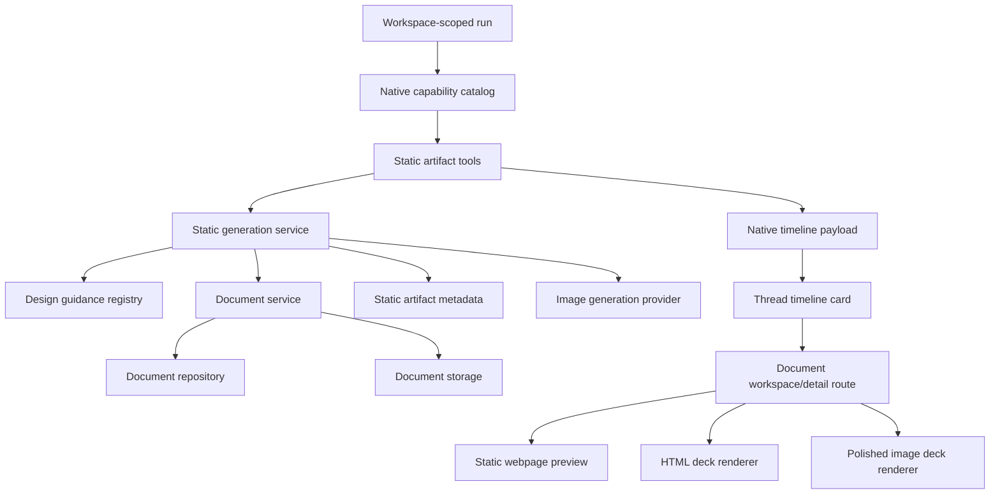

# Agent native tooling V4.x: static webpages and slides

## Status

Approved.

## Goal

Add the next Interactive-category V4 slice by giving Agentis agents a native capability for static generated outputs: scrollable webpages, HTML slide decks, and polished image slide decks.

Hyperagent exposes overlapping Webpages-and-Slides and Slides entries. Agentis should model this as one native capability with format-specific renderers. The user-facing output is a Document with `documentType: "webpage"` or `documentType: "slides"`; the native capability owns generation mode, design guidance, validation, and timeline evidence.

Static generated outputs are frozen at creation time. They may include links, static layout, embedded assets, charts, and slide navigation, but they do not have runtime Agentis tool access. Interactive tools with persistent state and direct tool access belong to the HyperApp runtime spec.

## Source of truth

- Roadmap: `docs/specs/agent-native-tooling.md`, V4 Interactive category.
- Domain language: `CONTEXT.md`, especially Document as the durable Library primitive.
- Persistent document decision: `docs/adr/0003-persistent-documents-library-primitive.md`.
- Native tool permission decision: `docs/adr/0002-version-native-tool-permissions-with-agent-configuration.md`.
- HyperApp adjacent spec: `docs/specs/2026-06-04-agent-native-tooling-v4-hyperapps-design.md`.
- Existing document implementation:
  - `packages/shared/src/document-schemas.ts`
  - `apps/api/src/documents/document-service.ts`
  - `apps/api/src/documents/local-document-storage.ts`
  - `apps/api/src/repositories/document-repository.ts`
  - `apps/api/src/routes/documents.ts`
- Existing native runtime plumbing:
  - `apps/api/src/runtime/run-executor.ts`
  - `apps/api/src/native-tools/native-tool-capability-catalog.ts`
  - `apps/api/src/native-tools/native-tool-payload.ts`
  - `apps/web/src/components/thread/run-timeline.tsx`

## Current state

Agentis already has a Document primitive with versioning, visibility scope, provenance, local storage, Library filters, detail routes, downloads, and runtime document tools. The shared document type enum already includes `webpage` and `slides`, and seeded data includes examples of each type.

Agentis does not yet have:

- Native runtime tools for generating webpages or slide decks.
- A design guidance layer for webpage and deck generation.
- Static HTML validation and preview rendering for webpage Documents.
- Deck preview rendering for HTML slides.
- Polished image slide generation or slide asset metadata.
- Timeline cards specialized for generated webpages and slides.

## Naming decision

Use **Document** for durable storage and Library surfaces. Use **static generated output** or **static artifact** only when describing the generation capability category and runtime tool behavior. Do not introduce a second top-level durable primitive that competes with Document.

## Product scope

### Included

- Native tool permission id: `staticArtifacts`.
- Runtime tools:
  - `createStaticArtifact`
  - `editStaticArtifact`
  - `findStaticArtifacts`
- Artifact types:
  - `webpage`
  - `slides`
- Render modes:
  - `html` for webpages and slides.
  - `polishedImage` for slides only.
- Agentis-owned theme presets and bespoke style brief metadata.
- Versioned Document persistence for generated webpage and slides outputs.
- Static-artifact metadata persisted with the Document or a companion table keyed by `documentId`.
- Webpage preview route support for static HTML.
- Slide deck preview route support for HTML slides and polished image slides.
- Timeline cards with bounded metadata and stable relative links.
- Explicit provider availability handling for polished image slides.
- Tests for schemas, mode validation, tools, permission denial, preview rendering, and provider unavailable states.

### Out of scope

- HyperApps, runtime state, and direct runtime tool access.
- Live data refresh after artifact creation.
- Public sharing or anonymous access.
- Visual editor UI.
- Broad media editing.
- Collaborative editing.
- Export to PowerPoint, Keynote, or PDF.
- Full image generation product surface beyond polished slide assets.
- Arbitrary external network calls from generated HTML.

## Acceptance criteria

1. Agents can create a static generated output through a native runtime tool with `artifactType: "webpage" | "slides"` and `renderMode: "html" | "polishedImage"`; `polishedImage` is valid only when `artifactType` is `"slides"`.
2. Generated outputs are persisted as versioned Documents, or as Document-backed records, with provenance, visibility scope, current version, metadata, and stable relative `viewPath` values.
3. Webpages render as scrollable static HTML Documents with no runtime Agentis tool access.
4. HTML slide decks render as navigable full-screen decks with keyboard navigation, slide counter, and stable preview/detail route.
5. Polished slide decks persist one generated visual per slide, render as a navigable deck, and expose provider, cost, or unavailable errors clearly.
6. The tool contract includes templating and design guidance: curated theme presets, format-specific constraints, and optional bespoke style briefs.
7. Agents can edit an existing generated output by creating a new version while preserving prior version metadata.
8. Timeline cards show artifact type, render mode, title, version, theme or design brief summary, and stable link without persisting full HTML or images in run-step payloads.
9. Permission/provider failures, invalid render-mode combinations, unsafe HTML, oversized bundles, storage failures, and image-generation failures fail visibly.
10. Out-of-scope capabilities are not implemented in this slice unless the user explicitly expands the approved spec.

## Architecture

Static generated outputs should use one native capability with format-specific renderers.



Server responsibilities:

- Resolve `staticArtifacts` permission from the agent configuration.
- Build generation tools only when permitted.
- Validate artifact type and render mode combinations.
- Apply design guidance to generation prompts.
- Generate or accept generated static bundles from the model/tool pipeline.
- Sanitize and bound HTML/CSS/JS before persistence.
- Orchestrate polished image generation per slide when requested.
- Persist generated output as a Document version.
- Persist static-artifact metadata with the Document or in a companion table keyed by `documentId`.
- Normalize timeline payloads without embedding full HTML or image data.

Web responsibilities:

- Render specialized timeline cards for generated webpages and slides.
- Reuse the Document workspace/detail route where possible.
- Add static webpage preview for `documentType: "webpage"`.
- Add deck preview for `documentType: "slides"` with `renderMode: "html"`.
- Add image-backed deck preview for `documentType: "slides"` with `renderMode: "polishedImage"`.
- Show provider unavailable, invalid bundle, and missing asset states.

Shared schema responsibilities:

- Define tool inputs and outputs.
- Define metadata schema for artifact type, render mode, theme, design brief summary, slide count, asset references, provider, and validation result.
- Keep the generated output contract independent from any specific model or image provider.

## Tool contract

### `createStaticArtifact`

Input:

```ts
type CreateStaticArtifactInput = {
  title: string
  description?: string
  artifactType: "webpage" | "slides"
  renderMode: "html" | "polishedImage"
  contentBrief: string
  audience?: string
  purpose?: string
  theme?: StaticArtifactTheme
  bespokeStyleBrief?: string
  sourceData?: string
  visibilityScope?: "thread" | "project" | "global"
}
```

Output:

```ts
type CreateStaticArtifactOutput = {
  documentId: string
  title: string
  artifactType: "webpage" | "slides"
  renderMode: "html" | "polishedImage"
  version: number
  viewPath: string
  downloadPath?: string
  theme: string
  slideCount?: number
  provider?: string
  summary: string
}
```

### `editStaticArtifact`

Input:

```ts
type EditStaticArtifactInput = {
  documentId: string
  contentBrief: string
  changeSummary: string
  theme?: StaticArtifactTheme
  bespokeStyleBrief?: string
}
```

Output:

```ts
type EditStaticArtifactOutput = {
  documentId: string
  title: string
  artifactType: "webpage" | "slides"
  renderMode: "html" | "polishedImage"
  version: number
  previousVersion: number
  viewPath: string
  summary: string
}
```

`editStaticArtifact` creates a new Document version. It must reject non-static-artifact Documents and preserve prior versions.

### `findStaticArtifacts`

Input:

```ts
type FindStaticArtifactsInput = {
  query?: string
  artifactType?: "webpage" | "slides"
  renderMode?: "html" | "polishedImage"
  visibilityScope?: "thread" | "project" | "global"
  limit?: number
}
```

Output:

```ts
type FindStaticArtifactsOutput = {
  items: Array<{
    documentId: string
    title: string
    artifactType: "webpage" | "slides"
    renderMode: "html" | "polishedImage"
    version: number
    viewPath: string
    theme?: string
    updatedAt: string
  }>
  resultCount: number
  truncated: boolean
}
```

This tool supports follow-up edits and prevents agents from guessing document ids.

## Templating and design guidance

The first slice should include an Agentis-owned design guidance registry. It should shape generated outputs without requiring a separate hand-built template for every request.

### Webpage themes

- `editorial`: essays and narrative reports.
- `data`: analytics reports and data-heavy writeups.
- `developer`: technical docs and implementation guides.
- `design`: portfolios, case studies, and visual explainers.
- `academic`: research summaries and formal references.
- `warm`: lifestyle, recipes, and people-centered narratives.
- `midnight`: dark-mode reports and high-contrast technical pieces.
- `terminal`: retro technical and command-line inspired pages.
- `landing`: marketing pages and product announcements.
- `playful`: educational, exploratory, and approachable pages.

### Slide themes

- `keynote`: product reveals and launches.
- `pitch`: investor and sales narratives.
- `ted`: thought leadership and one-big-idea presentations.
- `corporate`: board reviews and operating updates.
- `workshop`: training and facilitated sessions.
- `cinematic`: theatrical launches and visual reveals.
- `neon`: developer and technical demos.
- `gallery`: image-forward showcases.
- `infographic`: data storytelling and comparisons.
- `playful`: approachable teaching and lightweight storytelling.

### Shared theme selectors

- `auto`: Agentis selects the most suitable preset from content and purpose.
- `surprise`: Agentis may choose a more expressive preset while staying within safety constraints.
- `bespoke`: Agentis follows a user-provided `bespokeStyleBrief` and records a summary of that brief.

### Format guidance

Webpages:

- Optimize for reading and scanning from top to bottom.
- Use semantic sections, responsive width, accessible hierarchy, and clear navigation where useful.
- Support optional hero imagery and section imagery when explicitly requested or helpful.
- Use static charts only when data is provided or generated from source material.

HTML slides:

- Optimize for one idea per screen.
- Include keyboard navigation, slide counter, and responsive full-screen layout.
- Use live text and static charts when precision matters.
- Keep word-level editability by storing HTML/CSS/JS as the version content.

Polished image slides:

- Optimize for cinematic or highly visual decks.
- Limit text density because slide text is rendered into images.
- Do not use for dense data, live charts, or content that needs word-level edits.
- Persist one image asset per slide plus slide ordering and metadata.

Generation prompts should include artifact type, render mode, audience, purpose, theme, bespoke style brief summary, source data, accessibility constraints, and safety constraints. Persisted metadata should record the selected theme and a bounded design brief summary for timeline and review surfaces.

## Generation modes

### Webpage HTML

- Produces a scrollable static HTML document.
- May include bounded CSS and optional bounded JS for static visual effects, table-of-contents behavior, or chart initialization.
- Must not call Agentis APIs at runtime.
- Must not include arbitrary external scripts or styles.

### Slides HTML

- Produces a static HTML deck.
- Includes navigation JS owned by Agentis or generated from an approved deck shell.
- Supports keyboard navigation, dot indicators if useful, slide counter, and full-screen-friendly layout.
- Supports static charts and embedded images.

### Slides polished image

- Starts from a structured slide outline.
- Generates one image per slide through an image generation provider.
- Persists image assets and slide metadata.
- Renders images in the same deck navigation shell.
- Requires explicit provider availability. Missing credentials or disabled provider blocks this mode before generation.

## Data model and persistence

Reuse Document as the durable primitive:

- `documentType`: `webpage` or `slides`.
- `contentFormat`: `text` for HTML outputs, `binary` or metadata-backed text for polished slide manifests depending on current Document constraints.
- `visibilityScope`: `thread | project | global`.
- Document versions preserve prior generated outputs and edit history.
- `viewPath` should resolve to the Document workspace/detail route or a route nested under it.
- `downloadPath` should return the persisted HTML or a manifest package when supported.

Static-artifact metadata should include:

- `artifactType`
- `renderMode`
- `theme`
- `bespokeStyleBriefSummary`
- `generationPath`: `modelHtml | modelDeckHtml | polishedImageSlides`
- `slideCount`
- `assetReferences`
- `provider`
- `providerModel`
- `safetyValidationResult`
- `generationWarnings`

If Document metadata and version records cannot cleanly represent polished slide images, add a companion table keyed by `documentId`:

- `static_artifacts`
- `static_artifact_versions`
- `static_artifact_assets`

The companion table should not become a competing durable primitive. Document remains the item users see in Library and project context.

## Safety and validation

HTML validation must reject or strip unsafe content before persistence:

- External script tags.
- External stylesheets outside an approved allowlist.
- Inline event handler attributes.
- Runtime calls to Agentis APIs.
- Arbitrary `fetch`, `XMLHttpRequest`, WebSocket, or EventSource usage.
- Direct access to browser storage unless explicitly approved for static preview shell behavior.
- Oversized HTML, CSS, JS, or asset bundles.
- Invalid render-mode combinations.

Approved library usage should be narrow and explicit. Webpages and HTML slides may use static charts or animations through generated inline code or an approved CDN allowlist. Build must document any allowlisted libraries in code or config and test rejection of unapproved network dependencies.

Polished image generation must handle:

- Provider unavailable.
- Provider timeout.
- Safety rejection.
- Partial slide failure.
- Asset storage failure.

Partial polished slide failures should mark the tool call failed unless Build explicitly implements resumable retry metadata in the same slice.

## Error handling

Use visible, specific error codes:

- `static_artifact_permission_denied`
- `static_artifact_invalid_type`
- `static_artifact_invalid_render_mode`
- `static_artifact_not_found`
- `static_artifact_invalid_html`
- `static_artifact_bundle_too_large`
- `static_artifact_storage_failed`
- `static_artifact_provider_unavailable`
- `static_artifact_image_generation_failed`
- `static_artifact_asset_missing`

Timeline rendering should show the attempted action, title or document id when safe, artifact type, render mode, error code, and concise remediation.

## UI behavior

Thread timeline cards should show:

- Title.
- Action: created, edited, found, or failed.
- Artifact type.
- Render mode.
- Version.
- Theme or bespoke brief summary.
- Slide count when relevant.
- Stable relative link.
- Error code and remediation when failed.

Document workspace/detail route should support:

- Static webpage preview.
- HTML slide deck preview.
- Polished image deck preview.
- Version metadata.
- Download when available.
- Source/provenance display.
- Invalid or unsafe content state.
- Provider unavailable state for polished mode.

Library filtering should continue to work through existing `documentType` values.

## Implementation phases

### Phase 1: Schemas, permission, design guidance, and metadata

Likely files:

- `packages/shared/src/native-tools.ts`
- `packages/shared/src/document-schemas.ts`
- `packages/shared/src/schemas.ts`
- New `packages/shared/src/static-artifact-schemas.ts`
- `apps/api/src/native-tools/native-tool-capability-catalog.ts`
- New `apps/api/src/static-artifacts/design-guidance.ts`
- Document metadata helpers or companion repository files if needed.

Build tasks:

- Add `staticArtifacts` native permission.
- Add tool input/output schemas.
- Add metadata schemas for generated webpages and slides.
- Add theme preset registry and format guidance.
- Add mode validation rules.

Acceptance tie-ins: 1, 2, 6, 9.

### Phase 2: Generation service and runtime tools

Likely files:

- New `apps/api/src/static-artifacts/static-artifact-service.ts`
- New `apps/api/src/static-artifacts/static-artifact-tool.ts`
- New `apps/api/src/static-artifacts/static-html-validator.ts`
- Optional image provider boundary under `apps/api/src/static-artifacts/` or `apps/api/src/media/`.
- `apps/api/src/runtime/run-executor.ts`
- `apps/api/src/native-tools/native-tool-payload.ts`

Build tasks:

- Implement `createStaticArtifact`, `editStaticArtifact`, and `findStaticArtifacts`.
- Persist generated outputs through Document service/versioning.
- Add static HTML validation and bundle bounds.
- Add polished image provider availability checks.
- Normalize bounded timeline payloads.

Acceptance tie-ins: 1, 2, 5, 7, 8, 9.

### Phase 3: Preview rendering and timeline UI

Likely files:

- `apps/web/src/components/thread/run-timeline.tsx`
- Document workspace route and components under `apps/web/src/components/documents/`.
- New components under `apps/web/src/components/static-artifacts/` if separation helps.
- Web API clients under `apps/web/src/lib/` if needed.

Build tasks:

- Add static artifact timeline cards.
- Add scrollable webpage preview.
- Add HTML deck renderer.
- Add polished image deck renderer.
- Add failure and unavailable states.
- Keep Library document filtering intact.

Acceptance tie-ins: 3, 4, 5, 8, 9.

### Phase 4: Verification coverage and UAT

Likely files:

- Shared schema tests.
- API service/tool/route tests.
- Web component and route tests.
- E2E or manual UAT notes.

Build tasks:

- Add tests for mode validation and metadata.
- Add tests for create/edit/find and permission denial.
- Add tests for unsafe HTML and oversized bundle rejection.
- Add preview tests for webpage, HTML deck, polished image deck, and provider unavailable state.
- Run quality commands.

Acceptance tie-ins: all.

## Testing and verification

Required automated checks:

- Shared schema tests for tool inputs, outputs, metadata, theme presets, and mode validation.
- Service tests for Document-backed persistence, edit versioning, invalid modes, unsafe HTML, oversized bundles, and polished provider unavailable state.
- Native capability catalog tests for permission-enabled and permission-denied behavior.
- Tool tests for create, edit, find, timeline payload summaries, and error payloads.
- Route/component tests for webpage preview, HTML deck preview, polished image deck preview, missing assets, and provider unavailable states.

Required commands:

```bash
pnpm typecheck
pnpm build
pnpm lint
```

Recommended targeted tests during Build:

```bash
pnpm --filter @workspace/api test -- static-artifact
pnpm --filter @workspace/web test -- static-artifact
```

Manual UAT:

1. Start the app with mock runtime enabled when live credentials are unavailable.
2. Create or seed an agent with the `staticArtifacts` native tool permission.
3. Ask the agent to create a themed webpage and confirm it appears as a webpage Document with a timeline card and preview route.
4. Ask the agent to create an HTML slide deck and confirm keyboard navigation, slide counter, version metadata, and preview route.
5. Ask the agent to create a polished image slide deck without live image credentials and confirm a provider-unavailable failure is visible.
6. If live image credentials are available, create a small polished slide deck and confirm one persisted visual per slide plus deck navigation.
7. Ask the agent to edit one generated output and confirm a new version appears while previous version metadata remains available.
8. Run the same request with an agent lacking `staticArtifacts` permission and confirm a visible denied or unavailable path.

## Risks and mitigations

- The word artifact conflicts with Agentis Document language. Mitigate by keeping Document as the durable primitive and using static artifact only for capability/tool naming.
- HTML generation can introduce unsafe runtime behavior. Mitigate with strict validation, bounds, CSP where available, and no Agentis runtime bridge.
- Polished image mode depends on provider availability and cost. Mitigate with explicit availability checks, mock provider tests, and visible provider errors.
- Slide decks and webpages can diverge into duplicated implementations. Mitigate with shared tool contracts, metadata, timeline cards, and preview shell boundaries.
- Design guidance can become untestable if fully freeform. Mitigate with preset registries plus bounded bespoke style brief summaries.

## Explicitly deferred work

- HyperApps and any runtime tool bridge.
- Public sharing.
- PowerPoint, Keynote, or PDF export.
- Visual editor UI.
- Live charts or live data refresh.
- Broad media generation beyond polished slide images.
- Reusable user-created templates.
- Static artifact marketplace or gallery.
- Rollback to prior versions.

## Build handoff

Approved direction: unified static generated output runtime backed by Documents.

Build should implement the smallest end-to-end slice that satisfies the acceptance criteria:

1. Add `staticArtifacts` native permission and tool schemas.
2. Add theme preset/design guidance registry.
3. Add static generation service and HTML validation.
4. Persist webpage and slides outputs as versioned Documents with static-artifact metadata.
5. Add polished image slide provider availability handling and mock/provider-unavailable test path.
6. Add create, edit, and find runtime tools.
7. Add timeline cards and preview rendering for webpage, HTML slides, and polished image slides.
8. Add tests and run required quality commands.

Do not implement deferred Hyperagent parity capabilities during this Build unless the user explicitly changes the approved scope.
