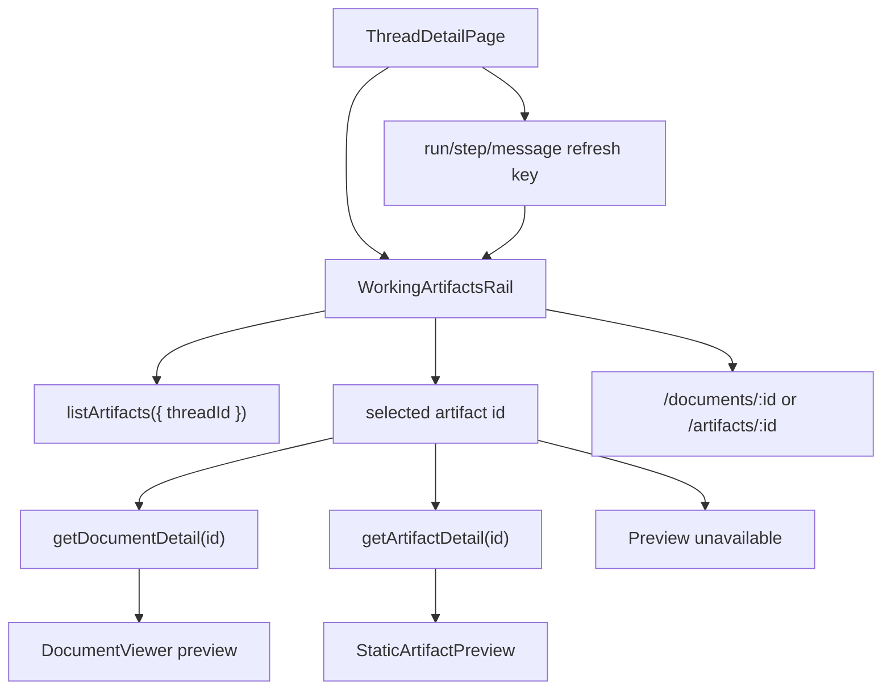

# Thread working artifacts side panel

## Status

IMPLEMENTED (2026-06-13)

## Goal

Implement HA-GAP-08 from `docs/specs/index.md`: the thread session should show run-linked documents and artifacts in an inline right rail so users can preview working outputs without leaving the thread.

The first slice is frontend-first. It reuses existing artifact and document APIs unless Build discovers a concrete batching or freshness gap.

**Shipped:** `WorkingArtifactsRailProvider`, `WorkingArtifactsRailSidebar`, and `WorkingArtifactsRailMobile` in `thread-durable-artifacts.tsx`; integrated in `thread-detail.tsx` with desktop right rail and collapsed mobile bar above the transcript.

## Source of truth

- Roadmap: [specs/index.md](index.md), HA-GAP-08.
- Thread route: `apps/web/src/routes/thread-detail.tsx`.
- Transcript: `apps/web/src/components/thread/thread-transcript.tsx`.
- Working artifacts rail: `apps/web/src/components/thread/thread-durable-artifacts.tsx`.
- Thread route tests: `apps/web/src/routes/thread-detail.test.tsx`.
- Artifact rail tests: `apps/web/src/components/thread/thread-durable-artifacts.test.tsx`.
- API client helpers: `apps/web/src/lib/api/projects-client.ts`.
- Markdown preview: `apps/web/src/components/documents/document-viewer.tsx`.
- Static artifact preview: `apps/web/src/components/static-artifacts/static-artifact-preview.tsx`.
- Artifact API route: `apps/api/src/routes/artifacts.ts`.
- Document API route: `apps/api/src/routes/documents.ts`.

## Verified current state

- `/threads/:threadId` renders a desktop right rail with project context, run timeline, and `WorkingArtifactsRailSidebar`; mobile uses `WorkingArtifactsRailMobile` above the transcript.
- `WorkingArtifactsRailProvider` loads `listArtifacts({ threadId })`, sorts newest first, preserves selection across refreshes, and loads preview detail for the selected artifact.
- `ThreadTranscript` groups user/assistant turns and hides completed messages with no visible content.
- `GET /api/artifacts?threadId=<threadId>` is wired through `listArtifactsQuerySchema` and `ArtifactRepository.list`.
- `getDocumentDetail(documentId)` and `getArtifactDetail(artifactId)` back inline preview via `DocumentViewer` and `StaticArtifactPreview`.
- Apps, tables, images, videos, and other unsupported types show preview-unavailable copy with workspace links when available.

## Constraints

- Keep scope tied to current-thread artifacts, using the artifact `threadId` filter.
- Do not add direct editing inside the thread panel in this slice.
- Do not change artifact/document storage models.
- Do not add a new backend endpoint unless the existing endpoints cannot support acceptance criteria.
- Reuse existing preview components where possible.
- Preserve full workspace routes for deeper work:
  - `/documents/:documentId`
  - `/artifacts/:artifactId`

## Out of scope

- Editing artifacts from the thread panel.
- Drag-resizing the panel.
- Fullscreen-in-thread preview mode.
- Public share links.
- New artifact types beyond rendering existing supported types.
- A combined thread artifact preview API.

## Acceptance criteria

1. On `/threads/:threadId`, the right rail lists artifacts returned by `GET /api/artifacts?threadId=<threadId>` sorted newest first.
2. Selecting a markdown document loads `GET /api/documents/:documentId/detail` and renders an inline preview in the thread rail.
3. Selecting a webpage or slides artifact loads `GET /api/artifacts/:artifactId/detail` and renders the existing static artifact preview inline.
4. Each listed artifact has a full workspace link to `/documents/:id` for documents or `/artifacts/:id` for webpages, slides, and apps.
5. The panel refreshes after run, step, or message changes so a newly created document appears without leaving the thread.
6. On mobile-width layouts, the artifact panel is collapsed by default and can be opened and closed without hiding the transcript permanently.
7. Unsupported artifact types show list metadata and workspace links when available, with a clear preview unavailable state.
8. Tests cover thread artifact listing, document preview, static artifact preview loading, full workspace links, empty and error states, and mobile collapse behavior.

## Recommended approach

Replace the current compact durable-artifact list with a selectable Working artifacts rail.

The rail should:

- Load current-thread artifacts with `listArtifacts({ threadId })`.
- Sort newest first.
- Auto-select the newest previewable artifact when artifacts first load or when the selected artifact disappears.
- Preserve the user's selected artifact across refreshes when it still exists.
- Load preview detail only for the selected item.
- Render markdown documents with `DocumentViewer`.
- Render webpages and slides with `StaticArtifactPreview`.
- Show a preview unavailable state for apps, tables, images, videos, and other unsupported types.
- Keep workspace navigation visible for every artifact with a supported route.
- Collapse behind a mobile control below the thread header or above the transcript.

## Architecture



### Component boundaries

`ThreadDetailPage`

- Owns page layout and passes `threadId` plus the existing refresh key.
- Owns mobile placement for the rail if layout changes require route-level markup.

`WorkingArtifactsRail`

- Replaces or evolves `ThreadDurableArtifacts`.
- Owns artifact list fetch state, selection state, preview fetch state, mobile collapsed state, and rendering.
- Exposes no backend-specific details to the route beyond `threadId` and `refreshKey`.

`WorkingArtifactPreview`

- A small internal component or extracted child that receives the selected artifact and loads the correct detail endpoint.
- Keeps document and static artifact preview logic isolated from list rendering.

### Data loading

List loading:

```text
GET /api/artifacts?threadId=<threadId>
```

Preview loading:

```text
GET /api/documents/:documentId/detail
GET /api/artifacts/:artifactId/detail
```

Refresh behavior:

- Keep the current `refreshKey` pattern from `ThreadDetailPage`.
- Trigger list reload when latest run id/status, step count, or message count changes.
- After reload, keep the current selection if the artifact still exists.
- If no selected artifact exists, select the newest previewable artifact, then the newest artifact.

### Supported preview matrix

| Artifact type                      | Inline preview          | Detail endpoint             | Workspace link                                  |
| ---------------------------------- | ----------------------- | --------------------------- | ----------------------------------------------- |
| `document` with markdown           | `DocumentViewer`        | `/api/documents/:id/detail` | `/documents/:id`                                |
| `webpage`                          | `StaticArtifactPreview` | `/api/artifacts/:id/detail` | `/artifacts/:id`                                |
| `slides`                           | `StaticArtifactPreview` | `/api/artifacts/:id/detail` | `/artifacts/:id`                                |
| `app`                              | Preview unavailable     | none for this rail          | `/artifacts/:id`                                |
| `table`, `image`, `video`, `other` | Preview unavailable     | none for this rail          | link only when `artifactLaunchPath` supports it |

## UX behavior

Desktop:

- Keep the thread transcript as the primary working surface.
- Use the existing right rail location.
- Label the panel `Working artifacts`.
- Show count, loading, empty, and error states.
- Render a compact artifact list with title, type/format/version, updated time, and workspace action.
- Highlight selected artifact.
- Render preview below the list or in a rail section that does not obscure the list.

Mobile:

- Collapse the panel by default.
- Show a compact control labeled `Working artifacts` with the artifact count.
- Opening the panel should reveal the list and preview in a scrollable area.
- Closing the panel returns focus to the thread surface.

## Error handling

- List failure: show an inline rail error and leave the rest of the thread usable.
- Empty list: show `No working artifacts yet.` or equivalent.
- Detail failure: keep the selected item visible and show a preview error.
- Unsupported type: show preview unavailable with the workspace action when available.
- Truncated document or artifact detail: rely on existing detail response state and preview components. If a component needs extra copy for truncation, keep it scoped to the preview area.

## Implementation phases

1. Rename or evolve the existing rail.
   - Likely files:
     - `apps/web/src/components/thread/thread-durable-artifacts.tsx`
     - `apps/web/src/components/thread/thread-durable-artifacts.test.tsx`
   - Preserve existing API calls and workspace link behavior.

2. Add selection and preview loading.
   - Add document detail loading through `getDocumentDetail`.
   - Add static artifact detail loading through `getArtifactDetail`.
   - Reuse `DocumentViewer` and `StaticArtifactPreview`.
   - Add unsupported preview state.

3. Integrate responsive layout.
   - Likely file: `apps/web/src/routes/thread-detail.tsx`.
   - Keep desktop right rail.
   - Add mobile collapsed behavior without removing access to transcript.

4. Expand tests.
   - Update component tests for list, selection, preview loading, errors, unsupported types, and links.
   - Update route tests only for layout/mobile integration if component tests cannot cover it cleanly.

## Verification

Required commands:

```bash
pnpm typecheck
pnpm build
pnpm lint
pnpm test:coverage
```

Focused tests to run during Build:

```bash
pnpm vitest run apps/web/src/components/thread/thread-durable-artifacts.test.tsx
pnpm vitest run apps/web/src/components/thread/thread-transcript.test.tsx
pnpm vitest run apps/web/src/routes/thread-detail.test.tsx
```

Manual UAT:

1. Start the app with `pnpm dev`.
2. Open a thread that creates a markdown document artifact.
3. Stay on `/threads/:threadId`.
4. Confirm the Working artifacts panel lists the document.
5. Confirm the panel renders the document preview inline.
6. Confirm `Open document` navigates to `/documents/:id`.
7. Confirm a webpage or slides artifact renders inline when selected.
8. Confirm mobile viewport starts collapsed and can open/close the panel.

## Risks and mitigations

- Static artifact previews may be too tall for the rail.
  - Mitigation: constrain preview height inside the rail with internal scrolling.
- Detail requests may race during rapid selection changes.
  - Mitigation: use a request id or cancellation guard before committing preview state.
- Auto-selection may override a user's selection after refresh.
  - Mitigation: preserve selection when the selected artifact remains in the refreshed list.
- Existing `StaticArtifactPreview` copy may be workspace-sized.
  - Mitigation: add optional compact styling only if needed, without changing artifact detail behavior.

## Build handoff

Approved scope:

- Frontend-first Working artifacts rail for current-thread artifacts.
- Inline markdown document preview.
- Inline static webpage/slides preview.
- Workspace navigation links.
- Mobile collapsible panel.
- Focused tests and standard quality commands.

Non-goals:

- Editing inside the thread panel.
- New backend endpoint.
- Draggable/fullscreen panel.
- New artifact storage or schema changes.

Build should start with the existing `ThreadDurableArtifacts` component and keep changes surgical. If the existing endpoint shape blocks any acceptance criterion, stop and record the exact blocker before adding backend scope.