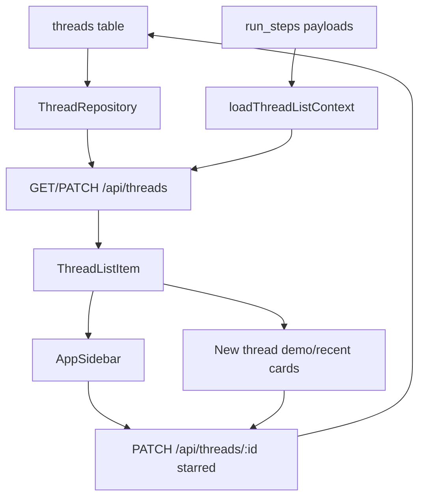

# Thread metadata — star, status badges, agent chip

## Status

Shipped (2026-06-14). Implements HA-GAP-11.

**Shipped:** Persisted `starred` on threads (migration `0033_thread_starred.sql`); `GET /api/threads` returns `starred` and derived `hasPendingApproval`; `PATCH /api/threads/:id` accepts `starred`. Sidebar `Starred` section via `thread-sidebar-section.tsx`; shared display helpers in `thread-list-display.ts` and `thread-list-metadata.tsx`; optimistic star toggles via `use-thread-star-toggle.ts`; pending approval heuristic in `packages/shared/src/thread-pending-approval.ts`.

## Goal

Implement HA-GAP-11 from [specs/index.md](index.md): make thread lists more informative and actionable by adding persisted starred threads, derived waiting-for-input badges, and owning-agent metadata in the sidebar and new-thread home cards.

This slice should make important threads easy to return to without introducing a larger thread organization system.

## Source of truth

- Roadmap: [specs/index.md](index.md), HA-GAP-11.
- Sidebar shell: `apps/web/src/components/shell/app-sidebar.tsx`.
- Sidebar thread sections: `apps/web/src/components/shell/thread-sidebar-section.tsx`.
- Star toggle hook: `apps/web/src/hooks/use-thread-star-toggle.ts`.
- Shared list display: `apps/web/src/lib/thread-list-display.ts`.
- Shared metadata row: `apps/web/src/components/thread/thread-list-metadata.tsx`.
- Star button: `apps/web/src/components/thread/thread-list-star-button.tsx`.
- New-thread home: `apps/web/src/routes/new-thread.tsx`.
- Recent/demo cards: `apps/web/src/components/new-thread/recent-threads-section.tsx`, `demo-threads-section.tsx`.
- Demo/recent partitioning: `apps/web/src/components/new-thread/demo-thread-utils.ts`.
- Thread list API: `apps/api/src/routes/threads.ts`.
- Thread list context: `apps/api/src/lib/thread-list-context.ts`.
- Pending approval heuristic: `packages/shared/src/thread-pending-approval.ts`.
- Shared thread schemas: `packages/shared/src/schemas.ts`.
- Thread persistence: `apps/api/src/repositories/thread-repository.ts`, `apps/api/src/db/schema.ts`, `apps/api/drizzle/0033_thread_starred.sql`.

## Delivered state

- `GET /api/threads` lists threads ordered by `updatedAt`, enriches each row with `loadThreadListContext`, and returns `starred` plus derived `hasPendingApproval`.
- `PATCH /api/threads/:id` accepts `starred` alongside existing `projectId` patch behavior.
- `ThreadListItem` includes persisted `starred`, derived `hasPendingApproval`, and existing list fields (`status`, `mode`, `agentId`, `agentNameSnapshot`, `lastRunStatus`, `summary`, `messageCount`, `documentCount`).
- `AppSidebar` renders a `Starred` section above `Threads` when starred threads exist; both sections use `thread-sidebar-section.tsx`.
- `/threads/new` demo and recent cards reuse `ThreadListMetadata`, `ThreadListStarButton`, and `useThreadStarToggle` for consistent metadata and star toggles.
- `hasPendingApproval` derives from latest-run steps via `runStepsHavePendingApproval` (`approval.status === "pending"` with a `toolCallId`).
- Agent display falls back to `Agentis` for the built-in generic agent via `threadAgentDisplayName`.

## Constraints

- Keep `docs/specs/index.md` as the primary roadmap and keep this spec linked from the HA-GAP-11 section.
- Store user-controlled star state on the thread record so it persists across reloads.
- Derive waiting-for-input state from existing run step approval metadata rather than adding a separate status column.
- Preserve current thread ordering, project thread counts, demo/recent home partitioning, and route navigation.
- Keep this slice scoped to metadata and list/card UI. Do not redesign thread navigation or add full thread labels/folders.
- Use the project glossary terms: thread, agent configuration, Artifact, Document, native tool.

## Out of scope

- Thread folders, labels, archive flows, or bulk actions.
- Global search ranking changes.
- New notification infrastructure.
- Editable agent icons or emoji selection.
- A full status model beyond the approved `Waiting` badge for pending approvals.
- Changing plan-mode approval behavior inside `/threads/:threadId`.

## Acceptance criteria

1. `ThreadListItem` includes persisted `starred` and derived `hasPendingApproval` metadata from `GET /api/threads`.
2. Users can toggle `starred` for any thread from the sidebar without leaving the current route.
3. Starred threads appear in a distinct sidebar section above the full thread list, ordered by recent update.
4. `/threads/new` recent/demo cards show a visible star state and allow toggling it.
5. Plan-mode threads with pending workspace edit or command approval show a `Waiting` badge in sidebar and thread cards.
6. Thread rows/cards show the owning agent chip/name when `agentNameSnapshot` is present, with generic Agentis copy for the built-in agent.
7. Star toggles persist after reload and are covered by API and UI tests.
8. Existing thread list behavior remains intact: recent ordering, demo/recent partitioning, project counts, and thread navigation still work.

## Architecture



### Persisted metadata

Add `starred` to the thread model with a default value of `false`:

- database column on `threads`, stored as boolean/integer in SQLite;
- Drizzle schema and migration;
- mapper support in `mapThread`;
- shared `threadSchema` and `threadListItemSchema`;
- repository create/list/touch paths.

Extend `updateThreadRequestSchema` so `PATCH /api/threads/:id` accepts `starred`. Keep existing `projectId` patch behavior unchanged.

### Derived metadata

Add `hasPendingApproval` to `ThreadListContext` and `ThreadListItem`.

The derivation should use batched repository reads for the listed thread ids:

- load latest runs for each thread, as today;
- inspect run steps for those latest run ids;
- return `true` when any step payload includes `approval.status === "pending"`;
- return `false` otherwise.

If implementation discovers pending approvals can exist on non-latest runs that still need action, stop and record the exact case before broadening the query. The first slice should prefer the latest-run interpretation used by current thread list context.

### UI behavior

Sidebar:

- Add a `Starred` section above `Threads` when at least one thread is starred.
- Render starred threads in the same recent ordering already returned by the API.
- Keep the full `Threads` section visible so starring does not hide threads from the main list.
- Add a star button to each row. The button should not trigger thread navigation when toggled.
- Show `Waiting` badge when `hasPendingApproval` is true. Otherwise keep the current status badge behavior.
- Show an agent chip/name for `agentNameSnapshot`; use `Agentis` for the built-in generic agent when appropriate.

New-thread home cards:

- Show star state and allow toggling on demo and recent cards.
- Show the same `Waiting` badge and agent metadata as the sidebar, scaled for card layout.
- Keep `partitionHomeThreads` behavior unchanged.

## Error handling

- Star toggle should optimistically update local state and revert if `PATCH /api/threads/:id` fails.
- Toggle failure should surface accessible inline copy or a lightweight error state without blocking navigation.
- Missing `agentNameSnapshot` should not render an empty chip. If the thread belongs to the built-in generic agent, render `Agentis`.
- If `hasPendingApproval` cannot be derived for a thread, default to `false` and leave the normal status badge visible.
- Existing API validation errors for invalid `projectId` must remain unchanged.

## Implementation phases

All phases shipped on branch `feat/thread-metadata-2951`.

1. Persist `starred` on threads — **done**.
   - Files: `apps/api/src/db/schema.ts`, `apps/api/drizzle/0033_thread_starred.sql`, `apps/api/src/lib/mappers.ts`, `apps/api/src/repositories/thread-repository.ts`, `packages/shared/src/schemas.ts`.

2. Derive pending approval metadata — **done**.
   - Files: `apps/api/src/lib/thread-list-context.ts`, `packages/shared/src/thread-pending-approval.ts`, `apps/api/src/lib/thread-list-context.test.ts`, `packages/shared/src/thread-pending-approval.test.ts`.

3. Extend thread patch API — **done**.
   - Files: `packages/shared/src/schemas.ts`, `apps/api/src/routes/threads.ts`, `apps/api/src/routes/threads.test.ts`.

4. Update sidebar thread rows — **done**.
   - Files: `apps/web/src/components/shell/app-sidebar.tsx`, `thread-sidebar-section.tsx`, `thread-list-star-button.tsx`, `use-thread-star-toggle.ts`, `app-sidebar.test.tsx`.

5. Update new-thread home cards — **done**.
   - Files: `recent-threads-section.tsx`, `demo-threads-section.tsx`, `thread-list-metadata.tsx`, `thread-list-display.ts`, component tests.

## Verification

Required quality commands before Build completion:

```bash
pnpm typecheck
pnpm build
pnpm lint
pnpm test:coverage
```

Focused tests:

```bash
pnpm vitest run apps/api/src/lib/thread-list-context.test.ts apps/api/src/routes/threads.test.ts packages/shared/src/thread-pending-approval.test.ts
pnpm vitest run apps/web/src/components/shell/app-sidebar.test.tsx apps/web/src/lib/thread-list-display.test.ts apps/web/src/components/new-thread/recent-threads-section.test.tsx apps/web/src/components/new-thread/demo-threads-section.test.tsx
```

Manual UAT:

1. Start the app with `pnpm dev`.
2. Open the sidebar and star a thread.
3. Confirm it appears in the `Starred` section and remains in `Threads`.
4. Reload the app and confirm the star persists.
5. Open `/threads/new` and confirm demo/recent cards show star state, agent metadata, and still navigate to thread detail.
6. Create or seed a plan-mode pending workspace approval and confirm sidebar and cards show `Waiting`.

## Risks and mitigations

- Pending approval detection may require reading run step payloads across many threads.
  - Mitigation: inspect only latest runs for listed threads, matching existing thread list context scope.
- Sidebar row actions can conflict with row navigation.
  - Mitigation: make the star control an explicit button that stops event propagation and has an accessible label.
- Adding `starred` requires local database migration care.
  - Mitigation: default the new column to false and cover schema parsing with tests.
- Generic Agentis threads may have nullable agent snapshots in older records.
  - Mitigation: centralize display fallback so older records render consistently.

## Build handoff

Approved scope:

- Persisted `starred` metadata on threads.
- Derived `hasPendingApproval` metadata for thread list responses.
- Sidebar `Starred` section and row-level star toggles.
- Waiting badge and agent chip/name in sidebar and new-thread home cards.
- Focused API and UI tests plus standard quality commands.

Non-goals:

- Thread folders, archive, labels, or bulk actions.
- Notification infrastructure.
- Global search changes.
- Changes to approval mechanics in thread detail.

Build followed the API-first path: schema and list context, then sidebar sections, then shared display/toggle components reused on new-thread home cards.

## Related

- [HA-GAP-10 new thread home](index.md#ha-gap-10-new-thread-home-parity-lightweight) — card summaries and suggestion chips this slice extends with metadata.
- [2026-06-13-thread-working-artifacts-design.md](2026-06-13-thread-working-artifacts-design.md) — adjacent thread-session UX (HA-GAP-08).
