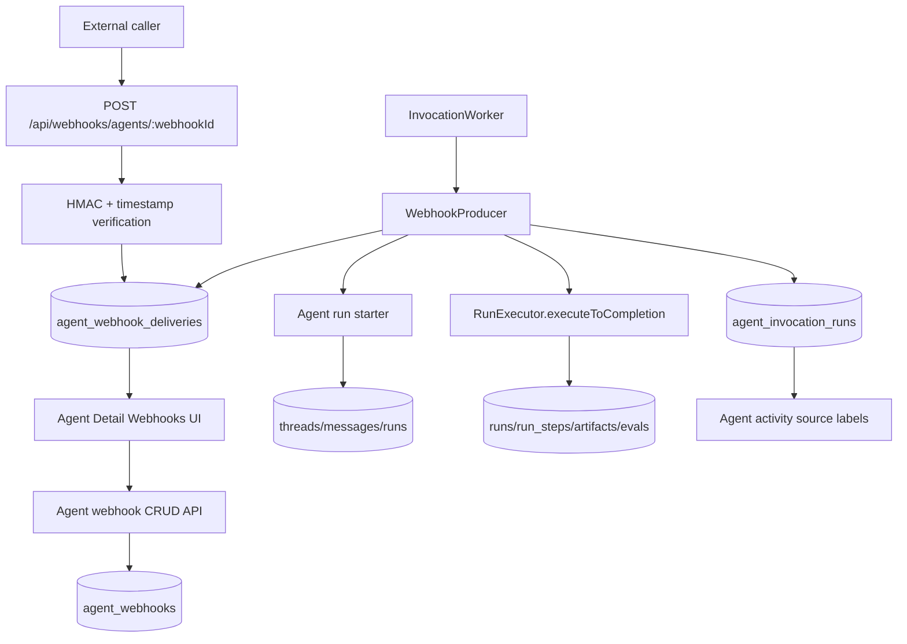

# Webhook agent invocation

## Status

Approved (2026-06-15). Implements HA-GAP-14 from [specs/index.md](index.md).

## Goal

Add signed webhook invocation for API-backed agents. A user can create a webhook URL for an agent, send a signed HTTP request, and have Agentis queue, execute, and label the resulting agent run through the existing invocation worker foundation.

This slice should make webhook invocation useful for self-hosted automation while keeping execution out of the request path.

## Source of truth

- Roadmap: [specs/index.md](index.md), HA-GAP-14.
- Scheduled invocation foundation: [_done/2026-06-14-scheduled-agent-invocations-design.md](_done/2026-06-14-scheduled-agent-invocations-design.md).
- Invocation worker: `apps/api/src/invocations/invocation-worker.ts`.
- Schedule producer reference: `apps/api/src/invocations/schedule-producer.ts`.
- Agent run starter reference: `apps/api/src/invocations/agent-run-starter.ts`.
- Invocation claim repository: `apps/api/src/repositories/agent-invocation-run-repository.ts`.
- Schedule routes reference: `apps/api/src/routes/agent-schedules.ts`.
- App route registration: `apps/api/src/app.ts`.
- Persistence schema: `apps/api/src/db/schema.ts`.
- Shared schedule/invocation schemas: `packages/shared/src/schedule-schemas.ts`.
- Agent Detail invocation UI: `apps/web/src/components/agent-detail/agent-edit-tabs.tsx`.
- Schedule panel reference: `apps/web/src/components/agent-detail/agent-schedules-panel.tsx`.
- Agent API client reference: `apps/web/src/lib/api/agents-client.ts`.

## Current state

- Scheduled agent invocations are shipped with `agent_schedules`, `agent_invocation_runs`, `ScheduleProducer`, and `InvocationWorker`.
- `agent_invocation_runs.source_type` and shared `agentInvocationSourceTypeSchema` currently support only `schedule`.
- `startAgentScheduledRun` creates a thread/run from the agent's current configuration and optional project context.
- `ScheduleProducer` executes background runs through `RunExecutor.executeToCompletion` and records terminal status.
- Agent Detail has a disabled Webhook row under Invocations.
- No webhook configuration, signed inbound route, delivery queue, or webhook source metadata exists.

## Constraints

- Keep webhook execution on the invocation worker. The public webhook route should authenticate and queue work, then return quickly.
- Reuse the normal run executor so webhook runs preserve thread, run, cost, timeline, artifact, memory, and evaluation behavior.
- Use the agent's current configuration at execution time, including model, system prompt, native tools, cost settings, and tool grants.
- Keep the first webhook slice scoped to JSON `POST` requests and HMAC signing.
- Do not store unauthenticated invalid-signature payload bodies.
- Keep self-host operation compatible with SQLite and the existing worker process.
- Use project glossary terms: agent configuration, thread, run, integration, native tool, Artifact.

## Out of scope

- Slack, Telegram, email, passive listeners, or other invocation channels.
- Custom webhook response templates.
- Multi-step workflow branching from a single webhook.
- Per-webhook OAuth or mTLS.
- Non-JSON request parsing.
- Public replay dashboards or analytics beyond delivery status and recent run source metadata.
- Webhook retry scheduling beyond stale claim recovery and visible failure status.

## Acceptance criteria

1. API-backed agents can create, list, disable/delete, and rotate secrets for webhook invocation endpoints.
2. Each webhook exposes a stable URL and signing metadata without revealing the raw secret after creation or rotation.
3. Inbound webhook requests must pass HMAC verification over the raw request body and timestamp, with replay protection for stale timestamps.
4. A valid webhook delivery persists an auditable delivery record, payload summary, status, and failure reason when applicable.
5. The invocation worker claims queued webhook deliveries and creates a thread/run from the agent's current configuration, optional project context, and approved prompt template.
6. Webhook-triggered runs execute to completion through the shared run executor without browser streaming.
7. Agent Detail activity and recent runs identify webhook-triggered runs with webhook name/source metadata.
8. Invalid signatures, disabled webhooks, missing agents, invalid projects, missing runtime credentials, stale duplicate deliveries, grant failures, and cost-limit blockers fail visibly without creating duplicate runs.
9. Tests cover webhook CRUD and secret rotation, signature validation, delivery queuing, worker claiming, run creation and execution handoff, duplicate prevention, source metadata, and failure states.
10. Docs or UAT notes include a `curl` example that triggers a webhook-signed run and shows where to verify the resulting thread/run.

## Architecture



### Persistence

Add `agent_webhooks`:

- `id`
- `agent_id`
- `name`
- `status`: `enabled` or `disabled`
- `secret_hash` or encrypted secret material, depending on existing project secret helpers available during Build
- `secret_prefix`: short display identifier for support and rotation confirmation
- `prompt_template`
- `project_id`
- `last_delivery_at`
- `last_delivery_status`: `queued`, `running`, `completed`, `failed`, or `rejected`
- `last_failure_reason`
- `created_at`
- `updated_at`

Add `agent_webhook_deliveries`:

- `id`
- `webhook_id`
- `agent_id`
- `delivery_key`: caller-provided idempotency key when present, otherwise generated id
- `status`: `queued`, `claimed`, `running`, `completed`, `failed`, or `skipped`
- `request_timestamp`
- `payload_json`: bounded sanitized JSON for authenticated deliveries
- `payload_summary`: compact text summary for UI
- `thread_id`
- `run_id`
- `failure_reason`
- `claimed_at`
- `started_at`
- `finished_at`
- `created_at`
- `updated_at`

Extend `agent_invocation_runs` source typing to include `webhook`. The existing unique `(source_type, source_id, due_at)` shape can support webhook claims by using delivery id as `source_id` and delivery creation time as `due_at`, or Build can rename this field in code-level types to a generic claim key while preserving the database column if that is lower risk.

### Shared schemas

Add shared schemas for:

- `AgentWebhook`
- `CreateAgentWebhookRequest`
- `UpdateAgentWebhookRequest`
- `RotateAgentWebhookSecretResponse`
- `AgentWebhookDelivery`
- `AgentInvocationSource` union with schedule and webhook variants

The create and rotate responses may include the raw secret exactly once. List and detail responses must only include URL, signing algorithm, secret prefix, status, and timestamps.

### API routes

Agent-scoped configuration routes:

- `GET /api/agents/:agentId/webhooks`
- `POST /api/agents/:agentId/webhooks`
- `PATCH /api/agents/:agentId/webhooks/:webhookId`
- `DELETE /api/agents/:agentId/webhooks/:webhookId`
- `POST /api/agents/:agentId/webhooks/:webhookId/rotate-secret`

Public invocation route:

- `POST /api/webhooks/agents/:webhookId`

Expected signing headers:

- `x-agentis-webhook-timestamp`: Unix seconds or ISO timestamp
- `x-agentis-webhook-signature`: `sha256=<hex digest>`
- Optional `x-agentis-delivery-id`: caller idempotency key

Signature base string:

```text
<timestamp>.<rawBody>
```

Use a bounded timestamp window, for example five minutes. Build may tune the value, but the spec requires a documented replay window.

### Prompt rendering

Each webhook stores a prompt template. The first implementation should support a small, explicit variable set:

- `{{payload}}`: pretty-printed authenticated JSON payload, bounded by configured payload limits
- `{{deliveryId}}`
- `{{receivedAt}}`

If the template has no variables, append a compact payload context block to the prompt. Build should fail template rendering loudly when an unsupported variable is used.

### Worker producer

Add `WebhookProducer` under `apps/api/src/invocations/`.

Processing flow:

1. List queued deliveries for enabled webhooks.
2. Claim one delivery atomically and create or reuse an `agent_invocation_runs` claim with source type `webhook`.
3. Validate runtime credentials, agent existence, project availability, tool grants, and cost prerequisites.
4. Render prompt from the webhook template and authenticated payload context.
5. Create a thread/run through a generalized agent run starter.
6. Link delivery, invocation claim, thread, and run.
7. Create a run step such as `Webhook invocation` with webhook id, webhook name, and delivery id.
8. Execute the run through `RunExecutor.executeToCompletion`.
9. Record delivery, invocation claim, and webhook last status fields.

`InvocationWorker.tick()` should run schedule and webhook producers. A failure in one producer must not prevent the other producer from running during later ticks.

### Source metadata

Extend recent run/thread source metadata so webhook runs display visibly in Agent Detail activity, for example:

```ts
{
  type: "webhook",
  webhookId: string,
  webhookName: string,
  deliveryId: string
}
```

UI copy can render `Webhook: <name>` next to recent activity rows.

## UI design

Replace the disabled Webhook row in Agent Detail -> Invocations with a webhook management section for API-backed agents.

Required controls:

- Empty state explaining webhook invocation.
- Create webhook button.
- Webhook list with name, status, URL copy, last delivery status, and last run link when available.
- Enable/disable or delete action.
- Rotate secret action with a confirmation step.
- One-time secret display on create and rotate.

Create/edit fields:

- name
- prompt template
- optional project selector
- enabled status

Keep preset or fixture-backed agents read-only if the existing Agent Detail edit behavior requires that boundary.

## Error handling

- Malformed request body: return `400`, no run.
- Missing timestamp or signature: return `401`, no run.
- Invalid signature: return `401`, no delivery payload storage, no run.
- Stale timestamp: return `400`, no run.
- Disabled webhook: return `410` or `404`, no run.
- Missing webhook: return `404`, no run.
- Oversized payload: return `413`, no run.
- Duplicate delivery id for the same webhook: return the existing delivery status or skip duplicate queueing.
- Missing agent: mark delivery failed and disable the webhook or require user action. The spec prefers a visible failed status without repeated execution attempts.
- Invalid or archived project: mark delivery failed with a visible reason.
- Missing runtime credentials: mark delivery failed with the existing runtime env message.
- Integration grant or connection failure: mark delivery failed with the human-readable grant error.
- Run execution failure: preserve normal run failure evidence and mirror the summary to the delivery and webhook last status.
- Worker stale claim: recover through existing stale claim handling and mark delivery failed or skipped with a visible reason.

## Implementation phases

### Phase 1: Persistence and shared schemas

- Add migrations for `agent_webhooks` and `agent_webhook_deliveries`.
- Extend source typing for `agent_invocation_runs` to include `webhook`.
- Add repositories for webhook config and deliveries.
- Add shared schemas and mappers.
- Add repository tests for CRUD, secret rotation metadata, delivery queueing, and duplicate delivery keys.

### Phase 2: API routes and HMAC signing

- Add agent-scoped webhook CRUD routes.
- Add secret generation and rotation behavior.
- Add public webhook route with raw-body HMAC verification.
- Enforce timestamp replay window and payload size bounds.
- Add API tests for valid signatures and all rejection paths.

### Phase 3: Worker producer and run creation

- Generalize `startAgentScheduledRun` naming and input so schedules and webhooks share run creation logic.
- Add `WebhookProducer` with duplicate-safe delivery claiming.
- Link delivery, invocation claim, thread, and run.
- Add `Webhook invocation` run step.
- Execute through `RunExecutor.executeToCompletion`.
- Add tests for successful execution, runtime blockers, missing agent/project, grant failure, run failure, duplicate delivery, and stale claims.

### Phase 4: UI integration

- Add API client and hook for agent webhooks.
- Replace disabled Webhook invocation row with the webhook management section.
- Add one-time secret display on create/rotate.
- Add source labels for webhook-triggered recent runs.
- Add UI tests for create, list, disable/delete, rotate, copy URL, and source label behavior.

### Phase 5: Docs and UAT

- Add a signed `curl` example or script in the spec, docs, or UAT notes.
- Verify the full path locally: create webhook, sign payload, POST request, run worker, confirm thread/run completion and source label.
- Update `docs/specs/index.md` and `docs/specs/log.md` after Build ships.

## Testing and acceptance

Suggested command groups for Build verification:

```bash
pnpm vitest run apps/api/src/routes/agent-webhooks.test.ts apps/api/src/invocations/webhook-producer.test.ts apps/api/src/repositories/agent-webhook-repository.test.ts
pnpm vitest run apps/web/src/components/agent-detail
pnpm typecheck
pnpm build
```

Manual UAT outline:

1. Start API, web, and worker with live or mock runtime as appropriate for the verification target.
2. Create an API-backed agent.
3. Open Agent Detail -> Invocations -> Webhooks.
4. Create an enabled webhook with a prompt template such as `Summarize this payload: {{payload}}`.
5. Copy the URL and one-time secret.
6. Send a signed `curl` request with a JSON payload.
7. Confirm the HTTP response returns `202` with a delivery id.
8. Wait for the worker to process the delivery.
9. Confirm a thread/run is created and completes without calling `/api/runs/:runId/stream` from the browser.
10. Confirm Agent Detail activity identifies the run as webhook-triggered.
11. Disable the webhook and confirm a new signed request no longer queues a run.
12. Send an invalid signature and confirm no run is created.

## Risks and mitigations

- **Raw body verification can be broken by JSON parsing.** Implement the public route with raw body access before parsing JSON and cover it with tests.
- **Long-running execution from HTTP would be brittle.** Keep execution in the worker and return `202` after queueing.
- **Secrets can leak through list responses.** Return raw secrets only on create and rotate, and test list/detail responses for absence of raw secret material.
- **Duplicate webhook retries can create duplicate runs.** Use delivery id idempotency when provided and duplicate-safe claim records.
- **Prompt templates can become an unsafe template language.** Support only explicit variables and fail unsupported variables loudly.
- **Payload storage can become large or sensitive.** Bound payload size and store authenticated payloads only. Do not store invalid-signature request bodies.
- **Source metadata can stay schedule-specific.** Extend schemas and mappers with a union so webhook labels do not overload schedule fields.

## Build handoff

Approved scope:

- Signed webhook configuration and public invocation for API-backed agents.
- Worker-queued delivery execution through the shared run executor.
- Agent Detail webhook management UI.
- Webhook source metadata in recent activity.
- Tests and UAT evidence for the complete signed `curl` path.

Non-goals:

- Slack, email, Telegram, passive listeners, custom response templates, and non-JSON webhooks.
- Executing agent runs directly inside the public webhook request.
- Storing unauthenticated invalid-signature payloads.

Required verification:

- API route tests for CRUD, secret rotation, HMAC validation, timestamp replay protection, disabled webhook behavior, and duplicate delivery keys.
- Worker tests for delivery claim, run creation, shared execution handoff, failure states, and source metadata.
- UI tests for management controls, one-time secret display, and webhook source labels.
- `pnpm typecheck` and `pnpm build`.
- Manual signed webhook UAT with thread/run evidence.

Blocking questions for Build:

- None. If Build discovers an existing secret storage helper, use it. If no helper exists, use a minimal project-local hashing or encryption approach and document the choice in the build report.
