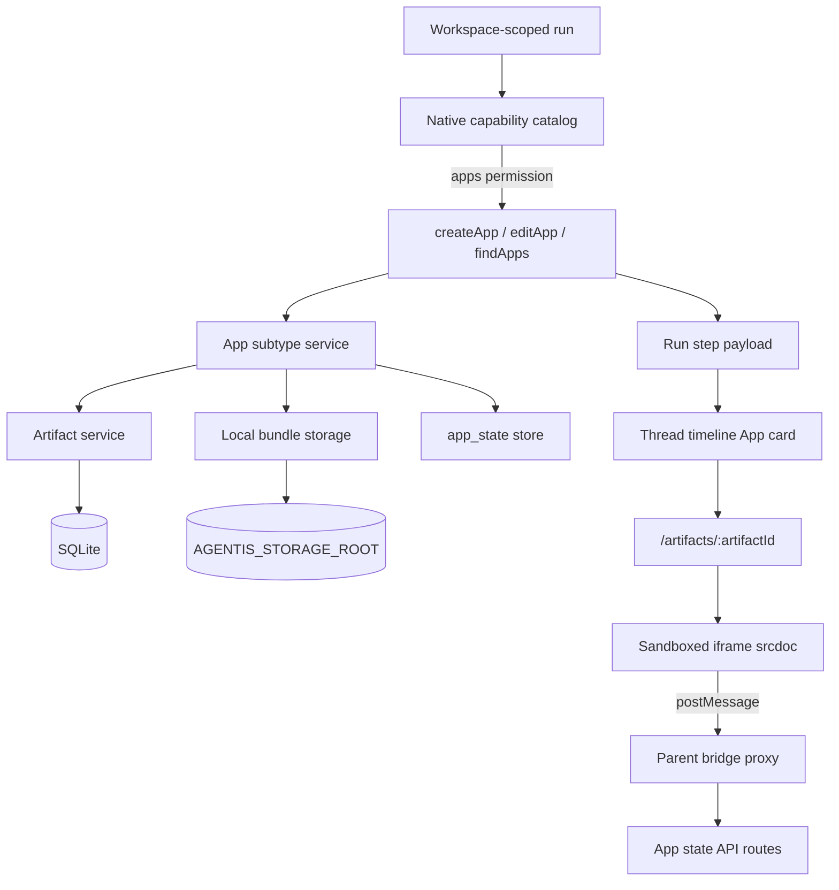

# Agent native tooling V4.x: App artifact runtime

## Status

Implemented.

## Goal

Add the first Interactive-category V4 slice with runtime state by making **Apps** a first-class Agentis-native Artifact subtype. Agents should be able to create, edit, persist, and return interactive mini-apps that render inside the Artifact workspace with stable links, version history, bounded timeline evidence, and explicit native tool permission gating.

This spec targets the App artifact runtime primitive. Product-specific templates, broad runtime tool access, maps, agent invocation from inside Apps, static webpages, slides, media generation, public sharing, and production sandbox hardening are deferred.

## Source of truth

- Roadmap: `docs/specs/_done/agent-native-tooling.md`, V4 Interactive category.
- Domain language: `CONTEXT.md`, especially **App**, **App state**, and **Artifact workspace**.
- Native tool permission decision: `docs/adr/0002-version-native-tool-permissions-with-agent-configuration.md`.
- Artifact primitive decision: `docs/adr/0005-use-artifact-as-library-primitive.md`.
- Static artifact precedent (frozen HTML sibling type): `docs/specs/_done/2026-06-04-agent-native-tooling-v4-static-artifacts-design.md`.
- Existing native runtime plumbing:
  - `apps/api/src/runtime/run-executor.ts`
  - `apps/api/src/native-tools/native-tool-capability-catalog.ts`
  - `apps/api/src/native-tools/native-tool-payload.ts`
  - `apps/api/src/repositories/run-step-repository.ts`
  - `apps/web/src/components/thread/run-timeline.tsx`
- Existing Artifact implementation:
  - `packages/shared/src/artifact-schemas.ts`
  - `apps/api/src/artifacts/artifact-service.ts`
  - `apps/api/src/static-artifacts/static-artifact-service.ts`
  - `apps/web/src/routes/artifact-workspace.tsx`
  - `apps/web/src/components/static-artifacts/static-artifact-preview.tsx`

## Current state

Agentis already supports the core runtime path needed for this slice, and Build must use the landed Artifact domain refactor in `docs/specs/_done/2026-06-04-library-artifact-domain-refactor-design.md`:

- Native tools are constructed during `RunExecutor` execution and merged into the AI SDK `streamText` tool map.
- Tool calls and results are persisted as assistant message parts and run steps.
- Native run-step payloads are normalized for timeline rendering.
- Agent-scoped native tool permissions are versioned with agent configuration.
- Web search, documents, and static artifacts already use the native capability catalog.
- The Artifact refactor provides the durable Library primitive for records, version history, local storage, relative `viewPath` values, Library routes, and timeline evidence. Documents remain the markdown artifact subtype.
- Static artifacts (`webpage`, `slides`) already open in the Artifact workspace at `/artifacts/:artifactId`.

Agentis does not yet have App artifact subtype behavior, embedded interactive runtime rendering, App state persistence, or a runtime bridge for App code.

## Naming decision

Use **Artifact** for durable storage and Library surfaces. **Apps** are the interactive Artifact subtype (`artifact.type = "app"`).

- Product language: **App**, not HyperApp.
- Schema enum: **`app`**, replacing provisional `hyperapp` wherever it appears in shared schemas, Library filters, and mappers.
- Native permission id: **`apps`**.
- Runtime tools: **`createApp`**, **`editApp`**, **`findApps`**.
- Workspace route and `viewPath`: **`/artifacts/:artifactId`**, same as static artifacts.
- Injected bridge namespace: **`App`**, not `HyperApp`.

Static webpage and slide Artifacts remain frozen HTML previews without mutable state or bridge access. Apps are the interactive sibling type with JS runtime and Agentis-owned state.

## Dependency

Build must use the landed Artifact primitive from `docs/specs/_done/2026-06-04-library-artifact-domain-refactor-design.md`. Apps are implemented as Artifact `type = "app"`. Do not introduce a separate Library primitive. Subtype-specific behavior lives in an App service, App runtime components, and optional dedicated state storage keyed by `artifactId`.

Build must also rename provisional `hyperapp` enum values and references to `app` as part of this slice.

## Product scope

### Included

- Native tool permission id **`apps`**, default **off** for new custom agents (`defaultSelected: false`).
- Runtime tools **`createApp`**, **`editApp`**, and **`findApps`**.
- API persistence for Artifact `type = "app"`, versions, provenance, current version, and App subtype metadata.
- Local storage for App code bundles when bundle size makes filesystem storage more appropriate than SQLite fields.
- Dedicated **`app_state`** store for mutable runtime state, separate from versioned bundles.
- Thread timeline rendering for App tool calls and results.
- Artifact workspace rendering at **`/artifacts/:artifactId`** with `viewPath` matching static artifacts.
- A constrained embedded runtime for the **current** App version only.
- A minimal **`App`** bridge injected into the sandbox iframe, backed by parent postMessage proxying.
- Permission denial, runtime unavailability, invalid bundle, and storage failure handling.
- Thread, project, and global Artifact visibility scopes from v1.
- Unit, API, web, and manual UAT coverage.

### Out of scope

- Static webpages and slides (implemented under `staticArtifacts`).
- Public sharing or anonymous access.
- Arbitrary network access from App code.
- Direct relative API calls from inside the App iframe in v1.
- Maps, agents, table APIs, browser automation, media generation, or deep native tool access from inside Apps.
- Product-specific wizard templates.
- Production sandbox hardening beyond the embedded runtime constraints required for this slice.
- Collaborative editing.
- Rich visual builder UI.
- Running historical App versions in the embedded runtime.
- Rollback to prior App code versions.

## Acceptance criteria

1. Agents can create an App through `createApp`, storing an Artifact with `type = "app"`, the app bundle, initial version, provenance, ownership metadata, and optional initial state.
2. Agents can edit an existing App Artifact through `editApp`, creating a new Artifact version while preserving prior versions.
3. Apps render in the thread timeline as interactive cards with bounded metadata and a stable `/artifacts/:artifactId` link.
4. App agent tools are gated by the **`apps`** native tool permission and fail visibly when unavailable.
5. Apps persist user or runtime **App state** through a dedicated Agentis-owned store separate from versioned bundles. State updates do not create App code versions.
6. The first runtime surface is a parent-proxied postMessage bridge with injected `App.state.get()`, `App.state.set(value)`, and `App.runtime.info()`. Maps, agent invocation, table APIs, browser automation, and deep tool calls remain deferred.
7. Build includes API, shared schema, persistence, web rendering, and tests for create, edit, render, permission denial, invalid bundle rejection, and version history metadata.
8. Verify can demonstrate a thread-created App Artifact, open its timeline card or Artifact workspace, edit it into a new version, and inspect previous version metadata without running old code in the live runtime.
9. Verify can demonstrate permission denial by running without the `apps` permission and observing a visible failure path rather than silent omission.
10. Human users can open and run an App when Artifact visibility scope allows access, independent of whether their agent has the `apps` permission.
11. Out-of-scope capabilities are not implemented in this slice unless the user explicitly expands the approved spec.

## Architecture

Apps are an Agentis-owned Artifact subtype with an interactive runtime and clear server, shared schema, and web boundaries.



Server responsibilities:

- Resolve whether the current agent configuration permits App tools.
- Build `createApp`, `editApp`, and `findApps` only when the `apps` permission is enabled.
- Validate bundle shape and size before persistence.
- Persist Apps as Artifact `type = "app"` with versions, provenance, current version, and subtype metadata.
- Persist mutable App state in a dedicated store keyed by `artifactId`.
- Normalize tool outputs into bounded native timeline payloads.
- Serve Artifact detail, version metadata, and App state responses through existing Artifact routes plus App-specific state routes.

Shared schema responsibilities:

- Define App Artifact metadata, public DTOs, version summaries, tool inputs, tool outputs, and timeline payloads.
- Export the `apps` native tool permission id from the shared native tool schema area.
- Rename Artifact type enum value from `hyperapp` to `app`.
- Keep the model-visible tool output stable and provider-independent.

Web responsibilities:

- Render App creation and edit results as thread timeline cards.
- Link cards to `/artifacts/:artifactId`.
- Extend `ArtifactWorkspacePage` with an App runtime renderer for `type = "app"`.
- Always run the **current** App version in the embedded runtime.
- Show version metadata and provenance in the side panel; historical versions are metadata-only in v1.
- Show actionable error states for unavailable runtime, permission denial, invalid bundle, and missing App.

## Runtime tools

### `createApp`

Expected input shape:

```ts
type CreateAppInput = {
  title: string
  description?: string
  bundle: AppBundleInput
  initialState?: Record<string, unknown>
  stateSchema?: Record<string, unknown>
  visibilityScope?: "thread" | "project" | "global"
}
```

Expected output shape:

```ts
type CreateAppOutput = {
  artifactId: string
  title: string
  version: number
  viewPath: string
  visibilityScope: "thread" | "project" | "global"
  summary: string
}
```

`viewPath` must be `/artifacts/:artifactId`.

The model should use `createApp` when the user asks for an interactive mini-app, form, wizard, calculator, tracker, or visual tool that should run inside Agentis with mutable state.

Do not use `createApp` for static reports, landing pages, or slide decks; use `staticArtifacts` instead.

### `editApp`

Expected input shape:

```ts
type EditAppInput = {
  artifactId: string
  bundle: AppBundleInput
  changeSummary: string
}
```

Expected output shape:

```ts
type EditAppOutput = {
  artifactId: string
  title: string
  version: number
  previousVersion: number
  viewPath: string
  summary: string
}
```

`editApp` creates a new immutable version and updates the App's current version pointer. Prior versions remain available for metadata display and future rollback planning.

### `findApps`

Expected input shape:

```ts
type FindAppsInput = {
  query?: string
  visibilityScope?: "thread" | "project" | "global"
  limit?: number
}
```

Expected output shape:

```ts
type FindAppsOutput = {
  items: Array<{
    artifactId: string
    title: string
    description?: string
    version: number
    viewPath: string
    updatedAt: string
  }>
  resultCount: number
  truncated: boolean
}
```

This tool supports follow-up edit requests and prevents agents from guessing artifact ids.

## Bundle model

An App bundle uses a constrained schema that is easy to validate and render:

```ts
type AppBundleInput = {
  html: string
  css?: string
  js: string
}
```

Validation rules:

- `html` and `js` are required and bounded by configured byte limits.
- `css` is optional and bounded.
- Bundle code cannot include external script tags, external stylesheets, inline event handler attributes, iframe creation, or direct references to parent page globals.
- Bundle metadata records validation results and rejected reasons.
- Invalid bundles fail before persistence and produce a visible timeline error.

Build assembles `html`, optional `css`, and `js` into a single sandboxed `srcdoc` document at render time, injecting the approved bridge bootstrap script. The public Agentis tool contract stays compact even if internal storage uses assembled HTML.

Build may reuse static HTML validation patterns where appropriate, but App bundles allow controlled client script execution in the interactive runtime.

## Data model

Follow the static-artifact persistence pattern:

- Shared Artifact and Artifact version rows own Library concerns: title, description, scope, provenance, current version, timestamps, and storage keys.
- App subtype fields live in Artifact `metadata` JSON and version metadata snapshots.
- Versioned bundle content lives in filesystem storage under `AGENTIS_STORAGE_ROOT`, referenced by version storage keys and content hashes.
- Mutable App state lives in a dedicated **`app_state`** store keyed by `artifactId`.

Do **not** add separate `hyper_apps` or `hyper_app_versions` tables unless Build discovers a concrete constraint that Artifact rows cannot represent. The dedicated state store is required and is not a second Library primitive.

State persistence:

- **App state** is separate from App code versions.
- State updates do not create App code versions.
- State reads and writes flow through parent-proxied bridge messages to Agentis-owned API routes.
- Do not defer state persistence until a tables primitive exists.

Visibility:

- Support `thread`, `project`, and `global` scope through the shared Artifact scope policy from v1.
- Provenance remains separate from visibility.

Access:

- Artifact visibility scope governs whether a human can open and run an App in the Artifact workspace.
- The `apps` permission governs agent tool availability only during workspace-scoped runs.

## Runtime and safety

App code renders inside a constrained embedded runtime: an iframe with explicit `sandbox` attributes and restrictive content assembly. Build must verify the embedding strategy against existing static artifact preview patterns before implementation.

Required constraints:

- `sandbox="allow-scripts"` for the interactive runtime iframe.
- No `allow-same-origin` in v1 unless Build documents a specific, reviewed reason.
- No ambient access to host page internals.
- No arbitrary external network access.
- No privileged browser APIs.
- No direct access to auth tokens or host storage outside the approved bridge.
- No unbounded bridge calls.
- No parent page mutation except through validated postMessage handling.
- Bounded App state payloads.
- Visible errors for failed bridge calls.

Runtime API (v1):

- App code uses an injected **`App`** bridge only:
  - `App.state.get()`
  - `App.state.set(value)`
  - `App.runtime.info()`
- The iframe posts messages to the Artifact workspace parent.
- The parent validates messages, calls Agentis App state API routes, and returns bounded responses to the iframe.
- Direct relative API calls from iframe code are deferred.

Historical versions:

- The embedded runtime always loads the **current** App version.
- Selecting a historical version in the Artifact workspace shows metadata only in v1.

## Error handling

The service and UI should fail loudly with specific codes:

- `app_permission_denied`
- `app_not_found`
- `app_invalid_bundle`
- `app_bundle_too_large`
- `app_storage_failed`
- `app_runtime_unavailable`
- `app_state_too_large`

Timeline rendering should show the attempted action, App title or id when safe, error code, and actionable copy. Full code bundles should not appear in timeline payloads.

## UI behavior

Thread timeline cards should show:

- App title.
- Action: created, edited, found, or failed.
- Current version.
- Visibility scope.
- Stable `/artifacts/:artifactId` link.
- Change summary for edits.
- Error code and short remediation when failed.

The Artifact workspace for `type = "app"` should show:

- Current App title and description.
- Embedded App runtime for the current version.
- Version metadata list with historical entries metadata-only.
- Provenance summary.
- Runtime unavailable or invalid bundle state.

The first slice does not require a full visual editor. Agents create and edit Apps through runtime tools.

## Implementation phases

### Phase 1: Schemas, permission, and persistence

Likely files:

- `packages/shared/src/native-tools.ts`
- `packages/shared/src/schemas.ts`
- New `packages/shared/src/app-schemas.ts`
- `packages/shared/src/artifact-schemas.ts` (rename `hyperapp` → `app`)
- `apps/api/src/db/schema.ts` (add `app_state` persistence)
- `apps/api/src/artifacts/artifact-service.ts`
- New `apps/api/src/artifact-apps/app-service.ts`
- New `apps/api/src/artifact-apps/local-app-bundle-storage.ts`

Build tasks:

- Add shared App schemas and the `apps` native permission id.
- Rename Artifact type enum value from `hyperapp` to `app` in shared schemas, tests, Library UI, and API mappers.
- Add App create, version append, lookup, list, and current version resolution through Artifact service boundaries plus subtype metadata.
- Add local bundle storage for versioned App code.
- Add dedicated App state store and bounds validation.
- Add service validation for bundle size, ownership, versioning, and visibility.

Acceptance tie-ins: 1, 2, 4, 5, 7, 10.

### Phase 2: Runtime tools and timeline payloads

Likely files:

- `apps/api/src/native-tools/native-tool-capability-catalog.ts`
- New `apps/api/src/artifact-apps/app-tool.ts`
- `apps/api/src/native-tools/native-tool-payload.ts`
- `apps/api/src/runtime/run-executor.ts`
- `apps/web/src/components/thread/run-timeline.tsx`

Build tasks:

- Add `apps` capability resolution and system prompt guidance.
- Build `createApp`, `editApp`, and `findApps`.
- Normalize App tool results and errors into bounded native payloads.
- Render timeline cards with stable `/artifacts/:artifactId` links.

Acceptance tie-ins: 1, 2, 3, 4, 6, 7, 9.

### Phase 3: Artifact workspace runtime and bridge

Likely files:

- New or extended Artifact API routes for App state load/save
- `apps/web/src/routes/artifact-workspace.tsx`
- New components under `apps/web/src/components/artifact-apps/`

Build tasks:

- Add App state load/save API routes scoped by Artifact visibility policy.
- Extend Artifact workspace with an App runtime renderer for `type = "app"`.
- Assemble bundle srcdoc with injected bridge bootstrap.
- Enforce sandbox constraints and bridge message validation in the parent proxy.
- Add runtime unavailable and invalid bundle states.
- Keep historical version selection metadata-only.

Acceptance tie-ins: 3, 5, 6, 7, 8, 10.

### Phase 4: Verification coverage and UAT fixture

Likely files:

- Repository and service tests beside implementation files.
- Route tests under `apps/api/src/routes/`.
- Web tests beside App runtime components.
- E2E or manual UAT notes if Playwright coverage is too expensive for the first Build.

Build tasks:

- Add targeted unit tests.
- Add API route/tool tests.
- Add web rendering and bridge proxy tests.
- Run quality commands and record any skipped checks with reasons.

Acceptance tie-ins: 7, 8, 9, 10, 11.

## Testing and verification

Required automated checks:

- Shared schema tests for App DTOs, permission ids, tool input, and tool output.
- Repository and service tests for create, append version, preserve previous versions, list, current version lookup, state bounds, and invalid bundle rejection.
- Native capability catalog tests for permission-enabled and permission-denied behavior.
- Runtime tool tests for create, edit, find, and error payloads.
- Timeline/component tests for card rendering, links, version metadata, and failure states.
- Artifact workspace tests for App runtime loading, bridge proxy behavior, current-version-only execution, and state save/load.

Required commands:

```bash
pnpm typecheck
pnpm build
pnpm lint
```

Recommended targeted tests during Build:

```bash
pnpm --filter @workspace/api test -- artifact-apps
pnpm --filter @workspace/web test -- artifact-apps
```

Manual UAT:

1. Start the app with mock runtime enabled when live credentials are unavailable.
2. Create or seed an agent with the `apps` native tool permission enabled.
3. Ask the agent in a thread to create a small interactive App, such as a two-field calculator with saved state.
4. Confirm the run timeline shows an App card with a stable `/artifacts/:artifactId` link.
5. Open the Artifact workspace and confirm the App renders in the embedded runtime.
6. Save state through the App, reload, and confirm state persists.
7. Ask the agent to edit the App.
8. Confirm the Artifact workspace shows the new current version and previous version metadata without executing old code in the live runtime.
9. Run the same create/edit request with an agent lacking `apps` permission and confirm the unavailable or denied path is visible.
10. Open the App from Library or a shared scope context without the `apps` permission on the viewing user's agent and confirm the App still runs when visibility scope allows access.

## Risks and mitigations

- Embedded App security can become the largest risk. Mitigate with iframe sandboxing, no direct iframe network access in v1, strict bridge message validation, and bounded state payloads.
- Runtime API scope can expand quickly. Mitigate by limiting v1 to parent-proxied state and runtime metadata helpers only.
- Versioned App code and mutable App state can blur. Mitigate with separate version storage and the dedicated `app_state` store.
- Timeline payloads may accidentally persist large code bundles. Mitigate by normalizing bounded metadata only.
- Historical version preview could tempt unsafe execution of old bundles against current state. Mitigate by running the current version only in v1.

## Explicitly deferred work

- Static webpages and slides (already implemented separately).
- Tables as a full V4 Data primitive or as an App state backend.
- Maps and geo tools.
- Agent invocation from inside Apps.
- Browser automation from inside Apps.
- Direct iframe access to relative Agentis APIs.
- Public sharing.
- Visual app builder UI.
- Collaborative editing.
- Rollback to prior App code versions.
- Running historical App versions in the live runtime.
- Marketplace or gallery surfaces.

## Build handoff

Approved direction: Core runtime first.

Build should implement the smallest end-to-end App artifact runtime that satisfies the acceptance criteria:

1. Rename provisional `hyperapp` references to **`app`** in shared schemas and active UI/API surfaces.
2. Add shared schemas and the **`apps`** native permission id using the landed Artifact primitive.
3. Persist Apps as Artifact `type = "app"` with immutable versions and a dedicated **`app_state`** store.
4. Add API/service/storage boundaries with validation and loud failures.
5. Add runtime tools **`createApp`**, **`editApp`**, and **`findApps`**.
6. Add bounded timeline rendering with `/artifacts/:artifactId` links.
7. Extend the Artifact workspace with sandboxed runtime rendering and parent-proxied bridge/state support.
8. Add automated tests and run required quality commands.

Do not implement deferred Hyperagent parity capabilities during this Build unless the user explicitly changes the approved scope.
