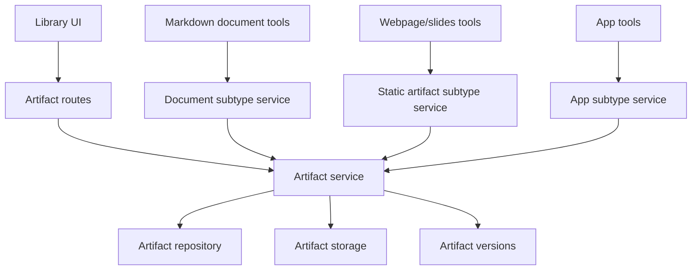

# Library artifact domain refactor

## Status

Verified.

## Goal

Refactor the Library domain so **Artifact** is the durable Library primitive and **Document** becomes the markdown-specific artifact subtype.

This refactor must happen before the static webpages/slides and App specs are built. Webpages, slides, and future generated outputs should not be modeled as document types. They are sibling artifact types that share Library management, scope, provenance, versioning, preview, and download mechanisms.

## Source of truth

- User clarification on 2026-06-04: webpages and slides are Artifacts of type `webpage` and `slides`, sibling to `document`; Documents are markdown documents.
- Superseding decision: `docs/adr/0005-use-artifact-as-library-primitive.md`.
- Superseded decision: `docs/adr/0003-persistent-documents-library-primitive.md`.
- Domain language: `CONTEXT.md`.
- Current document implementation:
  - `packages/shared/src/document-schemas.ts`
  - `apps/api/src/documents/document-service.ts`
  - `apps/api/src/documents/document-tool.ts`
  - `apps/api/src/repositories/document-repository.ts`
  - `apps/api/src/routes/documents.ts`
  - `apps/web/src/routes/document-workspace.tsx`
  - `apps/web/src/components/documents/`

## Pre-refactor state

Before this refactor, Agentis used Document as the durable Library primitive. The shared schema included `documentType` values such as `markdown`, `webpage`, `table`, `image`, `video`, `slides`, and `other`. That model made webpages and slides document types.

The intended domain model is different:

- Artifact is the durable Library primitive.
- `artifact.type = "document"` means a markdown document.
- `artifact.type = "webpage"` means a static webpage artifact.
- `artifact.type = "slides"` means a slide deck artifact.
- Future artifact types can include `app`, `table`, `image`, `video`, and `other`.
- All artifact types share Library management mechanisms.
- Type-specific behavior lives in type-specific services, tools, previews, and validators.

## Product scope

### Included

- Introduce Artifact domain language in active docs, shared schemas, API DTOs, repositories, services, routes, fixtures, and UI copy.
- Preserve existing markdown Document behavior under artifact type `document`.
- Move shared Library fields onto Artifact:
  - visibility scope
  - provenance
  - title and description
  - source
  - storage references
  - current version
  - created and updated timestamps
- Rename or wrap document routes/services so markdown document tools remain available while Library management is Artifact-backed.
- Preserve thread, project, and global visibility behavior.
- Preserve version history behavior.
- Preserve existing Library filters while changing Type from document subtypes to artifact types.
- Migrate existing records without data loss.
- Update specs and docs that currently describe webpages/slides as Document types.

### Out of scope

- Implementing webpage generation.
- Implementing slides generation.
- Implementing Apps.
- Adding public sharing.
- Changing thread/project/global visibility semantics.
- Adding fine-grained permissions beyond current scope model.
- Redesigning the Library UI beyond required terminology and type model changes.

## Acceptance criteria

1. Active domain docs define Artifact as the durable Library primitive and Document as only the markdown artifact subtype.
2. ADR 0003 is marked superseded and a new ADR records the Artifact primitive decision.
3. Shared schemas expose artifact-level types and remove webpage/slides from the markdown Document subtype model.
4. Existing markdown document tools continue to create, find, read, update, append, and change visibility for artifacts with `type = "document"`.
5. Library list/detail/download/version behavior works through artifact-level APIs or compatibility routes with no loss of existing markdown document behavior.
6. Existing stored document rows migrate or adapt to artifact records with `type = "document"` and preserve content, versions, scope, provenance, and download paths.
7. Library filters treat `document`, `webpage`, and `slides` as sibling artifact types.
8. Static webpages/slides specs describe outputs as artifacts with `type = "webpage"` and `type = "slides"`, not Document types.
9. App spec uses `type = "app"` as an Artifact subtype without a separate Library primitive.
10. Verification includes targeted schema, repository/service, route, UI, migration, and document-tool compatibility tests.

## Target domain model

```ts
type ArtifactType =
  | "document"
  | "webpage"
  | "slides"
  | "app"
  | "table"
  | "image"
  | "video"
  | "other"

type ArtifactVisibilityScope = "thread" | "project" | "global"

type Artifact = {
  id: string
  type: ArtifactType
  title: string
  description?: string | null
  contentFormat: "markdown" | "html" | "json" | "binary" | "manifest" | "text"
  mimeType: string
  sizeBytes: number
  storageKey: string
  previewText?: string | null
  metadata?: Record<string, unknown> | null
  visibilityScope: ArtifactVisibilityScope
  projectId?: string | null
  projectNameSnapshot?: string | null
  threadId?: string | null
  threadTitleSnapshot?: string | null
  runId?: string | null
  agentId?: string | null
  agentNameSnapshot?: string | null
  currentVersionId?: string | null
  currentVersion?: number | null
  createdAt: string
  updatedAt: string
}
```

Document is a type-specific view over Artifact:

```ts
type MarkdownDocument = Artifact & {
  type: "document"
  contentFormat: "markdown"
}
```

Webpage and slides are also type-specific views:

```ts
type WebpageArtifact = Artifact & {
  type: "webpage"
  contentFormat: "html"
}

type SlidesArtifact = Artifact & {
  type: "slides"
  contentFormat: "html" | "manifest"
}
```

## Architecture



Core responsibilities:

- Artifact service owns shared Library lifecycle, scope checks, version creation, provenance, storage references, detail/download responses, and list filters.
- Document service owns markdown-specific operations: section updates, append section, markdown validation, and document tool prompts.
- Static artifact service owns webpage/slides generation, HTML validation, render mode metadata, and deck assets.
- App service owns interactive runtime validation, versions, state references, and runtime bridge constraints.

## Migration strategy

Build should choose the smallest safe migration path:

1. Add artifact schemas and API DTOs.
2. Add artifact repository/service boundaries that can initially wrap existing document persistence if a full table rename is too large.
3. Migrate or adapt existing records so current markdown documents read as `type = "document"` artifacts.
4. Rename active product copy and shared contracts from document-as-Library-primitive to artifact-as-Library-primitive.
5. Keep compatibility document routes for markdown document workflows if route migration would break existing links.
6. Update document tools to operate through the document subtype service and return artifact-backed document links.
7. Update Library filters and detail route language to Artifact type while preserving document workspace behavior for markdown artifacts.

A compatibility layer is acceptable during the refactor if active domain language and public DTOs move to Artifact. Silent dual models are not acceptable.

## API and routes

Preferred public routes after the refactor:

- `GET /api/artifacts`
- `POST /api/artifacts/upload`
- `GET /api/artifacts/:artifactId`
- `GET /api/artifacts/:artifactId/detail`
- `PATCH /api/artifacts/:artifactId/content`
- `PATCH /api/artifacts/:artifactId/visibility`
- `GET /api/artifacts/:artifactId/download`

Compatibility routes may remain:

- `/api/documents/*` for markdown document workflows.
- `/documents/:documentId` as a compatibility redirect or markdown document workspace route.

Preferred UI routes after the refactor:

- `/artifacts/:artifactId` for generic artifact detail and preview.
- `/documents/:documentId` may remain for markdown document workspace compatibility.

## Implementation phases

### Phase 1: Decision and schema foundation

Likely files:

- `docs/adr/0005-use-artifact-as-library-primitive.md`
- `CONTEXT.md`
- `packages/shared/src/artifact-schemas.ts`
- `packages/shared/src/schemas.ts`
- Existing document schema exports for compatibility.

Build tasks:

- Add Artifact domain schemas.
- Narrow Document schemas to markdown document subtype behavior.
- Add compatibility aliases only where needed.

Acceptance tie-ins: 1, 2, 3.

### Phase 2: Repository, service, and migration

Likely files:

- `apps/api/src/repositories/artifact-repository.ts`
- `apps/api/src/artifacts/artifact-service.ts`
- Existing document repository/service files.
- Database schema and migrations.

Build tasks:

- Introduce artifact persistence or wrapping service.
- Preserve existing document content and versions.
- Add migration/adaptation tests.
- Move shared scope and provenance policy to artifact service.

Acceptance tie-ins: 4, 5, 6, 7.

### Phase 3: Routes, UI, and compatibility

Likely files:

- `apps/api/src/routes/artifacts.ts`
- `apps/api/src/routes/documents.ts`
- Library route/components under `apps/web/src/`.
- Document workspace route/components.

Build tasks:

- Add artifact API routes.
- Preserve markdown document compatibility routes.
- Update Library filters and UI copy to Artifact type.
- Keep document workspace available for markdown documents.

Acceptance tie-ins: 4, 5, 7.

### Phase 4: Spec and tool alignment

Likely files:

- `docs/specs/2026-06-04-agent-native-tooling-v4-static-artifacts-design.md`
- `docs/specs/2026-06-04-agent-native-tooling-v4-apps-design.md`
- `docs/specs/agent-native-tooling.md`
- `docs/specs/agentis-prd-roadmap.md`
- GitHub issues #405 and #406.

Build tasks:

- Update pending specs to use Artifact as the Library primitive.
- Update issue bodies or comments so implementers do not build against the old Document model.

Acceptance tie-ins: 8, 9.

## Testing and verification

Required automated checks:

- Shared schema tests for Artifact, ArtifactType, ArtifactVersion, Artifact detail responses, and markdown Document subtype schemas.
- Repository/service tests for scope checks, provenance, version preservation, content reads, downloads, and visibility updates.
- Migration tests that existing document rows become `type = "document"` artifacts without data loss.
- Document tool tests proving markdown document tools still work.
- Route tests for artifact list/detail/download and document compatibility routes.
- UI tests for Library type filters and markdown document workspace compatibility.

Required commands:

```bash
pnpm typecheck
pnpm build
pnpm lint
```

Recommended targeted tests during Build:

```bash
pnpm --filter @workspace/shared test -- artifact
pnpm --filter @workspace/api test -- artifact
pnpm --filter @workspace/web test -- artifact
```

Manual UAT:

1. Seed or create a markdown document through the current document tool flow.
2. Confirm it appears in Library as Artifact type `document`.
3. Confirm the markdown document workspace still renders, edits, versions, downloads, and updates scope.
4. Confirm Library type filtering treats `document`, `webpage`, and `slides` as sibling artifact types.
5. Confirm existing document links still resolve or redirect.

## Risks and mitigations

- Route and naming churn can break existing document flows. Mitigate with compatibility routes and focused tests.
- A partial refactor can leave two competing models. Mitigate by moving public DTOs and active docs to Artifact in the same change set.
- Existing document tools are valuable and should not be rebuilt from scratch. Mitigate by wrapping them around the document subtype service.
- Webpages/slides implementation could start before the refactor lands. Mitigate by marking dependent specs blocked on this refactor and updating GitHub tracking issues.

## Build handoff

Build this before implementing static webpages/slides or Apps.

Definition of done:

1. Artifact is the active durable Library primitive in docs and public DTOs.
2. Document is the markdown artifact subtype.
3. Existing markdown document behavior remains intact.
4. Webpage, slides, and App specs no longer instruct implementers to model those outputs as Document types.
5. Tests and manual UAT prove compatibility and migration safety.

## Build completion report

- Spec path: `docs/specs/2026-06-04-library-artifact-domain-refactor-design.md`
- Base SHA: `07d01aa5fb814c4ecba664148e1d42bf849c4dc5`
- Final implementation SHA before this report: `0e98a1e0`
- Tasks completed:
  - Added shared Artifact schemas and narrowed markdown Document subtype schemas.
  - Added artifact repository/service boundaries over existing document persistence.
  - Added `/api/artifacts` list/detail/content/visibility/download routes while preserving `/api/documents/*` compatibility.
  - Updated Library UI and related document surfaces to use artifact types and artifact terminology.
  - Aligned static artifacts and App specs plus GitHub issues #405 and #406 to the landed Artifact primitive.
- Files changed: shared artifact/document schemas, API artifact/document repository/service/routes/tests, web Library/document/agent surfaces/tests, active specs/docs, and issue tracker metadata.
- Verification commands run:
  - `pnpm typecheck` passed.
  - `pnpm build` passed.
  - `pnpm lint` passed.
  - `pnpm test` passed.
  - Targeted shared/API/web tests were run during Build for artifact schemas, artifact repository/routes, document compatibility, Library filters, document workspace, project documents, agent library summaries, and timeline document links.
- Review gates completed: per-phase spec compliance reviews and code/docs quality reviews passed; final whole-branch review passed.
- Approved deviations: none.
- Known follow-up issues: static webpage/slides generation and App runtime implementation remain out of scope and tracked by #406 and #405.
- Independent subagent review used: yes.

## Verify completion report

- UAT evidence: `uat-evidence/mixed-20260605-172642/`
- Human sign-off: accepted on 2026-06-05.
- Acceptance result: all 10 acceptance criteria passed.
- Evidence reviewed:
  - `uat-evidence/mixed-20260605-172642/evidence.md`
  - `uat-evidence/mixed-20260605-172642/evidence.json`
  - `uat-evidence/mixed-20260605-172642/screenshots/library-artifact-card.png`
  - `uat-evidence/mixed-20260605-172642/screenshots/library-type-filter-menu.png`
  - `uat-evidence/mixed-20260605-172642/screenshots/document-workspace-compatibility.png`
  - `uat-evidence/mixed-20260605-172642/logs/full-quality-gate.log`
  - `uat-evidence/mixed-20260605-172642/responses/artifact-detail-after-success.json`
- Verification commands passed:
  - `pnpm typecheck && pnpm build && pnpm lint && pnpm test`
  - `node /Users/gannonhall/.agents/skills/user-acceptance/scripts/verify-evidence.mjs --evidence uat-evidence/mixed-20260605-172642`
- Independent evidence review: passed with no required fixes.
- Final recommendation: accepted.
