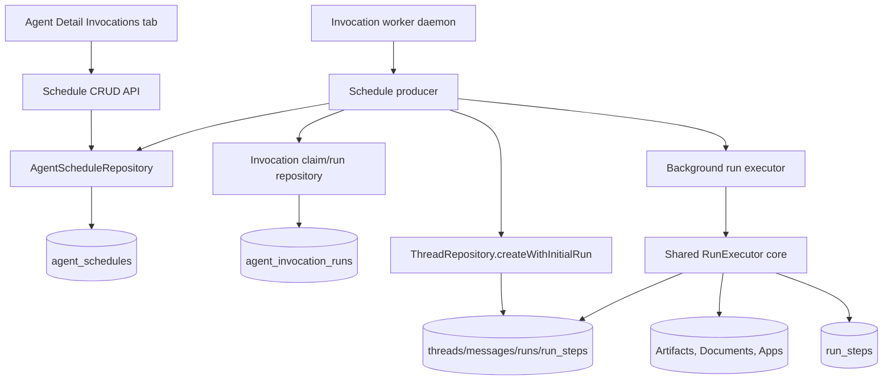

# Scheduled agent invocations

## Status

Shipped (2026-06-14). Implements HA-GAP-13 from [specs/index.md](../index.md).

**Shipped:** Migration `0034_agent_schedules.sql` adds `agent_schedules` and `agent_invocation_runs`; schedule CRUD at `GET/POST/PATCH/DELETE /api/agents/:agentId/schedules`; `InvocationWorker` + `ScheduleProducer` poll and claim due slots; `RunExecutor.executeToCompletion` shares lifecycle with streaming; Agent Detail **Invocations** tab schedule UI (`agent-schedules-panel.tsx`); `invocationSource` on agent recent threads. Operations guide: [invocation-worker.md](../../guides/invocation-worker.md).

## Delivered state

- `agent_schedules` stores cadence presets (hourly/daily/weekly/custom), timezone, prompt template, optional project, `next_run_at`, and last-run status fields.
- `agent_invocation_runs` enforces unique `(source_type, source_id, due_at)` claims for duplicate-safe scheduling.
- `schedule-calculator.ts` uses `cron-parser` for custom cron and preset-to-cron conversion; `resolveScheduleCronExpression` centralizes custom-cron resolution on create, update, and next-run recompute.
- `agent-schedules.ts` validates timing via `validateScheduleTiming`, archived projects, and agent existence before persistence.
- `schedule-producer.ts` claims due schedules, starts runs via `startAgentScheduledRun`, executes with `executeToCompletion`, and records schedule/invocation outcomes; missing agents disable the schedule without double-recording failure on the schedule row.
- `agent-detail-service.ts` attaches `invocationSource` (`scheduleId`, `scheduleName`) to recent threads; `agent-edit-tabs.tsx` shows `Scheduled: {name}` in activity.
- Shared schemas live in `packages/shared/src/schedule-schemas.ts`; mappers in `apps/api/src/lib/schedule-mappers.ts`.
- Worker entrypoint: `apps/api/src/worker.ts` (`pnpm dev:worker` / `pnpm --filter api start:worker`).

## Goal

Implement scheduled agent invocations as the first producer for a shared invocation worker foundation. Users should be able to configure an API-backed agent to run on a recurring schedule, and the worker should create and execute the scheduled run without a browser session calling `/api/runs/:runId/stream`.

This slice intentionally establishes the daemon boundary that later Slack, Discord, webhook, and other external invocation sources can reuse.

## Source of truth

- Roadmap: [specs/index.md](../index.md), HA-GAP-13.
- Operations: [guides/invocation-worker.md](../../guides/invocation-worker.md).
- Product milestone: [agentis-prd-roadmap.md](agentis-prd-roadmap.md), M07 Invocations and Deployment.
- Schedule routes: `apps/api/src/routes/agent-schedules.ts`.
- Schedule persistence: `apps/api/src/repositories/agent-schedule-repository.ts`, `apps/api/src/repositories/agent-invocation-run-repository.ts`.
- Invocation worker: `apps/api/src/invocations/` (`invocation-worker.ts`, `schedule-producer.ts`, `schedule-calculator.ts`, `agent-run-starter.ts`), `apps/api/src/worker.ts`.
- Thread/run creation: `apps/api/src/repositories/thread-repository.ts` via `startAgentScheduledRun`.
- Run execution: `apps/api/src/runtime/run-executor.ts` (`executeStream`, `executeToCompletion`).
- Agent detail metadata: `apps/api/src/agents/agent-detail-service.ts`.
- Agent detail UI: `apps/web/src/routes/agent-detail.tsx`, `apps/web/src/components/agent-detail/agent-edit-tabs.tsx`, `apps/web/src/components/agent-detail/agent-schedules-panel.tsx`.
- Schedule hook/client: `apps/web/src/hooks/use-agent-schedules.ts`, `apps/web/src/lib/api/agents-client.ts`.
- Shared schemas: `packages/shared/src/schedule-schemas.ts`, re-exported from `packages/shared/src/schemas.ts`.
- Migration: `apps/api/drizzle/0034_agent_schedules.sql`.
- Governing ADRs:
  - [ADR 0002: Version Native Tool Permissions With Agent Configuration](../../adrs/0002-version-native-tool-permissions-with-agent-configuration.md)
  - [ADR 0004: Use configurable AI Gateway providers as the live runtime boundary](../../adrs/0004-vercel-ai-gateway-runtime-boundary.md)
  - [ADR 0006: Route Cloudflare AI Gateway models by native REST transport](../../adrs/0006-cloudflare-gateway-transport-routing.md)

## Known follow-ups (not blocking HA-GAP-13)

- **Webhook producer:** shipped in HA-GAP-14; see [_done/2026-06-15-webhook-agent-invocation-design.md](2026-06-15-webhook-agent-invocation-design.md).
- **Slack producer:** HA-GAP-15 reuses the worker boundary.
- **Docker Compose worker topology:** HA-GAP-25 should run API + worker as separate Compose services; local dev uses `pnpm dev` + `pnpm dev:worker`.
- **Predictive cost preflight:** `maxCostPerRunUsd` is not enforced before background execution; only runtime/grant/project blockers run today.
- **Preset agent schedules:** fixture-backed preset agents still show planned/unavailable copy on the Invocations tab.

## Constraints

- Scheduled runs must execute in the background. Creating a queued run without executing it does not satisfy this spec.
- Use the agent's current configuration at schedule fire time, including model, system prompt, native tools, cost settings, and tool grants.
- Preserve thread, run, cost, timeline, artifact, memory, and evaluation behavior by sharing the existing run execution path rather than forking a schedule-only executor.
- Keep the first source to scheduled invocations. Slack, Discord, webhooks, passive listeners, and email are follow-up producers.
- Keep the scheduler self-host friendly. SQLite is the persistence and claim store for this slice.
- Use project vocabulary from `CONTEXT.md`: agent configuration, integration, native tool, thread, run, Artifact, Document.
- Document worker limitations honestly for single-node MVP operation.

## Out of scope

- Slack, Discord, Telegram, email, webhook, or passive listener implementation.
- Natural-language schedule parsing.
- Multiple prompt templates per schedule.
- Calendar blackout windows or holiday calendars.
- Full distributed queue infrastructure or production-grade multi-region scheduling.
- Agent archive UI or agent lifecycle redesign.
- Full predictive token cost estimation beyond reusing or minimally enforcing existing agent cost-limit fields.

## Acceptance criteria

1. Users can create, edit, enable, disable, and delete schedules for an API-backed agent.
2. Schedule options include Hourly, Daily, Weekly, and Custom cron, with timezone support.
3. Each schedule stores a prompt template and optional project context.
4. A worker or daemon process claims due schedules and creates an agent thread/run from the agent's current configuration.
5. The worker executes the created run to completion in the background, without requiring a browser or `/api/runs/:runId/stream` call.
6. Schedule-triggered threads/runs are linked back to the schedule and agent.
7. Agent detail activity and recent thread surfaces identify schedule-triggered runs.
8. Missing agent, disabled schedule, invalid project, missing runtime credentials, missing integration grants, and enforceable cost-limit blockers prevent execution and record a visible failure reason.
9. The scheduler avoids duplicate execution for the same due slot, including worker restart or overlapping poll windows.
10. Tests cover schedule CRUD, next-run calculation, due schedule claiming, run creation, background execution handoff, duplicate prevention, and failure states.

## Architecture



### Worker boundary

Add a first-class invocation worker boundary under `apps/api/src/invocations/` and a dedicated worker entrypoint such as `apps/api/src/worker.ts`.

The worker should own polling, due-slot claiming, invocation-source dispatch, and background run execution. The API route layer should own schedule CRUD and validation. This keeps later Slack, Discord, and webhook listeners from being bolted into HTTP handlers.

The API server may optionally start the worker in local development if the command structure needs a small first slice, but the implementation should preserve a separate worker entrypoint so self-host packaging can run it as its own process.

### Shared execution path

Refactor `RunExecutor` so the browser stream route and the worker share the same core execution logic.

Target shape:

- `executeStream(runId)` keeps the existing HTTP streaming behavior.
- A new background method, for example `executeToCompletion(runId)`, executes the same run lifecycle and persists the same messages, run steps, costs, artifacts, learning suggestions, and evaluations.
- Provider/runtime preflight checks should remain shared.
- Mock runtime behavior should work for worker tests.

Do not create a separate schedule-only executor. Divergent execution paths would make scheduled runs behave differently from user-started runs.

### Schedule persistence

Add an `agent_schedules` table with fields shaped around the product model:

- `id`
- `agent_id`
- `name`
- `status`: `enabled` or `disabled`
- `cadence`: `hourly`, `daily`, `weekly`, or `custom`
- `cron_expression`: required only for custom schedules
- `timezone`
- `prompt_template`
- `project_id`: nullable
- cadence config JSON for preset-specific fields, such as minute, local time, and weekday
- `next_run_at`
- `last_run_at`
- `last_run_status`
- `last_failure_reason`
- `created_at`, `updated_at`

Add an invocation run or claim table, likely `agent_invocation_runs`, to make due-slot execution auditable and duplicate-safe:

- `id`
- `source_type`: initially `schedule`
- `source_id`: schedule id
- `due_at`
- `status`: `claimed`, `running`, `completed`, `failed`, or `skipped`
- `thread_id`, nullable until created
- `run_id`, nullable until created
- `failure_reason`
- `claimed_at`, `started_at`, `finished_at`
- timestamps

Enforce uniqueness on `source_type`, `source_id`, and `due_at` so overlapping poll windows cannot create duplicate runs for the same due slot.

### Schedule calculation

Support these schedule modes:

- Hourly: selected minute of each hour.
- Daily: selected local time.
- Weekly: selected weekday and local time.
- Custom: cron expression plus timezone.

The implementation uses `cron-parser` (`apps/api/package.json`) with deterministic helpers in `schedule-calculator.ts`. `parseCronInterval` shares parse/validate logic between `validateCronExpression` and `computeNextRunAt`. Preset cadences compile to cron via `cadenceConfigToCronExpression`; custom cadences store the user expression. Timezone names validate through `Intl.DateTimeFormat`.

### Schedule CRUD API

Add schedule routes under the agent API surface, for example:

- `GET /api/agents/:agentId/schedules`
- `POST /api/agents/:agentId/schedules`
- `PATCH /api/agents/:agentId/schedules/:scheduleId`
- `DELETE /api/agents/:agentId/schedules/:scheduleId`

Shared schemas should validate cadence-specific payloads, timezone, prompt template, optional project id, enabled state, and custom cron expression.

Validation rules:

- Agent must exist.
- Project, when supplied, must be valid and usable for a new thread.
- Custom cron must parse before the schedule is saved.
- Presets must include their required fields.
- Disabling a schedule should not delete run history.

### Agent Detail UX

Replace the disabled `Scheduled` placeholder in `AgentInvocationsTab` with a schedule management surface for API-backed agents.

User-visible behavior:

- Show existing schedules with name, cadence, timezone, next run, enabled state, last result, and last failure reason when present.
- Provide Create schedule, Edit, Enable/Disable, and Delete controls.
- Create/Edit form includes:
  - name
  - cadence: Hourly, Daily, Weekly, Custom cron
  - timezone
  - cadence-specific fields
  - prompt template
  - optional project context
- Keep other invocation options as planned placeholders.

The spec does not require fixture-backed agents to support schedules. Preset agents may continue to show planned or unavailable copy.

### Invocation metadata in thread and run surfaces

Schedule-triggered threads/runs should be identifiable without requiring users to inspect raw database rows.

Minimum implementation options:

- Add invocation metadata to the thread/run list context and Agent Detail recent thread rows; or
- Add a schedule-linked run step such as `Scheduled invocation` with schedule name and due time, plus API fields where list surfaces need badges.

Build should choose the smallest representation that satisfies Agent Detail activity and recent-thread visibility while preserving future source types.

## Execution flow

1. Worker polls for enabled schedules with `next_run_at <= now`.
2. Worker attempts an atomic claim for `schedule_id + due_at`.
3. If claim fails because the due slot is already claimed, worker skips it.
4. Worker validates the schedule is still enabled and the agent exists.
5. Worker validates optional project context.
6. Worker snapshots the agent's current configuration and resolves tool grants.
7. Worker creates a thread and queued run using `ThreadRepository.createWithInitialRun`.
8. Worker links the invocation claim to the thread and run.
9. Worker executes the run through the shared background execution method.
10. Worker records invocation status, schedule `last_run_at`, `last_run_status`, `last_failure_reason`, and computes the next due time.

## Error handling

- Missing agent: mark the due slot failed and disable the schedule or require user action. Do not keep repeatedly firing an unowned schedule.
- Disabled schedule: skip claimed work and compute no new due slot until re-enabled.
- Invalid or archived project: skip the due run, keep the schedule enabled, and record a visible failure reason.
- Missing runtime credentials: fail before execution and record the runtime health message.
- Missing or expired integration grant: fail before execution with the existing grant remediation copy when available.
- Enforceable cost-limit blocker: fail before execution and record the reason. If current runtime cannot estimate final token cost before execution, do not invent predictive cost math in this slice.
- Duplicate claim: rely on database uniqueness to prevent duplicate schedule executions for the same due slot.
- Worker restart during `claimed` or `running`: mark stale claims failed after a bounded timeout or recover them through an explicit stale-claim policy, then compute the next due time. The policy must be tested.
- Run execution failure: preserve normal run failure evidence and mirror the summary into schedule/invocation status.

## Implementation phases

1. Persistence and schemas.
   - Add schedule and invocation-run tables, migrations, shared schemas, and repository CRUD.
   - Add next-run calculation helpers and tests for Hourly, Daily, Weekly, Custom cron, and timezone behavior.

2. Schedule API.
   - Add agent schedule routes and client helpers.
   - Validate agents, projects, cadence-specific fields, timezone, and custom cron.
   - Add route and repository tests.

3. Worker foundation.
   - Add invocation worker entrypoint and schedule producer.
   - Add due-slot claim logic with duplicate prevention and stale-claim handling.
   - Add tests using mock runtime and in-memory or test SQLite database.

4. Shared background run execution.
   - Refactor `RunExecutor` so `executeStream` and background execution share the same run lifecycle.
   - Ensure background execution persists assistant messages, run steps, artifacts, costs, evaluations, and learning suggestions.
   - Add tests that a scheduled run completes without calling the streaming endpoint.

5. Agent Detail schedule UI.
   - Replace disabled Scheduled placeholder for API-backed agents.
   - Add list, form, enable/disable, edit, delete, validation, and error states.
   - Keep non-schedule invocation options as planned placeholders.

6. Invocation metadata surfaces.
   - Show schedule source in Agent Detail recent activity/recent threads.
   - Add badges or copy that make schedule-triggered work distinguishable from manual thread/test-thread runs.

7. Documentation and operations.
   - Document how to run the worker locally and in self-host mode.
   - Document single-node MVP limits and expected environment variables.
   - Update [specs/index.md](../index.md), logs, and relevant runbooks/guides as part of Build closeout.

## Verification

Required quality commands before Build completion:

```bash
pnpm typecheck
pnpm build
pnpm lint
pnpm test:coverage
```

Focused tests to add or update:

```bash
pnpm vitest run apps/api/src/invocations/*.test.ts apps/api/src/routes/agents.test.ts apps/api/src/repositories/agent-schedule-repository.test.ts
pnpm vitest run apps/web/src/components/agent-detail/agent-future-placeholders.test.tsx apps/web/src/routes/agent-detail.test.tsx apps/web/src/lib/api/agents-client.test.ts
```

Manual UAT:

1. Start API, web, and worker with mock runtime enabled.
2. Open an API-backed agent detail page.
3. Create an Hourly schedule with a near-future due time and a prompt template.
4. Confirm the schedule row shows the next run.
5. Wait for the worker to claim the schedule.
6. Confirm a thread/run is created and completes without calling `/api/runs/:runId/stream` from the browser.
7. Confirm the Agent Detail activity/recent thread surface identifies the run as schedule-triggered.
8. Disable the schedule and confirm no further due runs are created.
9. Create a Custom cron schedule with invalid syntax and confirm validation blocks save.

Real-service UAT should run with `AGENTIS_MOCK_RUNTIME=0` when live Gateway credentials are available. Report missing credentials as blockers instead of using mock output for real-service evidence.

## Risks and mitigations

- Refactoring `RunExecutor` could break browser streaming.
  - Mitigation: keep stream response assembly at the edge and extract only shared lifecycle logic covered by existing thread/run tests.
- Timezone and cron logic can create off-by-one due times.
  - Mitigation: isolate next-run calculation and cover DST-adjacent and weekly boundary cases.
- Duplicate scheduled runs can occur when workers overlap.
  - Mitigation: unique due-slot claims and repository-level tests for duplicate claim attempts.
- Worker process management can sprawl into self-host packaging.
  - Mitigation: provide the entrypoint and docs now; defer Docker Compose process topology to HA-GAP-25 unless needed for local verification.
- Cost limits are stored but no full predictive preflight was found.
  - Mitigation: do not bypass existing cost settings; implement only enforceable preflight blockers in this slice and record any missing full cost-limit enforcement as follow-up.

## Explicitly deferred work

- HA-GAP-15 Slack invocation via Composio.
- Discord and other listener daemons.
- Custom MCP server connections.
- Distributed queue or external scheduler service.
- Agent lifecycle/archive model.
- Full predictive cost estimation.

## Build handoff

Approved scope:

- Worker-backed scheduled agent invocations.
- Schedule CRUD for Hourly, Daily, Weekly, and Custom cron schedules with timezone support.
- Prompt template and optional project context per schedule.
- Background run creation and execution without browser streaming.
- Schedule-to-thread/run linkage and visible invocation metadata.
- Duplicate due-slot prevention and stale-claim policy.
- Tests and documentation for the worker entrypoint and schedule operation.

Non-goals:

- Slack, Discord, webhook, email, or passive listener implementation.
- Full distributed queue infrastructure.
- Natural-language schedule authoring.
- Broad agent lifecycle redesign.

Build followed persistence → routes → worker → shared background execution → UI → invocation metadata. Post-ship simplify/strict-quality-review consolidated cron resolution (`resolveScheduleCronExpression`), deduped cron parsing (`parseCronInterval`), tightened edit PATCH payloads (`buildUpdateSchedulePayload` omits `status`), and removed duplicate schedule failure recording when a missing agent triggers `disable`.

## Related

- [invocation-worker.md](../../guides/invocation-worker.md) — local and production worker operation.
- [HA-GAP-14 webhook](2026-06-15-webhook-agent-invocation-design.md) — shipped signed webhook producer on the shared worker foundation.
- [HA-GAP-15 Slack](../index.md#ha-gap-15-slack-invocation-via-composio) — next invocation producer on the shared worker foundation.
