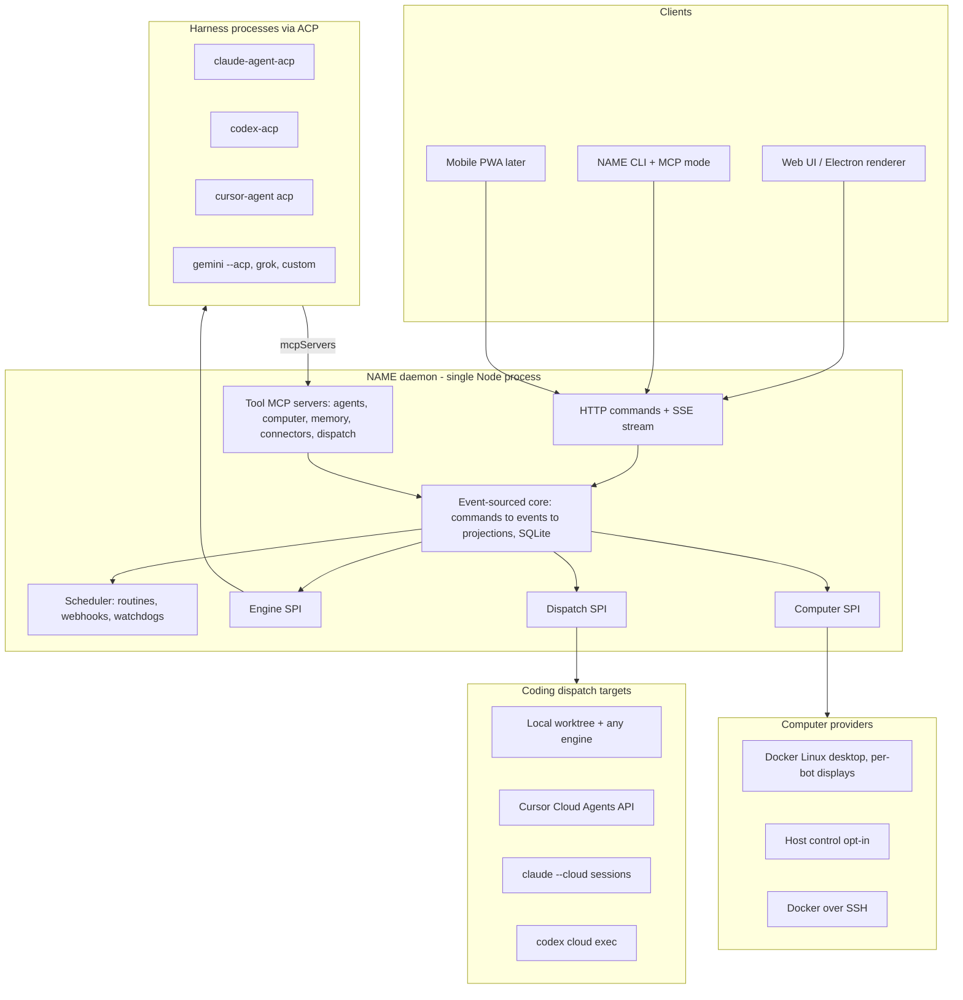
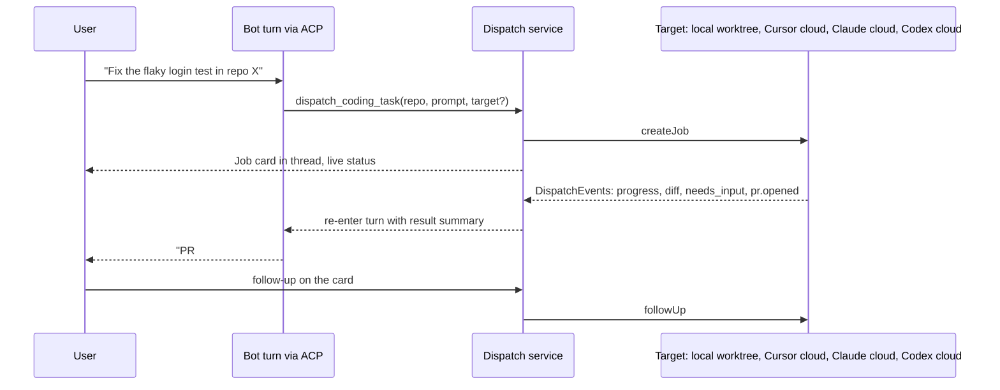

# Project Epic: Ground-up rebuild of an open, harness-agnostic Grok Bot

Status: Proposed (supersedes the 8-week OpenMausBot-fork plan; that document is preserved in git history at `3fcb64d`)
Prepared: September 2026

This is the end-to-end epic for the project. Phase 0 (reset and foundation) is written in detail
because it is the part we break out next; later phases are outlined at decreasing detail and
will each get their own breakout plan when they start.

---


## 0. Decisions this plan assumes (override any of them)

- **Not a fork.** OpenMausBot and CopilotKit/OpenBot become read-only references. No code, docs, or assets are copied; see clean-room rules in §2. This supersedes the earlier fork-based plan ("Base selection … do not relitigate").
- **Repo strategy:** reset this repository in place. Tag current `main` as `archive/openmausbot-fork`, start a fresh orphan `main` under the new name. (Alternative: brand-new repo; the plan is otherwise identical.)
- **Stack:** TypeScript on Node 24 (`node:sqlite`, no native deps), pnpm monorepo, Vitest, React 19 + Vite for UI, Electron for desktop. ACP TypeScript SDK, Claude Agent SDK, `codex app-server`/`codex-acp`, and the Cursor `@cursor/sdk` are all TypeScript, so one language covers server, contracts, and clients.
- **Name:** undecided; `NAME` is a placeholder below (`~/.NAME/`, `NAME serve`). Do not reuse "OpenMausBot", "Grok", or "Bot" marks.
- **Dispatch targets:** Claude Code, Codex, Cursor. T3 Code is out.
- **Billing model unchanged:** bring-your-own subscription via official CLIs/SDKs holding credentials on the user's machine; never proxy or pool tokens.

## 1. What we learned from the fork (why start over)

Findings from mapping the current tree (details in the exploration reports; key numbers):

- `server/index.ts` is a ~10k-line god file holding routes, turn orchestration, group goals, routines sync, computer lifecycle, and SSE; 140+ flat modules with no bounded contexts; three parallel "computer" stacks (`container-computer.ts`, `vps-computer.ts`, `box.ts`) plus four MCP proxies.
- Persistence is scattered: `bots.json`, `groups.json`, `routines.json`, `sessions.json`, `delegations.json`, `messages.db`, `events/*.ndjson`, shadow git repos, with ad hoc migrations.
- Client state duplicated four times: `src/state/store.tsx` (~2.3k lines, `api(): Promise<any>`), Swift `Session.swift`, Kotlin `Session.kt`, plus the mascot face data tri-ported. `shared/` is 445 lines; real types live in the store.
- No router, no schema-first API, no generated clients; hand-rolled i18n with 6 keys.
- Hard dependencies we do not want: Composio broker workers, `enterprise/` under a non-OSS license, Cloudflare control plane, three native clients, vendored electron-updater.

What was genuinely good and should be **re-derived** (as ideas, not code): the engine SPI vocabulary (`ProviderDriver` / `ProviderAdapter` / `RuntimeEvent` in [server/contracts.ts](server/contracts.ts)), unknown-driver "shadow instance" degradation, HTTP-commands + one replayable SSE stream, loopback-owner auth with paired remote sessions, and the isolated fake-engine verification fixture ([docs/verification/README.md](docs/verification/README.md)).

## 2. Clean-room rules

- Reference repos are consulted for behavior and product decisions only. Nobody pastes code; when a shape is deliberately similar, write it from the spec (ACP, MCP, Codex app-server, Cursor API docs), not from the reference implementation.
- Omit `enterprise/` and the T3-derived Antigravity adapter entirely (license constraints). Third-party binaries we may depend on as normal dependencies (Cua driver MIT, cloudflared Apache-2.0) ship with their own notices.
- New `LICENSE` (Apache-2.0, our copyright), fresh `NOTICE`, fresh visual identity (no mascot port).

## 3. Product definition

The Grok Bot shape, verified against current docs: a **roster of named Bots** (name, title, description), each with memory, its own screen on a **shared per-account computer** (browser, files, terminal), **routines** (schedule or event; teach-by-demonstration later), **handoff** by description matching, **group threads**, **approval cards**, connectors/MCP, thin desktop/mobile clients, and **delegation of coding work to cloud coding agents**.

Our differentiators:

1. Self-hosted, open source, local reach (local stdio MCP and local files work, which Grok Bot cannot do).
2. BYO subscription: bot brains run on Claude Code, Codex, Cursor CLI, Gemini CLI, Grok Build, or any ACP agent, billed to the user's existing plan.
3. Pluggable coding dispatch: the "send to Cursor Cloud Agent" experience, but the target can be Claude Code, Codex, or Cursor (local worktree or their clouds).
4. Auditable: every tool action and dispatch is an event in one append-only log.

## 4. Architecture

### 4.1 Core objects

`Account` (single-user in v1) → `Bot` → `Thread` (direct or group) → `Turn` → `Item`s (text, tool call, approval, card). Cross-cutting: `Computer` (one per account, `Screen` per bot), `Routine` + `RoutineRun`, `Skill`, `Connector` (MCP server binding), `Handoff`, `DispatchJob`, `Approval`, `MemoryItem`, `Session` (client auth).

### 4.2 Layering



### 4.3 The two plugin seams

**Engine SPI** (what runs a bot's turn). ACP is the primary transport: one generic `AcpEngine` (spawn command, `initialize`, `session/new` with our tool MCP servers mounted, `session/prompt`, permission requests → `Approval` items, `session/cancel`) plus per-harness *presets* (command, auth detection, model listing, capabilities). A non-ACP escape hatch stays in the interface for OpenAI-compatible endpoints later.

```ts
interface EngineDriver<C> {
  kind: string; displayName: string;
  detect(): Promise<Availability>;          // installed? logged in? which models?
  decodeConfig(raw: unknown): C;             // unknown kinds become "shadow" instances, never crash the fleet
  create(cfg: C, deps: EngineDeps): EngineInstance;
}
interface EngineInstance {
  startTurn(req: TurnRequest): Promise<void>; // streams EngineEvent via deps.emit
  steer?(threadId, text): Promise<void>;
  interrupt(threadId): Promise<void>;
  respondToRequest(requestId, answer): Promise<void>;
  capabilities: { steer: boolean; images: boolean; mcpMount: boolean; effort: EffortLevel[] };
}
```

**Dispatch SPI** (where a coding task goes):

```ts
interface DispatchTarget {
  kind: "local-worktree" | "cursor-cloud" | "claude-cloud" | "codex-cloud";
  detect(): Promise<Availability>;
  createJob(spec: JobSpec): Promise<JobHandle>;   // repo, baseRef, prompt, mode(plan|agent), autoPr, model
  followUp(handle, prompt): Promise<void>;
  cancel(handle): Promise<void>;
  observe(handle): AsyncIterable<DispatchEvent>;   // status, message, diff, pr.opened, needs_input, artifact
  capabilities: { followUp; stream; autoPr; applyDiff; planMode };
}
```

- `local-worktree`: git worktree on the account computer (or host), any `EngineInstance` runs inside it, our core does checkpointing, commit, push, PR (`gh`/GitHub API). Works with Claude Code, Codex, and Cursor CLI identically.
- `cursor-cloud`: Cursor Cloud Agents API v1 (`POST /v1/agents`, `POST /v1/agents/{id}/runs`, `GET …/runs/{id}/stream`, artifacts, `autoCreatePR`), agent-scoped API key.
- `claude-cloud`: `claude --cloud "<task>"` creates a claude.ai session from the repo's GitHub remote; follow-ups via `claude -p` with session id/URL; result observed via `--teleport`/branch. (Anthropic Managed Agents `/v1/sessions` is API-key billed; optional later target.)
- `codex-cloud`: `codex cloud exec|status|diff|apply` on a configured environment id, ChatGPT login.

The bot sees one tool, `dispatch_coding_task`, from our dispatch MCP server; the target is chosen per bot (default) or per call. The job appears as a live card in the thread; completion (PR URL, diff summary, needs-input) re-enters the bot's turn so the bot reports back or asks the user.

### 4.4 Transport, persistence, auth

- Commands over HTTP (JSON, Zod-validated, idempotency keys); one SSE stream with monotonically numbered frames and `Last-Event-ID` replay. Proxy- and tunnel-friendly; no WebSocket needed.
- One SQLite database (`~/.NAME/NAME.db`): append-only `events` table + projected read tables, versioned migrations. Blobs (attachments, screenshots) on disk keyed by hash. No JSON-file state.
- Daemon binds `127.0.0.1`. Loopback requests are the owner; remote clients pair once and hold bearer sessions with scopes. Provider credentials never enter our DB; official CLIs own them.

### 4.5 Monorepo layout

```
apps/server      daemon: `NAME serve` (routes by domain, wiring only)
apps/web         React UI, also the Electron renderer
apps/desktop     thin Electron: spawn daemon, notifications, host-control opt-in, updater
apps/cli         `NAME` CLI: serve, doctor, pair, verify, control; `--mcp` exposes control as an MCP server
packages/contracts   Zod schemas only: domain, API, SSE frames, EngineEvent, DispatchEvent; emits OpenAPI
packages/core        commands → events → projections, scheduler, SQLite, migrations
packages/engines     Engine SPI, AcpEngine, presets (claude, codex, cursor, gemini, grok, custom), registry, fake engine
packages/dispatch    Dispatch SPI + four targets
packages/computer    Computer SPI + docker-desktop, host (cua-driver), ssh-docker providers
packages/tools       MCP servers mounted into engines: agents, computer, memory, connectors, dispatch
packages/client      typed API client + SSE fold (shared by web, desktop, PWA)
packages/testing     fake ACP agent CLI, fixture launcher, SSE test helpers
docs/                product docs, verification map, compliance notes
```

## 5. Phase 0 — Reset and foundation (the "refactor"; detailed)

Goal: a new codebase that can run a bot on Claude Code and on Codex, stream a conversation, approve a tool call, survive restart, and be verified against an isolated fixture. This is the part we break out further next.

1. **Repo reset.** Tag `archive/openmausbot-fork`; orphan `main`; new `LICENSE`, `NOTICE`, `README` (what/why/quickstart placeholder), `AGENTS.md` (verification rule, clean-room rule), `CONTRIBUTING.md`. Delete everything else.
2. **Toolchain.** pnpm workspace, strict TS with project references, Vitest, oxlint + formatter, `engines: node >=24`, CI matrix (macOS, Ubuntu, Windows): typecheck, lint, unit, fixture smoke.
3. **`packages/contracts`.** Domain schemas; `EngineEvent` union (session.*, turn.*, item.*, content.delta, request.opened/resolved, usage, error); `DispatchEvent`; SSE frame envelope `{seq, kind, payload}`; API route schemas. Policy: no runtime logic in this package; OpenAPI generated from it.
4. **`packages/core`.** SQLite event store + projections (bots, threads, messages, approvals, sessions); command handlers with idempotency; replay buffer for SSE; migration runner; structured logger with redaction.
5. **`packages/engines`.** Generic `AcpEngine` on the ACP TS SDK; presets for `claude-agent-acp`, `codex-acp`, `cursor-agent acp`; registry with shadow instances; `doctor` (installed/authenticated/models); `fake-acp-agent` CLI for tests (scripted happy/deny/crash modes).
6. **`apps/server`.** HTTP + SSE, route modules per domain (`bots`, `threads`, `engines`, `auth`, `events`), loopback-owner auth, static UI serving, graceful shutdown that stops child harnesses.
7. **`packages/client` + `apps/web`.** Typed client generated from contracts; SSE fold into per-domain stores (Zustand or equivalent, no god store); TanStack Router with URL state; Tailwind + a small headless primitive set. Screens: onboarding/engine doctor, roster, chat with streaming and approval cards, bot settings (engine, model, effort).
8. **`apps/cli`.** `serve`, `doctor`, `verify launch` (temp data dir, fake engine only, PATH stripped, prints URL/PID/log), `bots|send|wait|messages --url` control commands that refuse to guess a port; `--mcp` mode for Cursor/Claude Desktop control.
9. **Verification discipline.** `docs/verification/` feature map + `AGENTS.md` rule from day one; every PR that touches server behavior includes fixture evidence.

Acceptance (Gate 0): two bots (Claude Code, Codex) chat concurrently; an approval round-trips; daemon restart preserves transcripts and resumes; unknown engine kind in config degrades to unavailable; CI green on three OSes; fixture flow documented and used.

## 6. Phase 1 — Parity with today's fork (medium detail)

Re-derive, in this order, each shipped to `main` before the next:

1. Bot lifecycle: profile (name/title/description/color, generated avatar system of our own), pin/hide/duplicate/delete, per-bot cwd, interrupt/steer/queue, edits, attachments (images/files) into blob store.
2. Additional engine presets: Gemini CLI (`--acp`), Grok Build, generic `custom-acp`; per-engine auth UX with quota/rate-limit surfacing and never-silent failures.
3. Tool MCP servers: `agents` (list bots, message a bot, ask), `memory` (workspace `MEMORY.md` + topic files, read/write tools), `connectors` (user-registered stdio and HTTP MCP servers with OAuth, start disabled, test handshake, per-bot enablement).
4. Skills: agentskills.io `SKILL.md` folders, import → disabled → review → enable per bot; mounted into engine-native skill dirs.
5. Computer v1: `docker-desktop` provider — one Linux desktop container per account with a virtual display per bot, screenshot/click/type/keys via our `computer` MCP server, live preview via noVNC/WebRTC in a side panel, takeover and hand-back; host-control provider opt-in behind Cua driver; Docker-over-SSH provider.
6. Groups: multi-bot threads with per-bot serialized turns, mentions, room instructions.
7. Routines v1: schedule triggers (once/daily/weekdays/interval), run records, enable/disable, run-now; webhook receiver as a separate loopback port.
8. Notifications (approval, question, done, failed, takeover) with click-to-exact-item.
9. Distribution: `npx NAME` / `NAME serve` headless; Docker image + Caddy compose for self-host; Electron desktop (signed macOS, Windows, Ubuntu) with auto-update.

Gate 1: daily-drivable — the team uses it for real work for three consecutive sessions; blockers only, nothing new, until it passes.

## 7. Phase 2 — Close the Grok Bot gap (lower detail)

- Routines v2: event triggers via connectors (GitHub, Slack first), 20 most-recent run records, auto-pause on inactivity, routine-created-by-bot with confirmation card, routines visible in the bot's profile.
- Handoff: one classifier call over all bots' descriptions; forward with a logged `Handoff` record shown in both threads; user can cancel; one-hop depth; chief-of-staff pattern documented.
- Memory v2: end-of-thread summarization into memory items; top-k retrieval at turn start (sqlite-vec, pluggable embedder); memory browser with approve/forget.
- Group ownership passing and parallel bots on separate screens of the shared computer.

Gate 2: Grok Bot scenario parity checklist (morning-briefing routine unattended, Slack-triggered routine, wrong-bot task lands with right bot, recall across closed threads, two bots working the browser in parallel).

## 8. Phase 3 — Coding dispatch (the Cursor analog; medium detail)



- `local-worktree` first (works for all three harnesses with existing logins), then `cursor-cloud`, `codex-cloud`, `claude-cloud`.
- Repo registry (URL, default base ref, auth via `gh`), per-bot default target and model, plan-vs-agent mode, auto-PR toggle.
- Job card: status, streamed summary, diff viewer, PR link, artifacts, needs-input answered inline; job list page.
- Routine-triggered dispatch (e.g. GitHub issue labeled → dispatch) and handoff into a "developer" bot.

Gate 3: end-to-end demo — a non-coding bot receives a bug report, hands off to the dev bot, which dispatches to each of the three targets and returns a PR link; user follows up from the card.

## 9. Phase 4 — Reach and always-on (low detail)

- Remote access: pairing codes, scoped sessions, stream tickets; Tailscale/SSH documented; optional tunnel provider abstraction (cloudflared) without a control plane of ours.
- Mobile: responsive PWA from `apps/web` first; native thin clients later, generated from the OpenAPI contract, never hand-ported models.
- Daemon as a system service (launchd/systemd/Windows service); desktop becomes optional.

## 10. Phase 5 — Ecosystem and hardening (low detail)

- Audit trail as product: decide-record-act per tool call and dispatch, filterable view, export.
- Usage accounting and per-bot budgets from engine usage events.
- Teach-by-demonstration: screen/action recording on the computer → routine draft → review.
- Skill/plugin compatibility with Claude Code, Codex, Cursor, Grok Build marketplaces (read their formats; do not build our own marketplace first).
- Multi-user/teams, policy engine, SSO: post-launch, from user demand.

## 11. Cross-cutting rules

- Compliance note (`docs/compliance.md`) reviewed at Phase 0 start: only official CLIs/SDKs, one person one token, API-key fallback per engine.
- Verification: every server/behavior change verified against `NAME verify launch` fixture; renderer-only changes exempt.
- Working rules carried over from the old plan: hard timeboxes recorded as data, one subsystem in flight per phase, weekly written status.

## 12. Open decisions for you

1. Project name.
2. Confirm repo reset in place vs. new repository.
3. Confirm TypeScript/Node 24 (vs. Go/Rust daemon, vs. TypeScript+Effect).
4. Connectors: MCP-native only (recommended), with Composio available as just another MCP endpoint if a user brings their own key.
5. Host-control provider: depend on Cua driver (MIT) vs. build our own thin native layer later.

## 13. Reference map (study, do not copy)

- Engine vocabulary and shadow-instance degradation: [server/contracts.ts](server/contracts.ts), [server/harness/registry.ts](server/harness/registry.ts)
- Fixture verification: [scripts/control-omb.ts](scripts/control-omb.ts), [docs/verification/README.md](docs/verification/README.md)
- SSE doctrine and replay: [src/lib/live-events.ts](src/lib/live-events.ts), `broadcast` in [server/index.ts](server/index.ts)
- Auth model: [server/request-auth.ts](server/request-auth.ts), [docs/plans/remote-workspace.md](docs/plans/remote-workspace.md)
- Cursor as ACP engine: [docs/cursor.md](docs/cursor.md)
- Grok Bot behavior: x.ai/docs Grok Bot overview, FAQ, teams; Cursor Cloud Agents API v1 docs; ACP registry (`claude-agent-acp`, `codex-acp`).

Next step after this epic is accepted: break Phase 0 into its own detailed implementation plan.